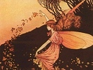

  
[Intangible Textual Heritage](../../../index)  [Legends and
Sagas](../../index)  [Celtic](../index)  [Index](index) 
[Previous](ffcc309)  [Next](ffcc411) 

------------------------------------------------------------------------

[Buy this Book at
Amazon.com](https://www.amazon.com/exec/obidos/ASIN/B0026FCI5W/internetsacredte)

------------------------------------------------------------------------

  
*The Fairy-Faith in Celtic Countries*, by W.Y. Evans-Wentz, \[1911\], at
Intangible Textual Heritage

------------------------------------------------------------------------

p. 442

# SECTION III

## THE CULT OF GODS, SPIRITS, FAIRIES, AND THE DEAD

## CHAPTER X

### THE TESTIMONY OF CHRISTIANITY

'The Purgatory of St. Patrick became the framework of another series of
tales, embodying the Celtic ideas concerning the other life and its
different states. Perhaps the profoundest instinct of the Celtic peoples
is their desire to penetrate the unknown. With the sea before them, they
wish to know what is to be found beyond it; they dream of the Promised
Land. In the face of the unknown that lies beyond the tomb, they dream
of that great journey which the pen of Dante has celebrated.'--ERNEST
RENAN.

Lough Derg a sacred lake originally--Purgatorial rites as christianized
survivals of ancient Celtic rites--Purgatory as Fairyland--Purgatorial
rites parallel to pagan initiation ceremonies--The Death and
Resurrection Rite--Breton Pardons compared--Relation to Aengus Cult and
Celtic cave-temples--Origin of Purgatorial doctrine
pre-Christian--Celtic and Roman feasts of dead shaped Christian
ones--Fundamental unity of Mythologies, Religions, and the Fairy-Faith.

THE best evidence offered by Christianity with direct bearing on the
Fairy-Faith comes from what may be designated survivals of transformed
paganism within the Church itself. Various pagan cults, which also came
to be more or less christianized, have been considered under Paganism;
and in this chapter we propose to examine the famous Purgatory of St.
Patrick and the Christian rites in honour of the dead.

### ST. PATRICK'S PURGATORY

In the south of County Donegal, in Ireland, amid treeless mountains and
moorlands, lies Lough Derg or the Red Lake, containing an island which
has long been famous throughout Christendom as the site of St. Patrick's
Purgatory. Even today more than in the Middle Ages it is the goal of
thousands

p. 443

of pious pilgrims who repair thither to be purified of the accumulated
sins of a lifetime. In this age of commercialism the picture is an
interesting and a happy one, no matter what the changing voices of the
many may have to say about it.

The following weird legends, which during the autumn of 1919 I found
surviving among the Lough Derg peasantry, explain how the lough received
its present name, and seem to indicate that long before Patrick's time
the lough was already considered a strange and mysterious place,
apparently an Otherworld preserve. The first legend, based on two
complementary versions, one from James Ryan, of Tamlach Townland, who is
seventy-five years old, the other from Arthur Monaghan, a younger man,
who lives about three miles from James Ryan, is as follows:--'In his
flight from County Armagh, Finn Mac Coul took his mother on his
shoulder, holding her by the legs, but so rapidly did he travel that on
reaching the shores of the lake nothing remained of his mother save the
two legs, and these he threw down there. Some time later, the Fenians,
while searching for Finn, passed the same spot on the lake-shore, and
Cinen Moul (?), who was of their number, upon seeing the shin-bones of
Finn's mother and a worm in one, said: "If that worm could get water
enough it would come to something great." "I'll give it water enough,"
said another of the followers, and at that he flung it into the lake
(later called Finn Mac Coul's lake). [1](#fn_541) Immediately the worm turned into an
enormous water-monster. This water-monster it was that St. Patrick had
to fight and kill; and, as the struggle went on, the lake ran red with
the blood of the water-monster, and so the lake came to be called Loch
Derg (Red Lake).' The second legend, composed of folk-opinions, was
related by Patrick Monaghan, the caretaker of the Purgatory, as he was
rowing me to Saints' Island--the site of the original

p. 444

purgatorial cave; and this legend is even more important for us than the
preceding one:--'I have always been hearing it said that into this lough
St. Patrick drove all the serpents from Ireland, and that with them he
had here his final battle, gaining complete victory. The old men and
women in this neighbourhood used to believe that Lough Derg was the last
stronghold of the Druids in Ireland; and from what I have heard them
say, I think the old legend means that this is where St. Patrick ended
his fight with the Druids, and that the serpents represent the Druids or
paganism.'

These and similar legends, together with what we know about the
purgatorial rites, lead us to believe that in pre-Christian times Finn
Mac Coul's Lake, later called Lough Derg, was venerated as sacred, and
that the cave which then undoubtedly existed on Saints' Island was used
as a centre for the celebration of pagan mysteries similar in character
to those supposed to have been celebrated in New Grange. Evidently, in
the ordeals and ceremonies of the modern Christian Purgatory of St.
Patrick, we see the survivals of such pagan initiatory rites. Just as
the cults of stones, trees, fountains, lakes, and waters were absorbed
by the new religion, so, it would seem, were all cults rendered in
prehistoric times to Finn Mac Coul's Lake and within the island cave.
Though the present location of the Purgatory is not the original place
of the old Celtic cults, there having been a transfer from Saints'
Island to Station Island, the present place of pilgrimage, where instead
of the cave there is the 'Prison Chapel', the practices, though
naturally much modified and corrupted, retain their primitive outlines.
Patrick in his time ordered the observance of the following ceremonies
by all penitents before their entrance into the original cave on Saints'
Island; [1](#fn_542) and for a long time they
were strictly carried out:--'The visitor must first go to the bishop of
the diocese, declare to him that he came of his own free will,

p. 445

and request of him permission to make the pilgrimage. The bishop warned
him against venturing any further in his design, and represented to him
the perils of his undertaking; but if the pilgrim still remained
steadfast in his purpose, he gave him a recommendatory letter to the
prior of the island. The prior again tried to dissuade him from his
design by the same arguments that had been previously urged by the
bishop. If, however, the pilgrim still remained steadfast, he was taken
into the church to spend there fifteen days in fasting and praying.
After this the mass was celebrated, the holy communion administered to
him and holy water sprinkled over him, and he was led in procession with
reading of litanies to the entrance of the purgatory, where a third
attempt was made to dissuade him from entering. If he still persisted,
the prior allowed him to enter the cave, after he had received the
benediction of the priests, and, in entering, he commended himself to
their prayers, and made the sign of the cross on his forehead with his
own hand. The prior then made fast the door, and opened it not again
till the next morning, when, if the penitent were there, he was taken
out and led with great joy to the church, and, after fifteen days'
watching and praying, was dismissed. If he was not found when the door
was opened, it was understood that he had perished in his pilgrimage
through purgatory; the door was closed again, and he was never
afterwards mentioned'.

An enormous mass of literary and historical material was recorded during
the mediaeval period, in various European vernaculars and in Latin,
concerning St. Patrick's Purgatory; and all of it testifies to the
widespread influence of the rites which already then as now attracted
thousands of pilgrims from all parts of Christendom. In the poem of
*Owayne Miles*, [1](#fn_543) which forms part
of this material, we find a poetical description of the purgatorial
initiatory rites quite comparable to Virgil's account of Aeneas on his
initiatory journey to Hades. The poem records how Sir Owain was locked
in the cave, and how, after a short time, he began to penetrate its
depths. He had but little light, and this

p. 446

by degrees disappeared, leaving him in total darkness. Then a strange
twilight appeared. He went on to a hall and there met fifteen men clad
in white and with heads shaven after the manner of ecclesiastics. One of
them told Owain what things he would have to suffer in his pilgrimage,
how unclean spirits would attack him, and by what means he could
withstand them. Then the fifteen men left the knight alone, and soon all
sorts of demons and ghosts and spirits surrounded him, and he was led on
from one torture and trial to another by different companies of fiends.
(In the original Latin legend there were four fields of punishment.)
Finally Owain came to a magic bridge which appeared safe and wide, but
when he reached the middle of it all the fiends and demons and unclean
spirits raised so horrible a yell that he almost fell into the chasm
below. He, however, reached the other shore, and the power of the devils
ceased. Before him was a celestial city, and the perfumed air which was
wafted from it was so ravishing that he forgot all his pains and
sorrows. A procession came to Owain and, welcoming him, led him into the
paradise where Adam and Eve dwelt before they had eaten the apple. Food
was offered to the knight, and when he had eaten of it he had no desire
to return to earth, but he was told that it was necessary to live out
his natural life in the world and to leave his flesh and bones behind
him before beginning the heavenly existence. So he began his return
journey to the cave's entrance by a short and pleasant way. He again
passed the fifteen men clad in white, who revealed what things the
future had in store for him; and reaching the door safely, waited there
till morning. Then he was taken out, congratulated, and invited to
remain with the priests for fifteen days. [1](#fn_544)

Here we have clearly enough many of the essential features of the
underworld: there is the mystic bridge which when crossed guarantees the
traveller against evil spirits, just as in Ireland a peasant believes
himself safe when fairies are pursuing him if he can only cross a bridge
or stream. The celestial city is both like the Christian Heaven and the
*Sidhe* 

p. 447

world. The eating of angel food by Owain has an effect quite like that
of eating food in Fairyland; but Owain, by Christian influence, is sent
back on earth to die 'that death which the King of Heaven and Earth hath
ordained,' as Patrick said of the prince whom he saved from the
*Sidhe*-folk. [1](#fn_545)

A curious story, in which King Arthur himself is made to visit St.
Patrick's Purgatory, published during the sixteenth century by a learned
Frenchman, Stephanus Forcatulus, shows how real a relation there is
between Purgatory and the Greek or Roman Hades. Arthur, it is said,
leaving the light behind him, descended into the cave by a rough and
steep road. 'For they say that this cave is an entrance to the shades,
or at least to purgatory, where poor sinners may get their offences
washed out, and return again rejoicing to the light of day.' But
Forcatulus adds that 'I have learnt from certain serious commentaries of
Merlin, that Gawain, his master of horse, called Arthur back, and
dissuaded him from examining further the horrid cave in which was heard
the sound of falling water which emitted a sulphureous smell, and of
voices lamenting as it were for the loss of their bodies'. [2](#fn_546)

### PURGATORIAL AND INITIATORY RITES

Judging from the above data and from the great mass of similar data
available, the religious rites connected with St. Patrick's Purgatory
are to be anthropologically interpreted

p. 448

in the light of what is known about ancient and modern initiatory
ceremonies, similarly conducted. As has already been stated, the
original Purgatory which was in a cave on Saints' Island is to-day
typified by 'Prison Chapel' on Station Island; and in this 'Prison
Chapel', as formerly in the cave, pilgrims, after having fasted and
performed the necessary preparatory penances, are required to pass the
night. Among the Greeks, neophytes seeking initiation, after similar
preparation, entered the cave-shrine recently discovered at Eleusis, the
site of the Great Mysteries, and therein, in the *sanctum sanctorum*,
entered into communion with the god and goddess of the lower
world; [1](#fn_547) whereas in the original
Purgatory Sir Owain and Arthur are described as having come into contact
with the Hades-world and its beings. In the state cult at Acharaca,
Greece, there was another cavern-temple in which initiations were
conducted. [1](#fn_547) The oracle of Zeus
Trophonius was situated in a subterranean chamber, into which, after
various preparatory rites, including the invocation of Agamedes,
neophytes descended to receive in a very mysterious manner the divine
revelations which were afterwards interpreted for them. So awe-inspiring
were the descent into the cave and the sights therein seen that it was
popularly believed that no one who visited the cave ever smiled again;
and persons of grave and serious aspect were proverbially said to have
been in the cave of Trophonius. [2](#fn_548)

The worship of Mithras, the Persian god of created light and all earthly
wisdom, who in time became identified with the sun, was conducted in
natural and artificial caves found in every part of the Roman Empire
where his cult flourished until superseded by Christianity; and in these
caves very elaborate initiations of seven degrees were carried out. The
cave itself signified the lower world, into which during the ordeals of
initiation the neophyte was supposed to enter while out of the physical
body, that the soul might be purged

p. 449

by many trials. [1](#fn_549) In Mexico the
cavern of Chalchatongo led to the plains of paradise, evidently through
initiations; and Mictlan, a subterranean temple, similarly led to the
Aztec land of the dead. [2](#fn_550)

Among the most widespread and characteristic features of contemporary
primitive races we find highly developed mysteries (puberty
institutions) of the same essential character as these ancient
mysteries. They are to uncivilized youth what the Greek Mysteries were
to Greek youth, and what colleges and universities are to the youth of
Europe and America, though perhaps more successful than these last as
places of moral and religious instruction. These mysteries vary from
tribe to tribe, though in almost all of them there is what corresponds
to the Death Rite in Freemasonry; that is to say, there is either a
symbolical presentation of death in a sacred drama--as there was among
the Greeks in their complete initiatory rites--or a state of actual
trance imposed upon each neophyte by the priestly initiators. The
*sanctum sanctorum* of these primitive mysteries is sometimes in a
natural or artificial cavern (as was the rule with respect to the
Ancient Mysteries and St. Patrick's Purgatory on Saints' Island);
sometimes in a structure specially prepared to exclude the light; or
else the neophytes are symbolically or literally buried in an
underground place to be resurrected greatly purified and
strengthened. [3](#fn_551) And the mystic
purification at the sea-shore and spiritual re-birth sought in the cave
at Eleusis by the highly cultured Athenians and their fellow Greeks, or
among other cultured and uncultured ancient and modern peoples through
some corresponding initiation ceremony, find their parallel in the
purification and spiritual re-birth still sought in the Christian
Purgatory, now 'Prison Chapel', and in the lake waters, amid the
solitude of sacred Lough Derg, Ireland, by thousands of earnest pilgrims
from all parts of the world. [4](#fn_552)

p. 450

There is a correspondence between this conclusion and what was said
about the initiatory aspects of the Aengus Cult; and should we try to
connect the Purgatory with some particular sun-cult of a character
parallel to that of the Aengus Cult we should probably have to name Lug,
the great Irish sun-god, because of the significant fact that the
purgatorial rites on Station Island come to an end

p. 451

on the Festival of the Assumption of the Blessed Virgin, the 15th of
August, a date which apparently coincides sufficiently to represent, as
it probably does, the ancient August Lugnasadh, the 1st of August, a day
sacred to the sun-god Lug, as the name indicates. [1](#fn_553)

If we are to class together the original Purgatory, New Grange,
Gavrinis, and other Celtic underground places, as centres of the highest
religious practices in the past, we should expect to discover that many
similar structures or natural caverns existed in pagan Ireland, as
indeed we find they did. Thus in different Irish manuscripts various
caves are mentioned, [2](#fn_554) and most of
them, so far as they can be localized, are traditionally places of
supernatural marvels, and often (as in the case of the last one
enumerated, the Cave of Cruachan) are directly related to the
under-world. [3](#fn_555) Another of these
caves is described as being under a church, which circumstance suggests
that the church was dedicated over an underground place originally
sacred to pagan worship, and, as we may safely assume, to pagan
mysteries.

The curious custom among early Irish Christians, of retiring for a time
to a cave, seems to show the lasting into historical times of the pagan
cave-ritual now surviving at Lough Derg only. The custom seems to have
been common among the saints of Britain and of Scotland; [4](#fn_556) and in Stokes's *Tripartite Life of
Patrick* (p. 242) there is a very significant reference to it. In the
*Mabinogion* story of *Kulhwch and Olwen* there seems to be another
traditional echo of the times when caves were used for religious rites
or worship, in the author's reference to the cave of the witch Orddu as
being 'on the confines of Hell'. A cave was thus popularly supposed

p. 452

to lead to Hades or an underworld of fairies, demons, and spirits; again
just as in St. Patrick's Purgatory. Purely Celtic instances of this kind
might be greatly multiplied.

### PAGAN ORIGIN OF PURGATORIAL DOCTRINE

The metrical romance of *Orfeo and Herodys* in Ritson's *Collection of
Metrical Romances* [1](#fn_557) illustrates how
in Britain (and Britain--even England--is more Celtic than Saxon) the
Grecian Hell or Hades was looked on as identical with the Celtic
Fairyland. This is quite unusual; and for us is highly significant. It
shows that in Britain, at the time the romance was written, there was no
essential difference between the underworld of fairies and the
underworld of shades. Pluto's realm and the realm where fairy kings and
fairy queens held high revelry were the same. The difference is this:
Hades was an Egyptian and in turn a Greek conception, while Fairyland
was a Celtic conception; they differ as the imagination at work on a
philosophical doctrine differs among the three peoples, and not
otherwise. And, as Wright has shown, the origin of Purgatory in the
Roman Church is very obscure. As to the location of Purgatory, Roman
theology confesses it has nothing certain to say. [2](#fn_558) The natural conclusion, as we suggested
in our study of Re-birth, would seem to be that the Irish doctrine of
the Otherworld in all its aspects, but especially as the underground
world of the *Sidhe* or fairy-folk, was combined with the pagan
Graeco-Roman doctrine of Hades in St. Patrick's Purgatory, and hence
gave rise to the modern Christian doctrine of Purgatory.

### CHRISTIAN RITES IN HONOUR OF THE DEPARTED

We may now readily pass from an examination of worldwide rites concerned
with death and re-birth, which are based on an ancient sun-cult, to an
examination of their shadows in the theology of Christianity, where they
are commonly known as the rites in honour of the departed. It seems to

p. 453

be clear at the outset that the Christian Fête in Commemoration of the
Dead, according to its history, is an adaptation from paganism; and with
so many Irish ecclesiastics, or else their disciples, educated in the
Celtic monasteries of Britain and Ireland, having influence in the
Church during the early centuries, there is a strong probability that
the Feast of *Samain* had something to do with shaping the modern feast,
as we have suggested in the preceding chapter; for both feasts
originally fell on the first of November. Roman Catholic writers record
that it was St. Odilon, Abbot of Cluny, who instituted in 998 in all his
congregations the Fête in Commemoration of the Dead, and fixed its
anniversary on the first of November; and that this fête was quickly
adopted by all the churches of the East. [1](#fn_559) To-day in the Roman Church both the
first and second of November are holy days devoted to those who have
passed out of this life. The first day, the Fête of All the Saints (*La
Toussaint*), is said to have originated thus: the Roman
Pantheon--Pantheon meaning the residence of all the gods--was dedicated
to Jupiter the Avenger, and when Christianity triumphed the pagan images
were overthrown, and there was thereupon originally established, in
place of the cult of all the gods, the Fête of all the Saints. [2](#fn_560) Why *La Toussaint* should have become a
feast of the dead would be difficult to say unless we admit the ancient
Celtic feast of the dead as having amalgamated with it. This we believe
is what took place; for if the Fête in Commemoration of the Dead was, as
some authorities hold, established by St. Odion to fall on the first of
November, in direct accord with *Samain* or Halloween, then at some
later period it was displaced by *La Toussaint*, for now it is
celebrated on the second of November.

Likewise prayers and masses for the dead, which annually

p. 454

receive emphasis on the first two days of November, seem to have had
their origin in pre-Christian cults. According to Mosheim, in his
*Histoire ecclésiastique*, [1](#fn_561) the
usage of celebrating the Sacrament at the tombs of martyrs and at
funerals was introduced during the fourth century; and from this; usage
the masses for the saints and for the dead originated in the eighth
century. Prior to the fourth century we find the newly converted
Christians in all parts of Celtic Europe, and in many countries
non-Celtic, still rendering a cult to ancestral spirits, making food
offerings at the tombs of heroes, and strictly observing the very
ancient November feast, or its equivalent, in honour of the dead and
fairies. Then, very gradually, in the course of four centuries, the
character of the Christian cults and feasts of the saints and of the
dead seems to have been determined. The following citation will serve to
illustrate the nature of Irish Christian rites in honour of the
dead:--In the *Lebar Brecc* [2](#fn_562) we
read: 'There is nothing which one does on behalf of the soul of him who
has died that doth not help it, both prayer on knees, and abstinence,
and singing requiems, and frequent blessings. Sons are bound to do
penance for their deceased parents. A full year, now, was Maedóc of
Ferns, with his whole community, on water and bread, after loosing from
hell the soul of Brandub son of Echaid.'

According to St. Augustine, the souls of the dead are solaced by the
piety of their living friends when this expresses itself through
sacrifice made by the Church; [3](#fn_563) St.
Ephrem commanded his friends not to forget him after death, but to give
proofs of their charity in offering for the repose of his soul alms,
prayers, and sacrifices, especially on the thirtieth day; [3](#fn_563) Constantine the Great wished to be
interred under the Church of the Apostles in order that his soul might
be benefited by the prayers offered to the saints, by the mystic
sacrifice, and by the holy communion. [3](#fn_563) Such prayers and

p. 455

sacrifices for the dead were offered by the Church sometimes during
thirty and even forty days, those offered on the third, the seventh, and
the thirtieth days being the most solemn. [1](#fn_564) The history of the venerable Bede, the
letters of St. Boniface, and of St. Lul prove that even in the ancient
Anglican church prayers were offered up for the souls of the dead; [2](#fn_565) and a council of bishops held at
Canterbury in 816 ordered that immediately after the death of a bishop
there shall be made for him prayers and alms. [2](#fn_565) At Oxford, in 1437, All Souls College
was founded, chiefly as a place in which to offer prayers on behalf of
the souls of all those who were killed in the French wars of the
fifteenth century.

### CONCLUSION

As seems to be evident from this and the two preceding chapters, all
these fêtes, rites, or observances of Christianity have a relation more
or less direct to paganism, and thus to ancient Celtic cults and
sacrifice offered to the dead, to spirits, and to the Tuatha De Danann
or Fairies. And the same set of ideas which operated among the Celts to
create their Fairy-Mythology--ideas arising out of a belief in or
knowledge of the one universal Realm of Spirit and its various orders of
invisible inhabitants--gave the Egyptians, the Indians, the Greeks, the
Romans, the Teutons, the Mexicans, the Peruvians, and all nations their
respective mythologies and religions; and we moderns are literally 'the
heirs of all the ages'.

------------------------------------------------------------------------

### Footnotes

[443:1](ffcc310.htm#fr_594) J. G. Campbell
collected in Scotland two versions of a parallel episode, but concerning
Loch Lurgan. In both versions the flight begins by Fionn's foster-mother
carrying Fionn, and in both, when she is tired, Fionn carries her and
runs so fast that when the loch is reached only her shanks are left*.*
These he throws out on the loch, and hence its name Loch Lurgan, 'Lake
of the Shanks.' (*The Fians*, pp. 18-19).

[444:1](ffcc310.htm#fr_595) During the
seventeenth century, the English government, acting through its Dublin
representatives, ordered this original Cave or Purgatory to be
demolished; and with the temporary suppression of the ceremonies which
resulted and the consequent abandonment of the island, the Cave, which
may have been filled up, has been lost.

[445:1](ffcc310.htm#fr_596) Thomas Wright, *St.
Patrick's Purgatory* (London, 1844), pp. 67-8.

[446:1](ffcc310.htm#fr_597) Wright, op. cit.,
p. 69.

[447:1](ffcc310.htm#fr_598) In the face of all
the legends told of pilgrims who have been in Patrick's Purgatory, it
seems that either through religious frenzy like that produced in
Protestant revivals, or else through some strange influence due to the
cave itself after the preliminary disciplines, some of the pilgrims have
had most unusual psychic experiences. Those who have experienced fasting
and a rigorous life for a prescribed period affirm that there results a
changed condition, physical, mental, and spiritual, so that it is very
probable that the Christian pilgrims to the Purgatory, like the pagan
pilgrims who 'fasted on' the Tuatha De Danann in New Grange, were in
good condition to receive impressions of a psychical nature such as the
Society for Psychical Research is beginning to believe are by no means
rare to people susceptible to them. Neophytes seeking initiation among
the ancients had to undergo even more rigorous preparations than these;
for they were expected while entranced to leave their physical bodies
and in reality enter the purgatorial state, as we shall presently have
occasion to point out.

[447:2](ffcc310.htm#fr_599) Wright, St.
*Patrick's Purgatory*, pp. 62 ff.

[448:1](ffcc310.htm#fr_601) L. R. Farneil,
*Cults of the Greek States* (Oxford, 1907), iii. 126--98, &c.

[448:2](ffcc310.htm#fr_602) Cf. Athenaeus, 614
A; Aristoph., *Nubes*, 508; and Harper's *Dict. Class. Lit, and Antiq.*,
p. 1615.

[449:1](ffcc310.htm#fr_603) Cf. O. Seyfert,
*Dict. Class. Antiquities,* trans. (London, 1895), *Mithras*.

[449:2](ffcc310.htm#fr_604) Brasseur,
*Mexique*, iii. 20, &c.; Tylor, *P. C.*,4 ii. 45.

[449:3](ffcc310.htm#fr_605) Cf. Hutton Webster,
*Primitive Secret Societies* (New York, 1908), p. 38, and *passim*.

[449:4](ffcc310.htm#fr_606) In the ancient
Greek world the annual celebration of the Mysteries p. 250 drew great concourses of people from all
regions round the Mediterranean; to the modern Breton world the chief
religious Pardons are annual events of such supreme importance that,
after preparing plenty of food for the pilgrimage, the whole family of a
pious peasant of Lower Brittany will desert farm and work dressed in
their beautiful and best costumes for one of these Pardons, the most
picturesque, the most inspiring, and the highest folk-festivals still
preserved by the Roman Church; while to Roman Catholics in all countries
a pilgrimage to Lough Derg is the sacred event of a lifetime.

In the Breton Pardons, as in the purgatorial rites, we seem to see the
survivals of very ancient Celtic Mysteries strikingly like the Mysteries
of Eleusis. The greatest of the Pardons, the Pardon of St. Anne d'Auray,
will serve as a basis for comparison; and while in some respects it has
had a recent and definitely historical origin (or revival), this origin
seems on the evidence of archaeology to have been a restoration, an
expansion, and chiefly a Christianization of prehistoric rites then
already partly fallen into decay. Such rites remained latent in the
folk-memory, and were originally celebrated in honour of the sacred
fountain, and probably also of Isis and the child, whose terra-cotta
image was ploughed up in a neighbouring field by the famous peasant
Nicolas, and naturally regarded by him and all who saw it as of St. Anne
and the Holy Child. Thus, in the Pardon of St. Anne d'Auray, which
extends over three days, there is a torch-light procession at night
under ecclesiastical sanction; as in the Ceres Mysteries, wherein the
neophytes with torches kindled sought all night long for Proserpine.
There are purification rites, not especially under ecclesiastical
sanction, at the holy fountain now dedicated to St. Anne, like the
purification rites of the Eleusinian worshippers at the sea-shore and
their visit to a holy well. There are mystery plays, recently
instituted, as in Greek initiation ceremonies; sacred processions, led
by priests, bearing the image of St. Anne and other images, comparable
to Greek sacred processions in which the god Iacchos was borne on the
way to Eleusis. The all-night services in the dimly-lighted church of
St. Anne, with the special masses in honour of the Christian saints and
for the dead, are parallel to the midnight ceremonies of the Greeks in
their caves of initiation and to the libations to the gods and to the
spirits of the departed at Greek initiations. Finally, in the Greek
mysteries there seems to have been some sort of expository sermon or
exhortation to the assembled neophytes quite comparable to the special
appeal made to the faithful Catholics assembled in the magnificent
church of St. Anne d'Auray by the bishops and high ecclesiastics of
Brittany. (For these Classical parallels compare Farnell, *Cults of the
Greek States*, iii, *passim*.)

[451:1](ffcc310.htm#fr_607) Cf. Rhy^s, *Hib.
Lect.*, p. 411, &c.

[451:2](ffcc310.htm#fr_608) O'Curry,
*Lectures*, pp. 586-7.

[451:3](ffcc310.htm#fr_609) There is this very
significant legend on record about the Cave of Cruachan:--'Magh Mucrime,
now, pigs of magic came out of the cave of Cruachain, and that is
Ireland's gate of Hell.' And 'Out of it, also, came the Red Birds that
withered up everything in Erin that their breath would touch, till the
Ulstermen slew them with their slings.' (*B. of Leinster*, p. 288 a;
Stokes's trans., in *Rev. Celt.*, xiii. 449; cf. *Silva Gadelica*, ii.
353)

[451:4](ffcc310.htm#fr_610) Forbes, *Lives of
S. Ninian and S. Kentigern* (Edinburgh, 1874), pp. 285, 345.

[452:1](ffcc310.htm#fr_611) Cf. Wright, *Si.
Patrick's Purgatory*, pp. 81-2.

[452:2](ffcc310.htm#fr_612) Cf. Godescard,
*Vies des Saints*, xi. 24; also Bergier, *Dict. de Théol.*, v. 405.

[453:1](ffcc310.htm#fr_613) Cf. Godescard,
*Vies des Saints*, xi. 32. But there is some disagreement in this matter
of dates: Petrus Damianus, *Vita S. Odilonis*, in the Bollandist *Acta
Sanctorum*, January 1, records a legend of how the Abbot Odion decreed
that November *2,* the day after All Saints' Day, should be set apart
for services for the departed (cf. Tylor, *Prim. Cult.*,4 ii.
37 n.).

[453:2](ffcc310.htm#fr_614) Cf. Godescard,
*Vies des Saints*, xi. I n.

[454:1](ffcc310.htm#fr_615) Part II, sec. 4; c.
4, par. 8; cf. Bergier, *Dict. de Théol.*, iv. 322.

[454:2](ffcc310.htm#fr_616) P. IIa,
I. 19; in Stokes's *Tripartite Life*, Intro., p. 194.

[454:3](ffcc310.htm#fr_619) *Enchiridion*,
chap. cx; *Testament of St. Ephrem* (ed. Vatican), ii. 230, 236; Euseb.,
*de Vita Constant.*, liv. iv, c. lx. 556, c. lxx. 562*;* cf. Godescard,
*Vies des Saints*, xi. 30-1.

[455:1](ffcc310.htm#fr_620) St. Ambroise, *de
Obitu Theodosii*, ii. 1197; *cf.* Godescard, *Vies des Saints*, xi. 31
n.

[455:2](ffcc310.htm#fr_622) Cf. Godescard,
*Vies des Saints*, xi. 31-2.

------------------------------------------------------------------------

[Next: Chapter XI. Science and Fairies](ffcc411)
