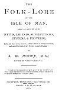

  
[Intangible Textual Heritage](../../../index.md) 
[Legends/Sagas](../../index)  [Celtic](../index)  [Index](index.md) 
[Next](fim01.md) 

------------------------------------------------------------------------

##### THE

# FOLK-LORE

###### OF THE

### ISLE OF MAN,

###### BEING AN ACCOUNT OF ITS

#### MYTHS, LEGENDS, SUPERSTITIONS, CUSTOMS, & PROVERBS,

#### Collected from many sources; with a GENERAL INTRODUCTION; and with EXPLANATORY NOTES to each Chapter;

###### BY

## A. W. MOOD E, M.A.;

###### AUTHOR OF "MANX NAMES," &c.

\_\_\_\_\_\_\_\_\_\_\_\_\_\_\_\_\_\_\_\_

"I would not for any quantity of gold, part with the wonderful tales
which I have retained from my earliest childhood, or have met with in my
progress through life."--*Martin Luther*.

\_\_\_\_\_\_\_\_\_\_\_\_\_\_\_\_\_\_\_\_\_\_\_\_\_\_\_\_\_\_\_\_\_\_\_\_\_\_\_\_\_

#### ISLE OF MAN: BROWN & SON, "Times" Buildings, Athol Street, Douglas.

#### LONDON: D. NUTT, 270, Strand.

#### \[1891\]

NOTICE OF ATTRIBUTION  
Scanned at Intangible Textual Heritage, June 2005. Proofed and formatted
by John Bruno Hare. This text is in the public domain in the United
States because it was published prior to 1923. These files may be used
for any non-commercial purpose, provided this notice of attribution is
left intact in all copies.

[  
Click to enlarge](img/title.jpg.md)  
Title Page  

------------------------------------------------------------------------

[Next: Introduction](fim01.md)
