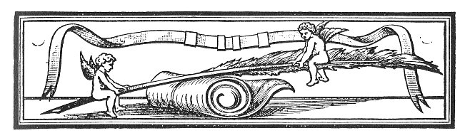
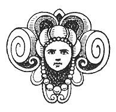

  
[Intangible Textual Heritage](../../../index.md) 
[Legends/Sagas](../../index)  [Celtic](../index)  [Index](index.md) 
[Previous](fim04)  [Next](fim06.md) 

------------------------------------------------------------------------

p. 19

 

## CHAPTER II.

### HAGIOLOGICAL AND MYTHO-HISTORICAL LEGENDS.

|                     |
|---------------------|
|  |

HE following legends are of entirely different character and origin from
the early myths. Those relating to the "Conversion of St. Maughold,"
"St. Maughold and Gilcolm," "The Legend of Myrescogh Lake," and "The
Stone Cross of Ballafletcher" are pious stories invented by monks and
priests for the edification of simple-minded laymen; while the legends
entitled "Goddard Crovan's Stone," "Olave Goddardson and the Sword
Macabuin," "Ivar and Matilda," and "Alswith the Swift" are tales which,
fostered by the love of the marvellous, have sprung up about personages,
some of whom are historical, centuries after the events related are
supposed to have taken place. The account of the conversion of the Manx
which follows is probably semi-historical, but will serve as an
introduction to the legends.

#### THE CONVERSION OF THE MANX.

The *Tripartite Life of St. Patrick* contains the following interesting
account of the conversion of Manxmen to Christianity:--St. Patrick
having by means of a miracle converted a wicked man of
[Ulster](errata.htm#3.md), called Macc Cuill, and his men, the following
incident is related:--"Then they were silent, and said, 'Truly this man
Patrick is a man of God.' They all forthwith believed, and Macc Cuill
believed, and at Patrick's behest he went into the sea in a coracle of
(only) one hide. . . . Now Macc Cuill went on that day to sea, with his
right hand towards Maginis, till he reached Mann, and found two
wonderful men in the island before him. And it is they that preached
God's Word

p. 20

in Mann, and through their preaching the men of that island were
baptized. Conindri and Romuil were their names. Now, when these men saw
Macc Cuill in his coracle, they took him from the sea, and received him
with a welcome; and he learnt the divine rule with them, until he took
the bishopric after them. This is Macc Cuill from the sea," the
illustrious bishop and prelate of Arduimen. [1](#fn_34.md) It has been conjectured with reasonable
probability, for reasons that need not be given here, that Macc Cuill is
identical with Maughold. In this story of the conversion of the Manx
there is probably a substratum of fact mingled with fiction. The
"Traditionary Ballad" gives the following account of it:--

Then came Patrick into the midst of them;  
He was a saint, and full of virtue;  
He banished Mannanan on the wave,  
And his evil servants all dispersed.  
And of all those that were evil,  
He showed no favour nor kindness,  
That were of the seed of the conjurors,  
But what he destroyed or put to death  
He blessed the country from end to end,  
And never left a beggar in it;  
And also cleared off all those  
That refused or denied to become Christians.  
Thus it was that Christianity first came to Man,  
By St. Patrick planted in,  
And to establish Christ in us,  
And also in our children.  
He then blessed Saint German,  
And left him a bishop in it,  
To strengthen the faith more and more,  
And faithfully built chapels in it.  
For each four quarterlands he made a chapel  
For people of them to meet in prayer;  
He also built German Church in Peel Castle,  
Which remaineth there until this day.  
Before German had finished his work,  
God sent for him, and he died;  
As ye yourselves know that this messenger  
Cannot be put off by using means.  
He died and his corpse was laid  
Where a great bank had been, hut soon was levelled;  
A cross of stone is set at his feet  
In his own church in Peel Castle.  
Then came Maughold, we are told,  
And came on shore at the Head,  
And built a church and yard around  
At the place he thought to have his dwelling.  
The chapels which Saint German ordered  
For the people to come to prayers in them,  
Maughold put a parcel of them into one, p.
21  
And thus make regular parishes.  
Maughold died, and he is laid  
In his own church at Manghold Head.  
And the next Bishop that came after  
To the best of my knowledge was Lonnan.  
Connaghan then came next,  
And then Marown the third;  
There all three lie in Marown,  
And there for ever lie unmolested.  
Now we will pass by these holy men,  
And commit their souls to the Son of God.  
It profiteth them not to praise them more  
Until they appear before the King of Kings. [1](#fn_35.md)

The St. Maughold referred to above is said to have been one of St.
Patrick's earliest disciples. The "Book of Armagh" gives the marvellous
story of his conversion by St. Patrick, and in the other accounts of St.
Patrick's life are equally marvellous tales about his episcopate. These
are all, perhaps, surpassed by the circumstantial statements in the
*Chronicon Manniæ* (see below), concerning his reappearance in the
twelfth century to strike dead with his staff a daring pirate who had
profaned his sanctuary.

#### THE CONVERSION OF THE ROBBER CHIEF MACALDUS, OTHERWISE ST. MAUGHOLD.

A district adjoining the Boyne was invested by a band of robbers under
the command of a chief named Macaldus. Some of these had been converted
from the error of their ways by the Missionaries, and their chief was
very wroth in consequence against St. Patrick. Hearing that he was to
pass along a road in their neighbourhood on a certain day, he and some
of his band took up a position by its side, intending to murder him; but
as they caught sight of him slowly approaching, and apparently sunk in
profound contemplation, they found themselves deprived of all desire to
injure him. Still they would not let the opportunity pass without
endeavouring to bring ridicule on him by some stratagem. So one of them
lay down by the side of the woodland path as if dead, and Macaldus, as
the Saint passed by, besought him to restore his dead comrade to life.
"I dare not intercede for him," said the Saint, and passed on. Though
very well inclined to offer him some insult, they could not muster
resolution for the purpose, and when he had gone on a little way,
Macaldus ordered the man to rise. But while this poor wretch had been
feigning death, life had really deserted his body, and consternation and

p. 22

remorse now seized on his comrades. Macaldus, foremost in wickedness,
was the first to feel repentance. Following St. Patrick, and throwing
himself on his knees before him, he besought him to return and intercede
for his comrade's restoration, acknowledging the deception they had
attempted, and his own readiness to undergo the severest penance the
Saint might impose.

The Apostle, retracing his steps, knelt by the dead body, and did not
cease to pray till the breath of life entered it again. All the band
present vowed on the spot to embrace the faith preached by Patrick, and
Macaldus besought the imposition of some most rigorous penance upon
himself. Patrick conducted him to the Boyne, and taking a chain from a
boat he flung it round him, secured the ends by a padlock, and threw the
key into the river. He then made him get into the boat, and trust his
course to Providence. "Loose not your chain," said he, "till the key
which now lies at the bottom of this river is found and delivered to
you. Strive to maintain (with God's help) a spirit of true sorrow; pray
without ceasing." He then unmoored the hide covered canoe; it drifted
down the river, out by the old seaport of Colpa, and so into the sea.

In twenty hours it was lying by a little harbour in Man, and those who
assembled wondered much at the robust form of the navigator, his
dejected appearance, and the chain that bound his body. On making
enquiry for the abode of a Christian Priest, he found that the Bishop of
the Island lived near. He went to his house, told him his former life
and present condition, and besought instruction. This was freely given,
and the man's conversion found to be sincere. Feeling a strong vocation
for the clerical office, he studied unremittingly, and at last came to
the eve of the day on which he was to receive holy orders. On that
evening the cook, suddenly entering the room in which the Bishop and
postulant were conferring, cried out, "Behold, O my master, what I have
taken from the belly of a fish just brought in." Macaldus, catching
sight of the key in the cook's hand, at once recognised it as the one
with which St. Patrick had secured his chain. It was at once applied to
its proper use, and he had the happiness of being ordained next day,
unencumbered by spiritual or material bonds. At the death of his kind
patron and instructor, he was raised to the dignity of the Bishop of
Man. [1](#fn_36.md)

p. 23

#### ST. MAUGHOLD'S FISH.

The following story about St. Maughold, when residing in the Isle of
Man, is from the *Triadis Thaumaturgæ* of Colgan:--And when he had for
some time abided there, a fish was one day taken in the sea, and brought
into their dwelling, and when the fish was opened before them, a key was
found in his belly, and Machaldus being released from his chains, gave
thanks unto God, and went henceforth free; and he increased in holiness,
and after the decease of these holy Bishops, [1](#fn_37.md) attained to the episcopal degree, and
being eminent in his miracles and in his virtues, there did he rest. In
that Island there was a city called after him, of no small extent, the
remains of whose walls may yet be seen, and in the cemetery of its
church is a sarcophagus of hollow stone, out of which a spring
continually exudes, nay, freely floweth, which is sweet to the palate,
whole some to the taste, and healeth divers infirmities, and the
deadliness of poison; for whoso drinketh thereof, either receiveth
instant health or instantly dieth. In that stone the bones of St.
Machaldus are said to rest, yet nothing is found therein save the clear
water only; and though many have often times endeavoured to remove the
stone, and especially the king of the Norice (of Norway?), who subdued
the Island, that he might at all times have sweet water, yet they have
all failed in their attempts; for the deeper they dug to raise the
stone, so much the more deeply and firmly did they find it fixed in the
heart of the earth.

This well is still celebrated for its sanative properties (see ch. vi.,
"August 12th.")

The next story about him relates to a much later period.

ST. MAUGHOLD AND GILCOLUM.

"Thenne, of Maughold, the Saynte, thys storye is,  
  Of wycked Gil Colum by Kewyse;  
A wonderous tale, yett so trewe ytt is,  
  That noe bodye ytt denyes."

While Somerlid was at Ramsey, in Man, in 1158, he was informed that his
troops intended to plunder the Church of St. Maughold, where a great
deal of money had been deposited, in hopes that the veneration due to
St. Maughold, added to the sanctity of the place, would secure
everything within its precincts. One GilColum, a very powerful
chieftain, in particular, drew the attention of Somerlid to these
treasures;

p. 24

and, besides, observed that he did not see how it was any breach of the
peace against St. Maughold, if, for the sustenance of the army, they
drove off the cattle which were feeding round the churchyard. Somerlid
objected to the proposal, and said that he would allow no violence to be
offered to St. Maughold. On this, GilColum earnestly petitioned that he
and his followers might be allowed to examine the place, and engaged to
take the guilt upon his own head. Somerlid, at last, though with some
reluctance, consented, and pronounced these words: "Let the affair rest
between thee and St. Maughold--let me and my troops be innocent--we
claim no share of thy sacrilegious booty." GilColum, exceedingly happy
at this declaration, ran back and ordered his vassals to assemble. He
then desired that his three sons should be ready at daybreak, to
surprise the church of St. Maughold, about two miles distant. Meanwhile,
news was brought to those in the church that the enemy were advancing,
which terrified them to such a degree that they all left the sanctuary,
and sought shelter in caves and subterraneous dens. The other
inhabitants of the district, with loud shrieks, spent the whole night in
imploring the forgiveness of God, through the merits of Maughold. The
weaker sex, also, with dishevelled locks, ran frantic about the walls of
the church, yelling and crying with a loud voice, "Where art thou
departed, Holy Maughold? Where are the wonders that, in the old time
before us, thou wroughtest in this spot--hast thou abandoned us for
[our](errata.htm#5.md) transgressions--wilt thou forsake thy people in such
an extremity? If not in compassion towards us, yet for thine own honour,
once more send us deliverance."

Maughold mollified, as we suppose, by these and the like supplications,
pitied the distress of his votaries. He snatched them from their
imminent danger, and consigned their adversary to instantaneous death.
GilColum had no sooner fallen asleep in his tent than St. Maughold,
arrayed in a white garment, and holding a pastoral staff in his hand,
appeared to the robber. He placed himself opposite to the couch, and
thus addressed him:--"What hast thou against me, GilColum? Wherein have
I, or any of my servants, offended thee, that thou shouldest thus covet
what is deposited within my sanctuary?" GilColum answered, "And who art
thou?" He replied, "I am the servant of Christ; my name, Maughold, whose
church thou purposest to violate; but vain are thy endeavours!" On this,
raising the staff which he held, he struck him to the heart. The impious
man was confounded, and awakened his soldiers, who were sleeping in
their tents. The Saint struck him again, which made the ruffian utter a
shriek, so hideous, that his son, and

p. 25

followers, ran in the greatest consternation to see what was the matter.
The wretch's tongue clove to his mouth in such a manner that it was with
much difficulty he could utter the following sentence:--"Maughold," said
he with a groan, "was here, and thrice he struck me with his rod. Go,
therefore, to the church, bring his staff, and also priests and clerks,
that they may make intercession for me, if, peradventure, St. Maughold
will forgive what I devised against him." In obedience his attendants
straightway implored the priests to bring the staff, and to visit their
master apparently in the agonies of death, relating at the same time
what had happened. The priests and clerks and people, on hearing of the
miracle, were exceedingly rejoiced indeed, and despatched some clergymen
with the crosier. Coming into the presence of the afflicted wretch they
found him almost breathless, wherefore one of the clerks pronounced the
following imprecation:--"May St. Maughold, who first laid his vengeful
hand upon thee, never remove thy plagues till he has bruised thee to
pieces. Thus shall others by seeing and hearing thy punishment learn to
pay due respect to hallowed ground." The clergy then retired, and
immediately such a swarm of monstrous, filthy flies come buzzing about
the ruffian's face and mouth, that neither he himself nor his attendants
could drive them away. At last, about the sixth hour of the day, he
expired in great misery and dismal torture. The exit of this man struck
Somerlid and his whole host with such dismay that, as soon as the tide
floated their ships, they weighed anchor, and with precipitancy returned
home.

#### A LEGEND OF MYRESCOGH LAKE.

There was a certain person called Donald, a veteran
[Chieftain](errata.htm#6.md), and a particular favourite of Harald
Olaveson. This man, flying the persecution raised by Harald Godredson,
took sanctuary with his infant child in St. Mary's Monastery, at Rushen.
Thither Harald Godredson followed, and as he could not offer violence in
this privileged place, he, in flattering and deceitful language,
addressed the aged man to this purpose:--"Why dost thou thus resolve to
fly from me? I mean to do thee no harm." He then assured him of
protection, adding that he might depart in peace to any part of the
country he had a mind. The veteran, relying on the solemn promise and
veracity of the King, followed him out of the Monastery. Within a short
space, however, his Majesty manifested his sinister intentions, and
demonstrated that he paid no regard to truth, or even his oath. He
ordered the old man to be apprehended, bound, and carried to an Isle in
the Lake at Myrescogh where he was consigned over to the charge of a
strong guard, In this distress,

p. 26

\[paragraph continues\] Donald still had confidence towards God. As
often as he could bend his knees, he prayed the Lord to deliver him from
his chains, through the intercession of the blessed Virgin, from whose
Monastery he had been so insidiously betrayed. The Divine interposition
was not withheld. One day as he was sitting in his chamber, and guarded
only by two sentinels, for the others were absent, suddenly the fetters
dropped from his ankles, and left him at full liberty to escape. He
reflected, notwithstanding, that he could elope more successfully during
the night while the sentinels were a sleep, and from this consideration
attempted to replace his feet in the fetters, but to his astonishment
found it impossible. Concluding, therefore, that this was wrought by the
might of Heaven, he wrapped himself in his mantle, and taking to his
heels, made the best of his way. One of the sentinels, a baker by trade,
observing him, immediately started up and pursued. Having run a good
way, eager to overtake the fugitive, he hit his shin a severe blow
against a log; and thus while posting full speed he was so arrested by
the power of the Lord that he could not stand. Hence the good man, by
the help of Heaven, got clear, and on the third day he reached St.
Mary's Abbey at Rushen, where he put up thanksgivings to God and the
most merciful Mother for the deliverance. This declaration, adds the
chronicler, we have recorded from the man's own mouth. This took place
in 1249. [1](#fn_38.md)

#### THE STONE CROSS OF BALLAFLETCHER.

In a wild and barren field near Ballafletcher there was formerly a large
Stone Cross, but in the many changes and revolutions which have happened
in this Island has been broken down, and part of it lost; but there
still remains the cross part. This has several times been attempted to
be removed by persons who pretended a claim to whatever was on that
ground, and wanted this piece of stone; but all their endeavours have
been unsuccessful. Nor could the strongest team of horses be able to
remove it, though irons were placed about it for that purpose. One day a
great number of people being gathered about it, contriving new methods
for the taking of it away, a very venerable old man appeared among the
crowd, and, seeing a boy of about six or seven years of age, he bade him
to put his hand to the stone, which the child doing, it immediately
turned under his touch, and under it was found a piece of paper, on
which were written these words: "Fear God, obey the priesthood, and do
to your neighbour as you would have him do to you." Everybody present
was in the

p. 27

utmost surprise, especially when looking for the old man in order to ask
him some questions concerning the miraculous removal of the stone, he
was not to be found, though it was not a minute that they had taken
their eyes off him, and there was neither house nor hut in a great
distance where he could possibly have concealed himself. The paper was,
however, carefully preserved, and carried to the vicar, who wrote copies
of it, and dispersed them over the Island. They tell you that they are
of such wonderful virtue to whoever wears them that on whatever business
they go they are certain of success. They also defend from witchcraft,
evil tongues, and all efforts of the devil or his agents.--*Waldron*.

#### GODDARD CROVAN'S STONE.

Down in the valley of St. Mark's, near a little purling brook, lies the
famous granite boulder, weighing between twenty and thirty tons, known
by the name of Goddard Crovan's stone. It was cast into this situation
one day by Goddard Crovan, son of Harold the Black, of Iceland, who
lived with his termagant wife in a great castle on the top of Barrule.
Unable to endure the violence of her tongue, he turned her
unceremoniously out of doors. After descending the mountain some
distance, imagining herself out of reach, she turned round and began
again to rate him so soundly at the full pitch of her voice that, in a
rage, he seized on this huge granite boulder, and hurling it with all
his might killed her on the spot. This took place about the year
1060.--*Cumming*.

This stone was broken up and used in building the parsonage house at St.
Mark's, and has been considered effectual as a specific for the cure of
a termagant by every occupier.

#### OLAVE GODDARDSON AND THE SWORD MACABUIN.

According to tradition, there resided in Man, in the days of Olave
Goddardson, a great Norman baron, named Kitter, who was so fond of the
chase that he extirpated all the bisons and elks with which the Island
abounded at the time of his arrival, to the utter dismay of the people,
who, dreading that he might likewise deprive them of the cattle, and
even of their purrs in the mountains, had recourse to witchcraft to
prevent such a disaster. When this Nimrod of the north had destroyed all
the wild animals of the chase in Man, he one day extended his havoc to
the red deer of the Calf, leaving at his castle, on the brow of Barrule,
only the cook, whose name was Eaoch (which signifies a person who can
cry aloud), to dress the provisions intended for his dinner. Eaoch
happened to fall asleep at his work in the kitchen. The famous
witch-wife Ada caused the

p. 28

fat accumulated at the lee side of the boiling pot to bubble over into
the fire, which set the house in a blaze. The astonished cook
immediately exerted his characteristic powers to such an extent that he
alarmed the hunters in the Calf, a distance. of nearly ten miles.

Kitter, hearing the cries of his cook, and seeing his castle in· flames,
made to the beach with all possible speed, and embarked. in a small
currach for Man, accompanied by nearly all his--attendants. When about
half way, the frail bark struck on a rock (which, from that
circumstance, has since been called Kitterland), and all on board
perished.

The fate of the great baron, and the destruction of his boat, caused the
surviving Norwegians to believe that Eaoch the cook was in league with
the witches of the Island, to extirpate the Norwegians then in Man; and
on this charge he was brought to trial,: and sentenced to suffer death.
The unfortunate cook heard his doom pronounced with great composure; but
claimed the privilege, at that time allowed to criminals in Norway, of
choosing the place and manner of passing from time to eternity. This was
readily granted by the king. "Then," said the cook, with a loud voice,
"I wish my head to be laid across one of your majesty's legs, and there
cut off by your majesty's sword, Macabuin, which was made by Loan
Maclibuin, the Dark Smith of Drontheim."

It being generally known that the king's scimitar could sever even a
mountain of granite, if brought into immediate contact with its edge, it
was the wish of everyone present that he would not comply with the
subtle artifice of such a low varlet as Eaoch the cook; but his majesty
would not retract the permission so recently given, and, therefore, gave
orders that the execution should take place in the manner desired.

Although the unflinching integrity of Olave was admired by his subjects,
they sympathised deeply for the personal injury to which he exposed
himself, rather than deviate from the path of rectitude. But Ada, the
witch, was at hand: she ordered toads' skins, twigs of the rowan tree,
and adders eggs, each to the number of nine times nine, to be placed
between the king's. leg and the cook's head, to which he assented.

All these things being properly adjusted, the great sword, Macabuin,
made by Loan Maclibuin, the Dark Smith of Drontheim, was lifted with the
greatest caution by one of the king's most trusty servants, and laid
gently on the neck of the cook; but ere its downward course could be
stayed, it severed the head from the body of Eaoch, and cut all the
preventives asunder, except the last, thereby saving the king's leg from
harm

When the Dark Smith of Drontheim heard of the stratagem

p. 29

submitted to by Olave to thwart the efficacy of the sword Macabuin, he
was so highly offended that he despatched his hammerman,
Hiallus-nan-urd, who had only one leg, having lost the other when
assisting in making that great sword, to the Castle of Peel to challenge
King Olave or any of his people to walk with him to Drontheim. It was
accounted very dishonourable in those days to refuse a challenge,
particularly if connected with a point of honour. Olave, in mere
compliance with this rule, accepted the challenge, and set out to walk
against the one-legged traveller from the Isle of Man to the smithy of
Loan Maclibhuin, in Drontheim.

They walked o’er the land and they sail’d o’er the sea.

And so equal was the match that, when within sight of the smithy,
Hiallus-nan-urd, who was first, called at Loan Maclibhuin to open the
door, and Olave called out to shut it. At that instant, pushing past he
of the one leg, the King entered the smithy first, to the evident
discomfiture of the swarthy smith and his assistant. To show that he was
not in the least fatigued, Olave lifted a large forehammer, and under
pretence of assisting the smith, struck the anvil with such force that
he clove it not only from top to bottom, but also the block upon which
it rested.

Emergaid, the daughter of Loan, seeing Olave perform such manly prowess,
fell so deeply in love with him that during the time her father was
replacing the block and the anvil, she found an opportunity of informing
him that her father was only replacing the studdy to finish a sword he
was making, and that he had decoyed him to that place for the purpose of
destruction, as it had been prophesied that the sword would be tempered
in Royal blood, and in revenge for the affront of the cook's death by
the sword Macabuin. "Is not your father the seventh son of old *windy
cap*, King of Norway?" said Olave. "He is," replied Emergaid, as her
father entered the smithy. "Then," cried the King of Man, as he drew the
red steel from the fire, "the prophecy must be fulfilled." Emergaid was
unable to stay his uplifted hand till he quenched the sword in the blood
of her father, and afterwards pierced the heart of the one-legged
hammerman, who he knew was in the plot of taking his life.

This tragical event was followed by one of a more agreeable nature.
Olave, conscious that had it not been for the timely intervention of
Emergaid, the sword of her father would indeed have been tempered in his
blood, and knowing the irreparable loss which she had sustained at his
hands, made her his queen, and from her were descended all succeeding
Kings of Man down to Magnus, the last of the race of Goddard Crovan, the
Conqueror.--*Train*.

p. 30

#### ALSWITH THE SWIFT.

Alswith, a son of Hiallus-nan-ard, the dark smith of Drontheim, whom
Olave Goddardson slew in the smithy of Loan Maclibuin, undertook to walk
round all the churches in the Isle of Man in one day. Now, in these days
there were a great number of churches and chapels which St. Germanus had
caused to be built, and the roads were then very rough and steep over
the mountains, so that it was no easy task to accomplish this. However,
Alswith started off very early one fine summer's morning, and he walked
and walked till he had almost accomplished his task. As the evening was
drawing on he approached the Tynwald Chapel at St. John's, and from
thence pursued his way along the old road leading to the Staarvey, the
road up Craig Willey's hill not having been made till long after this.
It was now getting very late, and he had still to visit Kirk Michael
before his task would be completed; so he pushed on faster than ever, so
that when going up the hill leading over "The Driney" he fell down quite
exhausted with fatigue and feeling utterly miserable at not having
accomplished his undertaking. Since then that hill has been called
*Ughtagh breesh my chree*, "Break my heart hill."

#### IVAR AND MATILDA.

"The course of true love never did run smooth. *"--Shakespeare*.

"In the year 1249 Reginald began to reign on the 6th May, and on the
30th May of the same month was slain by the Knight Ivar and his
*accomplices."--Chronicon Manniæ*.

There was a young and gallant knight, named Ivar, who was enamoured of a
very beautiful maiden, named Matilda. He loved her ardently, and she
reciprocated his affection. From childhood they had been companions, and
as they grew up in years, the firmer became they attached to each other.
Never, indeed, were two beings more indissolubly bound by the fetters of
love than Ivar and Matilda. But storms will overcast the serenest sky.
At this period Reginald was King of the Isle of Man; and, according to
ancient custom, it was incumbent upon Ivar to present his betrothed at
the Court of the Monarch, and obtain his consent, prior to becoming
linked in more indissoluble fetters with her. The nuptial day had
already been fixed, the feast had been prepared, and it was noised
abroad that the great and noble of the Island were to be present at the
celebration of the marriage. King Reginald resided in Rushen Castle, in
all the barbaric pomp which was predominant in those olden times; and
thither Ivar, accompanied by Matilda, proceeded to

p. 31

wait upon him. Dismounting from their horses at the entrance of the
keep, they were conducted to the presence of the King. Ivar doffed his
jewelled cap, and made obeisance; then, leading forward Matilda, he
presented her to him. Reginald was greatly enraptured with the maiden's
beauty from the first moment she had met his gaze, and swore inwardly
that he would possess her for himself, and spoil the knight of his
affianced bride. To carry into effect his wicked purpose, he accused
Ivar of pretended crimes; and, ordering in his guards, banished him from
his presence; detaining, however, the maiden. Vain would it be to depict
Matilda's anguish at this barbarous treatment. Reginald endeavoured to
sooth her agitation, but it was to no purpose. He talked to her of his
devoted love, but the maiden spurned his impious offers with contempt.
Exasperated at her resistance, he had her confined in one of the most
solitary apartments in the Castle. In the meantime, Ivar exerted himself
to avenge the deep injury which he had received; but Reginald had such
despotic sway, that all his endeavours proved abortive. At length he
resolved to retire from the world, to assume the monastic habit, and to
join the pious brotherhood of the Monastery of St. Mary's of Rushen. The
brethren received him with joy, commiserating the bereavement which he
had sustained. Ivar was now devoted to acts of piety; but still he did
not forget his Matilda. Sometimes he would ascend the Hill, and gaze
towards the Castle, wondering if Matilda were yet alive. One day, matin
prayers having been offered up, Ivar wandered as usual through the
woods, thinking of his betrothed, and bowed down with sorrow. At last he
reclined on the grass to rest; when, looking around, he beheld a fissure
in a rock which abutted from an eminence immediately opposite. Curiosity
induced him to go near; and he discovered that it was the entrance to a
subterranean passage. venturing in, he proceeded for some distance.
Onward he went, till a great door arrested his progress. After some
difficulty it yielded to his endeavours, and he passed through. Suddenly
a piercing shriek, which reverberated along the echoing vaults
[fixed](errata.htm#7.md) him horror-struck for a moment to the place. It
was repeated faintly several times. A faint glimmer of light now broke
in upon his path, and he found himself in a vaulted chamber. Passing
through it, another cry met his ear; and rushing impetuously forward, he
heard a voice in a state of exhaustion exclaim, "Mother of God, save
Matilda!" Whilst, through a chink in the barrier, he beheld his long
lost love, with dishevelled hair and throbbing bosom, in the arms of the
tyrant Reginald. Ivar instantly sprang through the barrier, rushed upon
the wretch, and, seizing his sword, which lay carelessly on the table,
plunged it into Reginald's bosom. Ivar,

p. 32

carrying Matilda in his arms, continued on through the subterranean
passage, which brought them to the sea side where they met with a boat,
which conveyed them to Ireland. There they were united in holy
matrimony, and passed the remainder of their days in the raptures of a
generous love, heightened by mutual admiration and gratitude.

 

 

------------------------------------------------------------------------

### Footnotes

[20:1](fim05.htm#fr_35.md) Stoke's Translation, p.
223.

[21:1](fim05.htm#fr_36.md) Manx Society, vol. xxi.,
pp. 29-33; or Train's History of Isle of Man, p. 52.

[22:1](fim05.htm#fr_37.md) From
[Kennedy's](errata.htm#4.md) *Legendary Fictions of the Irish Celts*,
London, 1866; original authority *The Book of Armagh*, probably written
in the eighth century.

[23:1](fim05.htm#fr_38.md) Conindrius and Romuilus,
supposed to have been the two first Bishops of the Island.

[26:1](fim05.htm#fr_39.md) Founded on the account
given in the *Chronicon Manniæ*.

------------------------------------------------------------------------

[Next: Chapter III. Fairies and Familiar Spirits](fim06.md)
