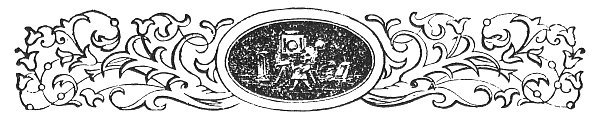
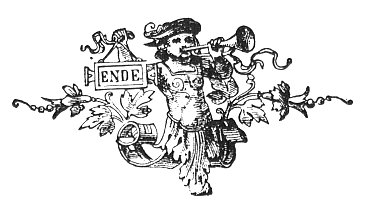

  
[Intangible Textual Heritage](../../../index.md) 
[Legends/Sagas](../../index)  [Celtic](../index)  [Index](index.md) 
[Previous](fim12.md) 

------------------------------------------------------------------------

p. 181

 

# CHAPTER X.

### PROVERBS AND SAYINGS.

|                     |
|---------------------|
|  |

O account of the Customs and Superstitions of the Manx would be complete
without touching upon their proverbs and characteristic sayings. For
nothing shows the peculiarities in the character and prevailing habits
of thought of a people more vividly than its proverbs. Any one reading
the Manx proverbs would at once say that many of them were similar to
those of other peoples, but this does not necessarily show that they are
not of native origin. It is, indeed, a well-known fact that there is a
remarkable similarity in the proverbs of all peoples, e.g., our
comparative philologists tell us of the likeness between the proverbs of
the Zulu and the Finn. Yet this simply proves that human thought runs in
a common groove, and does not disprove the separate origin of the
thoughts of each people. In fact the proverbs of different peoples,
which may be defined as the result of their common-sense welded into
trite sayings, are similar, because their ordinary ideas and wants are
sure to be much the same. Still, national characteristics do appear in
proverbs, and, as will he seen from those which follow, the special Manx
attribute, that of caution, is no exception to this rule. These
proverbs, which appear in the various forms of Maxims, Axioms, or
Precepts, are, for convenience, classified under the following
headings:--(1) Proverbs relating to General Truths; (2) Proverbs
inculcating Caution, Contentment, Thrift, Independence, Industry, and
Charity; (3) Proverbial Weather-Lore; (4) Miscellaneous Proverbs and
Sayings.

The following Proverbs are summary, statements of *General Truths*:--

*Cha jagh moylley ghooinney hene rieau foddey voish e ghorrys*. "A man's
praise of himself never went far from his door"--*i.e.*, "Self praise is
no recommendation."

p. 182

*Boayl nagh vel aggle cha vel grayse*.  
"Where there is no fear there is no grace."

*Eshyn nagh gow rish briw erbee t’eh deyrey eh hene*.  
"He who will acknowledge no judge condemns himself."

*Ta bee eeit jarroodit*.  
"Eaten food is forgotten."

*Cha vel fer erbee cha bouyr, as eshyn nagh jean clashtyn*.  
"There is no man so deaf as he who will not hear."

*Gowee bleb rish voylley, as gowee dooinney creeney rish foill*.  
"A fool will receive praise, and a rich man will receive blame."

*Ta fuill ny s’chee na ushtey*.  
"Blood is thicker than water."

*Ta scuirrys y laue dy choyrt, scuirrys yn veeal dy voylley*.  
"When the hand ceases to give, the mouth ceases to praise." James, the
7th Earl of Derby, made use of this proverb, in complaining of the
ingratitude of Captain Edmund Christian, whom he had made Governor of
the Island, and upon whom he had conferred many benefits.

*Caghlaa obbyr aash*.  
"Change of work is rest"--a very notable and true proverb.

*Ta ynsagh coamrey stoamey yn dooinney berthagh; as t’eh berchys yn
dooinney boght*.  
"Learning is fine clothes of the rich man, and it is riches of the poor
man"--*i.e.*, It is of some value in the one case, but of much more
value in the other. The following Italian proverb conveys a similar
idea--''Knowledge is silver among the poor, gold among the nobles, and a
jewel among princes."

*Myr sniessey d’an chraue s’miljey yn eill*.  
"The nearer the bone the sweeter the flesh."

*Ta drogh hammag ny share na magher foshlit*.  
"A miserable bush is better than an open field." This is similar to the
Scotch proverb, "a wee bush is better than nae bield." This imagery can
be well appreciated in a country so swept by the wind as the Isle of
Man. The meaning is, in effect, "Half a loaf is better than no bread."

*Cha dooar rieau drogh veaynee corran mie*.  
"A bad reaper never got a good sickle "--*i.e.*, "A bad workman quarrels
with his tools."

*Cha deinee rieau yn soogh y shang*.  
"The greedy will never feel for the hungry."

*Un eam gys bee, as jees gys obbyr*.  
"One call to meat, and two to work."

p. 182

*Obbyr dyn sharrey, obbyr dyn booise*.  
"Work without desire, work without thanks"--*i.e.*,
"[Proffered](errata.htm#42.md) service stinks."

*Sooree ghiare, yn tooree share*.  
"Short courting, the best courting."

*Boayl to gioee ta keck, as boayl to mraane ta pleat*.  
"Where there are geese there is dirt, and where there are women there is
talking."

*De ve aashagh ’syn oie, monney shibber nagh ee, er nonney nee oo
plaiynt er laccal dty laynt*.  
"To be easy in the night much supper don't eat, or else thoul’t complain
at wanting thy health."

*Myr sniessey da’n oie, slhee mitchooryn*.  
"The nearer to the night, the more rogues."

*Cha row rieau cooid chebbit mie*.  
"Never were offered wares good."

*T’an yeean myr e ghooie my vel clooie er y chione*.  
"The chicken is like its kind before down is on its head."

*Ta fys ec dy chooilley ghooinney c’raad t’an vraag gortagh eh*.  
"Every man knows where the shoe hurts him."

*Oie mooie as oie elley sthie.  
Olk son cabbil, agh son kirree mie*.  
"One night out and another in,  
Bad for horses, but good for sheep."

*Ta greim ayns traa cooie, sauail nuy*.  
"A stitch in due time saves nine."

*Foddeee fastyr grianagh ve ec moghray boojalagh*.  
"A sunny evening may follow a cloudy morning"--*i.e.*, *Nil
desperandum*.

*My to keim ’sy laair, bee keim ’sy lhiy*.  
"If there's an amble in the mare, it will be in the colt."

Though,

*Ta boa vie ny gha agh drogh lheiy ee*.  
"Many a good cow hath but a bad calf."

*Keeayl chionnit, yn cheeayl share  
Mannagh vel ee kionnit ro ghayr*.  
"Bought wit, the best wit,  
If it he not bought too dear."

The following are especially connected with *Morality*:--

*T’an aghaue veg shuyr da’n aghaue vooar*.  
"The little hemlock is sister to the great hemlock"--*i.e.*, "The little
sin is sister to the great sin."

p. 184

*Ta cree dooie ny share na kione croutagh*.  
"A kind heart is better than a crafty (knotty) head."

*Ta dooinney creeney mennick jannoo carrey jeh e noid*.  
"A wise man often makes a friend of his enemy."

*Eshyn ghuirrys skeealley hayrtys skeealley*.  
"He who hatches tales shall be caught by tales."

*Ta chengey ny host ny share na olk y ghra*.  
"The silent tongue is better than evil speaking."

*Eshyn lhieys marish moddee, irrys eh marish jarganyn*.  
"He who will lie down with the dogs will rise up with the fleas
"--*i.e.*, "Evil communications corrupt good manners."

*Yiow moyrn lhieggy*.  
"Pride will have a fall."

*Cha vel eh cheet jesh da moyrn dy jannoo red erbee to laccal
leshtal*.  
"It does not become pride to do what needs an apology."

*Cha bee breagery credjit ga dy ninsh eh y n’irriney*.  
"A liar will not be believed tho’ he speaks the truth."

*Cha nee tra ta’n cheyrrey gee yn ouw to cheet r’ee*.  
"It is not when the sheep eats the march-penny it tells a tale"
(literally, "it comes to her")--*i.e.*, The result of evil-doing is not
always apparent at first. The *ouw* is a slow poison.

*Tasht prughag, as ee lughag*.  
"Store miser, and eat mouse."

*Ta un cheyrrey screebagh mhilley yn slane shioltane*.  
"One scabby sheep infects (or injures) the whole flock.

*Ta keeayll ommidjys ny sloo my t’ee ec dooinney creeney dy reayll*.  
"Wisdom is folly unless a wise man keeps it."

*S’ mie ve daaney, agh s’olk ve ro ghaaney*.  
How good to be forward, but how bad to be too forward.

 

The following Proverbs appear to inculcate *Selfishness*:--

*Faggys ta my lheiney, agh ny sniessey to my crackan*.  
"Near is my shirt, but nearer is my skin."

*Cha stamp rieau yn dow doo er e chass*.  
"The black ox never stamped on his own foot."

*Dy chooilley ghooinney er e hon hene, as Yee son ain ooilley*.  
"Every man for himself, and God for us all."

*Baase y derrey voddey, Mays y voddey elley*.  
"The death of one dog is the life of another."

p. 185

*Ceau craue ayns beeall drogh voddey*.  
"Throw a bone into a bad dog's mouth "--*i.e.*, Give a sop to any one
who annoys you, though he does not deserve it.

*Sniessey yn ullin na yn cloan*.  
"Nearer the barn than the children"--*i.e.*, Our own welfare is more
important than our children's.

*Slaa sahll er toinn muck roauyr*.  
"Daub grease upon the rump of a fat pig "--*i.e.*, Flatter the
prosperous.

 

The following Proverbs illustrate one of the chief characteristics of
Manxmen, *i.e.*, *Caution*:--

*Ta aile meeley jannoo bry millish*.  
"Slow fire makes sweet malt"--*i.e.*, Don't be in a hurry. Don't jump to
a conclusion.

*Foddee yn moddey s’jerree tayrtyn y mwaagh*.  
"Perhaps the last dog may catch the hare "--This enforces precisely the
same conclusion as the previous proverb.

*Lurg roayrt hig contraie*.  
"After spring tide will come neap"--*i.e.*, Don't be elevated by present
good fortune, a reverse may come.

*Coontey ny hein roish to ny hoohyn guirt*.  
"Counting the chickens before the eggs are hatched."

*Myr smoo siyr, smoo cumrail*.  
"The greater hurry, the greater hindrance.'

*Leah appee, leah lhoau*.  
"Soon ripe, soon rotten." This seems to carry much the same idea as
"Slow and steady wins the race."

*Moyll y droghad myr heu harrish*.  
"Praise the bridge as thou wilt go over it"--*i.e.*, Don't be in a hurry
to praise a thing before you try it.

*Eddyr daa stoyl to toinn er laare*.  
"Between two stools the bottom is on the floor"--or, you will fall on
the floor.

*Tra s’reagh yn chloie, share faagail jeh*.  
"When the play is merriest it is better to leave off.

*Stiark keayrt to dooinney siyragh ass seaghyn*.  
"Seldom is the time that a hasty man is out of trouble."

*Cha jean un ghollan-geayee sourey,  
My un chellagh-keylley geurey*.  
"One swallow will not make summer,  
 Nor one woodcock winter."

*Mollee yn molteyr oo my odays eh* p. 186  
"The impostor will cheat thee if he can"--*i.e.*, A man of bad
reputation is never to be trusted.

*Share yn olk shione dooin, na yn olk nagh nhione dooin*.  
"Better the evil we know than the evil we do not know."

*Tra to thie dty naboo er aile gow cairail jeh dty hie hene*.  
"When thy neighbour's house is on fire take care of thine own house."

*Ta ashag ’sy lane chammah as jees ’sy thammag*.  
"A bird in the hand is as well as two in the bush."

*Ta lane eddyr raa as janno*.  
"There's much between saying and doing."

*Ta lane caillit eddyr y lane as y veeal*.  
"There's much lost between the hand and the mouth "--*i.e.*, "There's
many a slip ’twixt the cup and the lip."

*Ec shibber Oie Ynnyd my vees dty volg lane,  
My jig Laa Caisht yiow traisht son shen*.  
At Shrove Tuesday if thy belly be-full,  
Before Easter Day thou mayst fast for that."

*Eaisht lesh dagh cleaysh, eisht jean briwnys*.  
"Listen with each ear, then do judgment."

 

The following may also be put under the heading of cautious proverbs as
their moral is "Do not be deceived by appearances":

*Cha nee yn woa smoo eieys smoo vlíeaunys*.  
"It is not the cow which lows the most will milk the most."

*Siyn follym smoo sheean nee*.  
"Empty vessels will make the most noise."

 

The following seem to inculcate virtues of *Contentment* and
*Kindness*:--

*Tra hig yn laa, hig yn coyrle lesh*.  
"When the day comes, its counsel will come with it "--*i.e.*,
"Sufficient for the day is the evil thereof."

*Shegin goaill ny eairkyn marish y cheh*.  
"We must take the horns with the hide."

*Cha nee eshyn ta red beg echey ta boght.  
Agh eshyn to geearree smoo*.  
'"Tis not the man who has little that's poor,  
But he that desires more."

*Eshyn nagh bee mie rish e gharran,  
Shegin dan, phollan y cur-lesh er e vooin*.  
"He who will not be kind to his nag must bring the saddle on his own
back "--*i.e.*, Kindness is the best policy.

p. 187

The following inculcate the virtue of *Thrift*:--

*Millish dy ghoaill, agh sharroo dy eeck*.  
"Sweet to take but bitter to pay "--*i.e.*, When you are enjoying
yourself and spending money remember you will have to pay for it.

*Hig daill gys eeck*.  
"Credit will come to pay."

*Roshee daill y dorrys*.  
"Credit will stretch the door."

*Ta fooiliagh naareydagh ny s’messey na ee scammyltagh*.  
"Shameful leaving is worse than shameful eating."

*Cha daink lesh y gheay, nagh ragh lesh yn ushtey*.  
"What did not come with the wind would not go with the water."

*Dhaa ghrogh eeck t’ayn, geeck rolaue, as dyn eeck eedyr*.  
"There are two bad pays--pay beforehand, and no pay at all."

*Share goll dy lie fegooish shibber na girree ayns lhiastynys*.  
"Better to go to bed supperless than to get up in debt."

*Taa aaa pharick* [1](#fn_139.md) *jannoo un
ghimmagh*.  
"Two small lobsters make a big one "--*i.e.*, "Many a little makes a
mickle."

*Cha vel sonnys gonnys*.  
"Store is no sore."

*Soddag cham, bolg jeereagh*.  
"Crooked bannock, straight belly."

The meaning of this is probably that spare living will make strong, able
men.

 

The dignity of *Independence* is the moral of the following:--

*Lhig dy chooilley ushag guirr e hoohyn hene*.  
"Let every bird hatch its own eggs."

*Lhig dy chooilley vuck reuyrey jeh hene*.  
"Let every pig dig for itself."

*Ta dty lhiasagh dty ghoarn*.  
"Thy recompense is thine own hand."

A similar idea is conveyed by

*Lhiat myr hoilloo*.  
"To thee as thou deservest."

 

The following proverbs inculcate *Industry*, *Promptitude*, and
*Thorough Work*:--

p. 188

*Litcheragh goll dy lie, litcheragh dy irree,  
As litcheragh dy goll dys y cheeill Je-doonee*.  
"Lazy to go to bed, lazy to rise,  
And lazy to go to church on Sunday."

*Cha vow laue ny haaue veg*.  
"The idle hand gets nothing."

*Cadley ny moddee tra ta ny mraane creearey*.  
"Dogs sleep when the women are sifting "--*i.e.*, sifting meal at the
mill.

*Bwoaill choud as ta’n yiarn cheh*.  
"Strike as long as the iron's hot."

*Jean traagh choud as ta’n grian soilshean*.  
"Make hay as long as the sun shines."

*Lhig da’n innagh lhie er y chione s’jerree*.  
"Let the weft rest upon the last end."--*i.e.*, Finish your work. Do
what you have to do thoroughly.

The following charitable saying seems to be peculiar to the Isle of
Man:--

*Tra la un dooinney boght cooney lesh dooinney boght elley, ta Jee hene
garaghtee*.  
"When one poor man helps another poor man, God Himself laughs." The poor
in the Isle of Man are remarkably kind and helpful to each other.

The following proverb would seem to be a caution against permitting the
abuse of charity by unworthy objects:--

*Cur meer d’an feeagh, as hig eh reesht*.  
"Give a piece to the raven, and he'll come again."

#### WEATHER PROVERBS AND SAYINGS.

These are for the most part in connection with the seasons and certain
days, and have been given in Chapter VI.; but there are a few of more
general application, as follows:--

*Yn chiuney smoo erbee geay jiass sniessey jee*.  
"The greater the calm the nearer the south wind."  
A great calm is an almost certain token of coming storm. The worst
storms in the Isle of Man usually commence by blowing from the S.E. or
S., and take off when they reach the N.W.

*Glare sheear, liauyr shiar*.  
"Short west, long east." Alluding to the wind. The west winds are much
the most common in the Isle of Man, but when the east winds set in they
last longer.

*My ta’n grian jiarg tra girree eh,  
Foddee shiu jerkal rish fliaghey*.  
"If the sun is red when he rises, you may expect rain.

p. 189

A bright clear day coming in unsettled weather is called "a fox day," as
it is not to be depended upon. Throughout the southern part of the
Island a cloud on South Barrule Mountain is considered a sure sign of
coming rain.

#### MISCELLANEOUS PROVERBS AND SAYINGS.

*Myr sloo yn cheshaght share yn ayrn  
Myr smoo yn cheshaght s’raie yn chloie*.  
"The smaller the company, the bigger the share,  
The larger the company, the better the sport (or cheer)."

*Cronk ghlass foddey voym; lhome, lhome tra roshym eh*.  
"A green hill far from me; bare, bare when I reach it."

This would seem to mean that expectation is much better than the
reality. "Distance lends enchantment to the view." Things toiled for
that seemed most desirable in the distance are found of little worth
when attained.

The following fine manly saying seems to be of purely native origin:--

*Nagh insh dou cre va mee, agh insh dou cre ta mee*.  
"Don't tell me what I was, but tell me what I am"--*i.e.*, Take a man
for what he is himself worth. Don't consider his origin.

*Fuirree yn mwaagh rish e heshey*.  
"The hare will stop for its mate."

*Brishys accyrys trooid voallaghyn cloaie*.  
"Hunger will break through stone walls."

*Raad ta jees to reih,  
As raad ta troor ta teiy*.  
"Where there are two there is a choice, But where there are three there
is a pick."

*Cha vel y Vanninagh dy bragh creeney dys y laa lurg y vargee*.  
"The Manxman is never wise till the day after the market" (or after the
fair).

*Cha jinnagh dooinney to coyrt dy ve ry-akin dy bragh, jeirk ’sy
dorraghys*.  
"A man that doth not give to be seen always give in the dark."

*Yn oghe gyllagh 'toyn losht' da’n aiee*.  
"The oven crying 'burnt bottom' to the kiln "--*i.e.*, "The pot calling
the kettle black."

*Goll thie yn ghoayr dy hirrey ollan*.  
"Going to the goat's house to seek for wool "--*i.e.*, Going on a fool's
errand.

p. 190

*Myr s’doo yn feagh yiow eh sheshey*.  
"Black as is the raven, he'll get a partner."

*Ta sheshey chammah as ayrn*.  
"A companion is as good as a share.'

*Guilley smuggagh, dooinney glen,  
Inneen smuggagh, trowse dy ven*.  
"Snotty boy, clean man;  
Snotty girl, slut of a woman."

The notion seems to that a dirty girl will never improve, as she is
wanting in proper pride in her appearance, but that a dirty boy will
probably improve, as a boy who is too much concerned with his appearance
is not likely to do much good in after life.

*Stroshey yn theay na yn Chiarn*.  
"The Commons are stronger than the Lord "--*i.e.*, The Lord of the Isle.
The Manx have always been noted for their ability to maintain their
independence when it was threatened.

*Share farkiaght er baare faarkey, ny er keim rullickey*.  
"It is better to be waiting on the top of wave than on the church-yard
stile--*i.e.*, "A live dog is better than a dead lion."

*Bioys da dooinney as baase da eeast*.  
"Life to man, and death to fish."

This was a regular toast at public dinners. Its meaning being of course
an abundant fishing, without loss of life to those engaged in it.

*Yn raad mooar Ree Goree*.  
"The great road of King Oree"; or, the Milky Way.

Tradition has it that when King Oree landed in Man he was asked whence
he came, upon which, pointing to the Milky Way, he said, "That is the
road to my country." Hence the Manx name for it.

*Kione mooar cry veggan cheayley, as kione beg, yn veg eddyr*.  
"A great head with little wit, and a little head without any." It is
said that as some farmers were cutting their yearly stock of turf on the
mountain side near Snaefell, they came upon a large block of stone on
which was engraved--

*Chyndaa us mish, as yiow us choyrle*.  
"Turn thou me, and thou shall get advice."

On turning it after much labour, they found on the other side

*Ta brott cheh boggagh arran croie,  
Chyndaa us mish myr va roie*.  
"Hot broth softens hard bread,  
Turn thou me as I was before"

*i.e.*, "A soft answer turneth away wrath."

p. 191

*Ny poosee eirey-inneen ny ta’n ayr eck er ny ve craghit*.  
"Do not marry an heiress unless her father has been hanged." She is sure
to be proud and difficult to manage.

*Mannagh vow cliaghtey cliaghtey, nee cliaghtey coe*.  
"If custom be not indulged with custom, custom will weep." Manxmen are
very conservative and tenacious of old customs.

*Kiangle myr void, as yiow myr carrey*.  
"Bind as an enemy, and you shall have as a friend."

*Cre yiow jeh’n chayt agh y chrackan*.  
"What wilt thou get of the cat but the skin?"

*Ta lhane klinkyn ayns car-y-phoosee*.  
"There are many twists in the nuptial song "--*i.e.*, Matrimony has its
hazards.

*Traa-dy-liooar!*--"Time enough"--is a phrase often on a Manxmen's lips.
They are noted procrastinators. Gossips and tale-hearers are said "To go
about like a brewing pan," because, as one brewing pan usually served a
whole neighbourhood, in the days when beer was home-brewed, it went
about constantly from house to house. Those who were wont to "draw the
long-bow" were said to be "Playing *Fodjeeaght*." (*Fodjeeaght*,
according to Cregeen, being "the distance of the furthest arrow shot in
archery.")

*Tra ta’n, gheay sy villey yiow shiu yn Guilley-glass*--"When the wind
is in the tree you will get the Lockman." There Is no apparent
connection between the Lockman, who is a sort of under-Coroner, and the
wind in the tree, but possibly some of our readers may be able to
explain it.

*Ta airh er cushagyn ayns shen*.  
"There is gold on cushags there."

*Cushag* is the Manx name of the weed, Ragwort, which grows luxuriantly
in Man. The expression is an ironical one, and was used when people
spoke disparagingly of the Island, and boastingly of other places.

"No herring, no wedding."

For, if the herring fishing was to fail, the young men would not be rich
enough to marry. The Manx were formerly largely dependent on the fishing
for subsistence, as Blundell remarked in 1648, "The sea feedeth more of
the Manksmen than the soil." It was in recognition of this that a
special clause was inserted in the Litany by Bishop Wilson, *i.e.*,
"That it may please thee to give and preserve to our use the kindly
fruits of the earth, *and to restore and continue to us the blessings of
the seas*, so as in due time we may enjoy them."

p. 192

The Manx language abounds in quaint figurative *Sayings*, of which the
following will serve as illustrations:

The Zodiac is called *Cassan-ny-greiney*--"The footpath of the sun." The
Rainbow *Goll twoaie*--"Going north." The expression for "The perfect"
in the Bible is *Feallagh ny firrinys*--" People of the truth." Of a man
who prospers it is said *Te cheet lesh*--" It comes with him." When a
man is advised to rely on his own understanding he is told *Shass er e
chione hene*--"To stand on his own head." A person who is failing in
health is said to be *Goll sheese ny liargagh*--"Going down the slope."
Beggars are said to be *Shooyll 'ny thieyn*--"Walking (or, going) on the
houses." For "the water is boiling," they say *Ta’n ushtey cloie*--"The
water is playing." Remorse is expressed by the phrase *Craue beg ’sy
chleeau*--"A little bone in the breast." An impudent person is compared
to a white stone, thus: *T’ou cha daaney myr clagh vane*--" Thou art as
impudent as a white stone." The white quartz stones are very conspicuous
objects on the hill sides. An inconstant person is said to be
*Lhiam-lhiat*--"With me, with thee," or -*Chengey lhiam, Chengey
lhiat*--"Tongue with me, tongue with thee"--*i.e.*, "Blowing hot and
cold." A Manxman calls his walking-stick *Bock-Yuan-Fannee*--"John the
Flayer's pony," be pause this John is said to have flayed his pony, and
to have been consequently obliged to travel on foot.

 

 

 

 

 

 

------------------------------------------------------------------------

### Footnotes

[187:1](fim13.htm#fr_143.md) "Patricks," a slang
word for a lobster.

 
