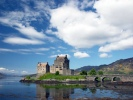

  
[Intangible Textual Heritage](../../../index.md) 
[Legends/Sagas](../../index)  [Celtic](../index)  [Index](index.md) 
[Previous](fotc21)  [Next](fotc23.md) 

------------------------------------------------------------------------

  
*The Feuds of the Clans*, by Alexander MacGregor, \[1907\], at
Intangible Textual Heritage

------------------------------------------------------------------------

### The Conflict of Garbharry.

The Queen Regent having gotten the Government of Scotland from the Earl
of Arran, she made her progress into the North, and so to Inverness, the
year of God 1555. Then was Y Mackay (the son of Donald) summoned to
compear before the Queen at Inverness, for that he had spoiled and
molested the country of Sutherland during Earl John's being in France
with the Queen Regent. Mackay refused to compear, whereupon there was a
commission granted to John, Earl of Sutherland, against him. Earl John
invaded Strathnaver in all hostile manner, and besieged the Castle of
Borve, the principal fort of that country, which he took by force, and
caused hang the Captain,

p. 78

then demolished the fort. In end, he beset Y Mackay so, on all sides,
that he forced him to render himself, and then was delivered by Earl
John to Sir Hugh Kennedy, by whom he was conveyed South and committed to
ward in the Castle of Edinburgh, where he remained a long space. Whilst
Y Mackay staid in captivity, his cousin-german, John Mor Mackay, took
upon him the government of Strathnaver. This John Mor taking the
occasion of Earl John's absence in the south of Scotland, he invaded
Sutherland with a company of the most resolute men in Strathnaver; they
burnt the chapel of St. Ninians in Navidell, where the inhabitants of
the country, upon this sudden tumult, had conveyed some of their goods;
so, having spoiled that part of the country, they retire homeward. The
inhabitants of Sutherland assembled together, and followed in all haste
under the conduct of Macjames, the Terrell of the Doil, and James
MacWilliam. They overtook the Strathnaver men at the foot of the hill
called Beinn-mhor, in Berriedale, and invaded them beside the water of
Garbharry, where then ensued a

p. 79

cruel conflict, fought with great obstinacy. The Strathnaver men were
overthrown and chased; above 120 of them were slain, and some drowned in
Garbharry. This is the last conflict that bath been fought betwixt
Sutherland and Strathnaver.

------------------------------------------------------------------------

[Next: The Burning of the Dornoch Cathedral](fotc23.md)
