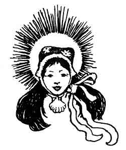

  
[Intangible Textual Heritage](../../../index.md)  [Legends and
Sagas](../../index)  [Celtic](../index)  [Index](index.md) 
[Previous](ftb01)  [Next](ftb03.md) 

------------------------------------------------------------------------

[Buy this Book at
Amazon.com](https://www.amazon.com/exec/obidos/ASIN/B0027ISB18/internetsacredte.md)

------------------------------------------------------------------------

  
*Folk Tales of Brittany*, by Elsie Masson, \[1929\], at Intangible
Textual Heritage

------------------------------------------------------------------------

p. 4

 

p. 5

 

|                                            |                                 |
|--------------------------------------------|---------------------------------|
|                                            | PAGE |
| The Castle of Comorre                      | [11](ftb04.htm#page_11.md)         |
| The Basin of Gold and the Diamond Lance    | [25](ftb05.htm#page_25.md)         |
| Lady Yolanda's Thimble                     | [45](ftb06.htm#page_45.md)         |
| The Witch of Lok Island                    | [55](ftb07.htm#page_55.md)         |
| Little White-Thorn and the Talking Bird    | [73](ftb08.htm#page_73.md)         |
| Princess Ahez and the Lost City            | [87](ftb09.htm#page_87.md)         |
| The Changeling                             | [97](ftb10.htm#page_97.md)         |
| The Foster Brother                         | [103](ftb11.htm#page_103.md)       |
| The Hunchback and the Elves                | [111](ftb12.htm#page_111.md)       |
| The Four Gifts                             | [125](ftb13.htm#page_125.md)       |
| The Magic Rocks and the Beggar             | [141](ftb14.htm#page_141.md)       |
| The Country Bumpkin and the Hobgoblin      | [153](ftb15.htm#page_153.md)       |
| The Wasp, the Winged Needle and the Spider | [167](ftb16.htm#page_167.md)       |
| Yannik, The Fairy Child                    | [181](ftb17.htm#page_181.md)       |
| The Hazel Scepter                          | [187](ftb18.htm#page_187.md)       |

 

p. 6

 

------------------------------------------------------------------------

[Next: Illustrations](ftb03.md)
