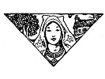
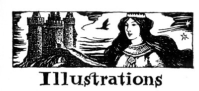
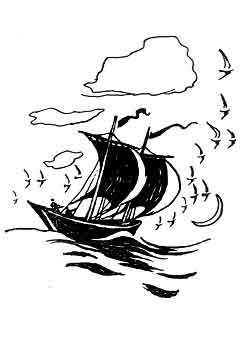

  
[Intangible Textual Heritage](../../../index)  [Legends and
Sagas](../../index)  [Celtic](../index)  [Index](index) 
[Previous](ftb02)  [Next](ftb04) 

------------------------------------------------------------------------

[Buy this Book at
Amazon.com](https://www.amazon.com/exec/obidos/ASIN/B0027ISB18/internetsacredte)

------------------------------------------------------------------------

  
*Folk Tales of Brittany*, by Elsie Masson, \[1929\], at Intangible
Textual Heritage

------------------------------------------------------------------------

p. 7

 

|                                       |                                 |
|---------------------------------------|---------------------------------|
|                                       | PAGE |
| Beware, beware, lost creature!        | [10](ftb04.htm#img_01000)       |
| The enchanted forest                  | [24](ftb05.htm#img_02400)       |
| Yolanda's fingers never stopped       | [44](ftb06.htm#img_04400)       |
| Coral ornaments were in her hair      | [54](ftb07.htm#img_05400)       |
| Milk flowed like water of a spring    | [72](ftb08.htm#img_07200)       |
| The waves rose swiftly higher         | [86](ftb09.htm#img_08600)       |
| Mariannik and little Loik             | [96](ftb10.htm#img_09600)       |
| How swift thy steed, my love, my love | [102](ftb11.htm#img_10200)      |
| Guilcher on the haunted heath         | [110](ftb12.htm#img_11000)      |
| The dame peered at Téphany            | [124](ftb13.htm#img_12400)      |
| Wells filled with precious stones     | [140](ftb14.htm#img_14000)      |
| Jegu loved Barbaïk with all his heart | [152](ftb15.htm#img_15200)      |
| Three angels dazzling with light      | [166](ftb16.htm#img_16600)      |
| Yannik of the woods                   | [180](ftb17.htm#img_18000)      |
| Sullenly the mountain opens           | [186](ftb18.htm#img_18600)      |

 

p. 8

 

------------------------------------------------------------------------

[Next: The Castle of Comorre](ftb04)
