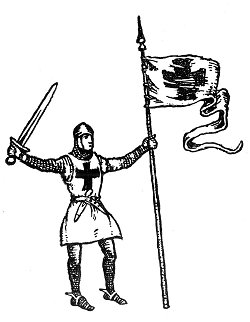
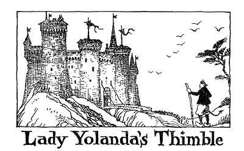
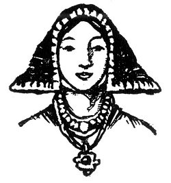

  
[Intangible Textual Heritage](../../../index)  [Legends and
Sagas](../../index)  [Celtic](../index)  [Index](index) 
[Previous](ftb05)  [Next](ftb07) 

------------------------------------------------------------------------

[Buy this Book at
Amazon.com](https://www.amazon.com/exec/obidos/ASIN/B0027ISB18/internetsacredte)

------------------------------------------------------------------------

  
*Folk Tales of Brittany*, by Elsie Masson, \[1929\], at Intangible
Textual Heritage

------------------------------------------------------------------------

p. 42

 

# LADY YOLANDA'S THIMBLE

p. 43 p. 44

  [  
Click to enlarge](img/04400.jpg)  
Yolanda's fingers never stopped  

p. 45

 

|                     |
|---------------------|
|  |

LL the warriors of Brittany had gone away to the Crusades. With helmets
and spears, and with banners flying, they had set out for the East. They
had gone to rescue the Holy Sepulcher from the infidels and to defend it
with their lives.

But when the knights and men rode away to the Holy Land they left
mourning and sadness behind, for now there would be no more tournaments,
no more hunting, no more dancing.

The old men, the women, and the children all asked each other: "When
will our warriors come home?"

Season followed season and the knights did not return. Spring took the
place of winter, and the country put on its old charm. The birds were
singing their joyous love songs, the brooks were babbling gleefully, and
the apple trees,

p. 46

dressed in pink and white blossoms, looked like radiant brides. But the
men of Brittany remained in the Holy Land.

At last messengers arrived. The Christian army had a heavy task, they
said, in its struggle with the infidels and doubtless the war would last
for many years to come.

All the country folk at home now fell to work to ease the anguish in
their hearts. Never before had Brittany seen such activity. The ladies
in the castles were perhaps. the most determined.

They opened their oak chests and brought out silks and brocades,
Flanders cloth, and English woolen stuffs, and Italian embroidery. And
soon under their fairy-like fingers banners with golden fringes were
spread out in the vaulted halls. Scarves were dotted with shining stars,
and proud mottoes decorated the walls of the castles. And dainty fingers
painted the Mass books with splendid colors. Truly if the knights were
doing wonders in the East the ladies in the castles were likewise
achieving marvels at home.

Now Old Nick saw this from his dark abode. This change in women's habits
did not suit his wicked plans. For their toil and prayers scattered evil
thoughts, just as fresh air scatters pestilential odors.

"I must put an end to this," said Old Nick to himself. "And an end there
shall be. I am going to cool the zeal of all these busy bees!"

p. 47

Among Old Nick's followers were all varieties of mischief makers; imps
of all sizes and kinds. He thought to himself that he would go to them
for advice. He noticed a very fat imp sound asleep in a corner.

"Come, come, Dame Laziness," he shouted, shaking her roughly, "come
along with me. I want you to discourage all these mad Breton women who
are working so hard that they haven't time for mischief. Go, throw sand
into their eyes and make them sleep as soundly as *you* do."

"No, no," answered the lazy imp. "I have already had a try at that, and
I didn't succeed a bit. I won't budge now. Let me sleep."

Just then another ugly creature came forward; he was holding a sharp
sting in his hand.

"Master," he said, "I will help you. Tonight while all these
hard-working ladies are sleeping I will take their needles and dip them
in the poison of vipers. That will calm their eagerness. If they prick a
finger but once they will cry out so loud that you will hear it down
below."

You may be sure the naughty imp spent a busy night. Every needle was
poisoned. And what cries and squeaks were heard the next day! Poor
dames! The needles would prick in spite of all precautions. In a short
time the most eager workers had laid aside their work.

Old Nick was as pleased as pleased can be, and especially so because the
women soon began to return to their former

p. 48

habits of indolence. The young ones spent their time on their clothes or
admiring themselves in the mirror, when they were not idling on the
castle lawns. The older ones gossiped and said unkind things about one
another. They all had ceased to think about their men folk fighting in
the Holy Land.

But in the midst of all this frivolity and idleness there was one worker
who was faithful to her task. That alone was enough to put a drop of
bitterness in Old Nick's cup of pleasure.

Yolanda de Tregoët lived in a great castle and there she worked with her
needle for the church and for the poor. She was betrothed to a famous
knight, Jehan de Kergoff. When the warriors had made ready to depart
Yolanda had bade Jehan go, and the young knight at her behest had sewed
the Cross upon his tunic.

And now her clever fingers neither stopped nor rested, not even when the
needles, by the imp's trick, tortured her and gave her cruel pain. She
only laughed at his cunning, while he gnashed his teeth in rage.

"I'll get the better of this minx!" exclaimed Old Nick, angrily.

But Yolanda would not give up her work.

One day Old Nick devised a new plan. He dressed himself like a pilgrim
and, staff in hand, looking both poor and devout, he went to ask for
charity at Yolanda's castle gate.

p. 49

He leaned against the arches of the drawbridge and wailed in a doleful
voice, "Have pity on a pilgrim from distant lands. A bit of bread, fair
damsel!"

Yolanda's kind heart was moved. She ran down quickly to the gate and,
taking the pretended pilgrim by the hand, she said, "Come in, come in.
Pilgrims are always welcome here; they are heaven-sent."

So Old Nick entered the castle and ate with hearty appetite. He drank
still more, for sobriety is not his special virtue. He would have liked
to stay longer if a limit were not set to his evil deeds.

When he left he pretended to pay his debt of gratitude to the lady
Yolanda. He gave her a shell he had picked up on the seashore, which, he
asserted, had touched the Holy Sepulcher and was, in consequence,
blessed. In reality he had poisoned the shell.

Yolanda took the shell and kissed it and Old Nick thought that it would
cause her destruction. But the deceiver, as so often happens, was
deceived in turn. The shell did not hurt her, for no real harm can come
to the innocent.

As soon as the pretended pilgrim had gone Yolanda began to sew, but the
needle pricked her finger so painfully that she wept in agony. As she
wiped the blood away an idea suddenly came to her, she would slip her
finger into the shell while she was sewing so as to guard herself from
the poisoned needle.

p. 50

She did so at once and her finger was protected. Not only that, the old
wounds were healed, for by a miracle the poison on the shell was turned
into a health-giving balm.

Now that very day one of Yolanda's friends came to see her at the
castle, and after she had learned of the strange virtue of the shell she
thought she too would try it. She knew that the shores of Brittany are
dotted over with such shells. They went out on the beach and she and
Yolanda hunted until one was found that fitted her exactly. She put it
on her finger and it protected her from needle pricks just as did
Yolanda's shell.

It was not long, you may be sure, before everyone heard of the
discovery. All the women began to pick up shells and to put them on
their fingers, and then they set to work again. They sewed and sewed
without so much as shedding a single drop of blood.

Farewell now to frivolous amusements, idling, and fine clothes! All the
castles in the dukedom were like busy hives, and all of Old Nick's wiles
were powerless. For in trying to poison a charitable girl for her
industry he had succeeded only in making a present to all women of a
convenient tool, the thimble. For in this manner was the thimble brought
into being.

The old tool was rough enough at first but soon elaborate ones were made
of gold, silver, ivory, or copper, fashioned f or any finger.

p. 51

As a sign of gratitude Yolanda, who on the return of her lover from the
Holy Land became Lady Kergoff, put a thimble among her daughter's
wedding gifts, and had a thimble engraved on her armorial bearings.

But in the Breton countryside old grannies may be found who bear a
grudge against the thimble. It came, they remember, from Old Nick, and
in consequence they remain to. this day faithful to the distaff and the
spinning-wheel.

 

------------------------------------------------------------------------

[Next: The Witch of Lok Island](ftb07)
