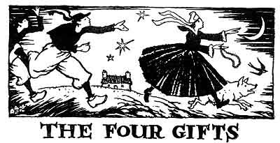
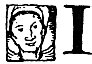
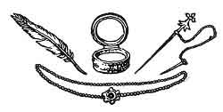

  
[Intangible Textual Heritage](../../../index)  [Legends and
Sagas](../../index)  [Celtic](../index)  [Index](index) 
[Previous](ftb12)  [Next](ftb14) 

------------------------------------------------------------------------

[Buy this Book at
Amazon.com](https://www.amazon.com/exec/obidos/ASIN/B0027ISB18/internetsacredte)

------------------------------------------------------------------------

  
*Folk Tales of Brittany*, by Elsie Masson, \[1929\], at Intangible
Textual Heritage

------------------------------------------------------------------------

p. 123

# THE FOUR GIFTS

p. 124

  [  
Click to enlarge](img/12400.jpg)  
The dame peered at Téphany  

p. 125

 

|                     |
|---------------------|
|  |

F I had three hundred crowns a year, I should go and live at Quimper,
where is the finest church in all Cornouailles and where all the houses
have weather-cocks; if I had two hundred crowns a year, I should go and
live at Carhaix, for its moorlands and game, but if I had only one
hundred crowns, I should settle down at Pont-Aven, for it is there you
find an abundance of everything. At Pont-Aven, butter costs but the
price of milk at Quimper, a fowl what you pay for a Quimper egg. That is
why at Pont-Aven you see fine farms, where you have home-cured bacon
three times a week and even shepherd-lads have as much homemade bread as
they can eat.

It was in one of such estates that Azénor Bourhis lived; she toiled from
dawn till night, keeping her farm as though she had been born a man, and
owning fields and produce enough to pay for two sons' schooling. But in
place of sons

p. 126

\[paragraph continues\] Azénor had one
niece who earned more than her keep, so that each day's savings were
added to the day's before. Thus the old dame's purse grew fat before her
very eyes.

Now, savings too easily earned bring evil in their train. If you store
up corn, rats come into the barn, and if you hoard up crowns,
miserliness grips the heart. Old Azénor had gotten to the point of
caring only about wealth, and of esteeming people only like herself, who
had plenty of money in their pockets. So she was angry when she saw
Dénès, a farm laborer from Plover, having private talks with her niece.

One day when Azénor again had seen the two together she called to
Téphany in a rasping tone:

"Are you not ashamed to be chattering with that beggar, when you can
find many a rich lad hereabouts who would be glad to buy you a silver
ring?"

"Dénès is a skillful farmer and as upright as the hills," replied the
maiden. "One of these days he will find a farm to let, big enough to
bring up little children on it."

"And you would like to be their mother?" burst out Azénor wrathfully.
"By my purse strings! I would rather see you at the bottom of our well,
than the wife of that good-for-nothing. No! No! No one shall say I have
brought up my sister's child only to see her marry a man whose whole
possessions could go into his tobacco-pouch!"

"What does money matter when you have health and

p. 127

the good saints know your intentions are of the best?" answered Téphany
gently.

"What does money matter!" retorted Azénor, horrorstruck. "Do you then
despise the goods that heaven gives us! Since it is so, you impertinent
baggage, I forbid you to speak again to Dénès, and if I catch him on our
lands I shall ask the Rector to blame you publicly on Sunday!"

"Oh! you would not truly do so!" cried Téphany quite terrified.

"As sure as there is a Paradise waiting for us all, I will!" flared back
the angry dame. "In the meantime, away to the brook with you and wash
the linen and put it to dry on the hawthorn hedge, for ever since you've
listened to the wind that blows from Plover town, all your work has been
forgotten, and both your arms are worth no more than a one-armed man's
five fingers."

With which bitter words Azénor pointed to the scrubbing board and
ordered Téphany to her task. The girl obeyed, but her heart was welling
with grief and resentment.

"Crabbed age is harder than the stone stoop of our farm," she brooded.
"Yes, a hundred times as hard, for the rain, falling drop by drop, wears
away the stone but tears cannot soften old folks' stubbornness. Heaven
knows my meetings with Dénès were my only joy. He never taught me
anything but beautiful songs, and talked to me only about what we should
do when we were married in our

p. 128

little farm,--he looking after the land, and the mangers. Is it wrong to
give each other courage and hope? God would never have created marriage
if it were a sin to think of one's own wedding! Ah! cruel, cruel aunt to
tear me from my Dénès!"

So thinking, Téphany reached the brook. As she was putting down her tub
of linen on the flat, white stones that marked the washing-place, she
saw a wizened woman, not of that parish, who was leaning on a hawthorn
wand. In spite of her trouble, Téphany greeted her, calling her "Aunt,"
according to the ways of Old Breton courtesy. Young folk had warm hearts
in those days of long ago.

"Are you resting under the cool willow tree, Aunt?" she asked.

"You have to rest where best you may, when the sky is your only roof,"
replied the shrivelled woman in a quavery voice.

"Are you then so forlorn?" inquired Téphany pitifully, "and have you no
relations to give you welcome in their home?"

"All have gone to heaven," continued the crone, "and my only home is
kind hearts."

The maiden took the piece of homemade bread and the slice of bacon which
Azénor had given her, wrapped up in a bit of clean linen, and offered it
to the beggar woman. The dame had a hungry look.

p. 129

"Take this, poor Aunt," said Téphany. "Today at least, with this good
bread you will have a Christian dinner. In your prayers, remember my
dear parents who have died."

The dame took the bread and peered at Téphany.

"Those who help are worthy to be helped," she remarked. "Your eyes are
red because your aunt Azénor has forbidden you to talk to your lad from
Plover,--but I shall give you the means of seeing him once a day."

"You will!" cried the girl, dumfounded that this old dame should know so
much about her.

"Take this brass pin," resumed the crone. "Each time you prick it into
your collar Mother Bourhis will feel compelled to leave the farmhouse
and go into the field to count her cabbages. As long as the pin is in
its place you will be free and your aunt will come back only when the
pin lies once more in its sheath."

Having pronounced these words, the beggar woman rose, waved her hand and
disappeared.

Téphany stood thunderstruck. It was certain that the wrinkled dame had
been a saint or fairy. The girl went home quite decided to try what the
pin could do.

The next day at about the time that Dénès usually arrived Téphany placed
the brass pin in her collar. Immediately Azénor took her wooden shoes
and went out into the garden, where she fell to counting the cabbages.
From the garden, she went to the orchard, from the orchard, to the

p. 130

other fields, so that the lassie had plenty of time to talk with the lad
from Plover.

It was the same the next day, and every day for week following week. As
soon as the pin came from its sheath, Téphany's aunt would trot off to
her cabbages and begin to calculate again and yet again the number of
the big ones, the little ones, the smooth ones or the curly. Who would
not have a pin like this!

At first Dénès was delighted, but as week followed week he became less
eager for his talks with Téphany. He had taught her all the songs he
knew. He had gone over his plans again and again and now he was obliged
to wonder what he was going to say to her, and to get it ready
beforehand, as a preacher prepares his sermon. So he came later and went
away earlier. At length days arrived when he did not come at all, and
the waiting Téphany twiddled her pin in vain.

Alas, poor Téphany!

She felt her lover's heart becoming cold and she was sadder now than in
the days before she had the magic pin.

There came an evening when Téphany, having waited uselessly for her
beloved, took her pitcher and went alone to the spring, her heart heavy
with sorrow. As she drew near, she beheld again the wizened woman, who
had given her the pin. When the crone saw Téphany she began to laugh and
addressed her in a squeaky voice:

p. 131

"Ah! Ah! my fine lady does not care about being able to talk to her
beloved Dénès at any time in the day?"

"Alas," sighed Téphany, "I had to see him to keep his heart in love with
me, but now habit has made my society less pleasant. Ah! Aunt! since you
gave me the means of seeing him every day, you ought to have given me
the wit to hold him."

"Is that then what my lassie wants?" asked the aged woman. "So be it.
Here is a feather. It comes from the wing of the oldest of the eagles,
and no one knows how old he is. When my fair lady hides it in her hair,
she will be as knowing as the will-o’-the-wisp himself."

Téphany, blushing with pleasure, took the feather and the next day,
before Dénès' visit, she slipped it under the blue ribbon of her coif.
It seemed instantly as if the sun had risen in her mind. She found
knowledge that men take all of a lifetime to acquire was hers. A wealth,
too, of other matters filled her brain which learned men know not at
all. For to man's wisdom was added woman's wit. So Dénès was astonished
at her flow of knowledge; she invented poetry and knew more songs than
all the singers of Scaër, and repeated all the gossip of the
neighborhood that on baking-days was going round from house to house.

The young man came back the next day and the days that followed, and
Téphany had always something fresh to tell him. Dénès had never met a
man nor woman half so witty,

p. 132

but it was not long before he felt himself a bit uneasy in his mind.
Téphany could not help wearing her feather for other folk as well as
Dénès and all over the countryside tongues began to wag about her songs
and clever speeches.

"She's a bad lot," folk said of her. "The man who marries her will be
led along for all the world like a bridled horse."

The lad from Plover began repeating the same prediction to himself, and
as he had always thought it better to hold the bridle than to wear it,
Téphany's jokes no longer made him laugh so heartily.

One day when he was going to a dance on a new threshing floor, the girl
did her brightest to prevent him, but Dénès, who did not intend to be
directed by her, would not listen to her reasons and laughed at her
request.

"Ah! I see why you are so anxious to go to the, new threshing floor,"
explained Téphany in a temper. "Azilicz will be there."

Azilicz was the prettiest girl in all the countryside and, as even all
her best friends said, the vainest.

"It is certain Azilicz will be there," said Dénès, who was pleased to
make his best-beloved jealous, "and a man would go a wearier way than
that to see a maid so winsome."

"Then go where your heart bids you," cried Téphany, and she flounced
into the farmhouse without listening to another word.

p. 133

She sat down upon the hearthstone, overwhelmed with grief, and, tearing
from her hair her magic feather, sobbed aloud with bitterness.

"Of what use is wit since men turn toward beauty as flies turn toward
the sun! Ah! old fairy Aunt, what I needed was not to be the most
learned, but the most beautiful of damsels."

"Then be the most beautiful," replied a voice close to her ear.

Téphany turned breathless, and behold! beside her stood the wrinkled
crone with the hawthorn wand. The dame went on: "Take this necklace, and
while you have it round your neck you will be to other women as the
queen of flowers is to the wild blossoms of the meadows." Truly here was
a necklace indeed!

Téphany uttered a cry of joy. She quickly donned the necklace, hastened
to her looking-glass and gasped delighted. Never had been seen in all
the land of Brittany a maid so flowerlike as she.

She determined to test immediately her beauty upon Dénès so, putting on
her richest costume, her woollen stockings and buckled shoes, she set
out for the threshing floor. When she reached the cross-roads, she met a
young lord in a coach.

"By our Lady," he cried, leaping out beside her, "I did not know there
was such a lovely creature in all the four

p. 134

corners of the land, and if I lose my soul for it, you shall bear my
name."

But Téphany replied:

"Go your way, my lord, go your way; I am only a poor peasant girl, used
to winnowing, milking and harvesting."

"And I will make a lady of you!" exclaimed the lord, seizing her hand
and drawing her toward his coach.

The girl drew back.

"I want only to be betrothed to Dénès, the ploughman of Plover," she
cried, alarmed. But the young lord laughed. He ordered his servants to
lay hands on Téphany and to lift her into his coach, which done they
drove away as quickly as the horses could gallop. Amidst clouds of dust
and a clattering of hoofs they reached the young lord's castle, which
was of rock, roofed with slate, as are all the great nobles' houses. Her
captor imprisoned Téphany in a vast and vaulted room, closed it with
three bolted doors and placed guards to keep watch upon her. But
scarcely had the young lord withdrawn than Téphany with sudden
inspiration drew forth her pin of brass. At once her watchers hastened
to the garden to count the cabbages. She then placed the feather in her
hair and with her wits discovered, hidden in the panelling, a fourth
door through which she fled. Soon she gained the brushwood through which
she plunged as a wild creature that hears the hounds hot in pursuit.

p. 135

She panted on until night began to fall, then she found herself beside a
convent at whose grated door she knocked and asked for shelter. The
doorkeeper, when she beheld Téphany, shook her head.

"Nay, nay," she growled out surlily, "this is no place for smartly
dressed girls who go about alone at night." And she clapped the door
shut and dropped the clanging bolts into place.

Téphany stumbled on and on and came at length to a farm where lights
were twinkling. Here again she stopped to ask for succor. At the door a
boisterous group of farm-lads greeted her. They all cried out at
Téphany's dazzling beauty, each one demanding that he have her for his
wife. This quickly led to quarrelling, and the quarrelling in turn to
fighting, so that frightened Téphany turned to flee. But all the lads
ran after her. Suddenly remembering her necklace, she snatched it from
her neck and threw it on a sow. At once the spell was broken that drew
the lads to her. Her pursuers now pursued the pig, which grunted off in
terror, and all vanished in the dark.

Téphany stumbled on her way and at last footsore, and sad at heart, she
reached her aunt Azénor's farm.

So fraught with danger and with hardship had been the gift of beauty
that Téphany found herself once more forming wishes. "Heaven forgive
me!" she whispered to herself, "what I ought to have asked for, was
neither the

p. 136

liberty of seeing Dénès every day, for he wearies of it, nor a sharp
wit, for it frightens him away, nor beauty, for it brings troubles and
distrust; I ought to have asked for wealth, which makes you master of
yourself and all the world beside. Ah! if I dared ask the fairy for one
thing more, I should be wiser than I was before!"

"Take your heart's wish," said the beggar woman's voice at Téphany's
ear. "If you feel in your right-hand pocket, you will find a silver box.
Rub your eyes with the pomade and you will have a treasure in yourself."

The girl felt quickly in her pocket, found the box, opened it and had
just begun to rub her eyes, when Azénor Bourhis suddenly appeared.

For some time past, Azénor had lost long days in counting cabbages, and
as she saw all work behindhand in the farm, she was on the watch for
someone on whom to vent her temper. When she beheld her niece sitting
idle, she exploded in a burst of wrath:

"Aha, and that's the way you work, while I am slaving in the fields!
Behold why ruin is in the house! Naught do you with shiftless fingers
but steal the bread of your own relation!"

Azénor's anger was like milk that boils upon the fire, as soon as it
boils it overflows the pot. From reproaches Azénor went to threats and
then from threats to blows. Téphany, at the irate woman's onslaught
burst into sobs

p. 137

and you can guess what was her amazement, when she beheld each tear
become a round and shining pearl.

Old Mother Bourhis, uttering a cry of admiration, began to snatch them
up.

Dénès too, arriving, stared with eyes like saucers.

"Pearls! pearls!" he cried out in excitement.

"It's a fortune for us," babbled Azénor who continued to sweep them up
in handfuls. "No one else must know about this, Dénès. Weep on, Téphany,
weep on!"

She held out her apron and Dénès his hat. He was thinking only about the
pearls, and had forgotten they were his sweetheart's tears. Thus can
mere sight of wealth befuddle wits of men!

"Alack, alack the tears are stopping!" Azénor now explained. "By all the
saints, Téphany if I had luck like yours I would out-weep the very rains
from Heaven! Shall we beat her, Dénès, and bring her sobs again?"

"No, no," broke in Dénès, "we mustn't wear her out the first time. As
for me I shall start for town at once and find out what each pearl is
worth."

"And I shall go with you!" cried Azénor, and the two hastily left the
house.

Téphany, alone at last, clasped her hands upon her heart. In anguish she
raised her eyes to Heaven, then dropped them to the dark chimney corner
where suddenly she saw again the wrinkled beggar woman. The crone's
regard was

p. 138

bent upon her with a strange and mocking smile. The girl started, then
with a gesture of despair, held out toward the fairy the pin, the
feather and the box of ointment.

"Take them back!" Téphany cried. "Woe to people who are not content with
gifts that God has granted. Give other girls wit, beauty, wealth; I wish
to be again the simple-hearted girl I was."

The smile broadened on the old crone's face, "That is right, Téphany,"
said she, "you have learned much through your ordeal. I was sent to give
you this lesson, and now you will live happily for ever after."

At these words, the beggar woman was changed into a sparkling fairy.
Light flooded the cottage and she disappeared in a cloud, sweetly
scented with violets and rose.

Téphany forgave Dénès for having wished to sell her tears, and as they
were both no longer hard to please, they were as happy as it is possible
to be upon this earth. She married the lad from Plover and he was always
the devoted husband that her heart had longed to have.

 

------------------------------------------------------------------------

[Next: The Magic Rocks and the Beggar](ftb14)
