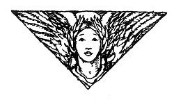

  
[Intangible Textual Heritage](../../../index.md)  [Legends and
Sagas](../../index)  [Celtic](../index)  [Index](index.md) 
[Previous](ftb15)  [Next](ftb17.md) 

------------------------------------------------------------------------

[Buy this Book at
Amazon.com](https://www.amazon.com/exec/obidos/ASIN/B0027ISB18/internetsacredte.md)

------------------------------------------------------------------------

  
*Folk Tales of Brittany*, by Elsie Masson, \[1929\], at Intangible
Textual Heritage

------------------------------------------------------------------------

p. 165

# THE WASP, THE WINGED NEEDLE AND THE SPIDER

p. 166

  [  
Click to enlarge](img/16600.jpg.md)  
Three Angels dazzling with light.  

p. 167

 

|                        |
|------------------------|
|  |

ago there lived, at Leon in Brittany, two young noblemen so rich and so
handsome that their own mother could discover no defect in them. Their
names were Tonyk and Mylie.

Mylie, the elder, was sixteen, but Tonyk was only fourteen. Both were
well educated, and Tonyk was of a pious disposition. He was always ready
to help the poor and to forgive evil. Money stuck to his fingers no more
than anger lingered in his heart.

Mylie, on the contrary, liked to give to people only what was strictly
due them. He was a bargainer. It is sad to say, too, that if anyone
offended him he never failed to take his vengeance if he could.

As their father was called to Heaven when they were still

p. 168

wearing petticoats, their mother brought them up. But now that they were
older she thought it was time to send them to their uncle who lived in
one of Brittany's farthest corners. Their father's brother would give
them good advice as well as all his property later on when he, too,
should be summoned into Paradise.

One fine morning their mother gave each of the brothers a new hat,
silver-buckled shoes, a violet cloak, and a purse full of money. She
told them it was now time to set out for their uncle's castle.

The two boys began their journey, delighted to think that at last they
were to see something of the world. Their horses travelled quickly, and
in a few days' time they were in another dukedom, in a country where
grew trees and corn of different sorts than those at home.

Now it happened one morning as they were riding along the road that they
saw a poor woman seated near a wayside cross, her face hidden in her
apron.

Tonyk reined in his horse at once and asked, "Why do you grieve, good
dame?"

The beggar woman sobbed and said, "I have lost my son who was all I had
in the world, and now I am left on the charity of the Christian folk."

The boy's heart was touched, but Mylie who had moved on a few paces
called back in mocking tones:

"Are you going to believe the story of the first old, sniffy,

p. 169

crone you come across? She is sitting there just to coax money out of
people's purses."

"Brother, be quiet!" exclaimed Tonyk. "Your unkind words are making her
weep more than ever. Do you not notice that she is about the age of our
own mother?"

Then bending over the beggar Tonyk gave her his purse, saying, "I can
give you only this small aid. But I shall pray that you be comforted in
your grief."

The tattered beggar accepted the purse and said, "Since the young lord
wishes to help the poor he will not refuse to accept this little gift in
return: it is a walnut containing a wasp whose sting is made from a
diamond."

Tonyk took the walnut and, thanking the old dame, went on his way with
Mylie.

The two brothers soon reached the outskirts of a forest. There they saw
a little child dressed only in thin rags. He was rummaging in a hollow
tree and singing to himself a song more mournful than the music of the
mass for the dead. He stopped every now and then to rub his ice-cold
hands, chanting as he did so, "I am cold! I am cold!" and then again,
"The wind is cold!"

Tears came to Tonyk's eyes, and he said to his brother, "Mylie, see how
that little child is suffering from the wind."

"Oh, he is just the chilly sort, I suppose," answered Mylie, "I do not
think the wind is cold."

p. 170

"That is because you have on a velvet doublet, a cloth coat, and on top
of all that your violet cloak, while this little child's clothes are but
the winds themselves."

"You are right," laughed Mylie, "but he is only a peasant."

"Alas, brother," said Tonyk, "when I think that you might have been born
in his place, my heart bleeds. I cannot bear to see him suffer."

So saying, he alighted from his horse and, calling the lad to him, asked
what he was doing.

"I am looking for winged needles," said the child. "They are sleeping in
the hollow trees."

"And what do you intend to do with your winged needles?" inquired Tonyk.

"When I have a great many I shall sell them in the town, and then I
shall buy such warm clothes that it will seem to me that the sun is
always shining."

"Have you found many?" asked the young lord.

"Only one," replied the child, showing Tonyk a tiny reed cage in which
he had put a small blue dragon fly.

"Very well, I shall buy it," said Tonyk, throwing his own violet cloak
around the child. "Wrap yourself in that, poor lad. And when you say
your prayers, pray for my brother Mylie and for our mother."

The two brothers journeyed on again. At first Tonyk suffered from the
wind and sadly missed his cloak. But

p. 171

after they had passed through the forest a softer breeze began to blow
and the sun shone warmly.

At length they came to a meadow where there was a spring and near the
spring was seated a bent and aged man with a beggar's knapsack upon his
shoulder. As soon as he saw the two riders he called to them in an
entreating voice.

Tonyk went to him. "What do you want, father?" he asked, taking off his
hat out of respect for the beggar's snowy locks.

"Alas, my dear young lords," replied the beggar, "see my hair, how white
it is! How wrinkled my cheeks! I am old and weak and my feet can carry
me no longer. I shall die here if one of you will not consent to sell me
his horse."

"Sell you one of our horses, old beggar!" cried Mylie disdainfully. "How
can you pay for it?"

"Do you see this?" asked the beggar, holding up a hollow acorn for the
brothers to behold. "It contains a spider that can weave a web stronger
than steel chains. Give me one of your horses and in exchange I'll give
you the spider in the acorn."

The elder brother burst out laughing.

"Did you ever hear of such stuff, Tonyk?" he asked, turning to his
brother.

"The poor can offer only what they have," answered the younger brother
gently.

Then dismounting Tonyk said to the beggar, "I shall give

p. 172

you my horse, old man. Not on account of the hollow acorn that you offer
in exchange, but in memory of the saints in Heaven. Take the horse as if
he were your own, and thank Heaven that we crossed your path today."

The old man murmured a blessing and, helped by the lad, he mounted the
horse and disappeared across the meadow.

But Mylie could not forgive his brother this last act of generosity.

"You fool!" he burst out angrily. "Look at the state you are in now
through your own silliness! No doubt You thought that when you gave
everything away I would let you take half of my money, half of my cloak,
and ride on my horse. But do not hope for that. I wish the lesson to be
brought home to you. You will be more careful in the future when you
realize the inconvenience of extravagance."

"Yes, this is indeed a lesson, brother," answered Tonyk gently. "And I
shall take it to heart. But I have never thought of sharing your money,
or your horse, or your cloak. Go your way and trouble not about me, and
may the angels guard you."

Mylie said nothing in answer but rode off as quickly as his horse could
trot whilst the younger brother continued his journey on foot.

Riding thus, and followed by his brother trudging in the dust, Mylie
came to a gorge between two lofty mountains. It was called the Accursed
Gully because a wicked ogre

p. 173

lived there, who was always on the alert for travellers who chanced to
pass. He was as blind as a stone, but his hearing was so sharp that he
could detect an earthworm hollowing out its hole.. His servants were two
eagles he had trained, for he was a powerful magician. When he heard
travellers approaching he would send the eagles to capture them. That is
why people, when travelling through the gorge, carried their shoes in
their hands, scarcely daring to draw breath.

But Mylie knew nothing of the ogre. Into the gorge he clattered, as bold
as brass. At the ring of the horse's hoofs the giant awoke.

"Come hither, come hither, my fleet eagles," cried he. "Where do you
tarry?"

The red eagle and the white eagle flapped quickly into the cave.

"My supper is riding by!" exclaimed the ogre. "Away and fetch it!

The two eagles darted off and plunged into the depths of the ravine.
They seized Mylie by his velvet cloak and bore him aloft to the ogre's
dwelling.

At that moment Tonyk reached the opening of the gorge, just in time to
see his brother carried off by the two great birds. He pursued them
shouting, but the eagles and Mylie soared into the clouds that covered
the highest peak and were swallowed up from view.

p. 174

The lad stood overcome with grief, staring at the rock that rose
straight upward like a wall. Then he fell on his knees and prayed:

"O, Creator of the world, save my brother Mylie!"

At once he heard three shrill voices near him calling, "Let us help you!
Let us help you!"

Tonyk turned around surprised.

"Who spoke to me?" he asked.

"We are in your jacket pocket," the voices answered.

Tonyk put his hand in his pocket and pulled out the acorn, the walnut,
and the reed cage which held the dragon fly.

"Can you save Mylie?" he asked in astonishment.

"Yes! Yes! Yes!" piped the tiny voices, each in a different key.

"But how will you manage that, you poor little nothings?" asked Tonyk.

"Open our prisons and you will see," they answered.

The boy did as they wished. The spider came out of the acorn and fell to
weaving a web as shining and as strong as steel. Then he climbed on the
back of the dragon fly, who had just come out of his little cage, and
together they rose gently in the air. And as they rose the spider
continued to weave his web. The threads were so spun that they formed a
lengthening ladder. Tonyk at once began to climb, following the spider
and the dragon fly, until he reached the

p. 175

top of the mountain. Then the wasp who had been shut up in the walnut
shell flew before them. Thus they came to the ogre's cave.

It was a cavernous grotto hollowed out of the rock and looked to be as
high as a church. In the middle sat the blind ogre. He was swaying to
and fro like a poplar tree in a gale, singing a wild song of his own
invention, and cutting slices of bacon with which to baste Mylie. Poor
Mylie lay at the ogre's feet with legs and arms trussed like a chicken
ready for the boiling. The two eagles were near by. One was winding up
the turnspit and the other was blowing the fire with a mighty bellows.

The ogre was making such a noise with his song and he was so busy
slicing the bacon that he did not hear Tonyk and his three little
servants enter. But the red eagle noticed the boy, flew at him, and was
about to catch him up in his claws when the wasp came to the rescue. It
darted at the eagle and pierced his eyes with its diamond sting. The
white eagle flew to the assistance of the red eagle, but he too was
blinded by the wasp.

Now it was the ogre's turn. He had stopped his song when he heard the
eagles shrieking, but the wasp flew at him and began to sting him
mercilessly. The ogre bellowed like a bull and threw his arms about like
a windmill, but he could not catch the wasp.

At last he fell with his face to earth to escape the fiery

p. 176

stings. Then the spider drew near. He wove a web over the fallen giant
who now lay imprisoned and motionless.

In vain the ogre called to his eagles. They were beside themselves with
pain, and moreover they did not wish to free their wicked master now
that he was helpless. They intended to gain freedom for themselves after
their long slavery.

They flew at the steel net and began to tear at the ogre through the
meshes. Each peck of a beak carried away a piece of flesh and the birds
stopped only when they had gotten to the ogre's bones. Then, as a
magician's flesh is poison, the eagles died upon the spot.

Meanwhile Tonyk had undone his brother's bonds, and after having kissed'
him with tears of joy he led him out of the ogre's cave to the edge of
the great rock.

The winged needle and the wasp appeared once more. They were harnessed
to the little reed cage, but it was now turned into a coach. They
invited the two brothers to take a seat within it, and when the boys had
entered the spider closed the door and climbed up behind, for he was now
the groom. Then the team set off as swift as the wind.

Tonyk was entranced at riding thus, high above the meadows. Over the
mountains, streams and villages they flew until at last they reached
their uncle's castle.

The coach rolled on to the drawbridge where the brothers saw their two
horses waiting for them. On the holster of

p. 177

the saddle of Tonyk's horse were hanging his purse and cloak. But the
purse was larger than it had been before, and the cloak was spangled
with diamonds.

Tonyk in great surprise turned to ask what all this meant, but the coach
had vanished, and standing there, instead of the wasp, the winged
needle, and the spider were three angels dazzling with light.

The two brothers, awestruck, fell on their knees. Then one of the
angels, the most handsome and most beautifully robed, approached the
younger brother, and, bending over him, said:

"Fear nothing, kind heart, you were given to our care that you might go
safely on your journey and now that you have reached your goal we are
going back to Paradise."

Spreading their lovely wings the three angels then soared up into the
heavens, leaving Tonyk and Mylie to stare after them with wonder.

 

------------------------------------------------------------------------

[Next: Yannik, the Fairy Child](ftb17.md)
