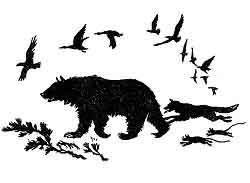
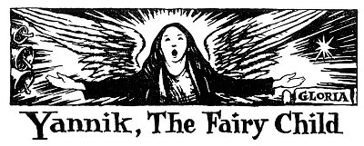
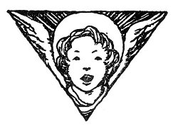

  
[Intangible Textual Heritage](../../../index)  [Legends and
Sagas](../../index)  [Celtic](../index)  [Index](index) 
[Previous](ftb16)  [Next](ftb18) 

------------------------------------------------------------------------

[Buy this Book at
Amazon.com](https://www.amazon.com/exec/obidos/ASIN/B0027ISB18/internetsacredte)

------------------------------------------------------------------------

  
*Folk Tales of Brittany*, by Elsie Masson, \[1929\], at Intangible
Textual Heritage

------------------------------------------------------------------------

p. 178

 

p. 179

# YANNIK, THE FAIRY CHILD

p. 180

  [  
Click to enlarge](img/18000.jpg)  
Yannik of the Woods  

p. 181

 

|                     |
|---------------------|
|  |

HE boy Yannik lived in the woods and fields. That was long, long ago,
when within the rocky shores of Finistère there were few houses or
villages and even fewer cultivated pastures. In those days wild reaches
of marsh and woodland were haunted by the will-o’-the-wisp, bears, and
savage wolves. Then elves danced on the lonely heaths and men had
strange visions.

But Yannik was growing as free as a redbreast on a branch, and, like the
redbreast, wherever he went the child seemed to bring joy and fair
fortune. But no song like the redbreast's carol ever came from between
his lips.

When the good people of the country gave Yannik a pair of wooden shoes
he smiled a radiant smile. Sometimes they gave him a ripe apple or
buckwheat cakes, but a smile was his only answer. For Yannik was dumb.

Who was he? Whence came he?

None could say.

Can you tell whence the dew on the heather comes, or a ray of sunlight
on the mountain tarn? Can you tell whence

p. 182

comes the beauty in the lark's song or the joyous leaps of the hind at
the breaking of the summer dawn?

Yannik was like one of these, a presence, a light, a smile. Everyone
welcomed him, but there was none who could keep him inside cottage
walls. Though she had softly cradled him at nightfall, at dawn when the
farmer's wife arose she saw by the ruddy firelight that Yannik's bed was
empty. No one had heard him go, but on the fallen snow footsteps could
be traced leading to the forest where Yannik lived with the birds and
the beasts he loved.

The bears knew him and the fierce wolf thrust its confiding muzzle in
Yannik's hand. The birds perched upon his shoulder and the turtle dove
nestled in his bosom. All creatures of the forest guarded him as he
roamed within its pathless depths.

"He is a fairy child," said the women to each other. And the men called
him the Fol Goët, which means "the mad thing of the woods."

Yet when the choir sang in the tiny church Yannik always crept in and
listened with so rapt a face, with clasped hands, and such shining eyes
that the white-haired priest tried to persuade him to remain and learn a
word or two of man's speech.

Yannik listened and smiled his radiant smile but no word ever crossed
his lips until at length one summer day as he left the heat of the
fields for the soft, cool shade of the

p. 183

church he heard the people chanting a hymn of praise. Their voices
seemed to rise toward the glowing Heaven.

It was a feast day and white-robed children were singing in tones as
pure and clear as heavenly harps:

"Glory! Glory! Glory!"

Yannik paused upon the door-sill, then went slowly up the aisle holding
his hands before him as a blind man who gropes his way. Awed, the
children hushed their song as they watched Yannik reach the foot of the
high altar and, standing near the priest raise his hands and sing:

"Glory! Glory! Glory!"

From that day Yannik, the fairy child, Yannik, the mad thing of the
woods, became one voice of praise. Alone in the woods, in the farmhouse
kitchens, in the church, or going from door to door with the
white-haired priest the child sang ever:

"Glory! Glory! Glory!"

To these words no other words were ever added.

One summer evening as the sun was setting and the peasants were coming
home, weary after the day's toil, and the blue smoke was slowly rising
in the air, the music of silver-toned bells filled the sky and it seemed
as if the bells were pealing:

"Glory! Glory! Glory!"

p. 184

"It is the song of Yannik, the dumb boy," said the people to each other,
awestruck. "The Heavens are chanting it for him."

The next morning when the priest went down to the church door he saw
Yannik lying across the threshold. The old man thought he was sleeping
and spoke to him tenderly. But as he stooped over him he saw the boy's
sweet smile frozen on his stiffened lips. The fairy child, Yannik, was
dead.

And so on that very spot they built the church of Fol Goët, strong and
stately as a knight's spear, but delicate as the lace coif of a fair
lady.

And here it is that mothers of children whose lips are sealed, like
Yannik's, bring them to be blessed in the hope that they too then will
speak only words of praise and glory, and never words of hatred or of
anger.

 

------------------------------------------------------------------------

[Next: The Hazel Scepter](ftb18)
