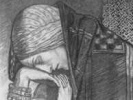

  
[Intangible Textual Heritage](../../../index)  [Sagas and
Legends](../../index)  [Celtic](../index)  [Index](index) 
[Previous](gafm00)  [Next](gafm02) 

------------------------------------------------------------------------

[Buy this Book at
Amazon.com](https://www.amazon.com/exec/obidos/ASIN/B002BH3EVC/internetsacredte)

------------------------------------------------------------------------

  
*Gods and Fighting Men*, by Lady Gregory, \[1904\], at Intangible
Textual Heritage

------------------------------------------------------------------------

# Dedication

My friends, those I know and those I do not know, I am glad in the year
of the birth of your Society to have this book to offer you.

It has given great courage to many workers here--working to build up
broken walls--to know you have such friendly thoughts of them in your
minds. A few of you have already come to see us, and we begin to hope
that one day the steamers across the Atlantic will not go out full, but
come back full, until some of you find your real home is here, and say
as some of us say, like Finn to the woman of enchantments

"We would not give up our own country--Ireland--if we were to get the
whole world as an estate, and the Country of the Young along with it"

 

 

AUGUSTA GREGORY.

------------------------------------------------------------------------

[Next: Preface by W B Yeats](gafm02)
