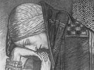

  
[Intangible Textual Heritage](../../../index)  [Sagas and
Legends](../../index)  [Celtic](../index)  [Index](index) 
[Previous](gafm90)  [Next](gafm92) 

------------------------------------------------------------------------

[Buy this Book at
Amazon.com](https://www.amazon.com/exec/obidos/ASIN/B002BH3EVC/internetsacredte)

------------------------------------------------------------------------

  
*Gods and Fighting Men*, by Lady Gregory, \[1904\], at Intangible
Textual Heritage

------------------------------------------------------------------------

# Notes

  
I. THE APOLOGY

 

THE Irish text of the greater number of the stories in this book has
been published, and from this text I have worked, making my own
translation as far as my scholarship goes, and when it fails, taking the
meaning given by better scholars. In some cases the Irish text has not
been printed, and I have had to work by comparing and piecing together
various translations, I have had to put a connecting sentence of my own
here and there, and I have fused different versions together, and
condensed many passages, and I have left out many, using the choice that
is a perpetual refusing, in trying to get some clear outline of the
doings of the heroes.

I have found it more natural to tell the stories in the manner of the
thatched houses, where I have heard so many legends of Finn and his
friends, and Oisin and Patrick, and the Ever-Living Ones, and the
Country of the Young, rather than in the manner of the slated houses,
where I have not heard them.

Four years ago, Dr Atkinson, a Professor of Trinity College, Dublin, in
his evidence before the Commission of Intermediate Education, said of
the old literature in Ireland: "It has scarcely been touched by the
movements of the great literatures; it is the untrained popular feeling.
Therefore it is almost intolerably low in tone--I do not mean naughty,
but low; and every now and then, when the circumstance occasions it, it
goes down lower than low … If l read the books in the Greek, the Latin
or the French course, in almost every one of them there is something
with an ideal ring about it--something that I can read with positive
pleasure--something that has what the child might take with him as a
perpetual treasure; but if I read the Irish books, I see nothing ideal
in them, and my astonishment is that through the whole range of Irish
literature that I have read (and I have read an enormous range of it),
the smallness of the element of idealism is most noticeable … And as
there is very little idealism there is very little imagination … The
Irish tales as a rule are devoid of it fundamentally."

Dr Atkinson is an Englishman, but unfortunately not only
fellow-professors in Trinity but undergraduates there have been
influenced by his opinion, that Irish literature is a thing to be
despised. I do not quote his words to draw attention to a battle that is
still being fought, but to explain my own object in working, as I have
worked ever since that evidence was given, to make a part of Irish
literature accessible to many, especially among my young countrymen, who
have not opportunity to read the translations of the chief scholars,
scattered here and there in learned periodicals, or patience and time to
disentangle overlapping and contradictory versions, that they may judge
for themselves as to its "lowness" and "want of imagination," and the
other well-known charges brought against it before the same Commission.

I believe that those who have once learned to care for the story of
Cuchulain of Muirthemne, and of Finn and Lugh and Etain, and to
recognise the enduring belief in an invisible world and an immortal life
behind the visible and the mortal, will not be content with my
redaction, but will go, first to the fuller versions of the best
scholars, and then to the manuscripts, themselves. I believe the forty
students of old Irish lately called together by Professor Kuno Meyer
will not rest satisfied until they have explored the scores and scores
of uncatalogued and untranslated manuscripts in Trinity College Library,
and that the enthusiasm which the Gaelic League has given birth to will
lead to much fine scholarship.

A day or two ago I had a letter from one of the best Greek scholars and
translators in England, who says of my "Cuchulain": "It opened up a
great world of beautiful legend which, though accounting myself as an
Irishman, I had never known at all. I am sending out copies to Irish
friends in Australia who, I am sure, will receive the same sort of
impression, almost an impression of pride in the beauty of the Irish
mind, as I received myself." And President Roosevelt wrote to me a
little time ago that after he had read "Cuchulian of Muirthemne," he had
sent for all the other translations from the Irish he could get, to take
on his journey to the Western States.

I give these appreciative words not, I think, from vanity, for they are
not for me but for my material, to show the effect our old literature
has on those who come fresh to it, and that they do not complain of its
"want of imagination." I am, of course, very proud and glad in having
had the opportunity of helping to make it known, and the task has been
pleasant, although toilsome. Just now, indeed, on the 6th October, I am
tired enough, and I think with sympathy of the old Highland piper, who
complained that he was "withered with yelping the seven Fenian
battalions."

 

II\. THE AGE AND ORIGIN OF THE STORIES OF THE FIANNA

 

MR ALFRED NUTT says in *Ossian and the Ossianic Literature,* No. 3 of
his excellent series of sixpenny pamphlets,

Popular Studies in Mythology, Romance and Folklore:--

"The body of Gaelic literature connected with the name of Ossian is of
very considerable extent and of respectable antiquity. The oldest texts,
prose for the most part but also in verse are preserved in Irish MSS. of
the eleventh and twelfth centuries, and go back to a period from one
hundred and fifty to two hundred and fifty years older at least The bulk
of Ossianic literature is, however, of later date as far as the form
under which it has come down to us is concerned. A number of important
texts, prose for the most part, are preserved in MSS. of the fourteenth
century, but were probably redacted in the thirteenth and twelfth
centuries. But by far the largest mass consists of narative poems, as a
rule dramatic in structure. These have come down to us in MSS, written
in Scotland from the end of the fifteenth to the middle of the
seventeenth century, in Ireland from the sixteenth down to the middle of
the nineteenth century. The Gaelic-speaking peasantry, alike in Ireland
and Scotland, have preserved orally a large number of these ballads, as
also a great mass of prose narratives, the heroes of which are Ossian
and his comrades.

"Were all Ossianic texts preserved in MSS. older than the present
century to be printed, they would fill some eight to ten thousand octavo
pages. The mere bulk of the literature, even if we allow for
considerable repetition of incident, arrests attention. If we further
recall that for the last five hundred years this body of romance has
formed the chief imaginative recreation of Gaeldom, alike in Ireland and
Scotland, and that a peasantry unable to read or write has yet preserved
it almost entire, its claims to consideration and study will appear
manifest."

He then goes on to discuss how far the incidents in the stories can be
accepted as they were accepted by Irish historical writers of the
eleventh century as authentic history:--

"Fortunately there is little need for me to discuss the credibility or
otherwise of the historic records concerning Finn, his family, and his
band of warriors. They may be accepted or rejected according to
individual bent of mind without really modifying our view of the
literature. For when we turn to the romances, whether in prose or verse,
we find that, although the history is professedly the same as that of
the Annals, firstly, we are transported to a world entirely romantic, in
which divine and semi-divine beings, ungainly monsters and giants, play
a prominent part, in which men and women change shapes with animals, in
which the lives of the heroes are miraculously prolonged--in short, we
find ourselves in a land of Faery; secondly, we find that the historic
conditions in which the heroes are represented as living do not, for the
most part, answer to anything we know or can surmise of the third
century. For Finn and his warriors are perpetually on the watch to guard
Ireland against the attacks of over-sea raiders, styled Lochlannac by
the narrators, and by them undoubtedly thought of as Norsemen. But the
latter, as is well known, only came to Ireland at the dose of the eighth
century, and the heroic period of their invasions extended for about a
century, from 825 to 925; to be followed by a period of comparative
settlement during the tenth century, until at the opening of the
eleventh century the battle of Clontarf, fought by Brian, the great
South Irish chieftain, marked the break-up of the separate Teutonic
organisations and the absorption of the Teutons into the fabric of Irish
life. In these pages then we may disregard the otherwise interesting
question of historic credibility in the Ossianic romances: firstly,
because they have their being in a land unaffected by fact, secondly,
because if they ever did reflect the history of the third century the
reflection was distorted in after-times, and a pseudo-history based upon
events of the ninth and tenth centuries was substituted for it. What the
historian seeks for in legend is far more a picture of the society in
which it took rise than a record of the events which it commemorates."

In a later part of the pamphlet Mr Nutt discusses such questions as
whether we may look for examples of third-century customs in the
stories, what part of the stories first found their way into writing,
whether the Oisin and Patrick dialogues were written under the influence
of actual Pagan feeling persisting from Pagan times, or whether "a
change came over the feeling of Gaeldom during the fourteenth and
fifteenth centuries," when the Oisin and Patrick dialogues in their
present form began to be written. His final summing-up is that
"well-nigh the same stories that were told of Finn and his
warrior-braves by the Gad of the eleventh century are told in well-nigh
the same way by his descendant to-day." Mr Nutt does not enquire how
long the stories may have been told before the first story was written
down. Larminie, however, whose early death was the first great loss of
our intellectual movement, pushes them backward for untold ages in the
introduction to his *West Irish Folk Tales and Romances.* He builds up a
detailed and careful argument, for which I must refer readers to his
book, to prove that the Scottish Highlands and Ireland have received
their folk-lore both from "Aryan and Non-Aryan sources," and that in the
Highlands there is more non-Aryan influence and more non-Aryan blood
than in Ireland. He argues that nothing is more improbable than that all
folk-tales are Aryan, as has sometimes been supposed, and sums up as
follows:--

"They bear the stamp of the genius of more than one race. The pure and
placid but often cold imagination of the Aryan has been at work on some.
In others we trace the more picturesque fancy, the fierceness and
sensuality, the greater sense of artistic elegance belonging to races
whom the Aryan, in spite of his occasional faults of hardness and
coarseness, has, on the whole, left behind him. But as the greatest
results in the realm of the highest art have always been achieved in the
case of certain blends of Aryan with other blood, I should hardly deem
it extravagent if it were asserted that in the humbler regions of the
folk-tale we might trace the working of the same law. The process which
has gone on may in part have been as follows:--Every race which has
acquired very definite characteristics must have been for along time
isolated. The Aryans during their period of isolation probably developed
many of their folk-germs into their larger myths, owing to the greater
constructiveness of their imagination, and thus, in a way, they used up
part of their material. Afterwards, when they became blended with other
races less advanced, they acquired fresh material to work on. We have in
Ireland an instance to hand, of which a brief discussion may help to
illustrate the whole race theory.

"The larger Irish legendary literature divides itself into three
cycles--the divine, the heroic, the Fenian. Of these three the last is
so well known orally in Scotland that it has been a matter of dispute to
which country it really belongs. It belongs, in fact, to both. Here,
however, comes in a strange contrast with the other cycles. The first
is, so far as I am aware, wholly unknown in Scotland. The second
comparatively unknown. What is the explanation? Professor Zimmer not
having established his late-historical view as regards Finn, and the
general opinion among scholars having tended of recent years towards the
mythical view, we want to know why there is so much more community in
one case than in the other. Mr. O'Grady long since seeing this
difficulty, and then believing Finn to be historical, was induced to
place the latter in point of time before Cuchulain and his compeers. But
this view is of course inadmissible when Finn is seen not to be
historical at all. There remains but one explanation. The various bodies
of legend in question are, so far as Ireland is concerned, only earlier
or later, as they came into the island with the various races to which
they belonged. The wider prevalence, then, of the Finn Saga would
indicate that it belonged to an early race occupying both Ireland and
Scotland. Then entered the Aryan Gael, and for him henceforth, as the
ruler of the island, his own gods and heroes were sung by his own bards.
His legends became the subject of what I may call the court poetry, the
aristocratic literature. When he conquered Scotland, he took with him
his own gods and heroes; but in the latter country the bardic system
never became established, and hence we find but feeble echoes of the
heroic among the mountains of the North. That this is the explanation is
shown by what took place in Ireland. Here the heroic cycle has been
handed down in remembrance almost solely by the bardic literature. The
popular memory retains but few traces of it. Its essentially
aristocratic character is shown by the fact that the people have all but
forgotten it, if they ever knew it. But the Fenian cycle has not been
forgotten. Prevailing everywhere, still cherished by the conquered
peoples, it held its ground in Scotland and Ireland alike, forcing its
way in the latter country even into the written literature, and so
securing a twofold of existence … The Fenian cycle, in a word, is
non-Aryan folk-literature partially subjected to Aryan treatment."

The whole problem is extremely complex, and several other writers have
written upon it. Mr Borlase, for instance, has argued in his big book on
the Dolmens that the cromlechs, and presumably the Diarmuid and Grania
legend, is connected with old religious rites of an erotic nature coming
down from a very primitive state of society.

I have come to my own conclusion not so much because of any weight of
argument, as because I found it impossible to arrange the stories in a
coherrent form so long as I considered them a part of history. I tried
to work on the foundations of the Annalists, and fit the Fianna into a
definite historical epoch, but the whole story seemed trivial and
incoherrent until I began to think of them as almost contemporaneous
with the battle of Magh Tuireadh, which even the Annalists put back into
mythical ages. In this I have only followed some of the story-tellers,
who have made the mother of Lugh of the Long Hand the grandmother of
Finn, and given him a shield soaked with the blood of Balor. I cannot
think of any of the stories as having had a modern origin, or that the
century in which each was written down gives any evidence as to its age.
"How Diarmuid got his Love-Spot," for instance, which was taken down
only a few years ago from some old man's recitation by Dr Hyde, may well
be as old as "Finn and the Phantoms," which is in one of the earliest
manuscripts. It seems to me that one cannot choose any definite period
either from the vast living mass of folk-lore in the country or from the
written text, and that there is as good evidence of Finn being of the
blood of the gods as of his being, as some of the people tell me, "the
son of an O'Shaughnessy who lived at Kiltartan Cross."

Dr Douglas Hyde, although he placed the Fenian after the Cuchulain cycle
in his *History of Irish Literature,* has allowed me to print this
note:--

"While believing in the real objective existence of the Fenians as a
body of Janissaries who actually lived, ruled, and hunted in King
Cormac's time, I think it equally certain that hundreds of stories,
traits, and legends far older and more primitive than any to which they
themselves could have given rise, have clustered about them. There is
probably as large a bulk of primitive mythology to be found in the Finn
legend as in that of the Red Branch itself. The story of the Fenians was
a kind of nucleus to which a vast amount of the flotsam and jetsam of a
far older period attached itself, and has thus been preserved."

As I found it impossible to give that historical date to the stories, I,
while not adding in anything to support my theory, left out such names
as those of Cormac and Art, and such more or less historical personages,
substituting "the High King." And in the "Battle of the White Strand," I
left out the name of Caelur, Tadg's wife, because I had already followed
another chronicler in giving him Ethlinn for a wife. In the earlier part
I have given back to Angus Og the name of "The Disturber," which had, as
I believe, strayed from him to the Saint of the same name.

 

 

III\. THE AUTHORITIES

 

THE following is a list of the authorities I have been chiefly helped by
in putting these stories together and in translation of the text. But I
cannot make it quite accurate, for I have sometimes transferred a mere
phrase, sometimes a whole passage from one story to another, where it
seemed to fit better. I have sometimes, in the second part of the book,
used stories preserved in the Scottish Gaelic, as will be seen by my
references. I am obliged to write these notes away from libraries, and
cannot verify them, but I think they are fairly correct.

 

PART ONE. BOOKS ONE, TWO, AND THREE

 

THE COMING OF THE TUATHA DE DANAAN, AND LUGH OF THE LONG HAND, AND THE
COMING OF THE GAEL.--O'Curry, *Manners and Customs of the Ancient Irish;
MSS. Materials; Atlantis:* De Jubainville, *Cycle Mythologique;*
Hennessy, *Chronicum Scotorum;* Atkinson, *Book of Leinster; Annals of
the Four Masters;* Nennius, *Hist. Brit.* (Irish Version); Zimmer,
*Glossae Hibernacae;* Whitley Stokes, *Three Irish* *Glossaries; Revue
Celtique* and *Irische Texte; Gaedelica;* Nun, *Voyage of Bran;
Proceedings Ossianic Society;* O'Beirne Crowe, *Amra Columcille;* Dean
of Lismore's Book; Windisch, *Irische Texte;* Hennessy and others in
*Revue Celtique; Kilkenny Archaeological Journal;* Keatinge's *History;
Oyia;* Curtin's *Folk Tales; Proceedings Royal Irish Academy; MSS.*
Series; Dr Sigerson, *Bards of Gael and Gall;* Miscellanies,

Celtic Society.

 

BOOK FOUR

 

THE EVER-LIVING ONES

I have used many of the above, and for separate stories, I may give
these authorities: -

MIDHIR AND ETAIN.--O'Curry, *Manners and Customs;* Whitley Stokes,
*Dinnsenchus;* Muller, *Revue Celtique;* Nutt, *Voyage of Bran; De
Jubainville, Epopée Celtique; S*tandish Hayes O'Grady, MS. lent me by
him.

MANANNAN AT PLAY.--S. Hayes O'Grady,

Silva Gaedelica.

HIS CALL TO BRAN.--Professor Kuno Meyer in Nutt's *Voyage of Bran;* S.
Hayes O'Grady, *Silva Gaedelica;* De Jubainville,

Cycle Mythologique.

HIS THREE CALLS TO CORMAC.--Whitley Stokes,

Irische Texte.

CLIODNA'S WAVE.--S. Hayes O'Grady, *Silva Gaedelica;* Whitley Stokes,

Dinnsenchus.

HIS CALL TO CONLA.--O'Beirne Crow; *Kilkenny Arch. Journal;* Windisch,

Irische Texte.

TADG IN THE ISLANDs.--S. Hayes O'Grady,

Silva Gaedelica.

LAEGAIRE IN THE HAPPY PLAIN.--S. H. O'Grady, *Silva Gaedelica;* Kuno
Meyer in Nutt's

Voyage of Bran.

FATE OF THE CHILDREN OF LIR.--O'Curry,

Atlantis.

  
PART TWO: THE FIANNA

THE COMING OF FINN, AND FINN's HOUSEHOLD*.--Proceedings Ossianic
Society;* Kuno Meyer, *Four Songs of Summer and Winter Revue Celtique;*
S. Hayes O'Grady, *Silva Gaedelica;* Curtin's

Folk Tales.

BIRTH OF BRAN

.--Proc. Ossianic Society.

OlSIN'S MOTHER.--Kennedy, *Legendary Fictions Irish Celts;* Mac Innis;

Leabhar na Feinne.

BEST MEN OF THE FIANNA.--Dean of Lismore's Book;

Silva Gaedelica; Leabhar na Feinne.

LAD OF THE SKINS*.--Waifs and Strays of Celtic Tradition;* Larminie's
*Folk Tales;* Curtin's

Tales.

THE HOUND*.--Silva Gaedelica;* Whitley Stokes,

Dinnsenchus.

RED RIDGE

.--Silva Gaedelica.

BATTLE OF THE WHITE STRAND.--Kuno Meyer, *Anec. Oxoniensis;* Hammer's
*Chronicle;* Dean of Lismore; Curtin's

Tales; Silva Gaedelica.

KING OF BRITAIN'S SON

.--Sllva Gaedelica.

THE CAVE OF CEISCORAN.--Silva

Gaedelica.

DONN, SON OF MIDHIR--

Silva Gaedelica.

HOSPITALITY OF CUANNA'S HOUSE.--*Proc*.

Ossianic Society.

CAT-HEADS AND DOG-HEADS.--Dean of Lismore; *Leabhar na Feinne,*
Campbell's

Popular Tales of the Western Highlands.

LOMNA'S HEAD.--O'Curry, *Orc. Treith,* O'Donovan, ed. Stokes.

ILBREC OF ESS RUADH.--Silva

Gaedelica.

CAVE OF CRUACHAN.--Stokes,

Irische Texte.

WEDDING AT CEANN SLIEVE.--*Proc*.

Ossianic Society.

THE SHADOWY ONE.--O'Curry.

FINN'S MADNESS.--Silva

Gaedelica.

THE RED WOMAN.--Hyde,

Sgealuidhe Gaedhealach.

FINN AND THE PHANTOMS.--Kuno Meyer,

Revue Celtique.

THE PIGS OF ANGUS

.--Proc. Ossianic Society.

HUNT OF SLIEVE CUILINN

.--Proc. Ossianic Society.

OISIN's CHILDREN.--O'Curry; *Leabhar na Feinne;* Campbell's *Popular
Tales of the Western Highlands;* Stokes, *Irische Texte;* Dean of
Lismore;

Celtic Magasine; Waifs and Strays of Celtic Tradition.

BIRTH OF DIARMUID*.--Pursuit of Diarmuid and Grania* (Society for
Preservation of the Irish Language); Campbell's

Popular Tales.

HOW DIARMUID GOT HIS LOVE-SPOT.--Hyde,

Sgealuidhe Gaedhealach.

DAUGHTER OF KING UNDER-WAVE.--Campbell'S

Popular Tales.

THE HARD SERVANT.--*Silva*

Gaedelica.

HOUSE OF THE QUICKEN TREES.--MSS. in Royal Irish Academy, and in Dr
Hyde's possession.

DIARMUID AND GRANIA.--Text Published by S. Hayes O'Grady, *Proc.
Ossianic Society,* and re-edited by N. O'Duffey for Society for
Preservation of the Irish Language; Kuno Meyer, *Revue Celtique,* and
*Four Songs; Leabhar na Feinne;* Campbell's *Popular Tales; Kilkenny
Arch. Journal; Folk Lore,* vol. vii., 1896; Dean of Lismore; Nutt,

Waifs and Strays of Celtic Tradition.

CNOC-AN-AIR, ETC.--*Proc*.

Ossianic Society.

 

  
WEARING AWAY OF THE FIANNA*.--Silva Gaedelica;* Dean of Lismore;
*Leabhar na Feinne;* Campbell's *Popular Tales; Proc. Ossianic Society;*
O'Curry; *Waifs and Strays of Celtic Tradition;* Stokes,

Irische Texte.

THE END OF THE FIANA .--Hyde, *Sgealuidhe Gaedhealach; Proc. Ossianic
Society; Silva Gaedelica;* Miss Brooke's

Reliques; Annals of the Four Masters; Celtic Magazine.

OISIN AND PATRICK, AND OISIN'S LAMENTS*.--Proc. Ossianic Society;* Dean
of Lismore; *Kilkenny Arch, Journal;* Curtin's

Tales.

 

I have taken Grania's sleepy song, and the description of Finn's shield
and of Cumhal's treasure-bag, and the fact of Finn's descent from
Ethlinn, from *Duanaire Finn,* now being edited for the Irish Texts
Society by Mr John MacNeil, the proofs of which I have been kindly
allowed to see. And I have used sometimes parts of stories, or comments
on them gathered directly from the people, who have kept these heroes so
much in mind. The story of Caoilte coming to the help of the King of
Ireland in a dark wood is the only one I have given without either a
literary or a folk ancestry. It was heard or read by Mr Yeats, he cannot
remember where, but he had, with it in his mind, written of "Caoilte's
burning hair" in one of his poems.

I and my readers owe special thanks to those good workers in the
discovery of Irish literature, Professor Kuno Meyer and Mr Whitley
Stokes, translators of so many manuscripts; and to my friend and kinsman
Standish Hayes O'Grady, for what I have taken from that wonderful
treasure-house, his

Silva Gaedelica.

------------------------------------------------------------------------

[Next: Pronunciation and Place Names](gafm92)
