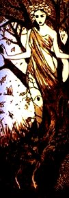

  
[Intangible Textual Heritage](../../../index.md)  [Sagas and
Legends](../../index)  [Celtic](../index.md) 

------------------------------------------------------------------------

<table width="75%">
<colgroup>
<col style="width: 50%" />
<col style="width: 50%" />
</colgroup>
<tbody>
<tr class="odd">
<td width="50%" data-valign="TOP"></td>
<td width="50%" data-valign="TOP"><h1 id="irish-fairy-tales" data-align="CENTER">Irish Fairy Tales</h1>
<h2 id="by-james-stephens" data-align="CENTER">by James Stephens</h2>
<h4 id="section" data-align="CENTER">[1920]</h4></td>
</tr>
</tbody>
</table>

------------------------------------------------------------------------

[Title Page](ift00.md)  
[The Story of Tuan Mac Cairill](ift01.md)  
[The Boyhood of Fionn](ift02.md)  
[The Birth of Bran](ift03.md)  
[Oisin's Mother](ift04.md)  
[The Wooing of Becfola](ift05.md)  
[The Little Brawl at Allen](ift06.md)  
[The Carl of the Drab Coat](ift07.md)  
[The Enchanted Cave of Cesh Corran](ift08.md)  
[Mongan's Frenzy](ift09.md)  
