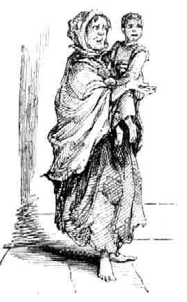
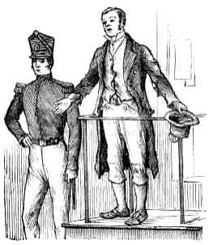

  
[Intangible Textual Heritage](../../../index.md)  [Sagas and
Legends](../../index)  [Celtic](../index)  [Index](index.md) 
[Previous](isb17)  [Next](isb19.md) 

------------------------------------------------------------------------

Roundstone Petty Sessions.

 

"The temple of august Themis," as a Frenchman would call the
sessions-room at Roundstone, is an apartment of some twelve feet square,
with a deal table and a couple of chairs for the accommodation of the
magistrates, and a Testament with a paper cross pasted on it to be
kissed by the witnesses and complainants who frequent the court. The
law-papers, warrants, &c., are kept on the sessions-clerk's bed in an
adjoining apartment, which commands a fine view of the court-yard-where
there is a stack of turf, a pig, and a shed beneath which the
magistrates' horses were sheltered during the sitting. The
sessions-clerk is a gentleman "having," as the phrase is here, both the
English and Irish languages, and interpreting for the benefit of the
worshipful bench.

And if the cockney reader supposes that in this remote country spot, so
wild, so beautiful, so distant from the hum and vice of cities,
quarrelling is not, and litigation never shows her snaky head, he is
very much mistaken. From what I saw, I would recommend any ingenious
young attorney whose merits are not appreciated in the metropolis, to
make an attempt upon the village of Roundstone; where as yet, I believe,
there is no solicitor, and where an immense and increasing practice
might speedily be secured. Mr. O'Connell, who is always crying out
"Justice for Ireland," finds strong supporters among the Roundstonians,
whose love of justice for themselves is inordinate. I took down the
plots of the first five little litigious dramas which were played before
Mr. Martin and the stipendiary magistrate.

Case 1.-A boy summoned a young man for beating him so severely that he
kept his bed for a week, thereby breaking an engagement with his master,
and losing a quarter's wages.

The defendant stated, in reply, that the plaintiff was engaged--in a
field through which defendant passed with another person--setting two
little boys to fight; on which defendant took plaintiff by the collar
and turned him out of the field. A witness who was present swore that
defendant never struck plaintiff at all, nor kicked him, nor ill-used
him, further than by pushing him out of the field.

As to the loss of his quarter's wages, the plaintiff ingeniously proved
that he had afterwards returned to his master, that he had worked out
his time, and that he had in fact received already the greater part of
his hire. Upon which the case was dismissed, the defendant quitting
court without a stain upon his honour.

Case 2 was a most piteous and lamentable case of killing a cow. The
plaintiff stepped forward with many tears and much gesticulation to
state the fact, and also to declare that she was in danger of her life
from the defendant's family.

It appeared on the evidence that a portion of the defendant's
respectable family are at present undergoing the rewards which the law
assigns to those who make mistakes in fields with regard to the
ownership of sheep which sometimes graze there. The defendant's father,
O'Damon, for having appropriated one of the fleecy bleaters of
O'Meliboeus, was at present passed beyond sea to a country where wool,
and consequently mutton, is so plentiful, that he will have the less
temptation. Defendant's brothers tread the Ixionic wheel for the same
offence. Plaintiff's son had been the informer in the case: hence the
feud between the families, the threats on the part of the defendant, the
murder of the innocent cow.

 

But upon investigation of the business, it was discovered, and on the
plaintiff's own testimony, that the cow had not been killed, nor even
been injured; but that the defendant had flung two stones at it, which
*might* have inflicted great injury had they hit the animal with greater
force in the eye or in any delicate place.

Defendant admitted flinging the stones, but alleged as a reason that the
cow was trespassing on his grounds; which plaintiff did not seem
inclined to deny. Case dismissed.--Defendant retires with unblemished
honour; on which his mother steps forward, and lifting up her hands with
tears and shrieks, calls upon God to witness that the defendant's own
brother-in-law had sold to her husband the very sheep on account of
which he had been transported.

Not wishing probably to doubt the justice of the verdict of an Irish
jury, the magistrate abruptly put an end to the lamentation and oaths of
the injured woman by causing her to be sent out of court, and called the
third case on.

This was a case of thrilling interest and a complicated nature,
involving two actions, which ought each perhaps to have been gone into
separately, but were taken together. In the first place Timothy Horgan
brought an action against Patrick Dolan for breach of contract in not
remaining with him for the whole of six months during which Dolan had
agreed to serve Horgan. Then Dolan brought an action against Horgan for
not paying him his wages for six months' labour done--the wages being
two guineas.

Horgan at once, and with much candour, withdrew his charge against
Dolan, that the latter had not remained with bun for six months: nor can
I understand to this day why in the first place he swore to the charge;
and why afterwards he withdrew it. But immediately advancing another
charge against his late servant, he pleaded that he had given him a suit
of clothes, which should be considered as a set-off against part of the
money claimed.

 

Now such a suit of clothes as poor Dolan had was never seen--I will not
say merely on an English scarecrow, but on an Irish beggar. Strips of
rags fell over the honest fellow's great brawny chest, and the covering
on his big brown legs hung on by a wonder. He held out his arms with a
grim smile, and told his worship to look at the clothes! The argument
was irresistible: Horgan was ordered to pay forthwith. He ought to have
been made to pay another guinea for clothing a fellow-creature in rags
so abominable.

 

And now came a case of trespass, in which there was nothing interesting
but the attitude of the poor woman who trespassed, and who meekly
acknowledged the fact. She stated, however, that she only got over the
wall as a short cut home; but the wall was eight feet high, with a ditch
too; and I fear there were cabbages or potatoes in the inclosure. They
fined her a sixpence, and she could not pay it, and went to jail for
three days--where she and her baby at any rate will get a meal.

Last on the list which I took down came a man who will make the fortune
of the London attorney that I hope is on his way hither: a rather old,
curly-headed man, with a sly smile perpetually ling on his face (the
reader may give whatever interpretation he please to the "lying"). He
comes before the court almost every fortnight, they say, with a
complaint of one kind or other. His present charge was against a man for
breaking into his court-yard, and wishing to take possession of the
same. It appeared that he, the defendant, and another lived in a row of
houses: the plaintiff's house was, however, first built; and as his
agreement specified that the plot of ground behind his house should be
his likewise, he chose to imagine that the plot of ground behind all the
three houses was his, and built his turf-stack against his neighbour's
window. The magistrates of course pronounced against this ingenious
discoverer of wrongs, and he left the court still smiling and twisting
round his little wicked eyes, and declaring solemnly that he would put
in an *appale.* If one could have purchased a kicking at a moderate
price off that fellow's back, it would have been a pleasant little piece
of self-indulgence, and I confess I longed to ask him the price of the
article.

And so, after a few more such great cases, the court rose, and I had
leisure to make moral reflections, if so minded: sighing to think that
cruelty and falsehood, selfishness and rapacity, dwells not in crowds
alone, but flourish all the world over--sweet flowers of human nature,
they bloom in all climates and seasons, and are just as much at home in
a hot house in Thavies' Inn as on a lone mountain or a rocky sea-coast
in Ireland, where never a tree will grow!

We walked along this coast, after the judicial proceedings were over, to
see the country, and the new road that the Board of Works is forming.
Such a wilderness of rocks I never saw! The district for miles is
covered with huge stones, shining white in patches of green, with the
Binabola on one side of the spectator, and the Atlantic running in and
out of a thousand little bays on the other. The country is very hilly,
or wavy rather, being a sort of ocean petrified; and the engineers have
hard work with these numerous abrupt little ascents and descents, which
they equalise as best they may-by blasting, cutting, filling cavities,
and levelling eminences. Some hundreds of men were employed at this
work, busy with their handbarrows, their picking and boring. Their pay
is eighteen-pence a day.

There is little to see in the town of Roundstone, except a Presbyterian
chapel in process of erection--that seems big enough to accommodate the
Presbyterians of the country--and a sort of lay convent, being a
community of brothers of the third order of Saint Francis. They are all
artisans and workmen, taking no vows, but living together in common, and
undergoing a certain religious regimen. Their work is said to be very
good, and all are employed upon some labour or other. On the front of
this unpretending little dwelling is an inscription with a great deal of
pretence, stating that the establishment was founded with the
approbation of "His Grace the Most Reverend the Lord Archbishop of
Tuam."

The Most Reverend Dr. MacHale is a clergyman of great learning, talents,
and honesty, but his Grace the Lord Archbishop of Tuam strikes me as
being no better than a mountebank; and some day I hope even his own
party will laugh this humbug down. It is bad enough to be awed by big
titles at all; but to respect sham ones!--O stars and garters! We shall
have his Grace the Lord Chief Rabbi next, or his Lordship the
Arch-Imaum!

 

------------------------------------------------------------------------

[Next: Clifden to Westport](isb19.md)
