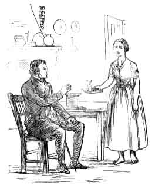
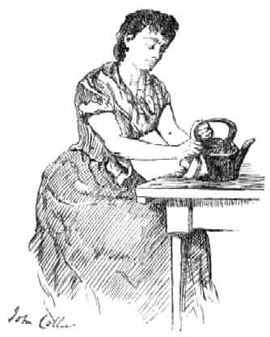

  
[Intangible Textual Heritage](../../../index)  [Sagas and
Legends](../../index)  [Celtic](../index)  [Index](index) 
[Previous](isb29)  [Next](isb31) 

------------------------------------------------------------------------

Peg of Limavaddy.

 

Between Coleraine and Derry there is a daily car (besides one or two
occasional queer-looking coaches), and I had this vehicle, with an
intelligent driver, and a horse with a hideous raw on his shoulder,
entirely to myself for the five-and-twenty miles of our journey. The
cabins of Coleraine are not parted with in a hurry, and we crossed the
bridge, and went up and down the hills of one of the suburban streets,
the Bann flowing picturesquely to our left; a large Catholic chapel, the
before-mentioned cabins, and farther on, some neat-looking houses and
plantations, to our right. Then we began ascending wide lonely hills,
pools of bog shining here and there amongst them, with birds, both black
and white, both geese and crows, on the hunt. Some of the stubble was
already ploughed up, but by the side of most cottages you saw a black
potato-field that it was time to dig now, for the weather was changing
and the winds beginning to roar. Woods, whenever we passed them, were
flinging round eddies of mustard-coloured leaves; the white trunks of
lime and ash trees beginning to look very bare.

Then we stopped to give the raw-backed horse water; then we trotted down
a hill with a noble bleak prospect of Lough Foyle and the surrounding
mountains before us, until we reached the town of Newtown Limavaddy,
where the raw-backed horse was exchanged for another not much more
agreeable in his appearance, though, like his comrade, not slow on the
road.

Newtown Limavaddy is the third town in the county of Londonderry. It
comprises three well-built streets, the others are inferior; it is,
however, respectably inhabited all this may be true, as the
well-informed Guide-book avers, but I am bound to say that I was
thinking of something else as we drove through the town, having fallen
eternally in love during the ten minutes of our stay.

Yes, Peggy of Limavaddy, if Barrow and Inglis have gone to Connemara to
fall in love with the Misses Flynn, let us be allowed to come to Ulster
and offer a tribute of praise at your feet--at your stockingless feet, O
Margaret! Do you remember the October day ('twas the first day of the
hard weather), when the way-worn traveller entered your inn? But the
circumstances of this passion had better be chronicled in deathless
verse.

Peg of Limavaddy

Riding from Coleraine  
(Famed for lovely Kitty),  
Came a cockney bound  
Unto Derry city;

Weary was his soul,  
Shivering and sad he  
Bumped along the road  
Leads to Limavaddy.

Mountains sketch'd around,  
Gloomy was their tinting,  
And the horse's hoofs  
Made a dismal clinting;  
Wind upon the heath  
Howling was and piping,  
On the heath and bog,  
Black with many a snipe in;  
Mid the bogs of black,  
Silver pools were flashing,  
Crowds upon their sides  
Picking were and splashing.  
Cockney on the car  
Closer folds his plaidy,  
Grumbling at the road  
Leads to Limavaddy.

Through the crashing woods  
Autumn brawl'd and bluster'd  
Tossing round about  
Leaves the hue of mustard;  
Yonder lay Lough Foyle,  
Which a storm was whipping,  
Covering with mist  
Lake, and shores, and shipping.  
Up and down the hill  
(Nothing could be bolder),  
Horse went with a raw,  
Bleeding on his shoulder.  
"Where are the horses changed?"  
Said I to the laddy  
Driving on the box:  
"Sir, at Limavaddy."

Limavaddy ins's  
But a humble baithouse,  
Where you may procure  
Whiskey and potatoes;  
Landlord at the door  
Gives a smiling welcome  
To the shivering wights  
Who to his lintel come.  
Landlady within  
Sits and knits a stocking,  
With a weary foot  
Baby's cradle rocking.

To the chimney nook,  
Having found admittance,  
There I watch a pup  
Playing with two kittens  
(Playing round the fire,  
Which of blazing turf is,  
Roaring to the pot  
which bubbles with the murphies;)  
And the cradled babe  
Fond the mother nursed it!  
Singing it a song  
As she twists the worsted

Up and down the stair  
Two more young ones patter  
(Twins were never seen  
Dirtier nor fatter)  
Both have mottled legs,  
Both have snubby noses,  
Both have--Here the Host  
Kindly interposes  
"Sure you must be froze  
with the sleet and hail, sir,  
So will you have some punch,  
Or will you have some ale, sir?"

Presently a maid  
Enters with the liquor,  
(Half a putt of ale  
Frothin in a beaker)  
Gods! I didn't know  
What my beating heart meant,  
Hebe's self I thought  
Enter'd the apartment

 

As she came she smiled,  
And the smile bewitching,  
On my word and honour,  
Lighted all the kitchen!

With a curtsey neat  
Greeting the new comer,  
Lovely, smiling Peg  
Offers me the rummer;  
But my trembling hand  
Up the beaker tilted,  
And the glass of ale  
Every drop I spilt it:  
Spilt it every drop  
(Dames, who read my volumes,  
Pardon such a word,)  
On my whatd'ycall'ems!

Witnessing the sight  
Of that dire disaster,  
Out began to laugh  
Missis, maid, and master;  
Such a merry peal,  
Specially Miss Peg's was,  
(As the glass of ale  
Trickling down my legs was),  
That the joyful sound  
Of that ringing laughter  
Echoed in my ears  
Many a long day after

Such a silver peal!  
In the meadows listening,

You who've heard the bells  
Ringing to a christening;  
You who ever heard  
Caradori pretty,  
Smiling like an angel  
Singing " Giovinetti,"  
Fancy Peggy's laugh,  
Sweet, and clear and cheerful,  
At my pantaloons  
With half a pint of beer full!

When the laugh was done,  
Peg, the pretty hussy,  
Moved about the room  
Wonderfully busy;  
Now she looks to see  
If the kettle keep hot,  
Now she rubs the spoons,  
Now she cleans the teapot;  
Now she sets the cups  
Trimly and secure  
Now she scours a pot  
And so it was I drew her.

 

Thus it was I drew her  
Scouring of a kettle.\*  
(Faith! her blushing cheeks  
Redden'd on the metal!)  
Ah! but 'tis in vain  
That I try to sketch it;  
The pot perhaps is like,  
But Peggy's face is wretched.  
No: the best of lead,  
And of Indian-rubber,  
Never could depict  
That sweet kettle-scrubber!

See her as she moves!  
Scarce the ground she touches",  
Airy as a fay,  
Graceful as a duchess;  
Bare her rounded arm,  
Bare her little leg is,

Vestris never show'd  
Ankles like to Peggy's:  
Braided is her hair,  
Soft her look and modest,  
Slim her little waist  
Comfortably bodiced.

This I do declare,  
happy is the laddy  
Who the heart can share  
Of Peg of Limavaddy;  
Married if she were,  
Blest would be the daddy  
Of the children fair  
Of Peg of Limavaddy;  
Beauty is not rare  
In the land of Paddy,  
Fair beyond compare  
Is Peg of Lirnavaddy.

Citizen or squire,  
Tory, Whig, or Radical would all desire  
Peg of Limavaddy.  
Had I Homer's fire,  
Or that of Sergeant Taddy,  
Meetly I'd admire  
Peg of Limavaddy.  
And till I expire,  
Or till I grow mad, I  
Will sing unto my lyre  
Peg of Limavaddy!

 

\* The late Mr. Pope represents Camilla as *"scouring the plain*" an
absurd and useless task. Peggy's occupation with the kettle is more
simple and noble. The second line of this verse (wheref the author 
scorns to deny an obligaion) is from the celebrated "Frithiof" of Esaias
Tigner. A maiden is serving warriers to drink, and is standing by a
sheld--"Und die Runde des Schildes ward wie das Magdalein roth"--perhaps
the best thing in both poems.

------------------------------------------------------------------------

[Next: Templemoyle--Derry](isb31)
