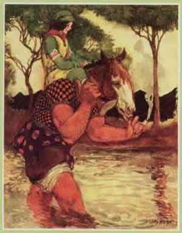

  
[Intangible Textual Heritage](../../../index)  [Sagas and
Legends](../../index)  [Celtic](../index) 

------------------------------------------------------------------------

<table width="75%">
<colgroup>
<col style="width: 50%" />
<col style="width: 50%" />
</colgroup>
<tbody>
<tr class="odd">
<td width="50%" data-valign="CENTER"> 
</td>
<td width="50%" data-valign="CENTER"><h1 id="the-king-of-irelands-son" data-align="CENTER">The King of Ireland's Son</h1>
<h2 id="by-padraic-colum" data-align="CENTER">by Padraic Colum</h2>
<h5 id="illustrations-and-decorations-by-willy-pogány" data-align="CENTER">illustrations and decorations by Willy Pogány</h5>
<h4 id="section" data-align="CENTER">[1916]</h4></td>
</tr>
</tbody>
</table>

------------------------------------------------------------------------

[Title Page](kis00)  

### Fedelma, The Enchanter's Daughter

[Part I](kis01)  
[Part II](kis02)  
[Part III](kis03)  
[Part IV](kis04)  
[Part V](kis05)  
[Part VI](kis06)  
[Part VII](kis07)  
[Part VIII](kis08)  
[Part IX](kis09)  
[Part X: The Story of the Ass and the Seal](kis10)  
[Part XI: The Sending of the Crystal Egg](kis11)  
[Part XII: The Story of the Young Cuckoo](kis12)  
[Part XIII: The Story of the Cloud-Woman](kis13)  
[Part XIV](kis14)  
[Part XV](kis15)  

### When the King of the Cats came to King Connal's dominion

[Part I](kis16)  
[Part II](kis17)  
[Part III](kis18)  
[Part IV](kis19)  
[Part V](kis20)  
[Part VI](kis21)  

### The Sword of Light and the Unique Tale, with as much of the adventures of Gilly of the Goat-Skin as is given in 'The Craneskin Book'

[Part I](kis22)  
[Part II](kis23)  
[Part III](kis24)  
[Part IV](kis25)  
[Part V](kis26)  
[Part VI](kis27)  
[Part VII](kis28)  
[Part VIII](kis29)  
[Part IX](kis30)  
[Part X](kis31)  
[Part XI](kis32)  
[Part XII](kis33)  
[Part XIII](kis34)  
[Part XIV](kis35)  
[Part XV: A Unique Tale](kis36)  
[Part XVI](kis37)  

### The Town of the Red Castle

[Part I](kis38)  
[Part II](kis39)  
[Part III](kis40)  
[Part IV](kis41)  
[Part V](kis42)  
[Part IV](kis43)  
[Part VII](kis44)  
[Part VIII](kis45)  

### The King of the Land of Mist

[Part I](kis46)  
[Part II](kis47)  
[Part III](kis48)  
[Part IV](kis49)  

### The House of Crom Duv

[Part I](kis50)  
[Part II](kis51)  
[Part III](kis52)  
[Part IV: The Story of Morag](kis53)  
[Part V](kis54)  
[The Story of the Fairy Rowan Tree](kis55)  
[Part VI](kis56)  
[Part VII](kis57)  
[Part VIII](kis58)  

### The Spae-Woman

[Part I](kis59)  
[Part II](kis60)  
[Part III](kis61)  
[Part IV](kis62)  
[Part V](kis63)  
[Part VI](kis64)  
