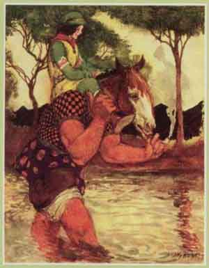

  
[Intangible Textual Heritage](../../../index.md)  [Sagas and
Legends](../../index)  [Celtic](../index)  [Index](index.md) 
[Next](kis01.md) 

------------------------------------------------------------------------

 

# The King of Ireland's Son

## by Padraic Colum

###### \[b. 1881 d. 1972.\]

### illustrations and decorations by Willy Pogány

###### \[b. 1882 d. 1955\].

#### New York, H. Holt and Company

#### \[1916\]

###### Scanned and redacted by Phillip Brown. Additional formatting and proofreading by Jean Lelievre at Intangible Textual Heritage. This text is in the public domain in the United States. This file may be used for any non-commercial purpose, provided this notice of attribution is left intact.

 

 

------------------------------------------------------------------------

[Next: Part I](kis01.md)
