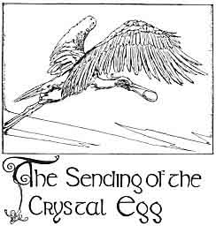

  
[Intangible Textual Heritage](../../../index)  [Sagas and
Legends](../../index)  [Celtic](../index)  [Index](index) 
[Previous](kis10)  [Next](kis12) 

------------------------------------------------------------------------

The Sending of the Crystal Egg

XI

 

The Kings of Murias heard that King Atlas had to bear  
The world upon his back, so they sent him then and there  
The Crystal Egg that would be the Swan of Endless Tales  
That his burthen for a while might lie on his shoulder-scales  
Fair-balanced while he heard the Tales the Swan poured forth--  
North-world Tales for the while he watched the Star of the North;  
And East-world Tales he would hear in the morning swart and cool,  
When the Lions Nimrod had spared came up from the drinking pool;  
West-world Tales for the King when he turned him with the sun;  
Then whispers of magic Tales from Africa, his own.

But the Kings of Murias made the Crane their messenger--  
The fitful Crane whose thoughts are always frightening her  
She slipped from Islet to Isle, she sloped from Foreland to Coast;  
She passed through cracks in the mountains and came over trees like a
ghost;  
And then fled back in dismay when she saw on the hollow plains  
The final battle between the Pigmies and the Cranes.

Where is the Crystal Egg that was sent King Atlas then?  
Hatched it will be one day and the Tales will be told to men:  
That is if it be not laid in some King's old Treasury: That is if the
fitful  
Crane did not lose it threading the Sea!

They were not long going through the little field of blue flowers, and
whenthey went through it they came to another field of white flowers.
Fedelma asked the King's Son to tell her another story, and thereupon he
told her the second story in "The Breastplate of Instruction."

------------------------------------------------------------------------

[Next: Part XII: The Story of the Young Cuckoo](kis12)
