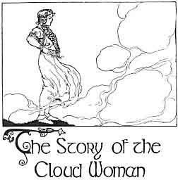

  
[Intangible Textual Heritage](../../../index)  [Sagas and
Legends](../../index)  [Celtic](../index)  [Index](index) 
[Previous](kis12)  [Next](kis14) 

------------------------------------------------------------------------

The Story of the Cloud-Woman

XIII

 

The Cloud-woman, Mor, was the daughter  
Of Griann, the Sun,--well, and she  
Made a marriage to equal that grandeur,  
For her Goodman was Lir, the Sea.

The Cloud-woman Mor, she had seven  
Strong sons, and the story-books say  
Their inches grew in the night-time,  
And grew over again in the day.

The Cloud-woman Mor,--as they grew in  
Their bone, she grew in her pride,  
Till her haughtiness turned away, men say,  
Her goodman Lir from her side;

Then she lived in Mor's Home and she watched  
With pride her sons and her crop,  
Till one day the wish in her grew  
To view from the mountain-top  
All, all that she owned, so she  
Traveled without any stop.

And what did she see? A thousand  
Fields and her own fields small, small!  
"What a fine and wide place is Eirinn," said she,  
"I am Mor, but not great after all."

Then a herdsman came, and he told her  
That her sons had stolen away:  
They had left the calves in the hollow,  
With the goose-flock they would not stay:

They had seen three ships on the sea  
And nothing would do them but go:  
Mor wept and wept when she heard it,  
And her tears made runnels below.

Then her shining splendor departed:  
She went, and she left no trace,  
And the Cloud-woman, Mor, was never  
Beheld again in that place.

The proud woman, Mor, who was daughter  
Of Griann, the Sun, and who made  
A marriage to equal that grandeur,  
Passed away as a shade.

------------------------------------------------------------------------

[Next: Part XIV](kis14)
