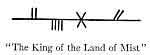

  
[Intangible Textual Heritage](../../../index)  [Sagas and
Legends](../../index)  [Celtic](../index)  [Index](index) 
[Previous](kis14)  [Next](kis16) 

------------------------------------------------------------------------

XV

Long, long after Fedelma had been taken by the King of the Land of Mist
the King of Ireland's Son came out of his slumber. He saw around him
that nameless place with its black rocks and bare roots of trees. He
remembered he had come to it with Fedelma. He sprang up and looked for
her, but no one was near him.

"Fedelma, Fedelma!" He searched and he called, but it was as if no one
had ever been with him. He found his sword; be searched for his steed,
but the Slight Red Steed was gone too.

He thought that the Enchanter of the Black Back-Lands had followed them
and had taken Fedelma from him. He turned to go towards the Enchanter's
country and then he found what Fedelma had written upon the ground in
Ogham letters:

 

He did not know what direction to take to get to the dominion of the
King of the Land of Mist. He crossed the broken ground and he found no
trace of Fedelma nor of him who had taken her. He found himself close to
the Wood of Shadows. He went through it. As he went on he saw scores and
scores of shadows. Nothing else was in the wood--no bird, no squirrel,
no cricket. The shadows had the whole wood to themselves. They ran
swiftly from tree to tree, and now and then one would stop at a tree and
wait. Often the King of Ireland's Son came close to a waiting shadow.
One became like a small old man with a beard. The King's Son saw this
shadow again and again. What were they, the shadows, he asked himself?
Maybe they were wise creatures and could tell him what he wanted to
know.

He thought he heard them whispering together. Then one little shadow
with trailing legs went slowly from tree to tree. The King of Ireland's
Son thought he would catch and hold a shadow and make it tell him where
he should go to find the dominion of the King of the Land of Mist.

He went after one shadow and another and waited beside a tree for one to
come. Often he thought he saw the small old man with the beard and the
little creature with trailing legs. And then he began to see other
shadows--men with the heads of rooks and men with queer heavy swords
upon their shoulders. He followed them on and on through the wood and he
heard their whispering becoming louder and louder, and then he thought
that as he went on the shadows, instead of slipping before him, began to
turn back and go past and surround him. Then he heard a voice just under
the ground at his feet say,

"Shout--shout out your own name, Son of King Connal!" Then the King's
Son shouted out his own name and the whispers ceased in the wood and the
shadows went backward and forward no more.

He went on and came to a stream within the wood and he went against its
flow all night as well as all day, hoping to meet some living thing that
would tell him how he might come to the dominion of the King of the Land
of Mist. In the forenoon of another day he came to where the wood grew
thin and then he went past the last trees

He saw a horse grazing: he ran up to it and found that it was the Slight
Red Steed that had carried Fedelma and himself from the house of the
Enchanter. Then as he laid hold of the steed a hound ran up to him and a
hawk flew down and he saw that they were the hawk and the hound that
used to be with him when he rode abroad from his father's Castle.

He mounted and seeing his hound at his heel and his hawk circling above
he felt a longing to go back to his father's Castle which he knew to be
near and where he might find out where the King of the Land of Mist had
his dominion.

So the King of Ireland's Son rode back to his father's Castle--

His hound at his heel,  
His hawk on his wrist.

------------------------------------------------------------------------

[Next: Part I](kis16)
