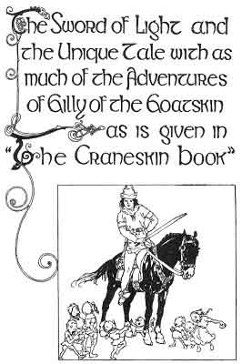
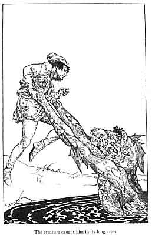

  
[Intangible Textual Heritage](../../../index)  [Sagas and
Legends](../../index)  [Celtic](../index)  [Index](index) 
[Previous](kis21)  [Next](kis23) 

------------------------------------------------------------------------

The Sword of Light and the Unique Tale  
With as Much of the Adventures of Gilly  
of the Goatskin  
as is Given in "The Craneskin Book"

 

I

He came to the house that was thatched with the one great wing of a
bird, and, as before, the Little Sage of the Mountain asked him to do a
day's work. The King's Son reaped the corn for the Little Sage, and as
he was reaping it his two foster-brothers, Dermott and Downal, rode by
on their fine horses. They did not know who the young fellow was who was
reaping in the field and they shouted for the Little Sage of the
Mountain to come out of the house and speak to them. "We want to know
where to find the Gobaun Saor who is to give us the Sword of Light,"
said Dermott.

"Come in," said the Sage, "and help me with my day's work, and I'll
search in my book for some direction."

"We can't do such an unprincely thing as take service with you," said
Downal. "Tell us now where we must go to find the Gobaun Saor."

"I think you have made a mistake," said the Little Sage. "I'm an
ignorant man, and I can't answer such a question without study."

"Ride on, brother," said Downal, "he can tell us nothing." Dermott and
Downal rode off on their fine horses, the silver bells on their bridles
ringing.

That night, when he had eaten his supper, the Little Sage told the
King's Son where to go. It is forbidden to tell where the King of
Ireland's Son found the Builder and Shaper for the Gods. In a certain
place he came to where the Gobaun Saor had set up his forge and planted
his anvil, and he saw the Gobaun Saor beating on a shape of iron.

"You want to find the Sword of Light," said the Gobaun, his eyes as
straight as the line of a sword-blade, "but show me first your will,
your mind and your purpose."

"How can I do that?" said the King of Ireland's Son.

"Guard my anvil for a few nights," said the Gobaun Saor. "A Fua comes
out of the river sometimes and tries to carry it off."

The Gobaun Saor had to make a journey to look at trees that were growing
in the forest, and the King's Son guarded his anvil. And at night a Fua
came out of the river and flung great stones, striving to drive him away
from the anvil. He ran down to the river bank to drive it away, but the
creature caught him in its long arms and tried to drown him in the deep
water. The King of Ireland's Son was near his death, but he broke away
from the Fua, and when the creature caught him again, he dragged it up
the bank and held it against a tree. "I will give you the mastery of all
arts because you have mastered me," said the Fua. "I do not want the
mastery of arts, but maybe you can tell me where to find the Sword of
Light." "You want to know that--do you?" said the Fua, and then it
twisted from him and went into the river.

 

The Fua came the next night and flung stones as before, and the King's
Son wrestled with it in the very middle of the river, and held him so
that he could not get to the other bank. "I will give you heaps of
wealth because you have mastered me," said the creature with the big
eyes and the long arms. "Not wealth, but the knowledge of where to come
on the Sword of Light is what I want from you," said the King of
Ireland's Son. But the Fua twisted from him and ran away again.

The next night the Fua came again, and the King's Son wrestled with him
in the middle of the river and followed him up the other bank, and held
him against a tree. "I will give you the craft that will make you the
greatest of Kings, because you have mastered me." "Not craft, but
knowledge of where the Sword of Light is, I want from you," said the
King's Son. "Only one of the People of Light can tell you that," said
the Fua. It became a small, empty sort of creature and lay on the ground
like a shadow.

The Gobaun Saor came back to his forge and his anvil. "You have guarded
my anvil for me," he said, "and I will tell you where to go for the
Sword of Light. It is in the Palace of the Ancient Ones under the Lake.
You have an enchanted steed that can go to that Lake. I shall turn his
head, and he shall go straight to it. When you come to the edge of the
Lake pull the branches of the Fountain Tree and give the Slight Red
Steed the leaves to eat. Mount now and go."

The King of Ireland's Son mounted the Slight Red Steed and went
traveling again.

------------------------------------------------------------------------

[Next: Part II](kis23)
