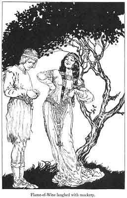

  
[Intangible Textual Heritage](../../../index.md)  [Sagas and
Legends](../../index)  [Celtic](../index)  [Index](index.md) 
[Previous](kis44)  [Next](kis46.md) 

------------------------------------------------------------------------

VIII

Flame-of-Wine saw him. She walked slowly down the orchard path so that
all might notice the stateliness of her appearance.

"I am glad to see you again, Flann," said she. "Have your comrades yet
come back to my father's town?"

Flann told her that one of them had returned.

"Bid him come see me," said Flame-of-Wine. Then she saw the girdle in
his hands.

"What is it you have?" said she.

"Something that went with the other treasures--a girdle."

"Will you not let me have it, Flann?" She took the girdle in her hands.
"Tell me, youth," she said, "how you got all these treasures?"

"I will have to give seven years' service for them," Flann said.

"Seven years," said she, "but you will remember--will you not--that I
loved you for bringing them to me?"

"Will you remember me until I come back from my seven years' service?"

"Oh, yes," said Flame-of-Wine, and she put the girdle around her waist
as she spoke.

"Someone said to me," said Flann, "that I should ask the maiden who
loved me for seven drops of her heart's blood."

The girdle was now round Flame-of- Wine's waist. She laughed with
mockery. "Seven drops of heart's blood," said she. "I would not give
this fellow seven eggs out of my robin's nest. I tell him I love him for
bringing me the three treasures for a King's daughter. I tell him that,
but I should be ashamed of myself if I thought I could have any love for
such a fellow."

 

"Do you tell me the truth now," said Flann.

"The truth, the truth," said she, "of course I tell you the truth. Oh,
and there are other truths. I shall be ashamed forever if I tell them.
Oh, oh. They are rising to my tongue, and every time I press them back
this girdle tightens and tightens until I think it will kill me."

"Farewell, then, Flame-of-Wine."

"Take off the girdle, take off the girdle! What truths are in my mind! I
shall speak them and I shall be ashamed. But I shall die in pain if I
hold them back. Loosen the girdle, loosen the girdle! Take the rose you
gave me and loosen the girdle." She let the rose fall on the ground.

"I will loosen the girdle for you," said Flann.

"But loosen it now. How I have to strive to keep truths back, and oh,
what pain I am in! Take the Comb of Magnificence, and loosen the
girdle." She threw the comb down on the ground.

He took up the Rose of Sweet Smells and the Comb of Magnificence and he
took the girdle off her waist. "Oh, what a terrible thing I put round my
waist," said Flame-of-Wine. "Take it away, Flann, take it away. But give
me back the Rose of Sweet Smells and the Comb of Magnificence,--give
them back to me and I shall love you always."

"You cannot love me. And why should I give seven years in service for
your sake? I will leave these treasures back in Mogue's pack."

"Oh, you are a peddler, a peddler. Go from me," said Flame-of-Wine. "And
do not be in the Town of the Red Castle to-morrow, or I shall have my
father's hunting dogs set upon you." She turned away angrily and went
into the Castle.

Flann went back to Mogue's tent and left the Rose of Sweet Smells, the
Comb of Magnificence and the Girdle of Truth upon Mogue's pack. He sat
in the comer and cried bitterly. Then the King of Ireland's Son came and
told him that his sword was bright once more--that the stains that had
blemished its blade had been cleared away by the Gobaun Saor who had
also shown him the way to the Land of the Mist. He put his arm about
Flann and told him that he was starting now to rescue his love Fedelma
from the Castle of the King of the Land of Mist.

------------------------------------------------------------------------

[Next: Part I](kis46.md)
