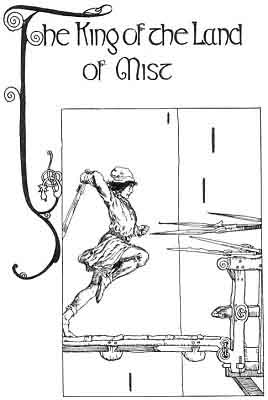
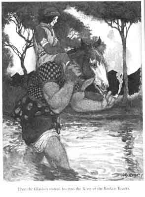

  
[Intangible Textual Heritage](../../../index)  [Sagas and
Legends](../../index)  [Celtic](../index)  [Index](index) 
[Previous](kis45)  [Next](kis47) 

------------------------------------------------------------------------

The King of the Land of Mist

 

I

The King of Ireland's Son came to the place where the river that he
followed takes the name of the River of the Broken Towers. It is called
by that name because the men of the old days tried to build towers
across its course. The towers were built a little way across the river
that at this place was tremendously wide.

"The Glashan will carry you across the River of the Broken Towers to the
shore of the Land of Mist," the Gobaun Saor had said to the King of
Ireland's Son. And now he was at the River of the Broken Towers but the
Glashan-creature was not to be seen.

Then he saw the Glashan. He was leaning his back against one of the
Towers and smoking a short pipe. The water of the river was up to his
knees. He was covered with hair and had a big head with horse's ears.
And the Glashan twitched his horse's ears as he smoked in great
contentment.

"Glashan, come here," said the King of Ireland's Son.

But the Glashan gave him no heed at all.

"I want you to carry me across the River of the Broken Towers," shouted
the King of Ireland's Son. The Glashan went on smoking and twisting his
ears.

And the King of Ireland's Son might have known that the whole clan of
the Gruagachs and Glashans are fond of their own ease and will do
nothing if they can help it. He twitched his ears more sharply when the
King's Son threw a pebble at him. Then after about three hours he came
slowly across the river. From his big knees down he had horse's feet.

"Take me on your big shoulders, Glashan," said the King of Ireland's
Son, "and carry me across to the shore of the Land of Mist."

"Not carrying any more across," said the Glashan. The King of Ireland's
Son drew the Sword of Light and flashed it.

"Oh, if you have that, you'll have to be carried across," said the
Glashan. "But wait until I rest myself."

"What did you do that you should rest?" said the King of Ireland's Son.
"Take me on your shoulders and start off."

"Musha," said the Glashan, "aren't you very anxious to lose your life?"

"Take me on your shoulders." "Well, come then. You're not the first
living dead man I carried across." The Glashan put his pipe into his
ear. The King of Ireland's Son mounted his shoulders and laid hold of
his thick mane. Then the Glashan put his horse's legs into the water and
started to cross the River of the Broken Towers.

 

"The Land of Mist has a King," said the Glashan, when they were in the
middle of the river.

"That, Glashan, I know," said the King of Ireland's Son.

"All right," said the Glashan.

Then said he when they were three-quarters of the way across, "Maybe you
don't know that the King of the Land of Mist will kill you?"

"Maybe 'tis I who will kill him," said the King of Ireland's Son.

"You'd be a hardy little fellow if you did that," said the Glashan. "But
you won't do it."

They went on. The water was up to the Glashan's waist but that gave him
no trouble. So broad was the river that they were traveling across it
all day. The Glashan threw the King's Son in once when he stooped to
pick up an eel. Said the King of Ireland's Son, "What way is the Castle
of the King of the Land of Mist guarded, Glashan?"

"It has seven gates," said the Glashan.

"And how are the gates guarded?"

"I'm tired," said the Glashan, "and I can't talk."

"Tell me, or I'll twist the horse's ears off your head."

"Well, the first gate is guarded by a plover only. It sits on the third
pinnacle over the gate, and when anyone comes near it rises up and flies
round the Castle crying until its sharp cries put the other guards on
the watch."

"And what other guards are there?"

"Oh, I'm tired, and I can talk no more."

The King of Ireland's Son twisted his horse's ears, and then the Glashan
said

"The second gate is guarded by five spear-men."

"And how is the third gate guarded?"

"The third gate is guarded by seven swordsmen."

"And how is the fourth gate guarded?"

"The fourth gate is guarded by the King of the Land of Mist himself."

"And the fifth gate?"

"The fifth gate is guarded by the King of the Land of Mist himself."

"And the sixth gate?"

"The sixth gate is guarded by the King of the Land of Mist."

"And how is the seventh gate guarded?"

"The seventh gate is guarded by a Hag."

"By a Hag only?" "By a Hag with poisoned nails. But I'm tired now, and
I'll talk no more to you. If I could strike a light now I'd smoke a
pipe."

Still they went on, and just at the screech of the day they came to the
other shore of the River of the Broken Towers. The King of Ireland's Son
sprang from the shoulders of the Glashan and went into the mist.

------------------------------------------------------------------------

[Next: Part II](kis47)
