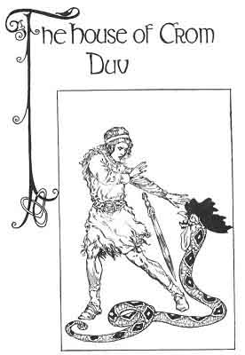

  
[Intangible Textual Heritage](../../../index)  [Sagas and
Legends](../../index)  [Celtic](../index)  [Index](index) 
[Previous](kis49)  [Next](kis51) 

------------------------------------------------------------------------

The House of Crom Duv

 

TO THE MEMORY OF BEATRICE CASSIDY COLUM

I

The story is now about Flann. He went through the East gate of the Town
of the Red Castle and his journey was to the house of the Hags of the
Long Teeth where he might learn what Queen and King were his mother and
his father. It is with the youth Flann, once called the Gilly of the
Goatskin, that we will go if it be pleasing to you, Son of my Heart. He
went his way in the evening, when, as the bard said:--

The blackbird shakes his metal notes  
Against the edge of day,  
And I am left upon my road  
With one star on my way.

And he went his way in the night, when, as the same bard said:--

The night has told it to the hills,  
And told the partridge in the nest,  
And left it on the long white roads,  
She will give light instead of rest.

And he went on between the dusk and the dawn, when, as the same bard
said again:--

Behold the sky is covered,  
As with a mighty shroud:  
A forlorn light is lying  
Between the earth and cloud.

And he went on in the dawn, when as the bard said (and this is the last
stanza he made, for the King said there was nothing at all in his
adventure):--

In the silence of the morning  
Myself, myself went by,  
Where lonely trees sway branches  
Against spaces of the sky.

And then, when the sun was looking over the first high hills he came to
a river. He knew it was the river he followed before, for no other river
in the country was so wide or held so much water. As he had gone with
the flow of the river then he thought he would go against the flow of
the river now, and so he might come back to the glens and ridges and
deep boggy places he had traveled from.

 

He met a Fisherman who was drying his nets and he asked him what name
the river had. The Fisherman said it had two names. The people on the
right bank called it the Day-break River and the people on the left bank
called it the River of the Morning Star. And the Fisherman told him he
was to be careful notto call it the River of the Morning Star when he
was on the right bank nor the Daybreak River when he was on the left, as
the people on either side wanted to keep to the name their fathers had
for it and were ill-mannered to the stranger who gave it a different
name. The Fisherman told Flann he was sorry he had told him the two
names for the River and that the best thing he could do was to forget
one of the names and call it just the River of the Morning Star as he
was on the left bank.

Flann went on with the day widening before him and when the height of
the noon was past he came to the glens and ridges and deep boggy places
he had traveled from. He went on with the bright day going before him
and the brown night coming behind him, and at dusk he came to the black
and burnt place where the Hags of the Long Teeth had their house of
stone.

He saw the house with a puff of smoke coming through every crevice in
the stones. He went to the shut door and knocked on it with the
knocking-stone.

"Who's without?" said one of the Hags.

"Who's within?" said Flann.

"The Three Hags of the Long Teeth," said one of the Hags, "and if you
want to know it," said she, "they are the runners and summoners, the
brewers and candle-makers for Crom Duv, the Giant."

Flann struck a heavier blow with the knocking-stone and the door broke
in. He stepped into the smoke-filled house.

"No welcome to you, whoever you are," said one of the three Hags who
were seated around the fire.

"I am the lad who was called Gilly of the Goatskin, and whom you reared
up here," said he, "and I have come back to you."

The three Hags turned from the fire then and screamed at him.

"And what brought you back to us, humpy fellow?" said the first Hag.

"I came back to make you tell me what Queen and King were my mother and
father."

"Why should you think a King and Queen were your father and mother?"
they said to him.

"Because I have on my breast the stars of a son of a King," said Flann,
"and," said he, "I have in my hand a sword that will make you tell me."

He came towards them and they were afraid. Then the first Hag bent her
knee to him, and, said she, "Loosen the hearthstone with your sword and
you will find a token that will let you know who your father was."

Flann put his sword under the hearthstone and pried it up. But if it
were a token, what was under the hearthstone was an evil thing--a
cockatrice. It had been hatched out of a serpent's egg by a black cock
of nine years. It had the head and crest of a cock and the body of a
black serpent. The cockatrice lifted itself up on its tail and looked at
him with red eyes. The sight of that head made Flann dizzy and he fell
down on the floor. Then it went down and the Hags put the hearthstone
above it.

"What will we do with the fellow?" said one of the Hags, looking at
Flann who was in a swoon on the floor.

"Cut of his head with the sword that he threatened us with," said
another.

"No," said the third Hag. "Crom Duv the Giant is in want of a servant.
Let him take this fellow. Then maybe the Giant will give us what he has
promised us for so long--a Berry to each of us from the Fairy Rowan Tree
that grows in his courtyard."

"Let it be, let it be," said the other Hags. They put green branches on
the fire so that Crom Duv would see the smoke and come to the house. In
the morning he came. He brought Flann outside, and after awhile Flann's
senses came back to him. Then the Giant tied a rope round his arms and
drove him before him with a long iron spike that he had for a staff.

------------------------------------------------------------------------

[Next: Part II](kis51)
