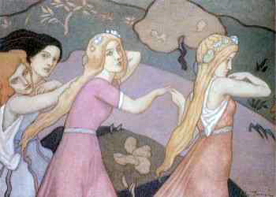

  
[Intangible Textual Heritage](../../../index)  [Legends and
Sagas](../../index)  [Celtic](../index) 

------------------------------------------------------------------------

[Buy this Book on
Kindle](https://www.amazon.com/exec/obidos/ASIN/B002GHBUI6/internetsacredte)

------------------------------------------------------------------------

<table width="75%">
<colgroup>
<col style="width: 50%" />
<col style="width: 50%" />
</colgroup>
<tbody>
<tr class="odd">
<td width="50%" data-valign="TOP"></td>
<td width="50%" data-valign="CENTER"><h1 id="legends-and-stories-of-ireland" data-align="CENTER">Legends and Stories of Ireland</h1>
<h2 id="by-samuel-lover" data-align="CENTER">by Samuel Lover</h2>
<h4 id="section" data-align="CENTER">[1831, 1834]</h4></td>
</tr>
</tbody>
</table>

------------------------------------------------------------------------

[Contents](#contents)    [Start Reading](lasi00)    [Text
\[Zipped\]](lasi.txt.gz)

------------------------------------------------------------------------

|                                                                                                                           |
|---------------------------------------------------------------------------------------------------------------------------|
|  |

This is a collection of Irish folklore, framed by first-person
remininces of the author, with some swatches of Irish 'dialect' and
other comic touches. It was written before the 'Celtic Twilight' books,
so its point is to entertain rather than record folklore. So the stories
are simply evocative of the art of Irish storytelling. However, there
are just enough ghosts, fairy trout, and other supernatural aspects to
please the Celtic lore fan.

------------------------------------------------------------------------

 [Title Page](lasi00)  
[Preface](lasi01)  
[Glossary](lasi02)  
[King O'Toole and St Kevin](lasi03)  
[Lough Corrib](lasi04)  
[A Legend of Lough Mask](lasi05)  
[The White Trout](lasi06)  
[The Battle of the Berrins; or, the Double Funeral](lasi07)  
[Father Roach](lasi08)  
[The Priest's Story](lasi09)  
[The King and the Bishop](lasi10)  
[Jimmy the Fool](lasi11)  
[The Catastrophe](lasi12)  
[The Devil's Mill](lasi13)  
[The Gridiron; or Paddy Mullowney's Travels in France](lasi14)  
[Paddy the Piper](lasi15)  
[The Priest's Ghost](lasi16)  
[New Potatoes](lasi17)  
[Paddy the Sport](lasi18)  
[The White Horse of the Peppers](lasi19)  
[The Legend of the Little Weaver of Duleek Gate](lasi20)  
[Conclusion of the White Horse of the Peppers](lasi21)  
[The Curse of Kishogue](lasi22)  
[The Fairy Finder](lasi23)  
