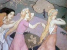

  
[Intangible Textual Heritage](../../../index.md)  [Legends and
Sagas](../../index)  [Celtic](../index)  [Index](index.md) 
[Previous](lasi00)  [Next](lasi02.md) 

------------------------------------------------------------------------

[Buy this Book on
Kindle](https://www.amazon.com/exec/obidos/ASIN/B002GHBUI6/internetsacredte.md)

------------------------------------------------------------------------

  
*Legends and Stories of Ireland*, by Samuel Lover, \[1831, 1834\], at
Intangible Textual Heritage

------------------------------------------------------------------------

# Preface

THOUGH the sources whence these Stories are derived are open to every
one, yet chance or choice may prevent thousands from making such sources
available; and though the village crone and mountain guide have many
hearers, still their circle is so circumscribed, that most of what I
have ventured to lay before my reader is for the first time made
tangible to the greater portion of those who do me the favour to become
such.

Many of them were originally intended merely for the diversion of a few
friends round my own fireside;--there, recited in the manner of those
from whom I heard them, they first made their *début*, and the
flattering reception they met on so minor a stage, led to their
appearance before larger audiences;--subsequently, I was induced to
publish two of them in the *Dublin Literary Gazette,* and the favourable
notice from contemporary prints, which they received, has led to the
publication of the present volume.

I should not have troubled the reader with this account of the "birth,
parentage, and education" of my literary bantlings, but to have it
understood that some of them are essentially *oral* in their character,
and, I fear, suffer materially when reduced to writing. This I mention
*en* *passant* to the critics; and if I meet but half as good-natured
*readers* as I have hitherto found *auditors,* I shall have cause to be
thankful. But, previously to the perusal of the following pages, there
are a few observations that I feel are necessary, and which I shall make
as concise as possible.

Most of the stories are given in the manner of the peasantry; and this
has led to some peculiarities that might be objected to, were not the
cause explained--namely, frequent digressions in the course of the
narrative, occasional adjurations, and certain words unusually spelt. As
regards the first, I beg to answer, that the stories would be deficient
in national character without it; the Irish are so imaginative that they
never tell a story straightforward, but constantly indulge in episode;
for the second, it is only fair to say, that in most cases the Irish
peasant's adjurations are not meant to be in the remotest degree
irreverent, but arise merely from the impassioned manner of speaking
which an excitable people are prone to; and I trust that such oaths as
"thunder-and-turf," or maledictions, as "bad cees to you," will not be
considered very offensive.

Nay, I will go further, and say, that their frequent exclamations of
"Lord be praised,"--"God betune us and harm," etc., have their origin In
a deeply reverential feeling and a reliance on the protection of
Providence. As for the orthographical dilemmas into which an attempt to
spell their peouliar pronunciation has led me, I have ample and most
successful precedent in Mr. Banim's works. Some general observations,
however, it may not be irrelevant to introduce here, on the
pronunciation of certain sounds In the English language by the Irish
peasantry. And here I wish to be distinctly understood, that I speak
only of the midland and western district of Ireland--and chiefly of the
latter.

They are rather prone to curtailing their words; *of,* for instance, is
very generally abbreviated into *o'* or *i'*, except when a succeeding
vowel demands a consonant; and even in that case they would substitute
*v.* The letters *d* and *t* as finals, they scarcely ever sound; for
example, pond, hand, slept, kept, are pronounced *pon*, *han, slep,
kep.* These letters, when followed by a vowel, are sounded as if the
aspirate *h* intervened, as tender, letter--*tindher*, *letther.* Some
sounds they sharpen, and *vice versa*. The letter *e*, for instance, is
mostly pronounced like *i* in the word litter, as *lind* for lend,
*mind* for mend, etc.; but there are exceptions to this rule--Saint
Kevin, for example, which they pronounce K*a*vin. The letter *o* they
sound like *a* in some words, as off, *aff* or *av--*thus softening *f*
into *v;* beyond, *beyant--*thus sharpening the final *d* to *t*, and
making an exception to the custom of not sounding *d* as a final; in
others they alter it to *ow--*as old, *owld.* Sometimes *o* is even
converted into *I* - as spoil, *spile.* In a strange spirit of
contrariety, while they alter the sound of *e* to that of *i*, they
substitute the latter for the former sometimes--as hinder,
*hendher--*cinder*, cendher; s* they soften into *z--as* us, *us.* There
are other peculiarities which this is not an appropriate place to dilate
upon. I have noticed the most obvious. Nevertheless, even these are
liable to exceptions, as the peasantry are quite governed by ear--as in
the word *of,* which is variously sounded *o', i', ov, av,* or *iv,* as
best suits their pleasure.

It is unnecessary to remark how utterly unsystematic I have been in
throwing these few remarks together. Indeed, to classify (if it were
necessary) that which has its birth in ignorance would be a very
perplexing undertaking. But I wished to notice these striking
peculiarities of the peasant pronunciation, which the reader will have
frequent occasion to observe in the following pages; and, as a further
assistance, I have added a short glossary.

------------------------------------------------------------------------

[Next: Glossary](lasi02.md)
