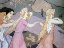

  
[Intangible Textual Heritage](../../../index)  [Legends and
Sagas](../../index)  [Celtic](../index)  [Index](index) 
[Previous](lasi01)  [Next](lasi03) 

------------------------------------------------------------------------

[Buy this Book on
Kindle](https://www.amazon.com/exec/obidos/ASIN/B002GHBUI6/internetsacredte)

------------------------------------------------------------------------

  
*Legends and Stories of Ireland*, by Samuel Lover, \[1831, 1834\], at
Intangible Textual Heritage

------------------------------------------------------------------------

# Glossary

ALPEEN--A cudgel.

BAD SCRAN--Bad food.

BAD WIN, BAD CESS--Malediction. Cess is an abbreviation of success.

BAITHERSHIN--It may be so.

BALLYRAG--To scold.

CAUREEN--An old bat. Strictly, a *little* old hat. *Een,* in Irish, is
diminutive.

COLLEEN DHAS--Pretty girl.

COMETHER--Corruption, of "Come hither." "Putting his comether" means
forcing his acquaintance.

GOMMOCH--A simpleton.

HARD WORD--Hint.

HUNKERS--Haunches.

KIMMEENS--Sly tricks.

MACHREE--My dear.

MAVOURNEEN--My darling.

MUSHA!--An exclamation, as "Oh, my!" "Oh, la!"

NOGGIN--A small wooden drinking vessel.

PHILLELEW--An outcry.

SPALPHEEN--A contemptible person.

STRAVAIG--To ramble.

ULICAN--The funeral cry.

WAKE--Watching the body of the departed previously to interment.

WEIRASTHRU!--Mary, have pity!

------------------------------------------------------------------------

[Next: King O'Toole and St Kevin](lasi03)
