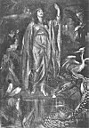

  
[Intangible Textual Heritage](../../../index)  [Legends and
Sagas](../../index)  [Celtic](../index)  [Index](index) 
[Previous](lrb11)  [Next](lrb13) 

------------------------------------------------------------------------

p. 241

# CHAPTER IX: THE BLACK ART AND ITS MINISTERS

SORCERY is a very present power in most isolated communities, and in the
civilized portions of Brittany it is but a thing of yesterday, while in
the more secluded departments it is very much a thing of to-day. The old
folk can recall the time when the farm, the dairy, and the field were
ever in peril of the spell, the enchantment, the noxious beam of the
evil eye, and tales of many a "devilish cantrip sleight," as Burns
happily characterized the activity of the witch and the wizard, were
told in hushed voices at the Breton fireside when the winter wind blew
cold from the cruel sea and the heaped faggots sent the red glow of
fire-warmth athwart the thick shadows of the great farm kitchen, and old
and young from grandsire to herd-boy made a great circle to hearken to
the creepy tales so dear to the Breton heart.

As in the East, where to refuse baksheesh is to lay oneself open to the
curse of the evil eye, the beggar was regarded as the chief possessor of
this bespelling member. The guild of tattered wanderers naturally
nourished this superstition, and to permit one of its members. to hobble
off muttering threats or curses was looked upon as suicidal. Indeed, the
mendicants were wont to boast of their feats of sorcery to the terrified
peasants, who hastened to placate them by all the means in their power.

Certain villages, too, appear to have possessed an evil reputation among
the country-folk as the dwelling-places of magicians, centres of
sorcery, which it was advisable to shun. Thus we read in Breton proverb

p. 242

of the sorcerers of Fougères, of Tréves, of Concoret, of Lézat.

The strangest circumstances were connected with the phenomena of sorcery
by the credulous Bretons. Thus, did a peasant join a dance of witches,
the sabots he had on would be worn out in the course of the merrymaking.
A churn of turned butter, a sour pail of milk, were certain to be
accounted for by sorcery. In a certain village of Moncontour the cows,
the dog, even the harmless, necessary cat, died off, and the farmer
hastened to consult a diviner, who advised him to throw milk in the fire
and recite certain prayers. The farmer obeyed and the spell was broken!

In the town of Rennes about fifty years ago dwelt a knowing fellow
called Robert, a very 'witch-doctor,' who investigated cases of sorcery
and undertook the dissipation of enchantments. On a certain large farm
the milk would yield no butter. An agricultural expert might have hinted
at poor pasturage, but the farmer and his wife had other views as to the
cause of the 'insufficiency of fats,' as an analyst would say, in the
lacteal output of the establishment. Straightway they betook themselves
to the mysterious Robert, who on arriving to investigate the affair was
attired in a skin dyed in two colours. He held in leash a large black
dog, evidently his familiar. He exorcized the dairy, and went through a
number of strange ceremonies. Then, turning to the awestruck farm hands,
he said:

"You may now proceed with your work. The spell is raised. It has been a
slow business. I must go now, but don't be afraid if you see anything
odd."

With these words he whistled, and a great black horse

p. 243

at once appeared as if from nowhere. Placing his hand on its crupper, he
vaulted into the saddle, bade good-bye to the astonished rustics, and
while they gazed at him open-mouthed, vanished 'like a flash.'

Many kinds of amulets or talismans were used by the Breton peasantry to
neutralize the power of sorcerers. Thus, if a person carried a snake
with him the enchanters would be unable to harm his sight, and all
objects would appear to him under their natural forms. Salt placed in
various parts of a house guarded it against the entrance of wizards and
rendered their spells void.

But many consulted the witch and the sorcerer for their personal
advantage, in affairs of the heart, to obtain a number in the casting of
lots for conscription which would free them from military service, and
so forth; and, as in other countries, there grew up a class of middlemen
between the human and the supernatural who posed as fortune-tellers,
astrologers, and quack mediciners.

It was said that sorcerers were wont to meet at the many Roches aux Fées
in Brittany at fixed periods in order to deliberate as to their actions
and settle their affairs. If anyone, it was declared, wandered into
their circle or was caught by them listening to their secret conclave he
seldom lived long. Others, terrified at the sight presented by the
gleaming eyes of the cat-sorcerers, blazing like live coals, fled
incontinently from their presence, and found that in the morning the
hair of their heads had turned white with the dread experience. Long
afterward they would sit by the fireside trembling visibly at nothing,
and when interrogated regarding their very evident fears would only
groan and bury their faces in their hands.

p. 244

A story is told of one, Jean Foucault, who one moonlight night had, like
Tam o' Shanter, sat overlong

Fast by an ingle bleezin’ finely,  
Wi’ reaming swats that drank divinely,

where the cider was as good as the company, and, issuing at midnight's
weary hour from his favourite inn, was not in a mood to run away from
anything, however fearsome. Walking, or rather rolling, across the moor
singing the burden of the last catch he had trolled with his fellows at
the ale-house, all on a sudden he stumbled into a circle of
sorcerer-cats squatting around a cross of stone. They were of immense
size and of all colours, black, grey, white, tortoise-shell, and when he
beheld them seated round the crucifix, their eyes darting fire and the
hair bristling on their backs, his song died upon his lips and all his
bellicose feelings, like those of Bob Acres, leaked out at his
finger-tips. On catching sight of him the animals set up a horrible
caterwauling that made the blood freeze in his veins. For an awful
moment the angry cats glared at him with death in their looks, and
seemed as if about to spring upon him. Giving himself up for lost, he
closed his eyes. But about his feet he could hear a strange purring,
and, glancing downward, he beheld his own domestic puss fawning upon him
with every sign of affection.

"Pass my master, Jean Foucault," said the animal.

"It is well," replied a great grey tom, whom Jean took to be the leader;
"pass on, Jean Foucault."

And Jean, the cider fumes in his head quite dissipated, staggered away,
more dead than alive.

p. 245

### Druidic Magic

The more ancient sorcerers of Brittany deserve a word of notice. Magic
among the Celtic peoples in olden times was so clearly identified with
Druidism that its origin may be said to have been Druidic. Whether
Druidism was of Celtic origin, however, is a question upon which much
discussion has taken place; some authorities, among them Rhys, believing
it to have been of non-Celtic and even non-Aryan origin, and holding
that the earliest non-Aryan or so-called Iberian people of Britain
introduced the Druidic religion to the immigrant Celts. An argument
advanced in favour of this theory is that the Continental Celts sent
their neophyte Druid priests to Britain to undergo a special training at
the hands of the British Druids, and that this island seems to have been
regarded as the headquarters of the cult. The people of Cisalpine Gaul,
for instance, had no Druidic priesthood. Cæsar has told us that in Gaul
Druidic seminaries were very numerous, and that within their walls
severe study and discipline were entailed upon the neophytes, whose
principal business was to commit to memory countless verses enshrining
Druidic knowledge and tradition. That this instruction was astrological
and magical we have the fullest proof. [1](#fn_48)

The Druids were magi as they were priests in the same sense that the
American Indian shaman is both magus and priest. That is, they were
medicine-men on a higher scale, and had reached a loftier stage of
transcendental knowledge than the priest-magicians of more barbarous
races. Thus they may be said to be a

p. 246

link between the barbarian shaman and the magus of medieval times. Many
of their practices were purely shamanistic, while others more closely
resembled medieval magical rite. But they were not the only magicians of
the Celts, for frequently among that people we find magic power the
possession of women and of the poetic craft. The magic of Druidism had
many points of comparison with most magical systems, and perhaps
approximated more to that black magic which desires power for the sake
of power alone than to any transcendental type. Thus it included the
power to render the magician invisible, to change his bodily shape, to
produce an enchanted sleep, to induce lunacy, and to inflict death from
afar.

The arts of rain-making, bringing down fire from heaven, and causing
mists, snow-storms, and floods were also claimed for the Druids. Many of
the spells probably in use among them survived until a comparatively
late period, and are still employed in some remote Celtic localities,
the names of saints being substituted for those of Celtic deities.
Certain primitive ritual, too, is still carried out in the vicinity of
some megalithic structures in Celtic areas, as at Dungiven, in Ireland,
where pilgrims wash before a great stone in the river Roe and then walk
round it, and in many parts of Brittany. [1](#fn_49)

In pronouncing incantations the usual method employed was to stand upon
one leg and to point with the forefinger to the person or object on
which the spell was to be laid, at the same time closing one eye, as if
to concentrate the force of the entire personality upon that which was
to be placed under ban. A manuscript

p. 247

possessed by the monastery of St Gall, and dating from the eighth or
ninth century, includes magical formulæ for the preservation of butter
and the healing of certain diseases in the name of the Irish god
Diancecht. These and others bear a close resemblance to Babylonian and
Etruscan spells, and thus go to strengthen the hypothesis often put
forward with more or less plausibility that Druidism had an Eastern
origin. At all magical rites spells were uttered. Druids often
accompanied an army, to assist by their magical arts in confounding the
enemy. [1](#fn_50)

There is some proof that in Celtic areas survivals of a Druidic
priesthood have descended to our own time in a more or less debased
condition. Thus the existence of guardians and keepers of wells said to
possess magical properties, and the fact that in certain families
magical spells and formulæ are handed down from one generation to
another, are so many proofs of the survival of Druidic tradition,
however feeble. Females are generally the conservators of these
mysteries, and that there were Druid priestesses is fairly certain.

The sea-snake's egg, or adder's stone, which is so frequently alluded to
in Druidic magical tales, otherwise called *Glain Neidr*, was said to
have been formed, about midsummer, by an assemblage of snakes. A bubble
formed on the head of one of them was blown by others down the whole
length of its back, and then, hardening, became a crystal ring. It was
used as one of the insignia of the Archdruid, and was supposed to assist
in augury.

The *herbe d’or*, or 'golden herb,' was a medicinal plant much in favour
among the Breton peasantry. It is the

p. 248

*selago* of Pliny, which in Druidical times was gathered with the utmost
veneration by a hand enveloped with a garment once worn by a sacred
person. The owner of the hand was arrayed in white, with bare feet,
washed in pure water. In after times the plant was thought to shine from
a distance like gold, and to give to those who trod on it the power of
understanding the language of dogs, wolves, and birds.

These, with the mistletoe, the favourite Druidical plant, the sorcerer
is entreated, in an old balled, to lay aside, to seek no more for vain
enchantments, but to remember that he is a Christian.

### Abélard and Héloïse

The touching story of the love of Abélard and Héloïse has found its way
into Breton legend as a tale of sorcery. Abélard was a Breton. The Duke
of Brittany, whose subject he was born, jealous of the glory of France,
which then engrossed all the most famous scholars of Europe, and being,
besides, acquainted with the persecution Abélard had suffered from his
enemies, had nominated him to the Abbey of St Gildas, and, by this
benefaction and mark of his esteem, engaged him to pass the rest of his
days in his dominions. Abélard received this favour with great joy,
imagining that by leaving France he would quench his passion for Héloïse
and gain a new peace of mind upon entering into his new dignity.

The Abbey of St Gildas de Rhuys was founded on the inaccessible coast
near Vannes by St Gildas, a British saint, the schoolfellow and friend
of St Samson of Dol and St Pol of Léon, and counted among its monks the
Saxon St Dunstan, who, carried by pirates from his

p. 249

native isle, settled on the desolate shores of Brittany and became,
under the name of St Goustan, the patron of mariners.

St Gildas built his abbey on the edge of a high, rocky promontory, the
site of an ancient Roman encampment, called Grand Mont, facing the
shore, where the sea has formed numerous caverns in the rocks. The rocks
are composed chiefly of quartz, and are covered to a considerable height
with small mussels. Abélard, on his appointment to the Abbey of St
Gildas, made over to Héloïse the celebrated abbey he had founded at
Nogent, near Troyes, which he called the Paraclete, or Comforter,
because he there found comfort and refreshment after his troubles. With
Nogent he was to leave his peace. His gentle nature was unable to
contend against the coarse and unruly Breton monks. As he writes in his
well-known letter to Héloïse, setting forth his griefs: "I inhabit a
barbarous country where the language is unknown to me. I have no
dealings with the ferocious inhabitants. I walk the inaccessible borders
of the stormy sea, and my monks have no other rule than their own. I
wish that you could see my dwelling. You would not believe it an abbey.
The doors are ornamented only with the feet of deer, of wolves and
bears, boars, and the hideous skins of owls. I find each day new perils.
I expect at every moment to see a sword suspended over my head."

It is scarcely necessary to outline the history of Abélard. Suffice it
to say that he was one of the most brilliant scholars and dialecticians
of all time, possessing a European reputation in his day. Falling in
love with Héloïse, niece of Fulbert, a canon of Paris, he awoke in her a
similar absorbing passion, which resulted in their

p. 250

 

[  
Click to enlarge](img/25000.jpg)  
HÉLOÏSE AS SORCERESS  

 

mutual disgrace and Abélard's mutilation by the incensed uncle, He and
his Héloïse were buried in one tomb at the Paraclete. The story of their
love has been immortalized by the world's great poets and painters.

An ancient Breton ballad on the subject has been spoken of as a "naïf
and horrible" production, in which one will find "a bizarre mixture of
Druidic practice and Christian superstition." It describes Héloïse as a
sorceress of ferocious and sanguinary temper. Thus can legend magnify
and distort human failing! As its presentation is important in the study
of Breton folklore, I give a very free translation of this ballad, in
which, at the same time, I have endeavoured to preserve the atmosphere
of the original.

### THE HYMN OF HÉLOÏSE

O ABÉLARD, my Abélard,  
Twelve summers have passed since first we kissed.  
There is no love like that of a bard:  
Who loves him lives in a golden mist!

Nor word of French nor Roman tongue,  
But only Brezonek could I speak,  
When round my lover's neck I hung  
And heard the harmony of the Greek,

The march of Latin, the joy of French,  
The valiance of the Hebrew speech,  
The while its thirst my soul did quench  
In the love-lore that he did teach.

The bossed and bound Evangel's tome  
Is open to me as mine own soul,  
But all the watered wine of Rome  
Is weak beside the magic bowl. p. 251

The Mass I chant like any priest,  
Can shrive the dying or bury the dead,  
But dearer to me to raise the Beast  
Or watch the gold in the furnace red.

The wolf, the serpent, the crow, the owl,  
The demons of sea, of field, of flood,  
I can run or fly in their forms so foul,  
They come at my call from wave or wood.

I know a song that can raise the sea,  
Can rouse the winds or shudder the earth,  
Can darken the heavens terribly,  
Can wake portents at a prince's birth.

The first dark drug that ever we sipped  
Was brewed from toad and the eye of crow,  
Slain in a mead when the moon had slipped  
From heav’n to the fetid fogs below.

I know a well as deep as death,  
A gloom where I cull the frondent fern,  
Whose seed with that of the golden heath  
I mingle when mystic lore I'd learn.

I gathered in dusk nine measures of rye,  
Nine measures again, and brewed the twain  
In a silver pot, while fitfully  
The starlight struggled through the rain.

I sought the serpent's egg of power  
In a dell hid low from the night and day:  
It was shown to me in an awful hour  
When the children of hell came out to play.

I have three spirits--seeming snakes;  
The youngest is six score years young,  
The second rose from the nether lakes,  
And the third was once Duke Satan's tongue.

The wild bird's flesh is not their food,  
No common umbles are their dole;  
I nourish them well with infants' blood,  
Those precious vipers of my soul. p. 252

O Satan ! grant me three years still,  
But three short years, my love and I,  
To work thy fierce, mysterious will,  
Then gladly shall we yield and die.

Héloïse, wicked heart, beware!  
Think on the dreadful day of wrath,  
Think on thy soul; forbear, forbear!  
The way thou tak’st is that of death!

Thou craven priest, go, get thee hence!  
No fear have I of fate so fell.  
Go, suck the milk of innocence,  
Leave me to quaff the wine of hell!

It is difficult to over-estimate the folk-lore value of such a ballad as
this. Its historical value is clearly *nil*. We have no proof that
Héloïse was a Breton; but fantastic errors of this description are so
well known to the student of ballad literature that he is able to
discount them easily in gauging the value of a piece.

In this weird composition the wretched abbess is described as an
alchemist as well as a sorceress, and she descends to the depths of the
lowest and most revolting witchcraft. She practises shape-shifting and
similar arts. She has power over natural forces, and knows the past, the
present, and the things to be. She possesses sufficient Druidic
knowledge to permit her to gather the greatly prized serpent's egg, to
acquire which was the grand aim of the Celtic magician. The
circumstances of the ballad strongly recall those of the poem in which
the Welsh bard Taliesin recounts his magical experiences, his
metamorphoses, his knowledge of the darker mysteries of nature.

p. 253

### Nantes of the Magicians

The poet is in accord with probability in making the magical exploits of
Abélard and Héloïse take place at Nantes--a circumstance not indicated
in the translation owing to metrical exigencies. Nantes was, indeed, a
classic neighbourhood of sorcery. An ancient college of Druidic
priestesses was situated on one of the islands at the mouth of the
Loire, and the traditions of its denizens had evidently been cherished
by the inhabitants of the city even as late as the middle of the
fourteenth century, for we find a bishop of the diocese at that period
obtaining a bull of excommunication against the local sorcerers, and
condemning them to the eternal fires with bell, book, and candle. [1](#fn_51)

The poet, it is plain, has confounded poor Héloïse with the dark
sisterhood of the island of the Loire. The learning she received from
her gifted lover had been her undoing in Breton eyes, for the simple
folk of the duchy at the period the ballad gained currency could
scarcely be expected to discriminate between a training in rhetoric and
philosophy and a schooling in the *grimoires* and other accomplishments
of the pit.

------------------------------------------------------------------------

### Footnotes

[245:1](lrb12.htm#fr_48) Rice Holmes, *Cæsar's
Conquest*, pp. 532-536.

[246:1](lrb12.htm#fr_49) See Rolleston, *Myths
and Legends of the Celtic Race*, p. 66.

[247:1](lrb12.htm#fr_50) See Gomme, *Ethnology
in Folk-lore*, p. 94.

[253:1](lrb12.htm#fr_51) it is of interest to
recall the fact that Abélard was born near Nantes, in 1079.

------------------------------------------------------------------------

[Next: Chapter X: Arthurian Romance in Brittany](lrb13)
