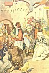
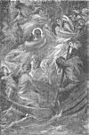

  
[Intangible Textual Heritage](../../../index)  [Legends and
Sagas](../../index)  [Celtic](../index)  [Index](index) 
[Previous](lrb15) 

------------------------------------------------------------------------

p. 372

# CHAPTER XIII: COSTUMES AND CUSTOMS OF BRITTANY

DISTINCTIVE national costume has to a great extent become a thing of the
past in Europe, and for this relinquishment of the picturesque we have
doubtless in a measure to thank the exploitation of remote districts as
tourist and sporting centres. Brittany, however, has been remarkably
faithful to her sartorial traditions, and even to-day in the remoter
parts of the west and in distant sea-coast places her men and women have
not ceased to express outwardly the strong national and personal
individuality of their race. In these districts it is still possible for
the traveller to take a sudden, bewildering, and wholly entrancing step
back into the past.

In Cornouaille the national costume is more jealously cherished than in
any other part of the country, even to the smallest details, for here
the men carry a *pen-bas*, or cudgel, which is as much a supplement to
their attire and as characteristic of it as the Irish shillelagh is of
the traditional Irish dress. Quimper is perhaps second to Cornouaille in
fidelity to the old costume, for all the men wear the national habit. On
gala days this consists of gaily embroidered and coloured waistcoats,
which often bear the travelling tailor's name, and voluminous
*bragou-bras*, or breeches of blue or brown, held at the waist with a
broad leather belt with a metal buckle and caught in at the knee with
ribbons of various hues, the whole set off with black leather leggings
and shoes ornamented with silver buckles. A broad-brimmed hat, beneath
which the hair falls down sometimes to below the shoulders, finishes a
toilet which on weekdays

p. 373

or work-days has to give place to white *bragou-bras* of tough material,
something more sombre in waistcoats, and the ever serviceable sabot.

### Hats and Hymen

In the vast stretch of the salt-pans of Escoublac, between Batz and Le
Croisic, where the entire population of the district is employed, the
workers, or *paludiers*, affect a smock-frock with pockets, linen
breeches, gaiters, and shoes all of white, and with this dazzling
costume they wear a huge, flapping black hat turned up on one side to
form a horn-shaped peak. This peak is very important, as it indicates
the state of the wearer, the young bachelor adjusting it with great
nicety over the ear, the widower above his forehead, and the married man
at the back of his head. On Sundays or gala-days, however, this uniform
is discarded in favour of a multicoloured and more distinctive attire,
the breeches being of fine cloth, exceedingly full and pleated and
finished with ribbons at the knees, the gaiters and white shoes of
everyday giving place to white woollen stockings with clocks embroidered
on them and shoes of light yellow, while the smock is supplanted by
several waistcoats, of varying lengths and shades, which are worn one
above the other in different coloured tiers, finished at the neck with a
turnover muslin collar. The holiday hat is the same, save for a roll of
brightly and many tinted chenille.

Several petticoats of pleated cloth, big bibs or plastrons called
*pièces*, of the same shade as their dresses, and a shawl with a fringed
border, compose the costume of the women. The aprons of the girls are
very plain and devoid of pockets, but the older women's are rich in
texture and design, some of them being of silk and

p. 374

others even of costly brocade. The women's head-dress is almost
grotesque in its originality, the hair being woven into two rolls,
swathed round with tape, and wound into a coronet across the head. Over
this is drawn tightly a kind of cap, which forms a peak behind and is
crossed in front like a handkerchief. Should widowhood overtake a woman
she relinquishes this *coiffe* and shrouds her head and shoulders in a
rough black triangular-shaped sheepskin mantle.

The toilette of a bride is as magnificent as the widow's is depressing
and dowdy. It consists of three different dresses, the first of white
velvet with apron of moire-antique, the second of purple velvet, and the
third of cloth of gold with embroidered sleeves, with a *pièce* of the
same material. A wide sash, embroidered with gold, is used for looping
up all these resplendent skirts in order to reveal the gold clocks which
adorn the stockings. These, and all gala costumes, are carefully stored
away at the village inn, and may be seen by the traveller sufficiently
interested to pay a small fee for the privilege.

### Quaint Head-dresses

Though the dress of the Granville women does not attempt to equal or
rival the magnificence just described, nevertheless it is as quaint and
characteristic. They favour a long black or very dark coat, with
bordering frills of the same material and shade, and their cap is a sort
of *bandeau*, turning up sharply at the ears, and crested by a white
handkerchief folded square and laid flat on top.

In Ouessant the peasant women adopt an Italian style of costume, their
head-dress, from under which their

p. 375

hair falls loosely, being exactly in almost every detail like that which
one associates with the women of Italy. The costume of the man from St
Pol is, like that of the Granville women, soberer than most others of
Brittany. Save for his buttons, the buckle on his hat, and the clasps of
white metal fastening his leather shoes, his dress, including spencer,
waistcoat, trousers, and stockings, is of black, and his hair is worn
falling on his shoulders, while he rarely carries the *pen-bas*--an
indication, perhaps, of his rather meditative, pious temperament.

At Villecheret the cap of the women is bewilderingly varied and very
peculiar. At first sight it appears to consist of several large sheets
of stiff white paper, in some cases a sheet of the apparent paper
spreading out at either side of the head and having another roll placed
across it; in other cases a ridged roof seems to rest upon the hair, a
roof with the sides rolling upward and fastened at the top with a frail
thread; while a third type of head-dress is of the skull-cap order, from
which is suspended two ties quite twenty inches long and eight inches
wide, which are doubled back midway and fastened again to the top of the
skull-cap. The unmarried woman who adopts this *coiffe* must wear the
ties hanging over the shoulders.

Originality in head-dress the male peasant leaves almost entirely to the
woman, for nearly everywhere in Brittany one meets with the long,
wide-brimmed, black hat, with a black band, the dullness of which is
relieved by a white or blue metal buckle, as large as those usually
found on belts. To this rule the Plougastel man is one of the
exceptions, wearing a red cap with his trousers and coat of white
flannel.

p. 376

At Muzillac, some miles distant from La Roche-Bernard, the women
supplant the white coiffe with a huge black cap resembling the cowl of a
friar, while at Pont l’Abbé and along the Bay of Audierne the cap or
*bigouden* is formed of two pieces, the first a species of skull-cap
fitting closely over the head and ears, the second a small circular
piece of starched linen, shaped into a three-cornered peak, the centre
point being embroidered and kept in position by a white tape tie which
fastens under the chin. Over the skull-cap the hair is dressed *en
chignon*. The dress accompanying this singular *coiffe* and *coiffure*
has a large yellow *pièce*, with sleeves to match. The men wear a number
of short coats, one above the other, the shortest and last being trimmed
with a fringe, and occasionally ornamented with sentences embroidered in
coloured wools round the border, describing the patriotic or personal
sentiments of the wearer.

The women of Morlaix are also partial to the tight-fitting *coiffe*.
This consists of five broad folds, forming a base from which a fan-like
fall of stiffened calico spreads out from ear to car, completely shading
the nape of the neck and reaching down the back below the shoulders.
Many of the women wear calico tippets, while the more elderly affect a
sort of mob-cap with turned-up edges, from which to the middle of the
head are stretched two wide straps of calico, joined together at the
ends with a pin. Most of the youths of Morlaix wear the big, flapping
hat, but very often a black cloth cap is also seen. This is ridiculous
rather than picturesque, for so long is it that with almost every
movement it tips over the wearer's nose. The tunic accompanying either
hat or cap is of blue flannel, and over it is worn a black waistcoat.
The porters of the

 

[  
Click to enlarge](img/37600.jpg)  
MODERN BRITTANY  

 

p. 377

market-places wear a sort of smock. The young boys of Morlaix dress very
like their elders, and nearly all of them wear the long loose cap, with
the difference that a tasselled end dangles down the back.

On religious festivals the gala dress is always donned in all vicinities
of Brittany, and the costume informs the initiated at once in what
capacity the Breton is present. For instance, the *porteuses*, or
banner-bearers, of certain saints are dressed in white; others may be
more gorgeously or vividly attired in gowns of bright-coloured silk
trimmed with gold lace, scarves of silver thread, aprons of gold tissue
or brocade, and lace *coiffes* over caps of gold or silver tissue; while
some, though in national gala dress, will have flags or crosses to
distinguish them from the more commonplace worshipper.

### Religious Festivals

This dressing for the part and the occasion is interwoven with the
Breton's existence as unalterably as sacred and profane elements are
into the occasions of his religious festivals. A feast day well and
piously begun is interspersed and concluded with a gaiety and abandon
which by contrast strikes a note of profanity. Yet Brittany is quite the
most devotedly religious of all the French provinces, and one may see
the great cathedrals filled to their uttermost with congregations
including as many men as women. Nowhere else, perhaps, will one find
such great masses of people so completely lost in religious fervour
during the usual Church services and the grander and more impressive
festivals so solemnly observed. This reverence is attributed by some to
the power of superstition, by others to the Celtic temperament of the
worshippers; but

p. 378

from whatever cause it arises no one who has lived among the Bretons can
doubt the sincerity and childlike faith which lies at the base of it
all, a faith of which a medieval simplicity and credence are the
keynotes.

### The Pardons

This pious punctiliousness is not confined to Church services and
ceremonies alone, for rarely are wayside crosses or shrines unattended
by some simple peasant or peasants telling beads or unfolding griefs to
a God Who, they have been taught, takes the deepest interest in and
compassionates all the troubles and trials which may befall them.
Between May and October the religious ardour of the Breton may be
witnessed at its strongest, for during these months the five great
'Pardons' or religious pilgrimage festivals are solemnized in the
following sequence: the Pardon of the Poor, at Saint-Yves; the Pardon of
the Singers, at Rumengol; the Pardon of the Fire, at
Saint-Jean-du-Doigt; the Pardon of the Mountain, at
Troménie-de-Saint-Renan; the Pardon of the Sea, at Sainte-Anne-la-Palud.

The Pardon of the Poor, the Pardon of the Singers, and the Pardon of the
Sea are 'especially rigorous and exacting, but the less celebrated
Pardon of Notre Dame de la Clarté, in Morbihan, has an earthly as much
as a celestial object, for while the pilgrimage does homage to the
Virgin it is at the same time believed to facilitate marriage. Here,
once the sacred side of the festival has been duly observed, the young
man in search of a wife circles about the church, closely scrutinizing
all the eligible demoiselles who come within range of his vision. As
soon as he decides which maiden most appeals to him, he asks her
politely if she will accept a

p. 379

gift from him, and at the same time presents a large round cake, with
which he has armed himself for that occasion. "Will mademoiselle break
the cake with me?" is the customary form of address, and in the adoption
or rejection of this suggestion lies the young peasant's yea or nay.

The Pardon of Saint-Jean-du-Doigt takes place on the 22nd of June, and
is, perhaps, the most solemn of these festivals. During its celebration
the relic of the Saint, the little finger of his right hand, is held
before the high altar of the church by an *abbé* clad in his surplice.
The finger is wrapped in the finest of linen, and one by one the
congregation files past the *abbé* for the purpose of touching for one
brief moment the relic he holds. At the same time another cleric stands
near the choir, holding the skull of St Mériadec, and before this the
pilgrims also promenade, reverently bowing their heads as they go. The
devotees then repair to a side wall near which there is a fountain, the
waters of which have been previously sanctified by bathing in them the
finger of St Jean suspended from a gold chain, and into this the
pilgrims plunge their palms and vigorously rub their eyes with them, as
a protection against blindness. This concludes the religious side of the
Pardon, and immediately after its less edifying ceremonies begin.

The Pardon of the Mountain is held on Trinity Sunday at Troménie. Every
sixth year there is the 'Grand Troménie,' an event which draws an
immense concourse of people from all parts. The principal feature of
this great day from the spectator's point of view is the afternoon
procession. It is of the most imposing description, and all who have
come to take part in the Pardon join it, as with banners flying and much
hymn

p. 380

singing it takes its way out of the town to wind round a mountain in the
vicinity.

### Barking Women

In the old days of religious enthusiasm a remarkable phenomenon often
attended these festivals, when excitement began to run high, as it was
certain to do among a Celtic people. This was the barking of certain
highly strung hysterical women. In time it became quite a usual feature,
but now, happily, it is a part of the ceremony which has almost entirely
disappeared. There is a legend in connexion with this custom that the
Virgin appeared before some women disguised as a beggar, and asked for a
draught of water, and, when they refused it, caused them and their
posterity to be afflicted with the mania.

### The Sacring Bell

Another custom of earlier times was that of ringing the sacring bell.
These bells are very tiny, and are attached at regular intervals to the
outer rim of a wooden wheel, wrongly styled by some 'the Wheel of
Fortune,' from which dangles a long string. In most places the sacring
bell is kept as a curiosity, though in the church of St Bridget at
Berhet the *Sant-e-roa*, or Holy Wheel, is still rung by pilgrims during
Mass. The bells are set pealing through the medium of a long string by
the impatient suppliant, to remind the saint to whom the *Sant-e-roa*
may be dedicated of the prayerful requests with which he or she has been
assailed.

There are in many of the churches of Brittany wide, old-fashioned
fireplaces, a fact which testifies to a very sensible practice which
prevailed in the latter half of

p. 381

the sixteenth century--that of warming the baptismal water before
applying it to the defenceless head of the lately born. The most famous
of these old fireplaces belong to the churches of St Bridget in Perguet,
Le Moustoir-le-Juch, St Non at Penmarch, and Brévélenz. In the church at
the latter place one of the pinnacles of the porch forms the chimney to
its historic hearth.

### The Venus of Quinipily

Childless people often pay a visit to some standing stone in their
neighbourhood in the hope that they may thereby be blessed with
offspring. Famous in this respect is the 'Venus,' or *Groabgoard*, of
Quinipily, a rough-hewn stone in the likeness of a goddess. The letters
. . . LIT . . . still remain on it--part of a Latin inscription which
has been thought to have originally read ILITHYIA, "a name in keeping
with the rites still in use before the image," says MacCulloch. [1](#fn_59)

### Holy wells

The holy well is another institution dating from early days, and there
is hardly a church in Brittany which does not boast one or more of these
shrines, which are in most cases dedicated to the saint in whose honour
the church has been raised. So numerous are these wells that to name
them and dwell at any length on the curative powers claimed for their
waters would fill a large volume. Worthy of mention, however, is the
Holy Well of St Bieuzy, as typical of most of such sacred springs. It is
close to the church of the same name in Bieuzy, and flows from a granite
wall. Its waters are said to relieve and cure the mentally

p. 382

deranged. Some of the wells are large enough to permit the afflicted to
bathe in their waters, and of these the well near the church of Goezenou
is a good example. It is situated in an enclosure surrounded by stone
seats for the convenience of the devotees who may desire to immerse
themselves bodily in it. Several of these shrines bear dates, but
whether they are genuine is a matter for conjecture.

### Reliquaries

Every Breton churchyard worthy of the name has its reliquary or
bone-house. There may be seen rows of small boxes like dog-kennels with
heart-shaped openings. Round these openings, names, dates, and pious
ejaculations are written. Looking through the aperture, a glimpse of a
skull may startle one, for it is a gruesome custom of the country to dig
up the bones of the dead and preserve the skulls in this way. The name
upon the box is that once borne by the deceased, the date that of his
death, and the charitable prayer is for the repose of his soul.
Occasionally these boxes are set in conspicuous places in the church,
but generally they remain in the reliquary. In the porch of the church
of St Trémeur, the son of the notorious Breton Bluebeard, Comorre, there
is one of the largest collections of these receptacles in Brittany. Rich
people who may have endowed or founded sacred edifices are buried in an
arched recess of the abbey or church they have benefited.

### Feeding the Dead

In some parts of Brittany hollows are found in tomb stones above graves,
and these are annually filled with holy water or libations of milk. It
would seem as if

p. 383

this custom linked prehistoric with modern practice and that the
cup-hollows frequently met with on the top of dolmens may have been
intended as receptacles for the food of the dead. The basins scooped in
the soil of a barrow may have served the same purpose. On the night of
All Souls' Day, when this libation is made, the supper is left spread on
the table of each cottage and the fire burns brightly, so that the dead
may return to refresh and warm themselves after the dolours of the
grave.

### The Passage de l’Enfer

How hard custom dies in Brittany is illustrated by the fact that it is
still usual at Tréguier to convey the dead to the churchyard in a boat
over a part of the river called the 'Passage de l’Enfer,' instead of
taking the shorter way by land. This custom is reminiscent of what
Procopius, a historian of the sixth century, says regarding Breton
Celtic custom in his *De Bello Gothico*. Speaking of the island of
Brittia, by which he means Britain, he states that it is divided by a
wall. Thither fishermen from the Breton coast are compelled to ferry
over at darkest night the shades of the dead, unseen by them, but
marshalled by a mysterious leader. The fishermen who are to row the dead
across to the British coast must go to bed early, for at midnight they
are aroused by a tapping at the door, and they are called in a low
voice. They rise and go down to the shore, attracted by some force which
they cannot explain. Here they find their boats, apparently empty, yet
the water rises to the bulwarks, as if they were crowded. Once they
commence the voyage their vessels cleave the water speedily, making the
passage,

p. 384

usually a day and a half's sailing, in an hour. When the British shore
is reached the souls of the dead leave the boats, which at once rise in
the sea as if unloaded. Then a loud voice on shore is heard calling out
the name and style of those who have disembarked.

Procopius had, of course, heard the old Celtic myth of an oversea
Elysium, and had added to it some distorted reminiscence of the old
Roman wall which divided Britain. The 'ship of souls' is evidently a
feature of Celtic as well as of Latin and Greek belief.

### Calvaries

Calvaries, or representations of the passion on the Cross, are most
frequently encountered in Brittany, so much so, indeed, that it has been
called 'the Land of the Calvaries.' Over the length and breadth of the
country they are to be met at almost every turn, some of them no more
than rude, simple crosses originating in local workshops, and others
truly magnificent in carving and detail. Some of the most famous are
those situated at Plougastel, Saint-Thégonnec, and Guimiliau. The
Calvary of Plougastel dates from the early sixteenth century, and
consists of an arcade beneath a platform filled with statues. The
surrounding frieze has carvings in bas-relief representing incidents in
the life of Christ. The Calvary of Saint-Thégonnec represents vividly
the phases of the passion, being really a 'way of the Cross' in
sculpture. It bears the unmistakable stamp of the sixteenth century. The
Calvary of Guimiliau is dated 1580 and 1588. A platform supported by
arches bears the three crosses, the four evangelists, and other figures
connected with the principal incidents in the life and passion of our
Lord, The principal

 

[  
Click to enlarge](img/38400.jpg)  
THE SOULS OF THE DEAD  

 

p. 385

figures, that of Christ and those of the attending Blessed Virgin and St
John, are most beautifully and sympathetically portrayed. The figures in
the representations from the life of Christ, which are from necessity
much smaller than those of the Crucifixion, are dressed in the costume
of the sixteenth century. The entire Calvary is sculptured in Kersanton
stone.

Whether these and other similar groups are really works of art is
perhaps a matter for discussion, but regarding their impressiveness
there cannot be two opinions. By the bulk of the people they are held in
great reverence, and rarely are they unattended by tiny congregations of
two or three, while on the occasion of important religious festivals
people flock to them in hundreds.

### Weddings

In many of their religious observances the Bretons are prone to confuse
the sacred with the profane, and chief among these is the wedding
ceremony--the customs attendant on which in some ostensibly Christian
countries are yet a disgrace to the intellect as well as the good
feeling of man. In rural Brittany, however, the revelry which ensues as
soon as the church door closes on the newly wedded pair is more like
that associated with a children's party than the recreation of older
people. Should the marriage be celebrated in the morning, tables laid
out with cakes are ranged outside the church door, and when the bridal
procession files out of the church the bride and bridegroom each take a
cake from the table and leave a coin in its stead for the poor. The
guests follow suit, and then the whole party repairs to the nearest
meadow, where endless *ronds* are begun.

p. 386

The *rond* is a sort of dance in which the whole assembly joins hands
and revolves slowly with a hop-skip-and-a-jump step to the accompaniment
of a most wearisome and unvarying chant, the music for which is provided
by the *biniou*, or bagpipe, and the flageolet or hautboy, both being
occasionally augmented by the drum. Before the ceremony begins the
musicians who are responsible for this primitive harmony are dispatched
to summon the guests, who, of course, arrive in the full splendour of
the national gala costume. As soon as the *ronds* are completed to the
satisfaction of everybody the custom common to so many countries of
stealing the bride away is celebrated. At a given signal she speeds away
from the party, hotly pursued by the young gallants present, and when
she is overtaken she presents the successful swain with a cup of coffee
at a public *café*. This interlude is followed by dinner, and after that
the *ronds* are resumed. These festivities, in the case of prosperous
people, sometimes last three days, during which time the guests are
entertained at their host's expense. If the wedding happens to be held
in the evening, dancing is about the only amusement indulged in, and
this follows an elaborate wedding supper. The *biniou* and its
companions are decidedly *en évidence*, while sometimes the monotony of
the ronds is varied by the *grand rond*, a much more graceful and
intricate affair, containing many elaborate and difficult steps; but the
more ordinary dance is the favourite, probably because of the
difficulties attending the other.

### Breton Burials

An ancient Breton funeral ceremony was replete with symbolic meaning and
ritual, which have been carried

p. 387

down through the Middle Ages to the present time. As soon as the head of
the family had ceased to breathe, a great fire was lit in the courtyard,
and the mattress upon which he had expired was burned. Pitchers of water
and milk were emptied, for fear, perhaps, that the soul of the defunct
might be athirst. The dead man was then enveloped from head to foot in a
great white sheet and placed in a description of funeral pavilion, the
hands joined on the breast, the body turned toward the east. At his feet
a little stool was placed, and two yellow candles were lit on each side
of him. Then the beadle or gravedigger, who was usually a poor man, went
round the country-side to carry the news of death, which he usually
called out in a high, piping voice, ringing his little bell the while.
At the hour of sunset people arrived from all parts for the purpose of
viewing the body. Each one carried a branch, which he placed on the feet
of the defunct. The evening prayer was recited by all, then the women
sang the canticles. From time to time the widow and children of the
deceased raised the corner of the shroud and kissed it solemnly. A
repast was served in an adjoining room, where the beggar sat side by
side with the wealthy, on the principle that all were equal before
death. It is strange that the poor are always associated with the griefs
as with the pleasures of Breton people; we find them at the feast of
death and at the baptism as at the wedding rejoicing.

In the morning the rector of the parish arrived and all retired, with
the exception of the parents, if these chanced to be alive, in whose
presence the beadle closed the coffin. No other member of the family

p. 388

was permitted to take part in this solemn farewell, which was regarded
as a sacred duty. The coffin was then placed on a car drawn by oxen, and
the funeral procession set out, preceded by the clergy and followed by
the female relations of the deceased, wearing yellow head-dresses and
black mantles. The men followed with bared heads. On arriving at the
church the coffin was disposed on trestles, and the widow sat close by
it throughout the ceremony. As it was lowered into the tomb the last
words of the prayer for the dead were repeated by all, and as it touched
the soil beneath a loud cry arose from the bereaved.

The Breton funeral ceremony, like those prevalent among other Celtic
peoples, is indeed a lugubrious affair, and somewhat recalls the Irish
wake in its strange mixture of mourning and feasting; but curiously
enough brightness reigns afterward, for the peasant is absolutely
assured that at the moment his friend is placed in the tomb he commences
a life of joy without end.

### Tartarus and Paradise

Two very striking old Breton ballads give us very vivid pictures of the
Breton idea of Heaven and its opposite. That dealing with the infernal
regions hails from the district of Léon. It is attributed to a priest
named Morin, who flourished in the fifteenth century, but others have
claimed it for a Jesuit father called Maunoir, who lived and preached
some two hundred years later. In any case it bears the ecclesiastical
stamp. "Descend, Christians," it begins, "to see what unspeakable
tortures the souls of the condemned suffer through the justice of God,
Who has chained them in the midst of flames for

p. 389

having abused their gifts in this world. Hell is a profound abyss, full
of shadow, where not the least gleam of light ever comes. The gates have
been closed and bolted by God, and He will never open them more. The key
is lost!

"An oven heated to whiteness is this place, a fire which constantly
devours the lost souls. There they will eternally burn, tormented by the
intolerable heat. They gnash their teeth like mad dogs; they cannot
escape the flames, which are over their heads, under their feet, and on
all sides. The son rushes at his father, and the daughter at her mother.
They drag them by the hair through the midst of flames, with a thousand
maledictions, crying, 'Cursed be ye, lost woman, who brought us into the
world! Cursed be ye, heedless man, who wert the cause of our damnation!'

"For drink they have only their tears. Their skins are scorched, and
bitten by the teeth of serpents and demons, and their flesh and their
bones are nothing but fuel to the great fire of Hell!

"After they have been for some time in this furnace, they are plunged by
Satan into a lake of ice, and from this they are thrown once more into
the flames, and from the flames into the water, like a bar of iron in a
smithy. 'Have pity, my God, have pity on us!' they call; but they weep
in vain, for God has closed His cars to their plaints.

"The heat is so intense that their marrow burns within their bones. The
more they crave for pity, the more they are tormented.

"This fire is the anger of God which they have aroused; verily it may
never be put out."

One turns with loathing, with anger, and with contempt

p. 390

from this production of medieval ecclesiasticism. When one thinks of the
thousands of simple and innocent people who must have been tortured and
driven half wild with terror by such infamous utterances as this, one
feels inclined to challenge the oft-repeated statement concerning the
many virtues of the medieval Church. But Brittany is not the only place
where this species of terrorism was in vogue, and that until
comparatively recent times. The writer can recall such descriptions as
this emanating from the pulpits of churches in Scottish villages only
some thirty years ago, and the strange thing is that people of that
generation were wont to look back with longing and admiration upon the
old style of condemnatory sermon, and to criticize the efforts of the
younger school of ministers as being wanting in force and lacking the
spirit of menace so characteristic of their forerunners. There are no
such sermons nowadays, they say. Let us thank God that to the credit of
human intelligence and human pity there are not!

The opposite to this picture is provided by the ballad on Heaven. It is
generally attributed to Michel de Kerodern, a Breton missionary of the
seventeenth century, but others claim its authorship for St Hervé, to
whom we have already alluded. In any case it is as replete with
superstitions as its darker fellow. The soul, it says, passes the moon,
sun, and stars on its Heavenward way, and from that height turns its
eyes on its native land of Brittany. "Adieu to thee, my country! Adieu
to thee, world of suffering and dolorous burdens! Farewell, poverty,
affliction, trouble, and sin! Like a lost vessel the body lies below,
but wherever I turn my eyes my heart is filled with a thousand
felicities.

p. 391

I behold the gates of Paradise open at my approach and the saints coming
out to receive me. I am received in the Palace of the Trinity, in the
midst of honours and heavenly harmonies. The Lord places on my head a
beautiful crown and bids me enter into the treasures of Heaven. Legions
of archangels chant the praise of God, each with a harp in his hand. I
meet my father, my mother, my brothers, the men of my country. Choirs of
little angels fly hither and thither over our heads like flocks of
birds. Oh, happiness without equal! When I think of such bliss to be, it
consoles my heart for the pains of this life."
