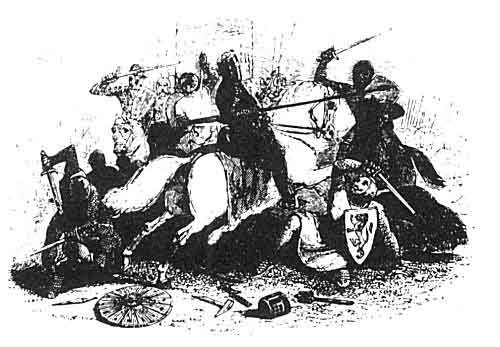

  
[Intangible Textual Heritage](../../../index)  [Legends and
Sagas](../../index)  [Celtic](../index)  [Index](index)  [Next](mab01) 

------------------------------------------------------------------------

[Buy this Book at
Amazon.com](https://www.amazon.com/exec/obidos/ASIN/B001W0Z8PY/internetsacredte)

------------------------------------------------------------------------

  
*The Mabinogion*, tr. by Lady Charlotte Guest, \[1877\], at Intangible
Textual Heritage

------------------------------------------------------------------------

###### THE

# MABINOGION

###### FROM

#### THE WELSH OF THE LLYFR COCH O HERGEST

#### (*THE RED BOOK OF HERGEST*)

#### IN THE LIBRARY OF JESUS COLLEGE, OXFORD

##### TRANSLATED, WITH NOTES

###### BY

## LADY CHARLOTTE GUEST

 

#### LONDON:

#### BERNARD QUARITCH, 15 PICCADILLY

#### \[1877\]

###### Scanned at Intangible Textual Heritage, February, 2004. John Bruno Hare, redactor. This text is in the public domain. These files may be used for any non-commercial purpose, provided this notice of attribution is left intact.

------------------------------------------------------------------------

[Next: Dedication](mab01)
