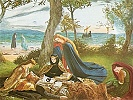

  
[Intangible Textual Heritage](../../../index)  [Legends and
Sagas](../../index)  [Celtic](../index)  [Index](index) 
[Previous](mab06)  [Next](mab08) 

------------------------------------------------------------------------

[Buy this Book at
Amazon.com](https://www.amazon.com/exec/obidos/ASIN/B001W0Z8PY/internetsacredte)

------------------------------------------------------------------------

  
*The Mabinogion*, tr. by Lady Charlotte Guest, \[1877\], at Intangible
Textual Heritage

------------------------------------------------------------------------

p. 66

### VERSIONS IN OTHER LANGUAGES

###### OF

### THE TALE OF "THE LADY OF THE FOUNTAIN."

THE story of Owain and the Lady of the Fountain was very popular in the
days of Chivalry, and we meet with it in many European languages besides
the Welsh.

The English version, under the title of "Ywaine and Gawin " (derived
from the French work of Chrestien de Troyes), was published by Ritson in
the first volume of his Metrical Romances, from a MS. in the British
Museum, supposed by him to be of the reign of Richard II.

Towards the end of the 12th century, the trouvère Chrestien de Troyes
made Owain's adventures the subject of his metrical Romance of the
"Cheualier an Lyon," which I have printed in the first edition of this
work, and of which there are several MS. copies in the Bibliothèque
Nationale.

Chrestien's French poem was turned into German verse by Hartmann von der
Aue, a Meister-sänger of the end of the 12th or the beginning of the
13th century. Of this production many copies exist, that in the Library
of the Vatican being considered by Tieck to be the oldest German MS,
preserved there. It has appeared more than once in print, and is to be
found in Professor Myller's Collection of Teutonic Romances, 2 vols.
4to., Berlin, 1784. It was also published by Michaeler in four small
8vo. volumes. Vienna, 1786.

Ulrich Fürterer, a Bavarian rhymer, who flourished in the later part of
the 15th century, has likewise left a poem on the subject of "Ivain," as
one of an immense series of metrical compositions embracing the entire
story of the Grail and the Round Table heroes.

In the Royal Library at Stockholm are preserved MS. versions of the Tale
of "Ivain," both in the Danish and Swedish languages, and the British
Museum, as well as the University Library of Copenhagen, possesses MSS.
of the Icelandic "Ivent Saga."

------------------------------------------------------------------------

[Next: Note on the Forest of Breceliande and the Fountain of
Baranton](mab08)
