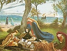
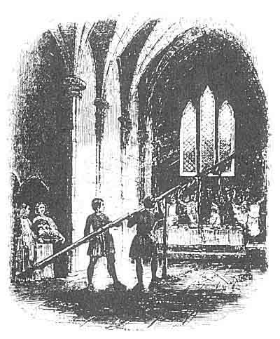

  
[Intangible Textual Heritage](../../../index.md)  [Legends and
Sagas](../../index)  [Celtic](../index)  [Index](index.md) 
[Previous](mab10)  [Next](mab12.md) 

------------------------------------------------------------------------

[Buy this Book at
Amazon.com](https://www.amazon.com/exec/obidos/ASIN/B001W0Z8PY/internetsacredte.md)

------------------------------------------------------------------------

  
*The Mabinogion*, tr. by Lady Charlotte Guest, \[1877\], at Intangible
Textual Heritage

------------------------------------------------------------------------

p. 125

 

### NOTES TO PEREDUR THE SON OF EVRAWC.

81a PEREDUR.--*Page* [81](mab10.htm#page_81.md).

OF the real history of Peredur, nothing is known. It is probable that he
fell in the battle of Cattraeth, in the beginning of the 6th century, as
Aneurin mentions a chieftain of this name among the slain.

"Warriors marched forth,--unanimously they bounded forward;--  
Short-lived were they,--they had revelled over the flowing mead;  
The host of Mynyddawc renowned in battle;  
Their life was the price of their banquet.  
Caradawc, and Madawc, Pyll, and Yeuan,  
Gwgawn, and Gwiawn, Gwynn, and Kynvan,  
*Peredur of steel arms*, Gwawrdur, and Aedan.  
A defence in the tumult, a shield in the conflict;  
When they were slain they also slaughtered.  
None to his home returned."

p. 126

Peredur is frequently alluded to by the Bards of the Middle Ages, in
terms illustrative of the high esteem in which his deeds of prowess then
were held. Gruffydd ab Meredydd, who flourished about the end of the
13th century, in his Elegy on Tudur ap Goronwy, one of the ancestors of
the House of Tudor, thus mentions him:--

"O Bountiful Creator of the radiant sun and waning moon,  
Sad is the fall of the chief of valiant deeds,  
Eagle of the battle-charge, equal to Peredur,  
Tudor, assaulter of the Angles, he who never shunned the fight."

In the old Romances, as Morte d'Arthur, &c., be is celebrated, under the
name of Perceval, as one of those engaged in the quest of the Sangreal,
in which character he is also spoken of in the Triads, together with
Bort, the son of the King of that name, and Galath, the son of Lancelot
du Lac.--Tri. lxi. Myv. Ar. II. 14.

Like Owain, his exploits were sung by Chrestiens de Troyes, and they
also form the subject of romantic compositions in German, and in other
languages of Northern Europe. Our own Chaucer alludes to him in his Rime
of Sire Thopas, Cant. Tales, 1384-5--

Himself drank water of the well,  
As did the Knight, Sire Percivell,  
     So worthy under wede."

 

81b ATTENDING TOURNAMENTS.--*Page*
[81](mab10.htm#page_81.md).

WE find various instances of knights, who made it a practice to resort
to Tournaments as a lucrative occupation; for, on those occasions, not
only the home and arms of the vanquished frequently became the property
of the victor, but the prizes contested for were often of so valuable a
nature as greatly to enrich those who were fortunate enough to win them.
Sometimes they consisted of diamonds and precious stones, and sometimes
even of the revenues of different domains. [1](#fn_27.md) In the Romance of Ipomydon, "a thousand
pound" is the guerdon bestowed on the successful combatant. Our Henry
the VII. proposed a ring of gold, set with a ruby, and another set with
a diamond, as the reward of the knights who should be victorious at a
Tournament at which he was to be present. [2](#fn_28.md) And there is a characteristic story on
record of the Chevalier Bayard, who being the conqueror on one of these
occasions, refused to take the prize, which was a ruby worth a hundred
ducats attached to a lady's

p. 127

sleeve, saying that the honour of the victory was entirely due to the
sleeve, for which he had contended. The ruby was accordingly presented
to the knight who had acquitted himself best after Bayard, and the lady
herself resumed possession of the sleeve, declaring that after what
Bayard had said, she should keep it all her life for his sake. [1](#fn_29.md)

 

81c WARS AND COMBATS.--*Page*
[81](mab10.htm#page_81.md).

FROM this passage we may probably infer that Evrawc was one of those
knights who, during the Middle Ages, ranked themselves under the banners
of such princes as were disposed to engage their services. Many of these
adventurers were held in high estimation, and Froissart, in speaking of
Sir John Hawkwood, who was one of the most distinguished of them, calls
him "a right valiant English knight who had performed many most gallant
deeds of arms." He gives the following account of Hawkwood's progress,
from which an idea may be formed of the emoluments that accrued to those
mercenary bands, and of the manner in which they were employed.

"He had left France at the conclusion of the peace of Bretigny, and was
at that time a poor knight, who thought it would not be of any advantage
to him to return home; but when he saw, that by the treaties, all
men-at-arms would be forced to leave France, he put himself at the head
of those free companions called late-comers, and marched into Burgundy.
Several such companions, composed of English, Gascons, Bretons, Germans,
and of men from every nation, were collected there. Hawkwood was one of
the principal leaders, with Bricquet and Carnelle, by whom the battle of
Brignais was fought, and who aided Bernard de la Salle to take the Pont
du St. Esprit.

"When they had harassed the country for some time, the marquis de
Montferrat made a treaty with them to assist him in his war with the
lords of Milan. This marquis led them over the Alps, after he had paid
them sixty thousand francs, of which Hawkwood received, for himself and
his troops, ten thousand. When they had finished the war for the
marquis, the greater part of them returned to France; for sir Bertrand
du Guesclin, the lords de la Marche, de Beaujeu, and sir Arnold
d'Andreghen, marshal of France, wished to lead them into Spain, to don
Henry de Trastamare, against don Pedro, king of Spain.

Sir John Hawkwood and his companions remained in Italy, and

p. 128

were employed by pope Urban as long as he lived, in his wars in the
Milanese. Pope Gregory, successor to Urban, engaged him in the same
manner. Sir John had also a profitable employment, under the lord de
Coucy, against the count de Vertus and his barons; in which, some say,
the lord de Coucy would have been slain, if sir John Hawkwood had not
come to his assistance with five hundred combatants, which he was solely
induced to do because the lord de Coucy had married one of the king of
England's daughters. This sir John Hawkwood was a knight much inured to
war, which he had long followed, and had gained great renown in Italy
from his gallantry.

"The Romans, therefore, and Urban, who called himself pope, resolved, on
Clement leaving Italy, to send for Hawkwood, and appoint him
commander-in-chief of all their forces: they made him large offers of
retaining him and his whole troop at a handsome subsidy, which he
accepted, and acquitted himself loyally for it."--Johnes's Froissart,
4to. II. c. 97.

 

82a THEY ARE ANGELS, MY SON.--*Page*
[82](mab10.htm#page_82.md).

INCIDENTS similar to that in the text are of frequent occurrence in the
old Romances. St. John of Damascus, a Greek writer of the 8th century,
has a story of a youth brought up in utter ignorance of all worldly
affairs, in order to evade a prophecy which existed against him. Here,
however, the compliment paid by Peredur's mother to the knights, in
calling them Angels, is far from being returned to her sex. For, in
describing to him all the objects he meets on his first going out, and
mixing with the world, the Greek writer makes the young man's father
apply an appellation to the ladies, which is the very reverse of
angelic.

There is another story to the same effect, in a Latin Collection of
Materials for composing Sermons, by John Herolt, sirnamed Discipulus, a
Dominican friar of Basil, who flourished about 1450. [1](#fn_30.md)

From these the idea has been adopted and worked up by the Italian
novelist.

 

83a POSSESS THYSELF OF IT, AND GIVE IT TO
ANOTHER.--*Page* [83](mab10.htm#page_83.md).

THE ideas of liberality entertained in the days of Chivalry were often
widely at variance with every principle of justice. That the advice
given to Peredur by his mother was consistent with the

p. 129

feelings of the day, may be gathered from various passages in the works
of contemporary writers. An amusing anecdote, illustrative of this, is
thus quoted by Mr. Hallam, from Joinville's celebrated History of St.
Louis.

"He is speaking of Henry count of Champagne, who acquired, says he, very
deservedly, the sirname of Liberal, and adduces the following proof of
it:--

A poor knight implored of him on his knees one day as much money as
would serve to marry his two daughters. One Arthault de Nogent, a rich
burgess, willing to rid the count, of this importunity, but rather
awkward, we must own, in the turn of big argument, said to the
petitioner: My lord has already given away so much that he has nothing
left. Sir Villain, replied Henry, turning round to him, you do not speak
truth, in saying that I have nothing left to give, when I have got
yourself. Here, Sir Knight, I give you this man and warrant your
possession of him. Then, says Joinville, the poor knight was not at all
confounded, but seized hold of the burgess fast by the collar, and told
him he should not go till he had ransomed himself. And in the end he was
forced to pay a ransom of five hundred pounds. The simple-minded writer
who brings this evidence of the count of Champagne's liberality is not
at all struck with the facility of a virtue that is exercised at the
cost of others." [1](#fn_31.md)

 

85a THROUGH MAGIC OR CHARMS.--*Page*
[85](mab10.htm#page_85.md).

THE dread of supernatural agency has in all ages exerted a powerful
influence over the human mind. Even in the present day, instances are
not wanting of men of the most approved natural courage, quailing with
fear at the idea of an invisible enemy. It must, therefore, not be
surprising, if, in less enlightened times, we find this superstitious
feeling interfering still more generally with the common affairs of
life. So decidedly was it acknowledged in the Middle Ages, that a solemn
oath was required to be taken by every knight previous to his engaging
in wager of battle, that he did not bear about him any charm or spell,
and that he was not protected by magic or enchantment.

 

86b THIS IRON COAT.--*Page*
[86](mab10.htm#page_86.md).

IN the English version, Perceval, after several vain attempts to

p. 130

disencumber the dead knight of his armour, betakes himself to rather a
curious expedient for effecting his object:--

"He sayd my moder bad me,  
When my dart solde broken be,  
Owte of ye Iren bren ye tree  
  Now es me fyre ynede.  
Now he getis hȳ flynt,  
His fyre Iren he hent,  
And yen wt owtten any stynt,  
  He kyndilt a glede."

 

86a BETWEEN THE NECK AND THE
SHOULDER.--*Page* [86](mab10.htm#page_86.md).

IT should seem that this was a favourite point of attack in the
energetic encounters of those days; for in the Morte d'Arthur we meet
with a similar expression to the above. It is stated, that when Arthur
first assumed the government of Britain, several kings and knights would
not acknowledge his authority, and assembled in order to oppose him.
Believing their visit to have a friendly object, he sent them many
valuable presents, which they refused to accept, rebuking "the messagers
shamefully," and sending Arthur "word, they wold none of his yeftes. But
that they were come to gyue hym yeftes with hard swerdys betwixt the
neck and the sholders."--B. I. c. 8.

 

89a STAPLE.--*Page* [89](mab10.htm#page_89.md).

THIS was, probably, a staple for fastening horses to, as it is well
known that the horses were often brought into the hall among the guests.
In the account of the thirteen rarities of the Island of Britain, as
enumerated in an unpublished MS. in the possession of Mr. Justice
Bosanquet, it is said that one chieftain had the staple for holding his
horse at the foot of his bed.

"The halter of Clydno Eiddyn, which was in a staple below the feet of
his bed; and whatever horse he wished for in it, he would find there."

90a SPEAR OF MIGHTY SIZE.--*Page* 90.

IN the French version of this tale, the spear here alluded to is said to
have been the Holy Lance, and with it is brought in the celebrated
Sangreal. The latter was the great object of research with the Knights
of the Round Table, and its recovery was ultimately

p. 131

achieved by Perceval of Wales, the Peredur ab Evrawc of Welsh Romance.

 

94a THE THIRD PART.--*Page*
[94](mab10.htm#page_94.md).

THIS apportionment is strictly in accordance with ancient Welsh customs;
for by the Laws of Howel Dda, it appears the Master of the Royal
Household and the Steward (*Penteulu* and *Distein*), were each entitled
to a third part of certain fines there mentioned; to express which
portion the same word (*trayan*) is used as in the present tale.

 

98a GWALCHMAI.--*Page*
[98](mab10.htm#page_98.md).

GWALCHMAI'S reputation for courtesy and eloquence is here admirably kept
up, and we find him fully entitled to the appellation of the Golden
Tongued, so poetically bestowed upon him in the Triads. No less
faithfully is Kai's character for the very opposite quality of
detraction sustained.

 

100a ANGHARAD LAW EURAWC.--*Page*
[100](mab10.htm#page_100.md).

THIS name literally signifies Angharad with the Golden Hand, an epithet
which was most probably bestowed on her, to designate her liberality.

 

100b SPEAK A WORD TO ANY CHRISTIAN
AGAIN.--*Page* [100](mab10.htm#page_100.md).

DURING the days of Chivalry, vows for the performance of some singular
or romantic feat, of a similar nature with that mentioned in the text,
were greatly in vogue. In an ancient French Poem, entitled Le Vœu du
Héron, printed by Ste. Palaye, an amusing instance of this occurs.

Robert of Artois presents himself at the Court of Edward the III. and
incites that Monarch to the conquest of France. One day he enters the
hall in which the King and his courtiers are assembled, accompanied by
musicians and two noble damsels, and bearing in great pomp a Heron,
which he had killed, and which be ironically offers to Edward, as a
compensation for the French crown. Edward, roused by the taunt,
immediately swears upon the Heron, that the year shall not elapse
without his entering France with fire and sword. His nobles follow his
example. Among them is the Earl of Salisbury, who is seated by the
daughter of the Earl of Derby, to whom he was

p. 132

devotedly attached. He asks the lady to lend him one of her fingers and
to place it upon his eye.

"Si pri à la pucelle, de ceur devotement,  
Qu'elle me preste un doit de sa main seulement,  
Et methe sur mon œil destre parfaitement."

She is complaisant enough to grant him two fingers, which she puts upon
his eye, so as to close it. Whereupon the Earl makes oath never more to
open that eye until he shall have done battle against the army of the
French King. And this he faithfully performs.

"Les deux dois, sur l'œil destre, li mist isnelement, [1](#fn_32.md)  
Et si li a clos l'œil, et fremé [2](#fn_33.md)
fermement,  
Et chix [3](#fn_34.md) a demandé moult
gracieusement:  
Bele, est-il bien clos? Oyl certainement.  
A dont dist, de la bouche, du ceur le pensement;  
Et je veu, et prometh à Dieu omnipotent,  
Et a sa douche mere, que de beaute resplent,  
Qu'i n'est jamais ouvers, pour ore, [4](#fn_35.md)
ne pour vent,  
Pour mal, ne pour martire, ne pour encombrement, [5](#fn_36.md)  
Si seray dedans Franche, où il a bonne gent,  
Et si aray le fu [6](#fn_37.md) bouté
entièrement,  
Et serai combatus a grand efforchement,  
Contre les gens Philype, qui taut a hardement;  
Je ne sui en bataille prins, par boin ensient, [7](#fn_38.md)  
Bien li ederai [8](#fn_39.md) a acomplir son
talent:  
Or aviegne qu'aviegne, car il n'est autrement.  
Adonc osta son doit la puchelle an cors gent,  
Et li iex [9](#fn_40.md) clos demeure, si ques
virent le gent,  
Et quand Robert l'entent, moult de joie l'enprent.  
Quant li quens Salebrin ot voué son avis, [10](#fn_41.md)  
Et demoura l'œil clos en la guerre toudis.  
Li bers [11](#fn_42.md) Robers d'Artois ne s'est
mie alentis." [12](#fn_43.md)

In the same reign, Froissart mentions a number of young bachelors who
appeared with a bandage over one eye, which they had sworn to their
ladies not to remove until they had distinguished themselves by come
deed of prowess against the French.

p. 133

105a SITTING ON A BENCH.--*Page*
[105](mab10.htm#page_105.md).

BENCHES were formerly much more general than chairs. Wherever the latter
are spoken of by our old English writers, it appears to have been as an
article of luxury, and even of magnificence; and [there](errata.htm#1.md)
is very reason to believe that they were far from being common, even in
the houses of the great. No mention whatever is made of chairs in the
catalogue of the furniture in the chamber of the Bishop of Winchester,
in 1266, where benches, or *forms*, are, however, particularly
enumerated.

"Et de i. mensa cum tressellis in camera dom. episcopi. Et v. *formis*
in eadem camera." [1](#fn_44.md)

This is also the case in the inventory preserved of the goods belonging
to Contarini, a rich Venetian trader, at his house in St Botolph's-lane,
A.D. 1481, and in that of the furniture of Skipton Castle, the great
honour of the Earls of Cumberland, and one of the most splendid mansions
of the North, A.D. 1572. [2](#fn_45.md)

And the more general use of benches may be gathered from many passages
in the elder poets. In the Geste of King Horne, we find,--

"Horne sett him *abenche*."

And in Piers Plowman's Crede, the author, describing the luxury of the
monks, tells us of

"An halle for an hygh kynge an houshold to holden,  
With brode bordes abouten, *ybenched* wel clene."

Ellis remarks, that "from this usage our Court of King's *Bench* had its
name." [3](#fn_46.md)

 

107a ADDANC.--*Page*
[107](mab10.htm#page_107.md).

IN the Triads mention is made of the Addanc, or Avanc of the Lake, as an
aquatic monster which exercised a mysterious influence over some
tremendous inundation, there alluded to and generally considered to have
been the universal deluge, of which event most primitive nations have
preserved a traditional recollection. The drawing of the Avanc from the
Lake was an exploit performed by the horned Oxen of Hu Gadarn, or the
Mighty, the hero who is

p. 134

recorded as having first conducted the nation of the Cymry into the
Island of Britain.--See Triad 4. Myv. Arch. II. 57.

"The three great exploits of the Island of Britain: The ship of Nevydd
Nav Neivion, which carried in it a male and female of all things living,
when the Lake of floods burst forth. And the horned oxen of Hu the
Mighty, which drew the Avanc of the Lake to land, so that the Lake burst
forth no more. And the stones of Gwyddon Ganhebon, on which were read
all the arts and sciences of the world."--T. 97. Myv. Arch. II. 71.

There are many popular traditions connected with this event still
existing in different parts of the Principality.

 

110a ETLYM GLEDDYV COCH.--*Page*
[110](mab10.htm#page_110.md).

LITERALLY, Etlym. with the red sword.

 

114a HOWEL THE SON OF EMYR LLYDAW.--*Page*
[114](mab10.htm#page_114.md).

HOWEL, the Prince of Llydaw, or Armorica, distinguished himself greatly
in Arthur's wars against the Romans, and was one of the most strenuous
in urging his Sovereign to resist their unjust claims. When Arthur was
called suddenly home, by the news of Modred's treachery, he left Howel
with part of his army in Gaul, to secure his possessions in that
country. [1](#fn_47.md)

He was one of the three knights of princely bearing in Arthur's Court,
who were so kind and gentle, and so courteous of demeanour, that it was
difficult for any one in the world to refuse or deny them anything they
asked.--T. 118. Myv. Arch. II. 74.

The Cambrian Biography places Howel's tomb at Llan. Illtyd Vawr, or
Lantwit, in Glamorganshire.

Emyr Llydaw, Howel's father, was nephew of the celebrated St. Germanus,
or Garmon. A great number of his descendants, headed by Cadvan,
emigrated to this country from Armorica, and are ranked among the most
eminent of the Welsh Saints. [2](#fn_48.md)

p. 135

121a CHESSMEN WERE PLAYING.--*Page*
[121](mab10.htm#page_121.md).

A CHESSBOARD and men possessed of similar qualities with those in the
tale, belonged to Gwenddolen, the celebrated beauty of Arthur's Court,
and are thus described:--

"The Chessboard of Gwenddolen; when the men were placed upon it, they
would play of themselves. The Chessboard was of gold, and the men of
silver."--Bosanquet MS.

Something of the same kind occurs in the Romance of Sir Gaheret. That
champion is entertained in the Enchanted Castle of a beautiful Fairy,
who engages him in a party at Chess, in a large hall, where flags of
black and white marble form the chequer, and the pieces, consisting of
massive statues of gold and Silver, move at the touch of the magic rod
held by the player.

A similar adventure occurs in the Romance of Lancelot du Lac.--II. P.
101. [1](#fn_49.md)

------------------------------------------------------------------------

### Footnotes

[126:1](mab11.htm#fr_27.md) Mém. de Chev. I. 322.

[126:2](mab11.htm#fr_28.md) Strutt's Sports and
Pastimes, 134.

[127:1](mab11.htm#fr_29.md) Hist. of the Chev.
Bayard (Lond. 1825) I. 84.

[128:1](mab11.htm#fr_30.md) Hist. Eng. Poe. I.
ccxxiv. cclxv.

[129:1](mab11.htm#fr_31.md) Middle Ages, III. 499,
500.

[132:1](mab11.htm#fr_32.md) Promptement.

[132:2](mab11.htm#fr_33.md) Fermé.

[132:3](mab11.htm#fr_34.md) Celui-ci.

[132:4](mab11.htm#fr_35.md) Temps, heure.

[132:5](mab11.htm#fr_36.md) Empêchement.

[132:6](mab11.htm#fr_37.md) Feu.

[132:7](mab11.htm#fr_38.md) A bon escient, savoir
ou certitude.

[132:8](mab11.htm#fr_39.md) Edouard aiderai.

[132:9](mab11.htm#fr_40.md) Œil.

[132:10](mab11.htm#fr_41.md) Souhait, dessein.

[132:11](mab11.htm#fr_42.md) Baron.

[132:12](mab11.htm#fr_43.md) Mém Chev. II. 102 103.

[133:1](mab11.htm#fr_44.md) Warton's Hist. Eng.
Poe. 1824. I. 43.

[133:2](mab11.htm#fr_45.md) Hallam's Middle Ages.
Chap. on the State of Society,. 1834. III. 427 There were, however, a
*few* chairs in Mr. Fermor's house at Easton, according to the inventory
printed by Strutt.

[133:3](mab11.htm#fr_46.md) Notes to Way's
Fabliaux, I. 222.

[134:1](mab11.htm#fr_47.md) See Gruffydd ab Arthur,
Wace's Brut, Rob. of Glou., &c. The tragical story of Howel's niece
Helen, the victim of Dinabuc, the Spanish Giant of St. Michael's Mount,
forms a long episode in all these accounts of the expedition against
Rome. The St. Michael's Mount here alluded to is that in Normandy.
Arthur went there with no other escort than his two knights, Kai and
Bedwer, and had the satisfaction of overcoming and slaying the Giant,
who, from all the descriptions, must have been a most fierce and savage
monster.

[134:2](mab11.htm#fr_48.md) See Professor Rees's
Essay, p. 213.

[135:1](mab11.htm#fr_49.md) Sir W. Scott's Notes to
Sir Tristram (1811), p. 275.

------------------------------------------------------------------------

[Next: Notice of Various Other Versions](mab12.md)
