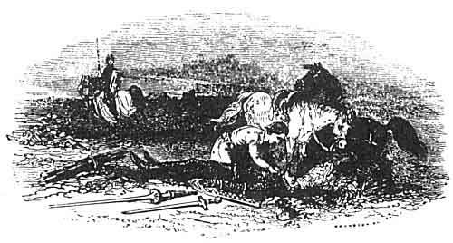

  
[Intangible Textual Heritage](../../../index)  [Legends and
Sagas](../../index)  [Celtic](../index)  [Index](index) 
[Previous](mab11)  [Next](mab13) 

------------------------------------------------------------------------

[Buy this Book at
Amazon.com](https://www.amazon.com/exec/obidos/ASIN/B001W0Z8PY/internetsacredte)

------------------------------------------------------------------------

  
*The Mabinogion*, tr. by Lady Charlotte Guest, \[1877\], at Intangible
Textual Heritage

------------------------------------------------------------------------

p. 136

### NOTICE OF VARIOUS OTHER VERSIONS.

THE story of Peredur exists in the French language in two different
forms: one of these is a Metrical Romance, by Chrestien de Troyes,
entitled "Perceval le Galois," of which several MSS. are deposited in
the Bibliothèque du Roi; the other is a Prose Composition, and has
appeared in print. This last is of small folio size, bearing the date of
Paris, March 20, 1529. Copies of it are extremely rare.

Of the English Metrical Romance of Perceval, only one ancient copy is
known to be extant. It is contained in a very curious folio MS. on
paper, belonging to the library of Lincoln Cathedral, and which from the
name of its transcriber, Robert de Thornton, a monk who lived in the
15th century, is commonly known by the name of the Thornton MS. Sir
Frederick Madden, in his Introduction to the Romance of Sir Gawaine,
gives a particular description of the MS. and its contents.

I possess a transcript of it, which, by the kind permission of the
Chapter, I made in 1840.

Amongst the various Romances of the Round Table none appears to have
enjoyed a larger share of popularity in Germany than that of Perceval.
It is the subject of a poem written by Wolfram von Eschenbach, about the
year 1200, which he professedly derived from a French original totally
distinct from that of Chrestien. The author's name is given as Kyot, or
Guyot, of Provence; apparently a different person from Guyot of Provins,
whose satirical poem, written at the same period, is well known in old
French literature. Kyot seems to have been acquainted with the wild
fictions of the Arabic story-tellers in Spain, and to have blended them
in his own work with the Welsh legends which, either in Latin or French
form, had already made their way to Southern France, and were eagerly
listened to at the court of Anjou.

Numerous MS. copies of Wolfram's poem are in existence, and a printed
edition, now of extreme rarity, appeared as early as the

p. 137

end of the 15th century. It is also comprised in Myller's Selection of
Ancient Poems, and in Karl Lachmann's edition of Wolfram von
Eschenbach's Works. Berlin, 1833. 8vo. Mr. Albert Schulz (San Marte) has
published a modern German translation of it. Magdeburg, 1836. 8vo.

The Romance of Peredur is found in Icelandic under the title of the Saga
of Perceval, of which there are copies in the British Museum and in the
Royal Library at Stockholm.

 

 

------------------------------------------------------------------------

[Next: Geraint the Son of Erbin](mab13)
