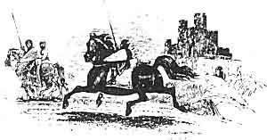

  
[Intangible Textual Heritage](../../../index.md)  [Legends and
Sagas](../../index)  [Celtic](../index)  [Index](index.md) 
[Previous](mab14)  [Next](mab16.md) 

------------------------------------------------------------------------

[Buy this Book at
Amazon.com](https://www.amazon.com/exec/obidos/ASIN/B001W0Z8PY/internetsacredte.md)

------------------------------------------------------------------------

  
*The Mabinogion*, tr. by Lady Charlotte Guest, \[1877\], at Intangible
Textual Heritage

------------------------------------------------------------------------

p. 214

### NOTICE OF VARIOUS OTHER VERSIONS.

IT is to Chrestien de Troyes, the author of the "Chevalier au Lyon" and
"Perceval le Galois," that we are also indebted for the French metrical
version of Geraint ab Erbin, entitled "Erec et Enide." Several copies of
his Romance are preserved in the Bibliothèque Nationale.

In like manner, we find that the German version of the Tale, under the
title of Erec and Enite, is the production of Hartmann von der Aue, to
whom the poem of "Iwein" is to be attributed.

Hartmann's "Erec" was edited in 1839 by Herr Moriz Haupt, from a MS. in
the Imperial Ambraser Collection at Vienna.

The Royal Library at Stockholm possesses an Icelandic composition,
called "Erik Saga," on the subject of this Tale.

In our own language I know of no other version of the Mabinogi of
Geraint except that so beautifully rendered by Mr. Tennyson in his Idyll
of Enid.

 

 

------------------------------------------------------------------------

[Next: Kilhwch and Olwen](mab16.md)
