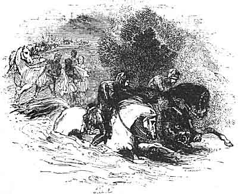

  
[Intangible Textual Heritage](../../../index)  [Legends and
Sagas](../../index)  [Celtic](../index)  [Index](index) 
[Previous](mab15)  [Next](mab17) 

------------------------------------------------------------------------

[Buy this Book at
Amazon.com](https://www.amazon.com/exec/obidos/ASIN/B001W0Z8PY/internetsacredte)

------------------------------------------------------------------------

  
*The Mabinogion*, tr. by Lady Charlotte Guest, \[1877\], at Intangible
Textual Heritage

------------------------------------------------------------------------

p. 217

 

# KILHWCH AND OLWEN [217a](mab17.htm#xref_217a)

###### OR THE

### TWRCH TRWYTH

KILYDD the son of Prince Kelyddon desired a wife as a helpmate, and the
wife that he chose was Goleuddydd, the daughter of Prince
Anlawdd [217b](mab17.htm#xref_217b). And after their union, the people
put up prayers that they might have an heir. And they had a son through
the prayers of the people. From the time of her pregnancy Goleuddydd
became wild, and wandered about, without habitation; but when her
delivery was at hand, her reason came back to her. Then she went to a
mountain where there was a swineherd, keeping a herd of swine. And
through fear of the swine the queen was delivered. And the swineherd
took the boy, and brought him to the palace; and he was christened, and
they called him Kilhwch, because he had been found in a swine's burrow.
Nevertheless the boy was of gentle lineage, and cousin unto Arthur; and
they put him out to nurse.

p. 218

After this the boy's mother, Goleuddydd, the daughter of Prince Anlawdd,
fell sick. Then she called her husband unto her, and said to him, "Of
this sickness I shall die, and thou wilt take another wife. Now wives
are the gift of the Lord, but it would be wrong for thee to harm thy
son. Therefore I charge thee that thou take not a wife until thou see a
briar with two blossoms upon my grave." And this he promised her. Then
she besought him to dress her grave every year, that nothing might grow
thereon. So the queen died. Now the king sent an attendant every morning
to see if anything were growing upon the grave. And at the end of the
seventh year the master neglected that which he had promised to the
queen.

One day the king went to hunt, and he rode to the place of burial to see
the grave, and to know if it were time that he should take a wife; and
the king saw the briar. And when he saw it, the king took counsel where
he should find a wife. Said one of his counsellors, "I know a wife that
will suit thee well, and she is the wife of King
Doged [218a](mab17.htm#xref_218a)." And they resolved to go to seek her;
and they slew the king, and brought away his wife and one daughter that
she had along with her. And they conquered the king's lands.

On a certain day, as the lady walked abroad, she came to the house of an
old crone that dwelt in the town, and that had no tooth in her head. And
the queen said to her, "Old woman, tell me that which I shall ask thee,
for the love of Heaven. Where are the children of the man who has
carried me away by violence?" Said the crone, "He has not children."
Said the queen, "Woe is me, that I should have come to one who is
childless!" Then said the hag, "Thou needest not lament on account of
that, for there is a prediction he shall have an heir by thee, and by
none other. Moreover, be not sorrowful, for he has one son."

The lady returned home with joy; and she asked her consort, "Wherefore
hast thou concealed thy children from me?" The king said, "I will do so
no longer." And he sent messengers for his son, and he was brought to
the Court. His

p. 219

stepmother said unto him, "It were well for thee to have a wife, and I
have a daughter who is sought of every man of renown in the world." "I
am not yet of an age to wed," answered the youth. Then said she unto
him, "I declare to thee, that it is thy destiny not to be suited with a
wife until thou obtain Olwen [219a](mab17.htm#xref_219a), the daughter
of Yspaddaden Penkawr." And the youth blushed, and the love of the
maiden diffused itself through all his frame, although he had never seen
her. And his father inquired of him, "What has come over thee, my son,
and what aileth thee?" "My stepmother has declared to me that I shall
never have a wife until I obtain Olwen, the daughter of Yspaddaden
Penkawr." "That will be easy for thee," answered his father. "Arthur is
thy cousin. Go, therefore, unto Arthur, to cut thy
hair [219b](mab17.htm#xref_219b), and ask this of him as a boon."

And the youth pricked forth upon a steed with head dappled grey, of four
winters old, firm of limb, with shell-formed hoofs, having a bridle of
linked gold on his head, and upon him a saddle of costly gold. And in
the youth's hand were two spears of silver, sharp, well-tempered, headed
with steel, three ells in length, of an edge to wound the wind, and
cause blood to flow, and swifter than the fall of the dewdrop from the
blade of reed-grass upon the earth when the dew of June is at the
heaviest. A gold-hilted sword was upon his thigh, the blade of which was
of gold, bearing a cross of inlaid gold of the hue of the lightning of
heaven: his war-horn was of ivory. Before him were two brindled
white-breasted greyhounds, having strong collars of rubies about their
necks, reaching from the shoulder to the ear. And the one that was on
the left side bounded across to the right side, and the one on the right
to the left, and like two sea-swallows sported around him. And his
courser cast up four sods with his four hoofs, like four swallows in the
air, about his head, now above, now below. About him was a four-cornered
cloth of purple, and an apple of gold was at each corner, and every one
of the apples was of the value of an hundred
kine [219c](mab17.htm#xref_219c). And there was precious gold of the
value of three hundred kine upon his

p. 220

shoes, and upon his stirrups, from his knee to the tip of his toe. And
the blade of grass bent not beneath him, so light was his courser's
tread as he journeyed towards the gate of Arthur's Palace.

Spoke the youth, "Is there a porter?" "There is; and if thou holdest not
thy peace, small will be thy welcome. I am Arthur's porter every first
day of January. And during every other part of the year but this, the
office is filled by Huandaw, and Gogigwc, and Llaeskenym, and
Pennpingyon, who goes upon his head to save his feet, neither towards
the sky nor towards the earth, but like a rolling stone upon the floor
of the court." "Open the portal." "I will not open it." "Wherefore not?"
"The knife is in the meat, and the drink is in the horn, and there is
revelry in Arthur's Hall, and none may enter therein but the son of a
king of a privileged country, or a craftsman bringing his craft. But
there will be refreshment for thy dogs, and for thy horses; and for thee
there will be collops cooked and peppered, and luscious wine and
mirthful songs, and food for fifty men shall be brought unto thee in the
guest chamber, where the stranger and the sons of other countries eat,
who come not unto the precincts of the Palace of Arthur. Thou wilt fare
no worse there than thou wouldest with Arthur in the Court. A lady shall
smooth thy couch, and shall lull thee with songs; and early to-morrow
morning, when the gate is open for the multitude that come hither
to-day, for thee shall it be opened first, and thou mayest sit in the
place that thou shalt choose in Arthur's Hall, from the upper end to the
lower." Said the youth, "That will I not do. If thou openest the gate,
it is well. If thou dost not open it, I will bring disgrace upon thy
Lord, and evil report upon thee. And I will set up three shouts at this
very gate, than which none were ever more deadly, from the top of
Pengwaed in Cornwall [220a](mab17.htm#xref_220a) to the bottom of
Dinsol, in the North, and to Esgair Oervel, in Ireland. And all the
women in this Palace that are pregnant shall lose their offspring; and
such as are not pregnant, their hearts shall be turned by

p. 221

illness, so that they shall never bear children from this day forward."
"What clamour soever thou mayest make," said Glewlwyd Gavaelvawr,
"against the laws of Arthur's Palace shalt thou not enter therein, until
I first go and speak with Arthur."

Then Glewlwyd went into the Hall. And Arthur said to him, "Hast thou
news from the gate?"--"Half of my life is past, and half of thine. I was
heretofore in Kaer Se and Asse, in Sach and Salach, in Lotor and Fotor;
and I have been heretofore in India the Great and India the Lesser; and
I was in the battle of Dau Ynyr, when the twelve hostages were brought
from Llychlyn. And I have also been in Europe, and in Africa, and in the
islands of Corsica, and in Caer Brythwch, and Brythach, and Verthach;
and I was present when formerly thou didst slay the family of Clis the
son of Merin, and when thou didst slay Mil Du the son of Ducum, and when
thou didst conquer Greece in the East. And I have been in Caer Oeth and
Annoeth, and in Caer Nevenhyr; nine supreme sovereigns, handsome men,
saw we there, but never did I behold a man of equal dignity with him who
is now at the door of the portal." Then said Arthur, "If walking thou
didst enter in here, return thou running. And every one that beholds the
light, and every one that opens and shuts the eye, let them shew him
respect, and serve him, some with gold-mounted drinking-horns, others
with collops cooked and peppered, until food and drink can be prepared
for him. It is unbecoming to keep such a man as thou sayest he is, in
the wind and the rain." Said Kai, "By the hand of my friend, if thou
wouldest follow my counsel, thou wouldest not break through the laws of
the Court because of him." "Not so, blessed Kai. It is an honour to us
to be resorted to, and the greater our courtesy the greater will be our
renown, and our fame, and our glory."

And Glewlwyd came to the gate, and opened the gate before him; and
although all dismounted upon the horseblock at the gate, yet did he not
dismount, but rode in

p. 222

upon his charger. Then said Kilhwch, "Greeting be unto thee, Sovereign
Ruler of this Island; and be this greeting no less unto the lowest than
unto the highest, and be it equally unto thy guests, and thy warriors,
and thy chieftains--let all partake of it as completely as thyself. And
complete be thy favour, and thy fame, and thy glory, throughout all this
Island." "Greeting unto thee also," said Arthur; "sit thou between two
of my warriors, and thou shalt have minstrels before thee, and thou
shalt enjoy the privileges of a king born to a throne, as long as thou
remainest here. And when I dispense my presents to the visitors and
strangers in this Court, they shall be in thy hand at my commencing."
Said the youth, "I came not here to consume meat and drink; but if I
obtain the boon that I seek, I will requite it thee, and extol thee; and
if I have it not, I will bear forth thy dispraise to the four quarters
of the world, as far as thy renown has extended." Then said Arthur,
"Since thou wilt not remain here, chieftain, thou shalt receive the boon
whatsoever thy tongue may name, as far as the wind dries, and the rain
moistens, and the sun revolves, and the sea encircles, and the earth
extends; save only my ship; and my mantle [222a](mab17.htm#xref_222a);
and Caledvwlch, my sword; and Rhongomyant, my lance; and
Wynebgwrthucher, my shield; and Carnwenhau, my dagger; and Gwenhwyvar,
my wife. By the truth of Heaven, thou shalt have it cheerfully, name
what thou wilt." "I would that thou bless my hair." "That shall be
granted thee."

And Arthur took a golden comb, and scissors, whereof the loops were of
silver, and he combed his hair. And Arthur inquired of him who he was.
"For my heart warms unto thee, and I know that thou art come of my
blood. Tell me, therefore, who thou art." "I will tell thee," said the
youth. "I am Kilhwch, the son of Kilydd, the son of Prince Kelyddon, by
Goleuddydd, my mother, the daughter of Prince Anlawdd." "That is true,"
said Arthur; "thou art my cousin. Whatsoever boon thou mayest ask, thou
shalt receive, be it what it may that thy tongue shall name."

p. 223

\[paragraph continues\] "Pledge the truth
of Heaven and the faith of thy kingdom thereof." "I pledge it thee,
gladly." "I crave of thee then, that thou obtain for me Olwen, the
daughter of Yspaddaden Penkawr; and this boon I likewise seek at the
hands of thy warriors. I seek it from Kai, and Bedwyr, and Greidawl
Galldonyd [223a](mab17.htm#xref_223a), and Gwythyr the son of
Greidawl [223b](mab17.htm#xref_223b), and Greid the son of Eri, and
Kynddelig Kyvarwydd, and Tathal Twyll Goleu, and Maelwys the son of
Baeddan, and Crychwr the son of Nes, and Cubert the son of Daere, and
Percos the son of Poch, and Lluber Beuthach, and Corvil Bervach, and
Gwynn the son of Nudd [223c](mab17.htm#xref_223c), and Edeyrn the son of
Nudd [223d](mab17.htm#xref_223d), and Gadwy the son of
Geraint [223e](mab17.htm#xref_223e), and Prince Fflewddur
Fflam [223f](mab17.htm#xref_223f), and Ruawn
Pebyr [223g](mab17.htm#xref_223g) the son of Dorath, and Bradwen the son
of Moren Mynawc, and Moren Mynawc himself, and Dalldav the son of Kimin
Côv [223h](mab17.htm#xref_223h), and the son of Alun Dyved, and the son
of Saidi, and the son of Gwryon, and Uchtryd Ardywad Kad, and Kynwas
Curvagyl, and Gwrhyr Gwarthegvras, and Isperyr
Ewingath [223i](mab17.htm#xref_223i), and Gallcoyt Govynynat, and Duach,
and Grathach, and Nerthach, the sons of Gwawrddur Kyrvach (these men
came forth from the confines of hell), and Kilydd Canhastyr, and
Canastyr Kanllaw, and Cors Cant-Ewin, and Esgeir Gulhwch Govynkawn, and
Drustwrn Hayarn, and Glewlwyd Gavaelvawr, and Lloch
Llawwynnyawc [223j](mab17.htm#xref_223j), and Aunwas
Adeiniawc [223k](mab17.htm#xref_223k), and Sinnoch the son of Seithved,
and Gwennwynwyn the son of Naw [223l](mab17.htm#xref_223l), and Bedyw
the son of Seithved, and Gobrwy the son of Echel Vorddwyttwll, and Echel
Vorddwyttwll [223m](mab17.htm#xref_223m) himself, and Mael the son of
Roycol, and Dadweir Dallpenn [223n](mab17.htm#xref_223n), and Garwyli
the son of Gwythawc Gwyr, and Gwythawc Gwyr himself, and Gormant the son
of Ricca, and Menw the son of Teirgwaedd [223o](mab17.htm#xref_223o),
and Digon the son of Alar, and Selyf the son of Smoit, and Gusg the son
of Atheu, and Nerth the son of Kedarn, and Drudwas the son of
Tryffin [223p](mab17.htm#xref_223p), and Twrch the son of Perif, and
Twrch the son of Annwas, and Iona king of France, and Sel the son of
Selgi, and Teregud the son of Iaen, and Sulyen the son of Iaen, and
Bradwen the son of Iaen, and Moren the son of Iaen, and Siawn the son of
Iaen, and Cradawc the son of Iaen.

p. 224

\[paragraph continues\] (They were men of
Caerdathal [224a](mab17.htm#xref_224a), of Arthur's kindred on his
father's side.) Dirmyg the son of Kaw [224b](mab17.htm#xref_224b), and
Justic the son of Kaw, and Etmic the son of Kaw, and Anghawd the son of
Kaw, and Ovan the son of Kaw, and Kelin the son of Kaw, and Connyn the
son of Kaw, and Mabsant the son of Kaw, and Gwyngad the son of Kaw, and
Llwybyr the son of Kaw, and Coth the son of Kaw, and Meilic the son of
Kaw, and Kynwas the son of Kaw, and Ardwyad the son of Kaw, and Ergyryad
the son of Kaw, and Neb the son of Kaw, and Gilda the son of Kaw, and
Calcas the son of Kaw, and Hueil the son of Kaw (he never yet made a
request at the hand of any Lord). And Samson Vinsych, and Taliesin the
chief of the bards [224c](mab17.htm#xref_224c), and Manawyddan the son
of Llyr [224d](mab17.htm#xref_224d), and Llary the son of Prince Kasnar,
and Ysperni the son of Fflergant king of Armorica, and Saranhon, the son
of Glythwyr, and Llawr Eilerw, and Annyanniawc the son of Menw the son
of Teirgwaedd, and Gwynn the son of Nwyvre, and Fflam the son of Nwyvre,
and Geraint the son of Erbin [224e](mab17.htm#xref_224e), and Ermid the
son of Erbin, and Dyvel the son of Erbin [224f](mab17.htm#xref_224f),
and Gwynn the son of Ermid, and Kyndrwyn the son of Ermid, and Hyveidd
Unllenn, and Eiddon Vawr Vrydic, and Reidwn Arwy, and Gormant the son of
Ricca (Arthur's brother by his mother's side; the Penhynev of Cornwall
was his father), and Llawnrodded Varvawc [224g](mab17.htm#xref_224g),
and Nodawl Varyf Twrch, and Berth the son of Kado, and Rheidwn the son
of Beli, and Iscovan Hael, and Iscawin the son of Panon, and Morvran the
son of Tegid [224h](mab17.htm#xref_224h) (no one struck him in the
battle of Camlan by reason of his ugliness; all thought he was an
auxiliary devil. Hair had he upon him like the hair of a stag). And
Sandde Bryd Angel (no one touched him with a spear in the battle of
Camlan because of his beauty; all thought he was a ministering angel).
And Kynwyl Sant (the third man that escaped from the battle of Camlan,
and he was the last who parted from Arthur on Hengroen his horse). And
Uchtryd the son of Erim, and Eus the son of Erim, and Henwas Adeinawg
the son of Erim, and Henbedestyr the son of Erim, and Sgilti Yscawndroed
the son of Erim. (Unto these three men belonged these three qualities,--

p. 225

\[paragraph continues\] With Henbedestyr
there was not any one who could keep pace, either on horseback or on
foot; with Henwas Adeinawg, no four-footed beast could run the distance
of an acre, much less could it go beyond it; and as to Sgilti
Yscawndroed, when he intended to go upon a message for his Lord, he
never sought to find a path, but knowing whither he was to go, if his
way lay through a wood he went along the tops of the trees. During his
whole life, a blade of reed grass bent not beneath his feet, much less
did one ever break, so lightly did he tread.) Teithi Hên the son of
Gwynhan (his dominions were swallowed up by the sea, and he himself
hardly escaped, and he came to Arthur; and his knife had this
peculiarity, that from the time that he came there no haft would ever
remain upon it, and owing to this a sickness came over him, and he pined
away during the remainder of his life, and of this he died). And
Carneddyr the son of Govynyon Hên, and Gwenwynwyn the son of Nav
Gyssevin, Arthur's champion, and Llysgadrudd Emys, and Gwrbothu Hên
(uncles unto Arthur were they, his mother's brothers). Kulvanawyd the
son of Goryon, and Llenlleawg Wyddel [225a](mab17.htm#xref_225a) from
the headland of Ganion, and Dyvynwal Moel [225b](mab17.htm#xref_225b),
and Dunard king of the North, Teirnon Twryf Bliant, and Tegvan Gloff,
and Tegyr Talgellawg, Gwrdinal the son of Ebrei, and Morgant Hael,
Gwystyl the son of Rhun the son of Nwython [225c](mab17.htm#xref_225c),
and Llwyddeu the son of Nwython, and Gwydre the son of Llwyddeu
(Gwenabwy the daughter of \[Kaw\] was his mother, Hueil his uncle
stabbed him, and hatred was between Hueil and Arthur because of the
wound). Drem the son of Dremidyd [225d](mab17.htm#xref_225d) (when the
gnat arose in the morning with the sun, he could see it from Gelli
Wic [225e](mab17.htm#xref_225e) in Cornwall, as far off as Pen Blathaon
in North Britain [225f](mab17.htm#xref_225f)). And Eidyol the son of
Ner, and Glwyddyn Saer (who constructed Ehangwen, Arthur's Hall). Kynyr
Keinvarvawc (when he was told he had a son born he said to his wife,
'Damsel, if thy son be mine, his heart will be always cold, and there
will be no warmth in his hands; and he will have another peculiarity,

p. 226

if he is my son he will always be stubborn; and he will have another
peculiarity, when he carries a burden, whether it be large or small, no
one will be able to see it, either before him or at his back; and he
will have another peculiarity, no one will be able to resist fire and
water so well as he will; and he will have another peculiarity, there
will never be a servant or an officer equal to him'). Henwas, and
Henwyneb (an old companion to Arthur). Gwallgoyc (another; when he came
to a town, though there were three hundred houses in it, if he wanted
anything, he would not let sleep come to the eyes of any one whilst he
remained there). Berwyn the son of Gerenhir, and Paris king of France,
and Osla Gyllellvawr (who bore a short broad dagger. When Arthur and his
hosts came before a torrent, they would seek for a narrow place where
they might pass the water, and would lay the sheathed dagger across the
torrent, and it would form a bridge sufficient for the armies of the
three Islands of Britain, and of the three islands
adjacent [226a](mab17.htm#xref_226a), with their spoil). Gwyddawg the
son of Menestyr (who slew Kai, and whom Arthur slew, together with his
brothers, to revenge Kai). Garanwyn the son of Kai, and Amren the son of
Bedwyr, and Ely Amyr, and Rheu Rhwyd Dyrys, and Rhun Rhudwern, and Eli,
and Trachmyr (Arthur's chief huntsmen). And Llwyddeu the son of Kelcoed,
and Hunabwy the son of Gwryon, and Gwynn
Godyvron [226b](mab17.htm#xref_226b), and Gweir Datharwenniddawg, and
Gweir the son of Cadell the son of Talaryant, and Gweir Gwrhyd Ennwir,
and Gweir Paladyr Hir (the uncles of Arthur, the brothers of his
mother). The sons of Llwch Llawwynnyawg (from beyond the raging sea).
Llenlleawg Wyddel, and Ardderchawg Prydain. Cas the son of Saidi, Gwrvan
Gwallt Avwyn, and Gwyllennhin the king of France, and Gwittart the son
of Oedd king of Ireland, Garselit Wyddel [226c](mab17.htm#xref_226c),
Panawr Pen Bagad, and Ffleudor the son of Nav, Gwynnhyvar mayor of
Cornwall and Devon (the ninth man that rallied the battle of
Camlan [226d](mab17.htm#xref_226d)). Keli and Kueli, and Gilla Coes Hydd
(he would clear three hundred acres at one bound: the chief leaper of
Ireland was he). Sol, and Gwadyn Ossol, and Gwadyn Odyeith. (Sol could
stand all day upon one foot.

p. 227

\[paragraph continues\] Gwadyn Ossol, if
he stood upon the top of the highest mountain in the world, it would
become a level plain under his feet. Gwadyn Odyeith, the soles of his
feet emitted sparks of fire when they struck upon things hard, like the
heated mass when drawn out of the forge. He cleared the way for Arthur
when he came to any stoppage.) Hirerwm and Hiratrwm. (The day they went
on a visit three Cantrevs provided for their entertainment, and they
feasted until noon and drank until night, when they went to sleep. And
then they devoured the heads of the vermin through hunger, as if they
had never eaten anything. When they made a visit they left neither the
fat nor the lean, neither the hot nor the cold, the sour nor the sweet,
the fresh nor the salt, the boiled nor the raw.) Huarwar the son of
Aflawn (who asked Arthur such a boon as would satisfy him. It was the
third great plague of Cornwall when he received it. None could get a
smile from him but when he was satisfied). Gware Gwallt
Euryn [227a](mab17.htm#xref_227a). The two cubs of Gast Rhymi, Gwyddrud
and Gwyddneu Astrus. Sugyn the son of Sugnedydd (who would suck up the
sea on which were three hundred ships so as to leave nothing but a dry
strand. He was broad-chested). Rhacymwri, the attendant of Arthur
(whatever barn he was shown, were there the produce of thirty ploughs
within it, he would strike it with an iron flail until the rafters, the
beams, and the boards were no better than the small oats in the mow upon
the floor of the barn). Dygyflwng and Anoeth Veidawg. And Hir Eiddyl,
and Hir Amreu (they were two attendants of Arthur). And Gwevyl the son
of Gwestad (on the day that he was sad, he would let one of his lips
drop below his waist, while he turned up the other like a cap upon his
head). Uchtryd Varyf Draws (who spread his red untrimmed beard over the
eight-and-forty rafters which were in Arthur's Hall). Elidyr Gyvarwydd.
Yskyrdav and Yscudydd (two attendants of Gwenhwyvar were they. Their
feet were swift as their thoughts when bearing a message). Brys the son
of Bryssethach (from the Hill of the Black Fernbrake

p. 228

in North Britain). And Grudlwyn Gorr. Bwlch, and Kyfwlch, and Sefwlch,
the sons of Cleddyf Kyfwlch, the grandsons of Cleddyf Difwlch. (Their
three shields were three gleaming glitterers; their three spears were
three pointed piercers; their three swords were three grinding gashers;
Glas, Glessic, and Gleisad. Their three dogs, Call, Cuall, and Cavall.
Their three horses, Hwyrdyddwd, and Drwgdyddwd, and Llwyrdyddwg. Their
three wives, Och, and Garym, and Diaspad. Their three grandchildren,
Lluched, and Neved, and Eissiwed. Their three daughters, Drwg, and
Gwaeth, and Gwaethav Oll. Their three hand-maids, Eheubryd the daughter
of Kyfwlch, Gorascwrn the daughter of Nerth, Ewaedan the daughter of
Kynvelyn Keudawd Pwyll the half-man [228a](mab17.htm#xref_228a).) Dwnn
Diessic Unbenn, Eiladyr the son of Pen Llarcau, Kynedyr Wyllt the son of
Hettwn Talaryant, Sawyl Ben Uchel [228b](mab17.htm#xref_228b), Gwalchmai
the son of Gwyar, Gwalhaved the son of Gwyar, Gwrhyr Gwastawd
Ieithoedd [228c](mab17.htm#xref_228c) (to whom all tongues were known),
and Kethcrwm the Priest. Clust the son of Clustveinad (though he were
buried seven cubits beneath the earth, he would hear the ant fifty miles
off rise from her nest in the morning). Medyr the son of Methredydd
(from Gelli Wic he could, in a twinkling, shoot the wren through the two
legs upon Esgeir Oervel in Ireland). Gwiawn Llygad Cath (who could cut a
haw from the eye of the gnat without hurting him). Ol the son of Olwydd
(seven years before he was born his father's swine were carried off, and
when he grew up a man he tracked the swine, and brought them back in
seven herds). Bedwini the Bishop [228d](mab17.htm#xref_228d) (who
blessed Arthur's meat and drink). For the sake of the golden-chained
daughters of this island. For the sake of Gwenhwyvar its chief lady, and
Gwennhwyach her sister, and Rathtyeu the only daughter of Clemenhill,
and Rhelemon the daughter of Kai, and Tannwen the daughter of Gweir
Datharwenîddawg. Gwenn Alarch the daughter of Kynwyl Canbwch. Eurneid
the daughter of Clydno Eiddin. Eneuawc the daughter of Bedwyr. Enrydreg
the daughter of Tudvathar. Gwennwledyr the daughter of Gwaledyr Kyrvach.
Erddudnid the daughter

p. 229

of Tryffin. Eurolwen the daughter of Gwdolwyn Gorr. Teleri the daughter
of Peul. Indeg [229a](mab17.htm#xref_229a) the daughter of Garwy Hir.
Morvudd the daughter of Urien Rheged. Gwenllian Deg the majestic maiden.
Creiddylad the daughter of Lludd Llaw Ereint. (She was the most splendid
maiden in the three Islands of the mighty, and in the three Islands
adjacent, and for her Gwythyr the son of Greidawl and Gwynn the son of
Nudd fight every first of May until the day of doom.) Ellylw the
daughter of Neol Kynn-Crog (she lived three ages). Essyllt Vinwen and
Essyllt Vingul." And all these did Kilhwch the son of Kilydd adjure to
obtain his boon.

Then said Arthur, "Oh! chieftain, I have never heard of the maiden of
whom thou speakest, nor of her kindred, but I will gladly send
messengers in search of her. Give me time to seek her." And the youth
said, "I will willingly grant from this night to that at the end of the
year to do so." Then Arthur sent messengers to every land within his
dominions to seek for the maiden; and at the end of the year Arthur's
messengers returned without having gained any knowledge or intelligence
concerning Olwen more than on the first day. Then said Kilhwch, "Every
one has received his boon, and I yet lack mine. I will depart and bear
away thy honour with me." Then said Kai, "Rash chieftain! dost thou
reproach Arthur? Go with us, and we will not part until thou dost either
confess that the maiden exists not in the world, or until we obtain
her." Thereupon Kai rose up. Kai had this peculiarity, that his breath
lasted nine nights and nine days under water, and he could exist nine
nights and nine days without sleep. A wound from Kai's sword no
physician could heal. Very subtle was Kai. When it pleased him he could
render himself as tall as the highest tree in the forest. And he had
another peculiarity,--so great was the heat of his nature, that, when it
rained hardest, whatever he carried remained dry for a handbreadth above
and a handbreadth below his hand; and when his companions were coldest,
it was to them as fuel with which to light their fire.

p. 230

And Arthur called Bedwyr, who never shrank from any enterprise upon
which Kai was bound. None was equal to him in swiftness throughout this
island except Arthur and Drych Ail Kibddar [230a](mab17.htm#xref_230a).
And although he was one-handed, three warriors could not shed blood
faster than he on the field of battle. Another property he had; his
lance would produce a wound equal to those of nine opposing lances.

And Arthur called to Kynddelig the Guide, "Go thou upon this expedition
with the chieftain." For as good a guide was he in a land which he had
never seen as he was in his own.

He called Gwrhyr Gwalstawt Ieithoedd, because he knew all tongues.

He called Gwalchmai the son of Gwyar, because he never returned home
without achieving the adventure of which he went in quest. He was the
best of footmen and the best of knights. He was nephew to Arthur, the
son of his sister, and his cousin.

And Arthur called Menw the son of Teirgwaedd, in order that if they went
into a savage country, he might cast a charm and an illusion over them,
so that none might see them whilst they could see every one.

They journeyed until they came to a vast open plain, wherein they saw a
great castle, which was the fairest of the castles of the world. And
they journeyed that day until the evening, and when they thought they
were nigh to the castle, they were no nearer to it than they had been in
the morning. And the second and the third day they journeyed, and even
then scarcely could they reach so far. And when they came before the
castle, they beheld a vast flock of sheep, which was boundless and
without an end. And upon the top of a mound there was a herdsman,
keeping the sheep. And a rug made of skins was upon him; and by his side
was a shaggy mastiff, larger than a steed nine winters old. Never had he
lost even a lamb from his flock, much less a large sheep. He let no
occasion ever pass without doing some hurt and harm. All the dead trees
and bushes in the plain he burnt with his breath down to the very
ground.

Then said Kai, "Gwrhyr Gwalstawt Ieithoedd, go thou and salute yonder
man." "Kai," said he, "I engaged not to go further than thou thyself."
"Let us go then together," answered Kai. Said Menw the son of
Teirgwaedd, "Fear not to go thither, for I will cast a spell upon the
dog, so that he shall injure no one." And they went up to the mound
whereon the herdsman was, and they said to him, "How dost thou fare, O
herdsman?" "No less fair be it to you than to me." "Truly, art thou the
chief?" "There is no hurt to injure me but my own." [1](#fn_95) "Whose are the sheep that thou dost keep,
and to whom does yonder castle belong?" "Stupid are ye, truly! Through
the whole world is it known that this is the castle of Yspaddaden
Penkawr." "And who art thou?" "I am called Custennin the son of
Dyfnedig, and my brother Yspaddaden Penkawr oppressed me because of my
possessions. And ye also, who are ye?" "We are an embassy from Arthur,
come to seek Olwen the daughter of Yspaddaden Penkawr." "Oh men! the
mercy of Heaven be upon you, do not that for all the world. None who
ever came hither on this quest has returned alive." And the herdsman
rose up. And as he arose, Kilhwch gave unto him a ring of gold. And he
sought to put on the ring, but it was too small for him, so he placed it
in the finger of his glove. And he went home, and gave the glove to his
spouse to keep. And she took the ring from the glove when it was given
her, and she said, "Whence came this ring, for thou art not wont to have
good fortune?" "I went," said he, "to the sea to seek for fish, and lo,
I saw a corpse borne by the waves. And a fairer corpse than it did I
never behold. And from its finger did I take this ring." "O man! does
the sea permit its dead to wear jewels? Show me then this body." "Oh
wife, him to whom this ring belonged thou shalt see here in the
evening."

p. 232

\[paragraph continues\] "And who is he?"
asked the woman, "Kilhwch the son of Kilydd, the son of Prince Kelyddon,
by Goleuddydd the daughter of Prince Anlawdd, his mother, who is come to
seek Olwen as his wife." And when she heard that, her feelings were
divided between the joy that she had that her nephew, the son of her
sister, was coming to her, and sorrow because she had never known any
one depart alive who had come on that quest.

And they went forward to the gate of Custennin the herdsman's dwelling.
And when she heard their footsteps approaching, she ran out with joy to
meet them. And Kai snatched a billet out of the pile. And when she met
them she sought to throw her arms about their necks. And Kai placed the
log between her two hands, and she squeezed it so that it became a
twisted coil. "Oh woman," said Kai, "if thou hadst squeezed me thus,
none could ever again have set their affections on me. Evil love were
this." They entered into the house, and were served; and soon after they
all went forth to amuse themselves. Then the woman opened a stone chest
that was before the chimney-corner, and out of it arose a youth with
yellow curling hair. Said Gwrhyr, "It is a pity to hide this youth. I
know that it is not his own crime that is thus visited upon him." "This
is but a remnant," said the woman. "Three-and-twenty of my sons has
Yspaddaden Penkawr slain, and I have no more hope of this one than of
the others." Then said Kai, "Let him come and be a companion with me,
and he shall not be slain unless I also am slain with him." And they
ate. And the woman asked them, "Upon what errand come you here?" "We
come to seek Olwen for this youth." Then said the woman, "In the name of
Heaven, since no one from the castle hath yet seen you, return again
whence you came." "Heaven is our witness, that we will not return until
we have seen the maiden." Said Kai, "Does she ever come hither, so that
she may be seen?" "She comes here every Saturday to wash her head, and
in the vessel where she washes, she leaves all her rings, and she never
either comes

p. 233

herself or sends any messengers to fetch them."

"Will she come here if she is sent to?" "Heaven knows that I will not
destroy my soul, nor will I betray those that trust me; unless you will
pledge me your faith that you will not harm her, I will not send to
her." "We pledge it," said they. So a message was sent, and she came.

The maiden was clothed in a robe of flame-coloured silk, and about her
neck was a collar of ruddy gold, on which were precious emeralds and
rubies. More yellow was her head than the flower of the broom, and her
skin was whiter than the foam of the wave, and fairer were her hands and
her fingers than the blossoms of the wood anemone amidst the spray of
the meadow fountain. The eye of the trained hawk, the glance of the
three-mewed falcon was not brighter than hers. Her bosom was more snowy
than the breast of the white swan, her cheek was redder than the reddest
roses. Whoso beheld her was filled with her love. Four white trefoils
sprung up wherever she trod. And therefore was she called Olwen.

She entered the house, and sat beside Kilhwch upon the foremost bench;
and as soon as he saw her he knew her. And Kilhwch said unto her, "Ah!
maiden, thou art she whom I have loved; come away with me, lest they
speak evil of thee and of me. Many a day have I loved thee." "I cannot
do this, for I have pledged my faith to my father not to go without his
counsel, for his life will last only until the time of my espousals.
Whatever is, must be. But I will give thee advice if thou wilt take it.
Go, ask me of my father, and that which he shall require of thee, grant
it, and thou wilt obtain me; but if thou deny him anything, thou wilt
not obtain me, and it will be well for thee if thou escape with thy
life." "I promise all this, if occasion offer," said he.

She returned to her chamber, and they all rose up and followed her to
the castle. And they slew the nine porters that were at the nine gates
in silence. And they slew the nine watch-dogs without one of them
barking. And they went forward to the hall.

p. 234

"The greeting of Heaven and of man be unto thee, Yspaddaden Penkawr,"
said they. "And you, wherefore come you?" "We come to ask thy daughter
Olwen, for Kilhwch the son of Kilydd, the son of Prince Kelyddon."
"Where are my pages and my servants? Raise up the forks beneath my two
eyebrows which have fallen over my eyes, that I may see the fashion of
my son-in-law." And they did so. "Come hither to-morrow, and you shall
have an answer."

They rose to go forth, and Yspaddaden Penkawr seized one of the three
poisoned darts that lay beside him, and threw it after them. And Bedwyr
caught it, and flung it, and pierced Yspaddaden Penkawr grievously with
it through the knee. Then he said, "A cursed ungentle son-in-law, truly.
I shall ever walk the worse for his rudeness, and shall ever be without
a cure. This poisoned iron pains me like the bite of a gadfly. Cursed be
the smith who forged it, and the anvil whereon it was wrought! So sharp
is it!"

That night also they took up their abode in the house of Custennin the
herdsman. The next day with the dawn they arrayed themselves in haste
and proceeded to the castle, and entered the hall, and they said,
"Yspaddaden Penkawr, give us thy daughter in consideration of her dower
and her maiden fee, which we will pay to thee and to her two kinswomen
likewise. And unless thou wilt do so, thou shalt meet with thy death on
her account." Then he said, "Her four great-grandmothers, and her four
great-grandsires are yet alive, it is needful that I take counsel of
them." "Be it so," answered they, "we will go to meat." As they rose up,
he took the second dart that was beside him, and cast it after them. And
Menw the son of Gwaedd caught it, and flung it back at him, and wounded
him in the centre of the breast, so that it came out at the small of his
back. "A cursed ungentle son-in-law, truly," said he, "the hard iron
pains me like the bite of a horse-leech. Cursed be the hearth whereon it
was heated, and the smith who formed it! So sharp is it! Henceforth,
whenever I go up a hill, I shall have

p. 235

a scant in my breath, and a pain in my chest, and I shall often loathe
my food." And they went to meat.

And the third day they returned to the palace. And Yspaddaden Penkawr
said to them, "Shoot not at me again unless you desire death. Where are
my attendants? Lift up the forks of my eyebrows which have fallen over
my eyeballs, that I may see the fashion of my son-in-law." Then they
arose, and, as they did so, Yspaddaden Penkawr took the third poisoned
dart and cast it at them. And Kilhwch caught it and threw it vigorously,
and wounded him through the eyeball, so that the dart came out at the
back of his head. "A cursed ungentle son-in-law, truly! As long as I
remain alive, my eyesight will be the worse. Whenever I go against the
wind, my eyes will water; and peradventure my head will burn, and I
shall have a giddiness every new moon. Cursed be the fire in which it
was forged. Like the bite of a mad dog is the stroke of this poisoned
iron." And they went to meat.

And the next day they came again to the palace, and they said, "Shoot
not at us any more, unless thou desirest such hurt, and harm, and
torture as thou now hast, and even more." "Give me thy daughter, and if
thou wilt not give her, thou shalt receive thy death because of her."
"Where is he that seeks my daughter? Come hither where I may see thee."
And they placed him a chair face to face with him.

Said Yspaddaden Penkawr, "Is it thou that seekest my daughter?" "It is
I," answered Kilhwch. "I must have thy pledge that thou wilt not do
towards me otherwise than is just, and when I have gotten that which I
shall name, my daughter thou shalt have." "I promise thee that
willingly," said Kilhwch, "name what thou wilt." "I will do so," said
he.

"Seest thou yonder vast hill?" "I see it." "I require that it be rooted
up, and that the grubbings be burned for manure on the face of the land,
and that it be ploughed and sown in one day, and in one day that the
grain ripen. And of that wheat I intend to make food and liquor fit for
the

p. 236

wedding of thee and my daughter. And all this I require done in one
day."

"It will be easy for me to compass this, although thou mayest think that
it will not be easy."

"Though this be easy for thee, there is yet that which will not be so.
No husbandman can till or prepare this land, so wild is it, except
Amaethon the son of Don [236a](mab17.htm#xref_236a), and he will not
come with thee by his own free will, and thou wilt not be able to compel
him."

"It will be easy for me to compass this, although thou mayest think that
it will not be easy."

"Though thou get this, there is yet that which thou wilt not get.
Govannon the son of Don to come to the headland to rid the iron, he will
do no work of his own good will except for a lawful king, and thou wilt
not be able to compel him."

"It will be easy for me to compass this."

"Though thou get this, there is yet that which thou wilt not get; the
two dun oxen of Gwlwlyd [236b](mab17.htm#xref_236b), both yoked
together, to plough the wild land yonder stoutly. He will not give them
of his own free will, and thou wilt not be able to compel him."

"It will be easy for me to compass this."

"Though thou get this, there is yet that which thou wilt not get; the
yellow and the brindled bull yoked together do I require."

"It will be easy for me to compass this."

"Though thou get this, there is yet that which thou wilt not get; the
two horned oxen, one of which is beyond, and the other this side of the
peaked mountain, yoked together in the same plough. And these are
Nynniaw and Peibaw [236c](mab17.htm#xref_236c) whom God turned into oxen
on account of their sins."

"It will be easy for me to compass this."

"Though thou get this, there is yet that which thou wilt not get. Seest
thou yonder red tilled ground?"

"I see it."

"When first I met the mother of this maiden, nine bushels

p. 237

of flax were sown therein, and none has yet sprung up, neither white nor
black; and I have the measure by me still. I require to have the flax to
sow in the new land yonder, that when it grows up it may make a white
wimple for my daughter's head, on the day of thy wedding."

"It will be easy for me to compass this, although thou mayest think that
it will not be easy."

"Though thou get this, there is yet that which thou wilt not get. Honey
that is nine times sweeter than the honey of the virgin swarm, without
scum and bees, do I require to make bragget for the feast."

"It will be easy for me to compass this, although thou mayest think that
it will not be easy."

"The vessel of Llwyr the son of Llwyryon, which is of the utmost value.
There is no other vessel in the world that can hold this drink. Of his
free will thou wilt not get it, and thou canst not compel him."

"It will be easy for me to compass this, although thou mayest think that
it will not be easy."

"Though thou get this, there is yet that which thou wilt not get. The
basket of Gwyddneu Garanhir [237a](mab17.htm#xref_237a), if the whole
world should come together, thrice nine men at a time, the meat that
each of them desired would be found within it. I require to eat
therefrom on the night that my daughter becomes thy bride. He will give
it to no one of his own free will, and thou canst not compel him."

"It will be easy for me to compass this, although thou mayest think that
it will not be easy."

"Though thou get this, there is yet that which thou wilt not get. The
horn of Gwlgawd Gododin to serve us with liquor that night. He will not
give it of his own free will, and thou wilt not be able to compel him."

"It will be easy for me to compass this, although thou mayest think that
it will not be easy."

"Though thou get this, there is yet that which thou wilt not get. The
harp of Teirtu [237b](mab17.htm#xref_237b) to play to us that night.
When a man desires that it should play, it does so of itself, and when
he desires that it should cease, it ceases. And this he will not give of
his own free will, and thou wilt not be able to compel him."

"It will be easy for me to compass this, although thou mayest think that
it will not be easy."

"Though thou get this, there is yet that which thou wilt not get. The
cauldron of Diwrnach Wyddel, the steward of Odgar the son of Aedd, king
of Ireland, to boil the meat for thy marriage feast."

"It will be easy for me to compass this, although thou mayest think that
it will not be easy."

"Though thou get this, there is yet that which thou wilt not get. It is
needful for me to wash my head, and shave my beard, and I require the
tusk of Yskithyrwyn Penbaedd to shave myself withal, neither shall I
profit by its use if it be not plucked alive out of his head."

"It will be easy for me to compass this, although thou mayest think that
it will not be easy."

"Though thou get this, there is yet that which thou wilt not get. There
is no one in the world that can pluck it out of his head except Odgar
the son of Aedd, king of Ireland."

"It will be easy for me to compass this."

"Though thou get this, there is yet that which thou wilt not get. I will
not trust any one to keep the tusk except Gado of North Britain. Now the
threescore Cantrevs of North Britain are under his sway, and of his own
free will he will not come out of his kingdom, and thou wilt not be able
to compel him."

"It will be easy for me to compass this, although thou mayest think that
it will not be easy."

"Though thou get this, there is yet that which thou wilt not get. I must
spread out my hair in order to shave it, and it will never be spread out
unless I have the blood of the jet-black sorceress, the daughter of the
pure white sorceress, from Pen Nant Govid, on the confines of Hell."

"It will be easy for me to compass this, although thou mayest think that
it will not be easy."

p. 239

"Though thou get this, there is yet that which thou wilt not get. I will
not have the blood unless I have it warm, and no vessels will keep warm
the liquid that is put therein except the bottles of Gwyddolwyd Gorr,
which preserve the heat of the liquor that is put into them in the east,
until they arrive at the west. And he will not give them of his own free
will, and thou wilt not be able to compel him."

"It will be easy for me to compass this, although thou mayest think that
it will not be easy."

"Though thou get this, there is yet that which thou wilt not get. Some
will desire fresh milk, and it will not be possible to have fresh milk
for all, unless we have the bottles of Rhinnon Rhin Barnawd, wherein no
liquor ever turns sour. And he will not give them of his own free will,
and thou wilt not be able to compel him."

"It will be easy for me to compass this, although thou mayest think that
it will not be easy."

"Though thou get this, there is yet that which thou wilt not get.
Throughout the world there is not a comb or scissors with which I can
arrange my hair, on account of its rankness, except the comb and
scissors that are between the two ears of Twrch
Trwyth [239a](mab17.htm#xref_239a), the son of Prince Tared. He will not
give them of his own free will, and thou wilt not be able to compel
him."

"It will be easy for me to compass this, although thou mayest think that
it will not be easy."

"Though thou get this, there is yet that which thou wilt not get. It
will not be possible to hunt Twrch Trwyth without Drudwyn the whelp of
Greid, the son of Eri."

"It will be easy for me to compass this, although thou mayest think that
it will not be easy."

"Though thou get this, there is yet that which thou wilt not get.
Throughout the world there is not a leash that can hold him, except the
leash of Cwrs Cant Ewin."

"It will be easy for me to compass this, although thou mayest think that
it will not be easy."

p. 240

"Though thou get this, there is yet that which thou wilt not get.
Throughout the world there is no collar that will hold the leash except
the collar of Canhastyr Canllaw."

"It will be easy for me to compass this, although thou mayest think that
it will not be easy."

"Though thou get this, there is yet that which thou wilt not get. The
chain of Kilydd Canhastyr to fasten the collar to the leash."

"It will be easy for me to compass this, although thou mayest think that
it will not be easy."

"Though thou get this, there is yet that which thou wilt not get.
Throughout the world there is not a huntsman who can hunt with this dog,
except Mabon the son of Modron [240a](mab17.htm#xref_240a). He was taken
from his mother when three nights old, and it is not known where he now
is, nor whether he is living or dead."

"It will be easy for me to compass this, although thou mayest think that
it will not be easy."

"Though thou get this, there is yet that which thou wilt not get. Gwynn
Mygdwn, the horse of Gweddw, that is as swift as the wave, to carry
Mabon the son of Modron to hunt the boar Trwyth. He will not give him of
his own free will, and thou wilt not be able to compel him."

"It will be easy for me to compass this, although thou mayest think that
it will not be easy."

"Though thou get this, there is yet that which thou wilt not get. Thou
wilt not get Mabon, for it is not known where he is, unless thou find
Eidoel, his kinsman in blood, the son of Aer. For it would be useless to
seek for him. He is his cousin."

"It will be easy for me to compass this, although thou mayest think that
it will not be easy."

"Though thou get this, there is yet that which thou wilt not get.
Garselit the Gwyddelian is the chief huntsman of Ireland; the Twrch
Trwyth can never be hunted without him."

"It will be easy for me to compass this, although thou mayest think that
it will not be easy."

p. 241

"Though thou get this, there is yet that which thou wilt not get. A
leash made from the beard of Dissull Varvawc, for that is the only one
that can hold those two cubs. And the leash will be of no avail unless
it be plucked from his beard while he is alive, and twitched out with
wooden tweezers. While he lives he will not suffer this to be done to
him, and the leash will be of no use should he be dead, because it will
be brittle."

"It will be easy for me to compass this, although thou mayest think that
it will not be easy."

"Though thou get this, there is yet that which thou wilt not get.
Throughout the world there is no huntsman that can hold those two whelps
except Kynedyr Wyllt, the son of Hettwn Glafyrawc; he is nine times more
wild than the wildest beast upon the mountains. Him wilt thou never get,
neither wilt thou ever get my daughter."

"It will be easy for me to compass this, although thou mayest think that
it will not be easy."

"Though thou get this, there is yet that which thou wilt not get. It is
not possible to hunt the boar Trwyth without Gwynn the son of Nudd, whom
God has placed over the brood of devils in Annwn, lest they should
destroy the present race. He will never be spared thence."

"It will be easy for me to compass this, although thou mayest think that
it will not be easy."

"Though thou get this, there is yet that which thou wilt not get. There
is not a horse in the world that can carry Gwynn to hunt the Twrch
Trwyth, except Du, the horse of Mor of Oerveddawg."

"It will be easy for me to compass this, although thou mayest think that
it will not be easy."

"Though thou get this, there is yet that which thou wilt not get. Until
Gilennhin the king of France shall come, the Twrch Trwyth cannot be
hunted. It will be unseemly for him to leave his kingdom for thy sake,
and he will never come hither."

p. 242

"It will be easy for me to compass this, although thou mayest think that
it will not be easy."

"Though thou get this, there is yet that which thou wilt not get. The
Twrch Trwyth can never be hunted without the son of Alun Dyved; he is
well skilled in letting loose the dogs."

"It will be easy for me to compass this, although thou mayest think that
it will not be easy."

"Though thou get this, there is yet that which thou wilt not get. The
Twrch Trwyth cannot be hunted unless thou get Aned and Aethlem. They are
as swift as the gale of wind, and they were never let loose upon a beast
that they did not kill him."

"It will be easy for me to compass this, although thou mayest think that
it will not be easy."

"Though thou get this, there is yet that which thou wilt not get; Arthur
and his companions to hunt the Twrch Trwyth. He is a mighty man, and he
will not come for thee, neither wilt thou be able to compel him."

"It will be easy for me to compass this, although thou mayest think that
it will not be easy."

"Though thou get this, there is yet that which thou wilt not get. The
Twrch Trwyth cannot be hunted unless thou get Bwlch, and Kyfwlch \[and
Sefwlch\], the grandsons of Cleddyf Difwlch. Their three shields are
three gleaming glitterers. Their three spears are three pointed
piercers. Their three swords are three griding gashers, Glas, Glessic,
and Clersag. Their three dogs, Call, Cuall, and Cavall. Their three
horses, Hwyrdydwg, and Drwgdydwg, and Llwyrdydwg. Their three wives,
Och, and Garam, and Diaspad. Their three grandchildren, Lluched, and
Vyned, and Eissiwed. Their three daughters, Drwg, and Gwaeth, and
Gwaethav Oll. Their three hand-maids \[Eheubryd, the daughter of
Kyfwlch; Gorasgwrn, the daughter of Nerth; and Gwaedan, the daughter of
Kynvelyn\]. These three men shall sound the horn, and all the others
shall shout, so that all will think that the sky is falling to the
earth."

p. 243

"It will be easy for me to compass this, although thou mayest think that
it will not be easy."

"Though thou get this, there is yet that which thou wilt not get. The
sword of Gwrnach the Giant; he will never be slain except therewith. Of
his own free will he will not give it, either for a price or as a gift,
and thou wilt never be able to compel him."

"It will be easy for me to compass this, although thou mayest think that
it will not be easy."

"Though thou get this, there is yet that which thou wilt not get.
Difficulties shalt thou meet with, and nights without sleep, in seeking
this, and if thou obtain it not, neither shalt thou obtain my daughter."

"Horses shall I have, and chivalry; and my lord and kinsman Arthur will
obtain for me all these things. And I shall gain thy daughter, and thou
shalt lose thy life."

"Go forward. And thou shalt not be chargeable for food or raiment for my
daughter while thou art seeking these things; and when thou hast
compassed all these marvels, thou shalt have my daughter for thy wife."

 

All that day they journeyed until the evening, and then they beheld a
vast castle, which was the largest in the world. And lo, a black man,
huger than three of the men of this world, came out from the castle. And
they spoke unto him, "Whence comest thou, O man?" "From the castle which
you see yonder." "Whose castle is that?" asked they. "Stupid are ye
truly, O men. There is no one in the world that does not know to whom
this castle belongs. It is the castle of Gwrnach the Giant." "What
treatment is there for guests and strangers that alight in that castle?"
"Oh! Chieftain, Heaven protect thee. No guest ever returned thence
alive, and no one may enter therein unless he brings with him his
craft."

Then they proceeded towards the gate. Said Gwrhyr Gwalstawt Ieithoedd,
"Is there a porter?" "There is. And thou, if thy tongue be not mute in
thy head, wherefore

p. 244

dost thou call?" "Open the gate." "I will not open it." "Wherefore wilt
thou not?" "The knife is in the meat, and the drink is in the horn, and
there is revelry in the hall of Gwrnach the Giant, and except for a
craftsman who brings his craft, the gate will not be opened to-night."
"Verily, porter," then said Kai, "my craft bring I with me." "What is
thy craft?" "The best burnisher of swords am I in the world." "I will go
and tell this unto Gwrnach the Giant, and I will bring thee an answer."

So the porter went in, and Gwrnach said to him, "Hast thou any news from
the gate?" "I have. There is a party at the door of the gate who desire
to come in." "Didst thou inquire of them if they possessed any art?" "I
did inquire," said he, "and one told me that he was well skilled in the
burnishing of swords." "We have need of him then. For some time have I
sought for some one to polish my sword, and could find no one. Let this
man enter, since he brings with him his craft." The porter thereupon
returned and opened the gate. And Kai went in by himself, and he saluted
Gwrnach the Giant. And a chair was placed for him opposite to Gwrnach.
And Gwrnach said to him, "Oh man! is it true that is reported of thee,
that thou knowest how to burnish swords?" "I know full well how to do
so," answered Kai. Then was the sword of Gwrnach brought to him. And Kai
took a blue whetstone from under his arm, and asked him whether he would
have it burnished white or blue. "Do with it as it seems good to thee,
and as thou wouldest if it were thine own." Then Kai polished one half
of the blade and put it in his hand. "Will this please thee?" asked he.
"I would rather than all that is in my dominions that the whole of it
were like unto this. It is a marvel to me that such a man as thou should
be without a companion." "Oh! noble sir, I have a companion, albeit he
is not skilled in this art." "Who may he be?" "Let the porter go forth,
and I will tell him whereby he may know him. The head of his lance will
leave its shaft, and draw blood from the wind, and will descend upon its
shaft again." Then the

p. 245

gate was opened, and Bedwyr entered. And Kai said, "Bedwyr is very
skilful, although he knows not this art."

And there was much discourse among those who were without, because that
Kai and Bedwyr had gone in. And a young man who was with them, the only
son of Custennin the herdsman, got in also. And he caused all his
companions to keep close to him as he passed the three wards, and until
he came into the midst of the castle. And his companions said unto the
son of Custennin, "Thou hast done this! Thou art the best of all men."
And thenceforth he was called Goreu, the son of Custennin. Then they
dispersed to their lodgings, that they might slay those who lodged
therein, unknown to the Giant.

The sword was now polished, and Kai gave it unto the hand of Gwrnach the
Giant, to see if he were pleased with his work. And the Giant said, "The
work is good, I am content therewith." Said Kai, "It is thy scabbard
that hath rusted thy sword, give it to me that I may take out the wooden
sides of it and put in new ones." And he took the scabbard from him, and
the sword in the other hand. And he came and stood over against the
Giant, as if he would have put the sword into the scabbard; and with it
he struck at the head of the Giant, and cut off his head at one blow.
Then they despoiled the castle, and took from it what goods and jewels
they would. And again on the same day, at the beginning of the year,
they came to Arthur's Court, bearing with them the sword of Gwrnach the
Giant.

Now, when they told Arthur how they had sped, Arthur said, "Which of
these marvels will it be best for us to seek first?" "It will be best,"
said they, "to seek Mabon the son of Modron; and he will not be found
unless we first find Eidoel the son of Aer, his kinsman." Then Arthur
rose up, and the warriors of the Islands of Britain with him, to seek
for Eidoel; and they proceeded until they came before the Castle of
Glivi, where Eidoel was imprisoned. Glivi stood on the summit of his
castle, and he said, "Arthur, what requirest thou of me, since nothing
remains to me in

p. 246

this fortress, and I have neither joy nor pleasure in it; neither wheat
nor oats? Seek not therefore to do me harm." Said Arthur, "Not to injure
thee came I hither, but to seek for the prisoner that is with thee." "I
will give thee my prisoner, though I had not thought to give him up to
any one; and therewith shalt thou have my support and my aid."

His followers said unto Arthur, "Lord, go thou home, thou canst not
proceed with thy host in quest of such small adventures as these." Then
said Arthur, "It were well for thee, Gwrhyr Gwalstawt Ieithoedd, to go
upon this quest, for thou knowest all languages, and art familiar with
those of the birds and the beasts. Thou, Eidoel, oughtest likewise to go
with my men in search of thy cousin. And as for you, Kai and Bedwyr, I
have hope of whatever adventure ye are in quest of, that ye will achieve
it. Achieve ye this adventure for me."

They went forward until they came to the Ousel of
Cilgwri [246a](mab17.htm#xref_246a). And Gwrhyr adjured her for the sake
of Heaven, saying, "Tell me if thou knowest aught of Mabon the son of
Modron, who was taken when three nights old from between his mother and
the wall." And the Ousel answered, "When I first came here, there was a
smith's anvil in this place, and I was then a young bird; and from that
time no work has been done upon it, save the pecking of my beak every
evening, and now there is not so much as the size of a nut remaining
thereof; yet the vengeance of Heaven be upon me, if during all that time
I have ever heard of the man for whom you inquire. Nevertheless I will
do that which is right, and that which it is fitting that I should do
for an embassy from Arthur. There is a race of animals who were formed
before me, and I will be your guide to them."

So they proceeded to the place where was the Stag of Redynvre. "Stag of
Redynvre, behold we are come to thee, an embassy from Arthur, for we
have not heard of any animal older than thou. Say, knowest thou aught of
Mabon the son of Modron, who was taken from his mother when three nights
old?" The Stag said, "When first I came hither, there was

p. 247

a plain all around me, without any trees save one oak sapling, which
grew up to be an oak with an hundred branches. And that oak has since
perished, so that now nothing remains of it but the withered stump; and
from that day to this I have been here, yet have I never heard of the
man for whom you inquire. Nevertheless, being an embassy from Arthur, I
will be your guide to the place where there is an animal which was
formed before I was."

So they proceeded to the place where was the Owl of Cwm Cawlwyd. "Owl of
Cwm Cawlwyd, here is an embassy from Arthur; knowest thou aught of Mabon
the son of Modron, who was taken after three nights from his mother?"
"If I knew I would tell you. When first I came hither, the wide valley
you see was a wooded glen. And a race of men came and rooted it up. And
there grew there a second wood; and this wood is the third. My wings,
are they not withered stumps? Yet all this time, even until to-day, I
have never heard of the man for whom you inquire. Nevertheless, I will
be the guide of Arthur's embassy until you come to the place where is
the oldest animal in this world, and the one that has travelled most,
the Eagle of Gwern Abwy."

Gwrhyr said, "Eagle of Gwern Abwy, we have come to thee an embassy from
Arthur, to ask thee if thou knowest aught of Mabon the son of Modron,
who was taken from his mother when he was three nights old." The Eagle
said, "I have been here for a great space of time, and when I first came
hither there was a rock here, from the top of which I pecked at the
stars every evening; and now it is not so much as a span high. From that
day to this I have been here, and I have never heard of the man for whom
you inquire, except once when I went in search of food as far as Llyn
Llyw. And when I came there, I struck my talons into a salmon, thinking
he would serve me as food for a long time. But he drew me into the deep,
and I was scarcely able to escape from him. After that I went with my
whole kindred to attack him, and to try to destroy him, but he sent
messengers, and made peace with me; and came and besought me to take
fifty

p. 248

fish spears out of his back. Unless he know something of him whom you
seek, I cannot tell who may. However, I will guide you to the place
where he is."

So they went thither; and the Eagle said, "Salmon of Llyn Llyw, I have
come to thee with an embassy from Arthur, to ask thee if thou knowest
aught concerning Mabon the son of Modron, who was taken away at three
nights old from his mother." "As much as I know I will tell thee. With
every tide I go along the river upwards, until I come near to the walls
of Gloucester, and there have I found such wrong as I never found
elsewhere; and to the end that ye may give credence thereto, let one of
you go thither upon each of my two shoulders." So Kai and Gwrhyr
Gwalstawt Ieithoedd went upon the two shoulders of the salmon, and they
proceeded until they came unto the wall of the prison, and they heard a
great wailing and lamenting from the dungeon. Said Gwrhyr, "Who is it
that laments in this house of stone?" "Alas, there is reason enough for
whoever is here to lament. It is Mabon the son of Modron who is here
imprisoned; and no imprisonment was ever so grievous as mine, neither
that of Lludd Llaw Ereint [248a](mab17.htm#xref_248a), nor that of Greid
the son of Eri." "Hast thou hope of being released for gold or for
silver, or for any gifts of wealth, or through battle and fighting?" "By
fighting will whatever I may gain be obtained."

Then they went thence, and returned to Arthur, and they told him where
Mabon the son of Modron was imprisoned. And Arthur summoned the warriors
of the Island, and they journeyed as far as Gloucester, to the place
where Mabon was in prison. Kai and Bedwyr went upon the shoulders of the
fish, whilst the warriors of Arthur attacked the castle. And Kai broke
through the wall into the dungeon, and brought away the prisoner upon
his back, whilst the fight was going on between the warriors. And Arthur
returned home, and Mabon with him at liberty.

 

Said Arthur, "Which of the marvels will it be best for us now to seek
first?" "It will be best to seek for the two

p. 249

cubs of Gast Rhymhi." "Is it known," asked Arthur, "where she is?" "She
is in Aber Deu [Cleddyf](errata.htm#5)," said one. Then Arthur went to
the house of Tringad, in Aber Cleddyf, and he inquired of him whether he
had heard of her there. "In what form may she be?" "She is in the form
of a she-wolf," said he; "and with her there are two cubs." "She has
often slain my herds, and she is there below in a cave in Aber Cleddyf."

So Arthur went in his ship Prydwen by sea, and the others went by land,
to hunt her. And they surrounded her and her two cubs, and God did
change them again for Arthur into their own form. And the host of Arthur
dispersed themselves into parties of one and two.

 

On a certain day, as Gwythyr the son of Greidawl was walking over a
mountain, he heard a wailing and a grievous cry. And when he heard it,
he sprang forward, and went towards it. And when he came there, he drew
his sword, and smote off an ant-hill close to the earth, whereby it
escaped being burned in the fire. And the ants said to him, "Receive
from us the blessing of Heaven, and that which no man can give we will
give thee." Then they fetched the nine bushels of flax-seed which
Yspaddaden Penkawr had required of Kilhwch, and they brought the full
measure without lacking any, except one flax-seed, and that the lame
pismire brought in before night.

 

As Kai and Bedwyr sat on a beacon carn on the summit of Plinlimmon, in
the highest wind that ever was in the world, they looked around them,
and saw a great smoke towards the south, afar off, which did not bend
with the wind. Then said Kai, "By the hand of my friend, behold, yonder
is the fire of a robber!" Then they hastened towards the smoke, and they
came so near to it, that they could see Dillus Varvawc scorching a wild
boar. "Behold, yonder is the greatest robber that ever fled from
Arthur," said Bedwyr unto Kai. "Dost thou know him?" "I do know him,"
answered Kai,

p. 250

"he is Dillus Varvawc, and no leash in the world will be able to hold
Drudwyn, the cub of Greid the son of Eri, save a leash made from the
beard of him thou seest yonder. And even that will be useless, unless
his beard be plucked alive with wooden tweezers; for if dead, it will be
brittle." "What thinkest thou that we should do concerning this?" said
Bedwyr. "Let us suffer him," said Kai, "to eat as much as he will of the
meat, and after that he will fall asleep." And during that time they
employed themselves in making the wooden tweezers. And when Kai knew
certainly that he was asleep, he made a pit under his feet, the largest
in the world, and he struck him a violent blow, and squeezed him into
the pit. And there they twitched out his beard completely with the
wooden tweezers; and after that they slew him altogether.

And from thence they both went to Gelli Wic, in Cornwall, and took the
leash made of Dillus Varvawc's beard with them, and they gave it into
Arthur's hand. Then Arthur composed this Englyn--

Kai made a leash  
Of Dillus son of Eurei's beard.  
Were he alive, thy death he'd be.

And thereupon Kai was wroth, so that the warriors of the Island could
scarcely make peace between Kai and Arthur. And thenceforth, neither in
Arthur's troubles, nor for the slaying of his men, would Kai come
forward to his aid for ever after.

 

Said Arthur, "Which of the marvels is it best for us now to seek?" "It
is best for us to seek Drudwyn, the cub of Greid the son of Eri."

A little while before this, Creiddylad the daughter of Lludd Llaw
Ereint, and Gwythyr the son of Greidawl, were betrothed. And before she
had become his bride, Gwyn ap Nudd came and carried her away by force;
and Gwythyr the son of Greidawl gathered his host together, and went to
fight with Gwyn ap Nudd. But Gwyn overcame him, and captured

p. 251

\[paragraph continues\] Greid the son of
Eri, and Glinneu the son of Taran, and Gwrgwst Ledlwm, and Dynvarth his
son. And he captured Penn the son of Nethawg, and Nwython, and Kyledyr
Wyllt his son. And they slew Nwython, and took out his heart, and
constrained Kyledyr to eat the heart of his father. And therefrom
Kyledyr became mad. When Arthur heard of this, he went to the North, and
summoned Gwyn ap Nudd before him, and set free the nobles whom he had
put in prison, and made peace between Gwyn ap Nudd and Gwythyr the son
of Griedawl. And this was the peace that was made:--that the maiden
should remain in her father's house, without advantage to either of
them, and that Gwyn ap Nudd and Gwythyr the son of Greidawl should fight
for her every first of May, from thenceforth until the day of doom, and
that whichever of them should then be conqueror should have the maiden.

And when Arthur had thus reconciled these chieftains, he obtained
Mygdwn, Gweddw's horse, and the leash of Cwrs Cant Ewin.

And after that Arthur went into Armorica, and with him Mabon the son of
Mellt, and Gware Gwallt Euryn, to seek the two dogs of Glythmyr Ledewic.
And when he had got them, he went to the West of Ireland, in search of
Gwrgi Severi; and Odgar the son of Aedd king of Ireland went with him.
And thence went Arthur into the North, and captured Kyledyr Wyllt; and
he went after Yskithyrwyn Penbaedd. And Mabon the son of Mellt came with
the two dogs of Glythmyr Ledewic in his hand, and Drudwyn, the cub of
Greid the son of Eri. And Arthur went himself to the chase, leading his
own dog Cavall. And Kaw, of North Britain, mounted Arthur's mare
Llamrei [251a](mab17.htm#xref_251a), and was first in the attack. Then
Kaw, of North Britain, wielded a mighty axe, and absolutely daring he
came valiantly up to the boar, and clave his head in twain. And Kaw took
away the tusk. Now the boar was not slain by the dogs that Yspaddaden
had mentioned, but by Cavall, Arthur's own dog.

And after Yskithyrwyn Penbaedd was killed, Arthur and his host departed
to Gelli Wic in Cornwall. And thence

p. 252

he sent Menw the son of Teirgwaedd to see if the precious things were
between the two ears of Twrch Trwyth, since it were useless to encounter
him if they were not there. Albeit it was certain where he was, for he
had laid waste the third part of Ireland. And Menw went to seek for him,
and he met with him in Ireland, in Esgeir Oervel. And Menw took the form
of a bird; and he descended upon the top of his lair, and strove to
snatch away one of the precious things from him, but he carried away
nothing but one of his bristles. And the boar rose up angrily and shook
himself so that some of his venom fell upon Menw, and he was never well
from that day forward.

After this Arthur sent an embassy to Odgar, the son of Aedd king of
Ireland, to ask for the cauldron of Diwrnach Wyddel, his purveyor. And
Odgar commanded him to give it. But Diwrnach said, "Heaven is my
witness, if it would avail him anything even to look at it, he should
not do so." And the embassy of Arthur returned from Ireland with this
denial. And Arthur set forward with a small retinue, and entered into
Prydwen, his ship, and went over to Ireland. And they proceeded into the
house of Diwrnach Wyddel. And the hosts of Odgar saw their strength.
When they had eaten and drunk as much as they desired, Arthur demanded
to have the cauldron. And he answered, "If I would have given it to any
one, I would have given it at the word of Odgar king of Ireland."

When he had given them this denial, Bedwyr arose and seized hold of the
cauldron, and placed it upon the back of Hygwyd, Arthur's servant, who
was brother, by the mother's side, to Arthur's servant, Cachamwri. His
office was always to carry Arthur's cauldron, and to place fire under
it. And Llenlleawg Wyddel seized Caledvwlch, and brandished it. And they
slew Diwrnach Wyddel and his company. Then came the Irish and fought
with them. And when he had put them to flight, Arthur with his men went
forward to the ship, carrying away the cauldron full of Irish money. And
he disembarked at the house of Llwydden the son of Kelcoed,

p. 253

at Porth Kerddin [253a](mab17.htm#xref_253a) in Dyved. And there is the
measure of the cauldron.

Then Arthur summoned unto him all the warriors that were in the three
Islands of Britain, and in the three Islands adjacent, and all that were
in France and in Armorica, in Normandy and in the Summer
Country [253b](mab17.htm#xref_253b), and all that were chosen footmen
and valiant horsemen. And with all these he went into Ireland. And in
Ireland there was great fear and terror concerning him. And when Arthur
had landed in the country, there came unto him the saints of Ireland and
besought his protection. And he granted his protection unto them, and
they gave him their blessing. Then the men of Ireland came unto Arthur,
and brought him provisions. And Arthur went as far as Esgeir Oervel in
Ireland, to the place where the Boar Trwyth was with his seven young
pigs. And the dogs were let loose upon him from all sides. That day
until evening the Irish fought with him, nevertheless he laid waste the
fifth part of Ireland. And on the day following the household of Arthur
fought with him, and they were worsted by him, and got no advantage. And
the third day Arthur himself encountered him, and he fought with him
nine nights and nine days without so much as killing even one little
pig. The warriors inquired of Arthur what was the origin of that swine;
and he told them that he was once a king, and that God had transformed
him into a swine for his sins.

Then Arthur sent Gwrhyr Gwalstawt Ieithoedd, to endeavour to speak with
him. And Gwrhyr assumed the form of a bird, and alighted upon the top of
the lair, where he was with the seven young pigs. And Gwrhyr Gwalstawt
Ieithoedd asked him, "By him who turned you into this form, if you can
speak, let some one of you, I beseech you, come and talk with Arthur."
Grugyn Gwrych Ereint made answer to him. (Now his bristles were like
silver wire, and whether he went through the wood or through the plain,
he was to be traced by the glittering of his bristles.) And this was the
answer that Grugyn made: "By him who turned us into this form, we will
not do so, and we will not speak

p. 254

with Arthur. That we have been transformed thus is enough for us to
suffer, without your coming here to fight with us." "I will tell you.
Arthur comes but to fight for the comb, and the razor, and the scissors
which are between the two ears of Twrch Trwyth." Said Grugyn, "Except he
first take his life, he will never have those precious things. And
to-morrow morning we will rise up hence, and we will go into Arthur's
country, and there will we do all the mischief that we can."

So they set forth through the sea towards Wales. And Arthur and his
hosts, and his horses and his dogs, entered Prydwen, that they might
encounter them without delay. Twrch Trwyth landed in Porth
Cleis [254a](mab17.htm#xref_254a) in Dyved, and Arthur came to Mynyw.
The next day it was told to Arthur that they had gone by, and he
overtook them as they were killing the cattle of Kynnwas Kwrr y Vagyl,
having slain all that were at Aber Gleddyf, of man and beast, before the
coming of Arthur.

Now when Arthur approached, Twrch Trwyth went on as far as Preseleu, and
Arthur and his hosts followed him thither, and Arthur sent men to hunt
him; Eli and Trachmyr, leading Drudwyn the whelp of Greid the son of
Eri, and Gwarthegyd the son of Kaw, in another quarter, with the two
dogs of Glythmyr Ledewic, and Bedwyr leading Cavall, Arthur's own dog.
And all the warriors ranged themselves around the Nyver. And there came
there the three sons of Cleddyf Divwlch, men who had gained much fame at
the slaying of Yskithyrwyn Penbaedd; and they went on from Glyn Nyver,
and came to Cwm Kerwyn.

And there Twrch Trwyth made a stand, and slew four of Arthur's
champions, Gwarthegyd the son of Kaw, and Tarawc of Allt Clwyd, and
Rheidwn the son of Eli Atver, and Iscovan Hael. And after he had slain
these men, he made a second stand in the same place. And there he slew
Gwydre the son of Arthur, and Garselit Wyddel, and Glew the son of
Ysgawd, and Iscawyn the son of Panon; and there he himself was wounded.

And the next morning before it was day, some of the men

p. 255

came up with him. And he slew Huandaw, and Gogigwr, and Penpingon, three
attendants upon Glewlwyd Gavaelvawr, so that Heaven knows he had not an
attendant remaining, excepting only Llaesgevyn, a man from whom no one
ever derived any good. And together with these he slew many of the men
of that country, and Gwlydyn Saer, Arthur's chief Architect.

Then Arthur overtook him at Pelumyawc, and there he slew Madawc the son
of Teithyon, and Gwyn the son of Tringad, the son of Neved, and Eiryawn
Penllorau. Thence he went to Aberteivi, where he made another stand, and
where he slew Kyflas the son of Kynan, and Gwilenhin king of France.
Then he went as far as Glyn Ystu, and there the men and the dogs lost
him.

Then Arthur summoned unto him Gwyn ab Nudd, and he asked him if he knew
aught of Twrch Trwyth. And he said that he did not.

And all the huntsmen went to hunt the swine as far as Dyffryn Llychwr.
And Grugyn Gwallt Ereint and Llwydawg Govynnyad closed with them and
killed all the huntsmen, so that there escaped but one man only. And
Arthur and his hosts came to the place where Grugyn and Llwydawg were.
And there he let loose the whole of the dogs upon them, and with the
shout and barking that was set up, Twrch Trwyth came to their
assistance.

And from the time that they came across the Irish sea, Arthur had never
got sight of him until then. So he set men and dogs upon him, and
thereupon he started off and went to Mynydd Amanw. And there one of his
young pigs was killed. Then they set upon him life for life, and Twrch
Llawin was slain, and then there was slain another of the swine, Gwys
was his name. After that he went on to Dyffryn Amanw, and there Banw and
Bennwig were killed. Of all his pigs there went with him alive from that
place none save Grugyn Gwallt Ereint and Llwydawg Govynnyad.

Thence he went on to Llwch Ewin, and Arthur overtook him there, and he
made a stand. And there he slew Echel Forddwytwll, and Garwyli the son
of Gwyddawg Gwyr, and

p. 256

many men and dogs likewise. And thence they went to Llwch Tawy. Grugyn
Gwrych Ereint parted from them there, and went to Din Tywi. And thence
he proceeded to Ceredigiawn, and Eli and Trachmyr with him, and a
multitude likewise. Then he came to Garth Gregyn, and there Llwydawg
Govynnyad fought in the midst of them, and slew Rhudvyw Rhys and many
others with him. Then Llwydawg went thence to Ystrad Yw, and there the
men of Armorica met him, and there he slew Hirpeissawg the king of
Armorica, and Llygatrudd Emys, and Gwrbothu, Arthur's uncles, his
mother's brothers, and there was he himself slain.

Twrch Trwyth went from there to between Tawy and Euyas, and Arthur
summoned all Cornwall and Devon unto him, to the estuary of the Severn,
and he said to the warriors of this Island, "Twrch Trwyth has slain many
of my men, but, by the valour of warriors, while I live he shall not go
into Cornwall. And I will not follow him any longer, but I will oppose
him life to life. Do ye as ye will." And he resolved that he would send
a body of knights, with the dogs of the Island, as far as Euyas, who
should return thence to the Severn, and that tried warriors should
traverse the Island, and force him into the Severn. And Mabon the son of
Modron came up with him at the Severn, upon Gwynn Mygdwn, the horse of
Gweddw, and Goreu the son of Custennin, and Menw the son of Teirgwaedd;
this was betwixt Llyn Lliwan [256a](mab17.htm#xref_256a) and Aber Gwy.
And Arthur fell upon him together with the champions of Britain. And
Osla Kyllellvawr drew near, and Manawyddan the son of Llyr, and Kacmwri
the servant of Arthur, and Gwyngelli, and they seized hold of him,
catching him first by his feet, and plunged him in the Severn, so that
it overwhelmed him. On the one side, Mabon the son of Modron spurred his
steed and snatched his razor from him, and Kyledyr Wyllt came up with
him on the other side, upon another steed, in the Severn, and took from
him the scissors. But before they could obtain the comb, he had regained
the ground with his feet, and from the moment that he reached the shore,
neither dog, nor man, nor

p. 257

horse could overtake him until he came to Cornwall. If they had had
trouble in getting the jewels from him, much more had they in seeking to
save the two men from being drowned. Kacmwri, as they drew him forth,
was dragged by two millstones into the deep. And as Osla Kyllellvawr was
running after the boar, his knife had dropped out of the sheath, and he
had lost it, and after that, the sheath became full of water, and its
weight drew him down into the deep, as they were drawing him forth.

Then Arthur and his hosts proceeded until they overtook the boar in
Cornwall, and the trouble which they had met with before was mere play
to what they encountered in seeking the comb. But from one difficulty to
another, the comb was at length obtained. And then he was hunted from
Cornwall, and driven straight forward into the deep sea. And thenceforth
it was never known whither he went; and Aned and Aethlem with him. Then
went Arthur to Gelli Wic, in Cornwall, to anoint himself, and to rest
from his fatigues.

Said Arthur, "Is there any one of the marvels yet unobtained?" Said one
of his men, "There is--the blood of the witch Orddu, the daughter of the
witch Orwen, of Pen Nant Govid, on the confines of Hell." Arthur set
forth towards the North, and came to the place where was the witch's
cave. And Gwyn ab Nudd, and Gwythyr the son of Greidawl, counselled him
to send Kacmwri, and Hygwyd his brother, to fight with the witch. And as
they entered the cave, the witch seized upon them, and she caught Hygwyd
by the hair of his head, and threw him on the floor beneath her. And
Kacmwri caught her by the hair of her head, and dragged her to the earth
from off Hygwyd, but she turned again upon them both, and drove them
both out with kicks and with cuffs.

And Arthur was wroth at seeing his two attendants almost slain, and he
sought to enter the cave; but Gwyn and Gwythyr said unto him, "It would
not be fitting or seemly for us to see thee squabbling with a hag. Let
Hiramreu and Hireidil go to the cave." So they went. But if great was
the trouble of the first two that went, much greater was

p. 258

that of these two. And Heaven knows that not one of the four could move
from the spot, until they placed them all upon Llamrei, Arthur's mare.
And then Arthur rushed to the door of the cave, and at the door he
struck at the witch, with Carnwennan his dagger, and clove her in twain,
so that she fell in two parts. And Kaw, of North Britain, took the blood
of the witch and kept it.

Then Kilhwch set forward, and Goreu the son of Custennin with him, and
as many as wished ill to Yspaddaden Penkawr. And they took the marvels
with them to his court. And Kaw of North Britain came and shaved his
beard, skin, and flesh clean off to the very bone from ear to ear. "Art
thou shaved, man?" said Kilhwch. "I am shaved," answered he. "Is thy
daughter mine now?" "She is thine," said he, "but therefore needest thou
not thank me, but Arthur who hath accomplished this for thee. By my free
will thou shouldest never have had her, for with her I lose my life."
Then Goreu the son of Custennin seized him by the hair of his head, and
dragged him after him to the keep, and cut off his head and placed it on
a stake on the citadel. Then they took possession of his castle, and of
his treasures.

And that night Olwen became Kilhwch's bride, and she continued to be his
wife as long as she lived. And the hosts of Arthur dispersed themselves,
each man to his own country. And thus did Kilhwch obtain Olwen, the
daughter of Yspaddaden Penkawr.

 

------------------------------------------------------------------------

### Footnotes

[230:1](mab16.htm#fr_96) This dialogue consists
of a series of repartees with a play upon words which it is impossible
to follow without the translation.

------------------------------------------------------------------------

[Next: Notes to Kilhwch and Olwen](mab17)
