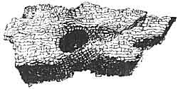
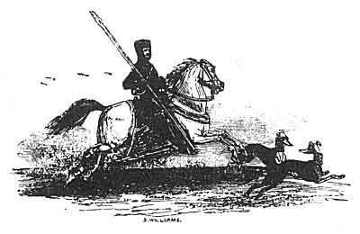

  
[Intangible Textual Heritage](../../../index.md)  [Legends and
Sagas](../../index)  [Celtic](../index)  [Index](index.md) 
[Previous](mab16)  [Next](mab18.md) 

------------------------------------------------------------------------

[Buy this Book at
Amazon.com](https://www.amazon.com/exec/obidos/ASIN/B001W0Z8PY/internetsacredte.md)

------------------------------------------------------------------------

  
*The Mabinogion*, tr. by Lady Charlotte Guest, \[1877\], at Intangible
Textual Heritage

------------------------------------------------------------------------

p. 259

### NOTES TO KILHWCH AND OLWEN.

217a KILHWCH AND OLWEN.--*Page*
[217](mab16.htm#page_217.md).

THE curious tale of Kilhwch and Olwen appears to be purely British. The
characters and events which it celebrates are altogether of native
origin, nor has any parallel or counterpart been discovered in any other
language.

It abounds in allusions to traditions of personages and incidents
belonging to a remote period, and, though it is true that some few of
these have now become obscure or unintelligible, yet many are, even to
the present day, current in the principality. Of a much greater number,
though all distinct recollection has ceased to exist, yet the frequent
references made to them in Bardic and other remains, prove that, to our
ancestors at least, they were well known; and so numerous are the
instances we meet with of this class, that we may safely infer that all
the allusions this Mabinogi contains were generally familiar to those
for whom it was designed.

Beyond the adventures here ascribed to him, no particulars of the hero
Kilhwch mab Kilydd mab Kelyddon have come down to us.

p. 260

217b ANLAWDD WLEDIG.--*Page*
[217](mab16.htm#page_217.md).

THE name of this prince occurs in the Pedigrees as being father of
Tywynwedd the mother of Tyvrydog mab Arwystli Gloff. Tyvrydog was a
saint who flourished in the sixth century. (Rees's Welsh Saints, p.
276.) In the Pedigrees, Tywynwedd is mentioned as the mother of Caradawc
Vreichvras, of Gwyn ab Nudd, and Gwallawc ab Lleenawg.

Eigr, the fair Ygraine of romance and mother of King Arthur, is likewise
said to have been the daughter of Anlawdd, by Gwen, the daughter of
Cunedda Wledig. This explains the relationship between Kilhwch and
Arthur.

 

218a KING DOGGED.--*Page*
[218](mab16.htm#page_218.md).

THE name of this most unfortunate king is enrolled among the number of
the Saints of Wales, and he is recorded as the founder or the church of
Llauddogged in Denbighshire. King Dogged was the son of Cedig ab
Ceredig [1](#fn_96.md) ab Cunedda. Wledig, and
brother of Avan Buallt, a bishop, whose tomb still remains at the church
of Llanavan Fawr, in Breconshire, which he founded. The date assigned to
these brothers is from 500 to 542.--Rees's Welsh Saints, p. 209.

 

219a OLWEN.--*Page*
[219](mab16.htm#page_219.md).

OF Olwen, the daughter of Yspaddaden Penkawr, but little is now known
beyond what is related concerning her in the present tale; but with the
bards of old her beauty had passed into a proverb. Amongst those who
made frequent allusion to her charms, we may instance Davydd ap Gwilym,
the Petrarch of Wales; and Sion Brwynog, a poet who flourished in the
sixteenth century, commences some complimentary verses addressed to a
young damsel, by comparing her to

"Olwen of slender eyebrow, pure of heart."

 

219b CUT THY HAIR.--*Page*
[219](mab16.htm#page_219.md).

IN the eighth century, it was the custom of people of consideration to
have their children's hair cut the first time by persons for whom they
had a particular honour and esteem, who in virtue of this ceremony were
reputed a sort of spiritual parents, or godfathers to them. This
practice appears, however, to have been still more ancient, inasmuch

p. 261

as we read that Constantine sent the Pope the hair of his son Heraclius,
as a token that he desired him to be his adoptive father.--See Rees's
Cyclopædia.

 

219c A HUNDRED KINE.--*Page*
[219](mab16.htm#page_219.md).

IT appears that in early times cows formed the standard of currency
among the Welsh; for in the laws of Howel Dda, after a certain enactment
concerning the payment of fines, the following remark is added, "For
with cows all payments were made formerly." And the price of a cow is
stated to be forty pence.

The Liber Landavensis furnishes numerous examples of the custom of
resorting to this method of valuation. Amongst others may be instanced
the case of Brychan, the son of Gwyngon, who bought three uncias of
land, on which three villages were situated, "for seven horses of the
value of twenty-eight cows, and the whole apparel of one man of the
value of fourteen cows, and a sword of the value of twelve cows, and a
hawk of the value of six cows, with four dogs of the value of fourteen
cows," p. 456. This property, consisting of about 324 acres, was
purchased by him to present to the Church of Llandaff, in the time of
Bishop Trychan, who is supposed to have lived about the early part of
the seventh century.

 

220a PENGWAED IN CORNWALL.--*Page*
[220](mab16.htm#page_220.md).

PENGWAED is the Land's End. In the Triad on the three divisions of
Britain, it is named as the extreme point to the south of the island,
which was distant nine hundred miles from Penrhyn Blathaon, supposed to
be Caithness in North Britain.--Triad ii.

 

222a SAVE ONLY MY SHIP AND MY
MANTLE.--*Page* [222](mab16.htm#page_222.md).

ARTHUR'S ship is mentioned several times in the course of the present
tale. Its name was Prydwen, and under that appellation it is alluded to
by Taliesin in his Preidden Annwn, [1](#fn_97.md)
the Spoils of Hell. In that mystical poem, which appears to be full of
allusions to traditions now no longer intelligible, various expeditions,
consisting of as many warriors as would have thrice filled Prydwen, are
represented as setting forth on different enterprises, from each of
which only seven returned.

The ancient chroniclers speak of these treasures of Arthur's with due
reverence. Sometimes, however, they bestow the name of Prydwen on his
shield instead of his ship. Thus old Robert of Gloucester, in the
following quaint description,

p. 262

Þe kynn, was aboue yarmed wyþ haubert noble & rẏche,  
wẏþ helm of gold on ys heued, (nas nour hẏm ẏlẏche)  
Þe fourme of a dragon þeron was ycast.  
Hys sseld, þat het Prydwen, was þanne ẏhonge wast  
Aboute ys ssoldren, and þeron ẏpeynt was and ẏwort  
Þe ẏmage of our Lady, inwan was al ys þoʒt.  
Mẏd ẏs suerd he was ẏgurd, þat so strong was & kene,  
Calẏbourne yt was ẏcluped, nas nour no such ye wene.  
In ys rẏʒt hond ẏs lance he nom, pat ycluped was Ron,  
Long & gret & strong ynow, hym ne mẏʒt atsytte non.  
                                                                           I.
174.

Gruffydd ab Arthur's account of King Arthur's arms agrees with this; but
respecting his sword Caledvwlch, or Caleburn, he adds the information
that it was formed in the Isle of Avallon. [1](#fn_98.md) It has already been detailed in a previous
portion of this work ([p. 32](mab06.htm#page_32).md), how Arthur finding
himself mortally wounded at the battle of Camlan, confided his sword to
one of his knights, charging him to cast it into the lake, and how when
the knight proceeded to fulfil his behest, a hand and arm arose from the
water, and seizing the precious weapon, brandished it three times, and
disappeared with it in the lake. This circumstance must have been
unknown to Richard the First, or he would hardly have sent to Tancred,
King of Sicily, as a valuable present, a sword which was supposed to
have been the, sword of Arthur. [2](#fn_99.md)

The Llenn, here rendered, the Mantle, but which appears to have served
sometimes as a covering, and sometimes as a carpet, was celebrated as
one of the thirteen precious things of the Island of Britain. Its
property was to render invisible any one who was either under or upon
it, while everything around was visible to him. In another Mabinogi it
is said to have been called Gwenn.

 

223a GREIDAWL GALLDONYD, OR
GALLDOVYDD.--*Page* [223](mab16.htm#page_223.md).

ONE of the three architects of the island of Britain, whose privilege it
was to go wheresoever they would, so that they did not go
unlawfully.--Triad 32.

 

223b GWYTHYR THE SON OF GREIDAWL.--*Page*
[223](mab16.htm#page_223.md).

This warrior, whose grave is noticed in the Englynion Beddau,

p. 263

\[paragraph continues\] (see [p.
33](mab06.htm#page_33).md), was father to one of the three wives of Arthur,
who all bore the name of Gwenhwyvar. [1](#fn_100.md)

It is he that fights with Gwyn ab Nudd, for the fair Cordelia, every
first of May. [2](#fn_101.md)

 

223c GWYN THE SON OF NUDD.--*Page*
[223](mab16.htm#page_223.md).

IN Gwyn ab Nudd, we become acquainted with one of the most poetical
characters of Welsh romance. He is no less a personage than the King of
Faerie, a realm, the extent and importance of which is nowhere better
appreciated, or held in greater reverence, than in Wales. Very numerous
indeed are the subjects of Gwyn ab Nudd, and very various are they in
their natures. He is the sovereign of those beneficent and joyous
beings, the Tylwyth Teg, or Family of Beauty (sometimes also called
Bendith i Mammau, or Blessing of Mothers), who dance in the moonlight on
the velvet sward, in their airy and flowing robes of blue or green, or
white or scarlet, and who delight in showering benefits on the more
favoured of the human race; and equally does his authority extend over
the fantastic, though no less picturesque class of Elves, who in Welsh
bear the name of Ellyllon, and who, on the other hand, enjoy nothing so
much as to mislead and torment the inhabitants of earth. Indeed, if
Davydd ap Gwylim may be believed, Gwyn ab Nudd himself is not averse to
indulging in a little mischievous amusement of this kind; for one dark
night the bard, having ridden into a turf bog on the mountain, calls it
the "Fishpond of Gwyn ab Nudd, a palace for goblins and their tribe," to
whom he evidently gives credit for having decoyed him into its mire.
Perhaps he may have been tempted to exclaim like Shakespeare,

"Heavens defend me from that Welsh fairy."

According to the same testimony, the Owl was more particularly
considered as the bird of Gwyn ab Nudd.

There is, in the Myvyrian Archaiology, a dialogue between Gwyn ab Nudd,
and Gwyddno Garanhir, [3](#fn_102.md) in which he
is represented as a victorious warrior. Gwyddno apostrophizes him thus,

"Gwyn, son of Nudd, the hope of armies, legions fall before thy
conquering arm, swifter than broken rushes to the ground."

In the same composition, Gwyn ab Nudd styles himself the lover of
Cordelia the daughter of Ludd, or Lear, for whom his contest with
Gwythyr mab Greidawl, on every first of May till the

p. 264

day of doom, is recorded in the text; he also mentions that Karngrwn was
the name of his horse.

The Triads commemorate Gwyn ab Nudd, as one of the three distinguished
astronomers of the Island of Britain, who by their knowledge of the
nature and qualities of the stars, could predict whatever was wished to
be known to the end of the world. [1](#fn_103.md)

A very curious legend, in which Gwynn ab Nudd bears a conspicuous part,
is contained in the Life of St. Collen (Buchedd Collen), which is
printed in a collection of Welsh remains, entitled the Greal. [2](#fn_104.md) This Saint was the son of Gwynawc, ab
Caledawc, ab Cawrdav, ab Caradawc Vreichvras, and having distinguished
himself greatly in foreign countries [3](#fn_105.md) by his zeal and piety, be returned to
Britain and became Abbot of Glastonbury; after a time Collen desired to
lead a life of greater austerity than his high office at Glastonbury
permitted; so he departed thence, and went forth to preach to the
people. The impiety, however, which he met with distressed him so much,
that at length he withdrew to a mountain, "where he made himself a cell
under the shelter of a rock, in a remote and secluded spot.

"And as he was one day in his cell, he heard two men conversing about
Gwyn ab Nudd, and saying that he was king of Annwn and of the Fairies.
And Collen put his head out of his cell, and said to them, 'Hold your
tongues quickly, those are but Devils.'--Hold thou thy tongue,' said
they, I thou shalt receive a reproof from him.' And Collen shut his cell
as before.

"And, soon after, he heard a knocking at the door of his cell, and some
one inquired if he were within. Then said Collen, 'I am; who is it that
asks?' 'It is I, a messenger from Gwyn ab Nudd, the king of Annwn, to
command thee to come and speak with him on the top of the hill at
noon.' [4](#fn_106.md)

"But Collen did not go. And the next day behold the same messenger came,
ordering Collen to go and speak with the king on the top of the hill at
noon.

"But Collen did not go. And the third day behold the same messenger
came, ordering Collen to go and speak with the king on

p. 265

the top of the hill at noon. 'And if thou dost not go, Collen, thou wilt
be the worse for it.'

"Then Collen, being afraid, arose, and prepared some holy water, and put
it in a flask at his side, and went to the top of the hill. And when he
came there, he saw the fairest castle he had ever beheld, and around it
the best appointed troops, and numbers of minstrels, and every kind of
music of voice and string, and steeds with youths upon them the
comeliest in the world, and maidens of elegant aspect, sprightly, light
of foot, of graceful apparel, and in the bloom of youth; and every
magnificence becoming the court of a puissant sovereign. And he beheld a
courteous man on the top of the castle, who bade him enter, saying that
the king was waiting for him to come to meat. And Collen went into the
castle, and when he came there, the king was sitting in a golden chair.
And he welcomed Collen honourably and desired him to eat, assuring him
that, besides what he saw, he should have the most luxurious of every
dainty and delicacy that the mind could desire, and should be supplied
with every drink and liquor that his heart could wish; and that there
should be in readiness for him every luxury of courtesy and service, of
banquet and of honourable entertainment, of rank and of presents: and
every respect and welcome due to a man of his wisdom.

"'I will not eat the leaves of the trees,' said Collen. 'Didst thou ever
see men of better equipment than those in red and blue?' asked the king.

"'Their equipment is good enough,' said Collen, 'for such equipment as
it is.'

"'What kind of equipment is that?' said the king.

"Then said Collen, 'The red on the one part signifies burning, and the
blue on the other signifies coldness.' And with that Collen drew out his
flask, and threw the holy water on their heads, whereupon they vanished
from his sight, so that there was neither castle, nor troops, nor men,
nor maidens, nor music, nor song, nor steeds, nor youth, nor banquet,
nor the appearance of any thing whatever, but the green hillocks."

 

223d EDEYRN THE SON OF NUDD.--*Page*
[223](mab16.htm#page_223.md).

See Page [195](mab14.htm#page_195.md).

 

223e GADWY THE SON OF GERAINT.--*Page*
[223](mab16.htm#page_223.md).

GADWY MAB GERAINT was noticed for his courtesy to guests and strangers,
as we learn from Triad xc.

p. 266

223f FFLEWDDUR FFLAM.--*Page*
[223](mab16.htm#page_223.md).

A NOTICE concerning Flewddur Flam, occurs in Triad 114, where under the
appellation of Fleidur Flam mab Godo he is ranked as one of the three
sovereigns of Arthur's Court who preferred remaining with him as
knights, although they had territories and dominion, of their own.--For
this Triad, see the note on Cadyrnerth mab Porthawr Gandwy, [p.
191](mab14.htm#page_191.md).

 

223g RHUAWN PEBYR.--*Page*
[223](mab16.htm#page_223.md).

RHUAWN or Rhuvawn Pebyr stands conspicuous amongst those who
distinguished themselves in the battle of Cattraeth. Aneurin says,--

"The warriors went to Caltraeth with marshalled array and shout of
war,  
With powerful steeds and dark blue harness, and with shields.  
The spears were mustered--the piercing lances,  
The glittering breastplates, and the swords.  
The chieftain would penetrate through the host  
Five battalions fell before his blade.  
Rhuvawn Hir--he gave gold to the altar,  
And gifts and precious jewels to the minstrel."  
                                     Gododin, Myv. Arch. I. p. 6.

His name occurs again in the same poem, as having approved himself an
intrepid warrior, standing firm in the hour of battle.--Myv. Arch. I. p.
12.

It is said that he fell in battle, and that it is owing to the
circumstance of his body having been redeemed for its weight in gold
that he became recorded as one of the three golden corpses of the Island
of Britain. [1](#fn_107.md)

He is also spoken of with Rhun ab Maelgwn, and Owain ab Urien, as one of
the Three blessed Kings; [2](#fn_108.md) and
another Triad ranks him with the three imperious ones. [3](#fn_109.md) Other versions, however, of the same
triad, read Rhun mab Einiawn, in the place of Rhuvawn Pebyr.

There is extant a poem composed by Hywel, the son of Owain Gwynedd,
about 1160, and printed in the Myvyrian Archaiology, I. p. 277, which
commences with these lines,--

The white wave mantled with foam, bedews the grave,  
The resting place of Rhuvawn Pebyr, chief of kings."

 

p. 267

Upwards of a century after this, we find the grave of Rhuvawn mentioned
by the bard, Gwilym Ddu, in a manner that makes it evident that its
locality was then well known.--Myv. Arch. I. p. 411.

 

223h DALLDAV THE SON OF KIMIN COV.--*Page*
[223](mab16.htm#page_223.md).

HE was one of the three compeers of the Court of Arthur with Trystan mab
March, and Rhyhawd mab Morgant ab Adras. The name of his horse was
Fferlas.--Triad 113, and Trioedd y Meirch, v.

 

223i ISPERYR EWINGATH.--*Page*
[223](mab16.htm#page_223.md).

THERE is an Esperir mentioned in the Englynion y Clyweid.

Hast thou heard what Esperir said,  
When he discoursed with Meni Hir?--  
In adversity is the true friend known.  
                              Myv. Arch. I. p. 173.

It is uncertain whether he is identical with the Isperyr Ewingath of the
Twrch Trwyth.

 

223j LLOCH LLAWWYNNYAWC.--*Page*
[223](mab16.htm#page_223.md).

LLOCH LLAWWYNNAWC is named, with several of the other warriors adjured
by Kilhwch, in the curious dialogue between Arthur, and Kai, and
Glewlwyd, of which mention has been made.--Page [42](mab06.htm#page_42.md).

 

223k AUNWAS ADEINIAWC.--*Page*
[223](mab16.htm#page_223.md).

THE preceding note applies as well to Aunwas as to Lloch Llawwynnawc.

It is doubtful whether he may be considered as the Aedenawc of the
Triads, celebrated with his brothers, Gruduei, and Henbrien, as the
three brave ones of the Island of Britain, who returned from battle on
their biers. The parents of these three brothers were Gleissiar Gogled
and Haernwed Vradawc.--Triad xxxiii. Myv. Arch. II. p. 15.

 

223l GWENNWYNWYN THE SON OF NAW.--*Page*
[223](mab16.htm#page_223.md).

has been already noticed with Geraint ab Erbin, and March ab Meirchion,
ai one of the three who had the command of the fleets of the Island of
Britain. Each of them had six score vessels with Six score men in
each.--See page [193](mab14.htm#page_193.md).

p. 268

223m ECHEL VORDDWYTTWLL.--*Page*
[223](mab16.htm#page_223.md).

His son Goronwy has already been cited as one of the Sovereigns who
preferred residing at Arthur's Court, to remaining in their own
dominions.--See [p. 191](mab14.htm#page_191.md), where the triad is given.

 

223n DADWEIR DALLPENN.--Page
[223](mab16.htm#page_223.md).

A VERY curious story concerning the sow of Dadweir (or, as he is there
called, Dallweir) Dallpenn, is contained in the Triads. It is there
related that Coll ab Collfrewi was one of the three powerful swineherds
of the Island of Britain, and that he kept the swine of Dallweir
Dallben, in the valley of Dallwyr in Cornwall. And one of these swine,
named Henwen, was with young, and it was prophesied that this
circumstance would bring evil to the Island of Britain. So Arthur
assembled his host and sought to destroy the swine; but she went
burrowing along till she came to Penhyn Austin, where she plunged into
the sea, and she landed again at Aberdarogi, in Gwent Iscoed. And all
the way she went Coll ab Collfrewi held by her bristles, both by sea and
by land, and at Maes Gwenith (Wheatfield) in Gwent, she left three
grains of wheat and three bees, since which time the best wheat and the
best honey have been in Gwent. And thence she went into Dyved, and
there, at Llonnio Llonnwen, she left a grain of barley and a little pig;
and Dyved has produced the best pigs and barley from that time to this.
And from Dyved she went into Arvon, and she left a grain of rye at Lleyn
in Arvon, and thenceforth the best rye has been found at Lleyn, and at
Eivionydd. And by the side of Rhiwgyverthwch, she left a wolf cub and a
young eaglet, and the wolf was given to Brynach Wyddel, of Dinas
Affaraon, and the eagle to Benwaedd, the lord of Arllechwedd, and there
was much talk concerning the wolf of Brynach, and the eagle of Benwaedd.
And when she came to Maen Du in Arvon she left there a kitten, and Coll
ab Collfrew, took it, and threw it into the Menai. But the sons of Palug
in Mona (Anglesey), reared this kitten, to their cost; for it became the
Palug Cat, which, we are told, was one of the three plagues of the Isle
of Mona which were reared therein, the second being Daronwy, and the
third, Edwin king of England.

These particulars are collected from the three series of Triads, printed
in the Myvyrian Archaiology. The version given in the second series is
the fullest of them.--Triad lvi.

This story is supposed to have a figurative meaning, and, under the
appellation of Henwen, the sow of Dallweir Dallpen, to allude to

p. 269

some vessel that brought to this island various sorts of grain and
animals not previously known here. Indeed, there is another triad, which
attributes to Coll ab Collfrewi the introduction of wheat and barley
into Britain, where only oats and rye were cultivated before his
time.--Triad 56.

Coll ab Collfrewi, the keeper of this marvellous sow, was one of the
chief enchanters of this island, and his magical arts were taught him by
Rhuddlwm Gawr. It has already been suggested as probable that it is to
him that Chaucer refers in his House of Fame, under the title of Coll
Tragetour, or Coll the Juggler.--See [p. 213](mab14.htm#page_213.md).

 

223o MENW THE SON OF TEIRGWAEDD.--*Page*
[223](mab16.htm#page_223.md).

THE part assigned to Menw ab Teirgwaedd in the present tale, is in
precise accordance with the character in which he appears in the Triads,
and other legendary remains of the Welsh. He is there commemorated as
one of the three men of Phantasy and Illusion in the Island of Britain,
and it is said that be taught his enchantments to Uthyr Pendragon, the
father of King Arthur.--See [p. 213](mab14.htm#page_213.md).

In the Abergavenny Prize Essay, [1](#fn_110.md) on
the Genuineness of the Coelbren y Beirdd, or Bardic Alphabet, by Mr.
Taliesin Williams (Ab Iolo), there is a curious allegorical tale, which
connects Menw with the discovery of that alphabet. The substance of the
tale is as follows.--Einigan Gawr saw three rays of light, on which were
inscribed all knowledge and science. And he took three rods of mountain
ash, and inscribed all the sciences upon them, as it should seem in
imitation of the three rays of light. And those who saw them, deified
the rods, which so grieved Einigan, that he broke the rods and died. And
after the space of a year and a day, Menw ab Teirgwaedd saw three rods
growing out of the mouth of Einigan, and upon them was every kind of
knowledge and science written. Then Menw took the three rods, and
learned all the sciences, and taught them all, except the name of God,
which has originated the Bardic secret, and blessed is he who possesses
it.--P. 6.

It may be remarked that the Bardic symbol is formed of three radiating
lines   which, it is said,
are intended to represent the three diverging rays of light, which
Einigan Gawr saw descending towards the earth; and it is somewhat
curious that these three lines contain all the elements of the Bardic
alphabet, as there is not a single letter in it that is not formed from
them. No less singular is it, that this alphabet, which is alleged to
have been only used

p. 270

upon wood (perhaps also implied by the three rods), is so constructed as
altogether to avoid horizontal or circular lines, which could not be cut
on wooden rods without splintering or running, on account of the grain
of the wood.

For the proofs of the genuineness of this alphabet the reader is
referred to the Essay itself.

 

223p DRUDWAS THE SON OF TRYFFIN.--*Page*
[223](mab16.htm#page_223.md).

CONCERNING Drudwas mab Tryffin, a curious tradition is presented in an
interesting letter from the celebrated antiquary, Robert Vaughan, to Mr.
Meredydd Lloyd, dated July 24th, 1655. It is printed in the Cambrian
Register (III. p. 311). In the following extract we have that portion of
it which relates to Drudwas.

"The story (or rather fable) of *Adar Llwch guin*, I have, but cannot
finde it. The birds were two griffins, which were *Drudwas ab Tryffin's*
birds, whoe had taught them to seise upon the first man that should
enter into a certain fielde, and to kill him. It chanced, that having
appointed a day to meete with King Arthur to fight a duell in the same
fielde, he himselfe protracting the tyme of his coming soe long that he
thought surely Arthur had come there long before, came first to the
place, whereupon the birds presently fell upon him, and killed him; and
they perceiving that he, whom they had killed was theire master, much
lamented his death with fearfull screechings and mournfull cryings a
long tyme; in memory whereof there is a lesson to be played upon the
*crowde*, the which I have often heard played, which was made then,
called *Caniad Adar llwchgwin*; and, to confirm this history in some
parte, there's a British epigram extant, which I cannot remember, but,
if you have the story and it, I pray you send it me."

According to the Triads, Drudwas mab Tryffin was one of the three
Golden-tongued Knights, whom no one could refuse whatsoever they might
ask; Gwalchmai, and Eliwlod ab Madawc ab Uthur were the other
two.--Triad 115.

 

224a CAERDATHAL.--*Page*
[224](mab16.htm#page_224.md).

CAERDATHAL, which the Mabinogion assign as a residence to Math ab
Mathonwy, is in Caernarvonshire, and crowns the summit of all eminence
near Llanrwst. It is peculiar for having large stones set upright to
guard its entrance.

The name of this place occurs in Cynddelw Brydydd Mawr's Elegy on the
death of his patron Owain Gwynedd, circa 1160. The

p. 271

passage in the Myvyrian Archaiology, I. p. 206, is imperfect, but the
Cambro-Briton, II. p. 3, gives it in the following manner:--

"Around the region of Caer Dathal  
Lay those whom the vultures had mangled,  
Reddening the hill and the headland and the dale."

 

224b KAW.--*Page* [224](mab16.htm#page_224.md).

CONSIDERABLE variations exist in the different catalogues which axe
extant of the numerous sons of Kaw. In that, however, given by Jones, in
his Welsh Bards, II. p. 22, the names exactly correspond with those in
the text. Some of these personages are enumerated amongst the Saints of
Wales, but of the individual history of the greater number little is
known. Some account has already been given of one of the most eminent of
them, Gildas mab Kaw, p. 1913. Huail, another of the brothers, obtained
a less honourable notoriety for his vices which eventually cost him his
life. Jones details the circumstances of his ignominious death, from the
authority of Edward Llwyd, who derived them from a Welsh MS. in the
handwriting of John Jones, of Gelli Lyfdy, dated June the 27th, 1611.

From this account, it appears that Huail was imprudent enough to court a
lady of whom Arthur was enamoured. The monarch's suspicions being
aroused, and his jealousy excited, he armed himself secretly, and
determined to observe the movements of his rival. Having watched him
going to the lady's house, some angry words passed between them, and
they fought. After a sharp combat, Huail got the better of Arthur, and
wounded him severely in the thigh, whereupon the contest ceased, and
reconciliation was made upon condition that Huail, under the penalty of
losing his head, should never reproach Arthur with the advantage he had
obtained over him. Arthur retired to his palace, which was then at
Caerwys, in Flintshire, to be cured of his wound. He recovered, but it
caused him to limp a little ever after.

A short time after his recovery, Arthur fell in love with a lady at
Rhuthyn, in Denbighshire, and, in order the more frequently to enjoy the
pleasure of her society, he disguised himself in female attire. One day
he was dancing with this lady, and her companions, when Huail happened
to see him. He recognized him on account of his lameness, and said,
"This dancing might do very well, but for the thigh." It chanced that
Arthur overheard his remark; he withdrew from the dance, and summoning
Huail before him, upbraided him angrily for the breach of his promise
and oath, and commanded him

p. 272

to be beheaded upon a stone, which lay in the street of the town, and
which, from this event, acquired the appellation of Maen Huail. [1](#fn_111.md) This stone is still to be seen in the
town of Rhuthyn.

In the Triads, Huail the son of Kaw of North Britain, Lord of Cwm
Cawlwyd, is represented as one of the three Diademed Chiefs of Battle
(Triad 69) and the Englynion y Clyweid appropriate a stanza to one of
his Sayings--

Hast thou, heard what was Sung by Huail  
The son of Kaw, whose saying was just?  
Often will a curse fall from the bosom."--  
                                    Myv. Arch. I. p. 173.

 

224c TALIESIN, THE CHIEF OF THE
BARDS.--*Page* [224](mab16.htm#page_224.md).

THE history of Taliesin, which is exceedingly wild and interesting,
forms the subject of a separate Mabinogi, and as such will be given in
its proper place.

 

224d MANAWYDDAN THE SON OF LLYR.--*Page*
[224](mab16.htm#page_224.md).

THIS chieftain, who figures in the Triads, will be alluded to hereafter
in the notes to one of the Mabinogion more particularly relating to him.

 

224e GERAINT THE SON, OF ERBIN.--*Page*
[224](mab16.htm#page_224.md).

OF this chieftain a full account has been given in the notes to the
Mabinogi bearing his name.--It may be added that a saying of his is
preserved in the Englynion y Clyweid: it is as follows:--

"Hast thou heard what Geraint sang,  
The son of Erbin just and Skilful?  
Short-lived is the hater of the saints."--  
                                   Myv. Arch. 1. p 172.

Geraint's own designation of "the friend of the saints" (Câr i Saint)
appears to be alluded to in this Englyn.--See Llyw. Hên's Elegies.

 

224f DYVEL THE SON OF ERBIN.--*Page*
[224](mab16.htm#page_224.md).

THE death of Dyvel mab Erbin is mentioned in the dialogue between
Myrddin Wyllt and Taliesin, where the former says:--

p. 273

"Through and through with rush and bound they came,  
Yonder and still beyond, were Bran and Melgan seen approaching,  
And by them, at the battle's close,  
Dyvel ab Erbin and his hosts were slain."--  
                                             Myv. Arch. I. p. 48.

His grave was in the plains of Gwesledin.--*Ib*. I. p. 80.

 

224g LLAWNRODDED VARVAWC.--*Page*
[224](mab16.htm#page_224.md).

IN days when, as we have already seen ([p. 219](mab16.htm#page_219).md),
the value of articles, even of luxury and ornament, was estimated by the
number of cows they were worth, we cannot be surprised that the herdsmen
were sometimes men of rank and distinction, and considered worthy to
occupy a place in the Triads. Accordingly we find that the subject of
the present note figured in those curious records, as one of the three
Tribe Herdsmen of the Island of Britain. He tended the kine of Nudd
Hael, the son of Senyllt, in whose herd were twenty-one thousand milch
cows. The other two herdsmen (and they had each a like number of cows
under their care) were Bennren, who kept the herd of Caradawc the son of
Brân and big tribe, in Gorwenydd in Glamorganshire; and Gwdion the son
of Don, the celebrated enchanter, who kept the herd of the tribe of
Gwynedd, above the Conwy.--Triad 85.

His own cow went by the name of Cornillo, and was one of the three chief
cows of the Island.--Trioedd y Meirch, xi.

Of the no less remarkable personages, who tended the swine of the Island
of Britain, an account has already been given, [p. 268](#page_268.md).

Llawnrodded's knife was one of the thirteen precious things possessing
marvellous properties. It would serve four-and-twenty men at once with
meat.

 

224h MORVRAN THE SON OF TEGID.--*Page*
[224](mab16.htm#page_224.md).

THIS circumstance of the three warriors escaping from the battle of
Camlan is related in the Triads, in words very nearly corresponding With
those in the text. The two accounts differ only as regards the name of
the third man, whom the Triad-, instead of Kynwyl Sant, represent to
have been Glewlwyd Gavaelvawr, to whom, as King Arthur's Porter, we have
already been introduced.--Triad 83.

From the Hanes Taliesin, we learn that Morvran was the son of Tegid Voel
and Ceridwen.

p. 274

225a LLENLLEAWG WYDDEL.--*Page*
[225](mab16.htm#page_225.md).

THIS name occurs in the Englynion y Clyweid.--

Hast thou heard what Llenlleawg Gwyddel sang,  
The noble chief wearing the golden torques?  
The grave is better than a life of want."--  
                                     Myv. Arch. I. p. 174.

 

225b DYVYNWAL MOEL.--*Page*
[225](mab16.htm#page_225.md).

DYVYNWAL MOELMUD, King of Britain, and the first lawgiver whom the
nation boasts, is supposed to have lived about 400 years before the
Christian era. There are four Triads relating to him, in all of which he
is represented as a great benefactor to his people. [1](#fn_112.md) In one of these he is styled one of the
three National Pillars of the Island: in another, one of the three
Primary Inventors: and in a third, one of the beneficent Sovereigns of
the Cymry, because he had first reduced to a system, and improved, and
extended their laws, institutions, customs, and privileges, "so that
right and justice might be obtained by every one in Britain, under the
protection of God and His peace, and under the protection of the
country, and the nation." Again we find him designated as one of three
chief System-formers of Royalty, by reason of the excellency of his mode
of government.

Howel Dda, the Welsh Legislator, in compiling his celebrated Welsh Code,
in the tenth century, made great use of the laws of Dyvynwal Moelmud,
some of the Triads and institutes ascribed to whom are to be found in
the third volume of the Myvyrian Archaiology, and are very curious and
interesting remains.

 

225c GWYSTYL THE SON OF RHUN THE SON OF
NWYTHON.--*Page* [225](mab16.htm#page_225.md).

RHUN the father of Gwystyl, was one of the chieftains mentioned by
Gruffydd ab Arthur, [2](#fn_113.md) as being
present at King Arthur's Coronation, at Caerlleon upon Usk.--Both he and
Nwython are named in Taliesin's poem addressed to Gwallawg. [3](#fn_114.md)

 

225d DREM THE SON OF DREMIDYD.--*Page*
[225](mab16.htm#page_225.md).

IN addition to the notice already given ([p. 187](mab14.htm#page_187).md),
of this fantastic personage, who was so sharp-sighted, that he could
descry a mote in the sunbeam in the four corners of the world, we may
remark that in the

p. 275

\[paragraph continues\] Englynion y
Clyweid, he is represented to have pronounced the very sensible opinion
recorded in the following lines:--

"Hast thou heard what Dremhidydd sang,  
An ancient watchman on the castle walls!  
A refusal is better than a promise unperformed."--  
                                    Myv. Arch. I. p. 174.

 

225e GELLI WIC.--*Page*
[225](mab16.htm#page_225.md).

OF Gelli Wic (or, as it is generally written, Gelliwig), in Cornwall,
frequent mention is made in the Triads, where it is named as one of the
three national thrones of the Island of Britain, [1](#fn_115.md) and one of King Arthur's chief seats of
empire, in which he was used to celebrate the high festivals of
Christmas, Easter, and Whitsuntide. At the time of Arthur's sovereignty,
when he was Supreme Ruler (Penrhaith as it is called in Welsh), Bedwin
was the chief Bishop, and Caradawc Vreichvras was the chief Elder, of
Gelliwig. It was one of the three Archbishoprics of Britain. [2](#fn_116.md) When Medrawd, Arthur's wicked nephew,
usurped the government of the island during his uncle's absence, he went
to Gelliwig, and dragged Gwenhwyvar from her throne with contumely, and
left neither meat nor drink in the court, "not even so much as would
feed a fly," but consumed and wasted all. [3](#fn_117.md) The fatal battle of Camlan was fought to
avenge this insult.

The site of Gelliwig is now a matter of some doubt. Hals places it at
Callington (Kellington or Killiwick), as we learn from the following
extract from his MS. quoted by Polwhele:--

"I take this to be the same place mentioned by the Welsh poets or bards,
and called by them Kellywick, and Kinge Arthur's palace or court, viz.,
his court-leet or baylywick. Such in his time vndoubtedly it was, as
Duke of Cornwall or Kinge of Britaine; for this manor of land with its
appurtenances was, by act of Parliament, given to Edward the Black
Prince as parcell of the lands of the ancient kinges or earles of
Cornwall, then translated into a dutchy or dukedom." [4](#fn_118.md)

It may be taken as some confirmation of this opinion with regard to the
locality of Gelliwig, that there is a place in the vicinity of

p. 276

\[paragraph continues\] Callington still
bearing the appellation of Arthur's Hall. It is on a rocky tor in the
parish of North-hill, which is in the same hundred as Callington, and
within a short distance of it. Norden gives the following description of
the spot:--"It is a square Plott, about 60 foote long and about 3.5
foote broade situate in a playne Mountayne, wrowghte some 3 foote in the
grounds and by reason of the depression of the place there standeth a
otarige or poole of water, the place (being) sett round about with flat
stones." Near to the Hall are many rocky basins, called by the common
people Arthur's Troughs, and in which, according to tradition, that
monarch used to feed his dogs; for (says Gilbert, from whom this account
is taken) it is "the custom in Cornwall to ascribe everything that is
great and whose use is unknown to that immortal hero." [1](#fn_119.md)

 

225f PEN BLATHAON IN NORTH BRITAIN.--*Page*
[225](mab16.htm#page_225.md).

PEN or Penrhyn Blathaon (supposed to be Caithness in Scotland) has
already been noticed [2](#fn_120.md) as the
extreme point from Penwaeth or Pengwaed, in Cornwall, from which it was
distant nine hundred miles. [3](#fn_121.md) The
distance between these two places was determined by the British
Legislator, Dyvynwal Moelmud. In the Welsh Laws is given the following
passage, relating to the admeasurement of the island made by him:--

"Before the Saxons seized the crown of London and the sceptre, Dyvynwal
Moelmud was King of this Island; and he was the Earl of Cornwall, by the
daughter of the King of Lloegr. And after the male line of inheritance
became extinct, he came into the possession of the kingdom, by the
distaff (that is by the female line), as being the grandson of the King.
Now he was a man of great wisdom, and he first made laws for this
Island, and those laws continued to the time of Rowel Dda, the son of
Cadell. And afterwards Rowel Dda made new laws, and changed some of the
laws of Dyvynwal. But Howel did not alter the measurements of the lands
of this Island, but left them as Dyvynwal framed them; for he was an
excellent measurer. He measured this Island from the Promontory of
Blathaon, in North Britain, to the Promontory of Pengwaed, in Cornwall,
which is nine hundred miles, and that is the length of the Island, and
from Crugyll, in Anglesey, to Sorram (Shoreham) on the shore of the sea
of Udd (the Channel), that is the breadth of the

p. 277

island. And the reason of his measuring it was to know the number of
miles in his journeys.

"And this measurement Dyvynwal made by a grain of barley. Three lengths
of a barley corn in an inch, three inches in a handbreadth, three
handbreadths in a foot, three feet in a step, three steps in a jump,
three jumps in a land, which is in later Welsh a ridge, and a thousand
lands or ridges make a mile, and this measure is used here till now."

 

226a THE THREE ISLANDS ADJACENT.--*Page*
[226](mab16.htm#page_226.md).

ORKNEY, the Isle of Wight, and the Isle of Man, are the three primary
islands lying adjacent to Britain, according to the authority of the
Triads, which proceed to mention, that subsequently Anglesey was
separated from the main land, and became an island, and that in like
manner the Island of Orkney was divided, and became a multitude of
islands, and that other parts of Wales and Scotland became islands
likewise.--Triad 67.

This coincides with Nennius's account of the three islands adjacent to
Britain, which is given in these words:--

"Tres magnas insulas habet \[Britannia\], quarum, una vergit contra
Armoricas, et vocatur Inisgueith; secunda sita est in umbilico maris
inter Hiberniam et Brittanniam, et vocatur nomen ejus Eubonia, id est,
Manau, alia sita est in extremo limits orbis Brittanniæ ultra Pictos, et
vocatur Orc. Sic in proverbio, antiquo dicitar, quando de judicibus vel
regibus sermo fuit, 'Judicavit Brittanniam cum tribus insulis.'"--P. 7,
ed. 1838.

 

226b GWYNN GODYVRON.--*Page*
[226](mab16.htm#page_226.md).

MENTIONED in the dialogue between Arthur, Kai, and Glewlwyd see [p.
42](mab06.htm#page_42.md), where the passage is given.

 

226c GARSELIT WYDDEL.--*Page*
[226](mab16.htm#page_226.md).

"Hast thou heard what Garselit sang,  
The Irishman whom it is safe to follow?  
Sin is bad when long pursued."--  
                              Englynion y Clyweid. [1](#fn_122.md)

 

p. 278

226d THE NINTH MAN THAT RALLIED THE BATTLE
OF CAMLAN.--*Page* [226](mab16.htm#page_226.md).

THIS is very probably an allusion to the disposition made by Arthur of
his forces, previous to the battle of Camlan. Geoffrey of Monmonth
states that he arranged his army in nine divisions, with a commander
over each, of whom Gwynnhyvar was possibly one.

 

227a GWARE GWALLT EURYN.--*Page*
[227](mab16.htm#page_227.md).

GWARE GWALLT EURYN was the son of Pwyll and Rhianon. The mysterious
circumstances connected with his birth are detailed in another Mabinogi.

 

228a KYNVELYN KEUDAWD PWYLL, THE HALF
MAN.--*Page* [228](mab16.htm#page_228.md).

THE Welsh have a fable on the subject of the Hanner Dyn or Half Man,
taken to be illustrative of the force of habit. In this allegory Arthur
is supposed to be met by a sprite, who appears at first in a small and
indistinct form, but who on approaching nearer increases in size, and,
assuming the semblance of half a man, endeavours to provoke the king to
wrestle. Despising his weakness, and considering that he should gain no
credit by the encounter, Arthur refuses to do so, and delays the
contest, until at length the Half Man (Habit) becomes so strong that it
requires his utmost efforts to overcome him.

 

228b SAWYL BEN UCHEL.--*Page*
[228](mab16.htm#page_228.md).

SAWYL BEN UCHEL is accused of being one of those whose arrogance
produced anarchy in the Island of Britain; and the lawless party united
with the Saxons, and themselves became Saxons at last.--Triad 74.

 

228c GWRHYR GWASTAWD IETTHOEDD.--*Page*
[228](mab16.htm#page_228.md).

IOLO GOCH'S allusion to Gwrhyr's extraordinary aptitude for acquiring
languages has already been noticed, in the notes to Geraint ab Erbin.
The Englynion y Clyweid refer in like manner to the singular talent by
which he was characterised:--

Hast thou heard what Gwrhyr Gwalstawt sang,  
He who was perfect in all languages?  
Who practises deceit will be deceived."--  
                                     Myv. Arch. I. p. 172.

 

p. 279

228d BEDWINI THE BISHOP.--*Page*
[228](mab16.htm#page_228.md).

BEDWINI was Bishop of Gelliwig in Cornwall, and as such is spoken of in
the Triads, [1](#fn_123.md) and in the British
Chronicles. One of his sayings is preserved in the Englynion y
Clyweid:--

Hast thou heard what Bedwini sung,  
A gifted Bishop of exalted rank?  
Consider thy word before it is given." [2](#fn_124.md)

 

229a INDEG.--*Page*
[229](mab16.htm#page_229.md).

SOME of the ladies here adjured are celebrated in the Triads, and others
figure in the writings of the Romancers of the Middle Ages.

Indeg, the daughter of Garwy or Afarwy hir, of Maelienydd, was one of
the three ladies best beloved by Arthur. [3](#fn_125.md) Her beauty is often the theme of the
bards.

Morvudd was the daughter of Urien Rheged, the twin sister of Owain, and
the beloved of Cynon the son of Clydno Eiddyn. Her mother's name was
Modron, the daughter of Avallach. [4](#fn_126.md)

Creiddylad is no other than Shakespeare's Cordelia, whose father, King
Lear, is, by the Welsh authorities, called indiscriminately Llyr and
Lludd Law Ereint. All the old chroniclers, from the Brut to Milton, give
the story of her devotion to her aged parent, but none of them seem to
have been aware that she is destined to remain with him until the day of
doom, whilst Gwyn ab Nudd, the King of the Fairies, and Gwythyr mab
Greidiawl, fight for her every first of May; and whichever of them may
be fortunate enough to be the conqueror at that time, will obtain her as
his bride. She is quoted in the Englynion y Clyweid:--

Hast thou heard what Creiddylad sang,  
The daughter of Lludd, the constant maiden?  
Much will the faithful messenger effect."--  
                                   Myv. Arch. I. p. 174.

Essyllt Vinwen or Fyngwen, the daughter of Culvanawyd Prydain, and
sister of Owain's faithless wife Penarwen, is mentioned very
disparagingly in the Triads. [5](#fn_127.md) She
was married to March ab Meirchion, and acquired a very undesirable
celebrity for her attachment to her husband's nephew Tristan ab Tallwch,
the renowned Sir Tristan of

p. 280

the Romancers, who bestow upon Essyllt the appellation of Yseult La
Belle.

Essyllt Vingul, we may presume to be the Yseullt aux Blanche Mains of
romantic fiction, whom Sir Tristan, although at the same time deeply
enamoured of her fairer namesake, married out of gratitude for her
having effected his cure, when wounded by a poisoned arrow.

 

230a DRYCH AIL KIBDDAR.--*Page*
[230](mab16.htm#page_230.md).

ONLY the first series of the Triads, printed in the Myvyrian
Archaiology, takes notice of Drych ail Kibddar, and there be is classed
among the dealers in phantasy or enchantment.--Triad xxxiii.

 

236a AMAETHON THE SON OF DON.--*Page*
[236](mab16.htm#page_236.md).

AMAETHON, the signification of whose name is "husbandman," would seem to
have been a very proper person to send for to perform the office.
required by Yspaddaden Penkawr. He was brother to the celebrated
illusionist or enchanter, Gwydion ab Don, and he appears to have had
himself some dealings with the powers of darkness; for it is fabled that
he brought from Annwn (the Lower Regions), a white roebuck, and a whelp,
which were the occasion of the Cad Goddeu, or Battle of the Trees.
Taliesin has a long mystical poem on the subject of this battle; and
some curious lines relative to it are given in the Myvyrian
Archaiology. [1](#fn_128.md) These, with the prose
heading that accompanies them, are as follows:--

These are the Englyns that were sung at the Câd Goddeu (the Battle of
the Trees), or, as others call it, the Battle of Achren, which was on
account of a white roebuck, and a whelp; and they came from Hell, and
Amathaon ab Don brought them. And therefore Amathaon ab Don, and Arawn,
King of Annwn (Hell), fought. And there was a man in that battle, unless
his name were known he could not be overcome; and there was on the other
side a woman called Achren, and unless her name were known her party
could not be overcome. And Gwydion ab Don guessed the name of the man,
and sang the two Englyns following:--

'Sure-hoofed is my steed impelled by the spur;  
The high sprigs of alder are on thy shield:  
Brân art thou called, of the glittering branches.'

 

p. 281

                    *And thus*,  
'Sure-hoofed is my steed in the day of battle  
The high sprigs of alder are on thy hand:  
Brân.............by the branch thou bearest  
Has Amathaon the good prevailed.'"

These lines have the appearance of being transcribed from a very ancient
and probably mutilated manuscript. Some of the words are scarcely
intelligible; but perhaps the foregoing will be found not very remote
from the meaning of the original.

This battle, in the Triads, is styled one of the three frivolous battles
(ofergad) of the Island of Britain, and is said to have been on account
of a bitch, a hind, and a lapwing; and it is added that it cost the
lives of seventy-one thousand men.--Triad 50.

The brothers, Gwydion and Amaethon, are mentioned as being efficient of
counsel, in Taliesin's Elegy on Aeddon of Mon. [1](#fn_129.md)

 

236b OXEN OF GWLWLYD.--*Page*
[236](mab16.htm#page_236.md).

THESE animals, to which some fabulous story probably attached, are
spoken of in the Triads, together with those required by Yspaddaden in
the subsequent paragraph.--Tr. y Meirch x.

One of these is alluded to in Taliesin's mystical poem, entitled
Preiddeu Annwn, the spoils of Hell. [2](#fn_130.md)

"They know not the brindled ox with the broad headband Seven score
handbreadths are in his yoke."

 

236c NYNNIAW AND PEBIAW.--*Page*
[236](mab16.htm#page_236.md).

ON turning to the ancient records, we meet with kings bearing the names
of those who were turned into oxen for their crimes.

Nynniaw was a prince of Glamorgan, and his descendants appear to have
profited by the lesson which his disastrous fate afforded; for we find
that Marchell, his great grand-daughter, was the mother of the
celebrated and canonized Brychan Brycheiniog, [3](#fn_131.md) who had himself the happiness of being
father to no less than forty-eight saints, twenty-three of whom were
sons, and five-and-twenty daughters.

According to the Liber Landavensis, King Pebiaw, who was the son of Erb,
was equally fortunate in the character of his descendants, one of whom
was Saint Dubricius himself, the particulars of whose miraculous birth
are there given in the following words.

p. 282

"There was a certain king of the region of Ergyng [1](#fn_132) (Archenfield.md) of the name of Pebiau,
called, in the British language, Claforawg, and in Latin, Spumosus, who
undertook an expedition against his enemies, and returning from thence
be ordered his daughter Eurddil to wash his head." The legend then goes
on to state that circumstances led him to suspect that Eurddil was
pregnant, and that "the King, therefore, being angry, ordered her to be
put into a sack, and cast headlong into the river, that she might suffer
whatever might befall; which, however, happened contrary to what was
expected, for as often as she was placed in the river, so often was she,
through the guidance of God, impelled to the bank. Her father, then,
being indignant because he could not drown her in the river, resolved to
destroy her with fire. A funeral pile was therefore prepared, into which
his daughter was thrown alive. In the following morning, the messengers
who had been sent by her father to ascertain whether any of the bones of
his daughter remained, found her holding her son in her lap, at a spot
where a stone is placed in testimony of the wonderful nativity of the
boy; and the place is called Madle, [2](#fn_133.md) because therein was born the holy man.
The father, bearing this, ordered his daughter with her son to be
brought to him; and when they came he embraced the infant with paternal
affection, as is usual, and kissing him, from the restlessness of
infancy, he touched with his hands the face and mouth of his
grandfather, and that not without divine appointment; for by the contact
of the hands of the infant, he was healed of the incurable disease
wherewith be was afflicted, for he incessantly emitted foam from his
mouth which two persons who constantly attended him could scarcely wipe
off with handkerchiefs.

"Who, when he knew that he had been healed by the touch of the infant,
rejoiced greatly, like one who had come to a harbour after having
suffered shipwreck. And he, who at first was as a roaring lion, was now
turned to a lamb, and he began to love the infant above all his sons and
grandsons; and of that place, Madle (that is, *Mad*, good, *lle*, place,
and whence *Madle*, a good place), he made him heir, and also of the
whole island, which took its name from his mother Eurddil, that is,
*Ynys Eurddyl*, which by others is called *Maes Mail Lecheu*." [3](#fn_134.md)

p. 283

Whether these events took place before or after King Pebiaw's
distressing transformation does not appear. All the further information
concerning him, in the Liber Landavensis, consists of the due. recital
of sundry grants of land which be made to the Church, "being penitent,
with an humble heart, and mindful of his evil deeds."

Lewis, in his "History of Great Britain," printed in 1729, mentions
Pebiaw as King of Erchenfield, and states that in a parish church in
Herefordshire is a picture of a king, with a man on each side of him,
wiping his face with napkins, "which king the country people call King
Dravellor."

The insane arrogance of these wicked kings is recorded in a curious
Welsh legend, a translation of which is printed by Mr. Taliesin
Williams, in the notes to his poem of Colyn Dolphyn. It is as follows:--

"There were two Kings, formerly in Britain, named Nynniaw and Peibiaw.
As these two ranged the fields one starlight night, 'See,' said Nynniaw,
'what a beautiful and extensive field I possess!' 'Where is it?' said
Peibiaw; 'the whole Firmament,' said Nynniaw, 'far as vision can
extend.' 'And do thou see,' said Peibiaw, 'what countless herds and
flocks of cattle and sheep I have depasturing thy field.' 'Where are
they?' said Nynniaw; 'why the whole host of stars which thou seest,'
said Peibiaw, 'and each of golden effulgence, with the Moon for their
shepherdess, to superintend their wanderings.' 'They shall *not* graze
in MY pasture,' said Nynniaw; 'They *shall*,' said Peibiaw; 'They shall
*not*,' said one: 'They *shall*.' said the other, repeatedly, in bandied
contradiction, until at last it arose to wild contention between them,
and from contention it came to furious war; until the armies and
subjects of both were nearly annihilated in the desolation. RHITTA, the
Giant, King of Wales, hearing of the carnage committed by these two
maniac kings, determined on hostility against them; and, having
previously consulted the laws and his people, he arose and marched
against them because they had, as stated, followed the courses of
depopulation and devastation, under the suggestions of phrenzy. He
vanquished them, and then cut off their beards. But, when the other
Sovereigns included in the twenty-eight kings of the island of Britain,
heard these things, they combined all their legions to revenge the
degradation committed on the two disbearded kings, and made a fierce
onset on Rhitta the Giant, and his forces; and furiously bold was the
engagement, But Rhitta the Giant won the day. 'This is *my* extensive
field,' said he, then, and immediately disbearded the other kings. When
the kings of the surrounding countries

p. 284

heard of the disgrace inflicted on all these disbearded kings, they
armed themselves against Rhitta. the Giant and his men; and tremendous
was the conflict; but Rhitta the Giant achieved a most decisive victory,
and then exclaimed: 'This is MY immense field!' and at once the kings
were disbearded by him and his men. Then pointing to the irrational
monarchs, 'These,' said he, 'are the animals that grazed *my* field, but
I have driven them out: they shall no longer depasture there.' After
that he took up all the beards, and made out of them a mantle for
himself that extended from head to heel; and Rhitta was twice as large
as any other person ever seen."

This Rhitta Gawr is none other than King Ryons of North Wales, who
appears to have been almost as presumptuous as the unfortunate monarchs
whom he so deservedly chastised. The Morte d'Arthur represents him as
sending to demand the beard of Arthur himself, which it need hardly be
added that he failed to obtain. [1](#fn_135.md)

We are told that Nynniaw and Pebiaw were the names of the horned oxen
(Ychain Banawg) employed by Hu Gadarn [2](#fn_136.md) to draw the Avanc out of the Lake of
Floods, so that the lake burst no more. This bursting of the lake is
considered to bear reference to the universal Deluge, as it is said in
the same Triad, that when that occurrence took place, the male and the
female of every living thing were preserved in the ship of Nevydd Nav
Neivion. It would be useless to follow all the theories which have been
founded on the name of Hu Gadarn, and his connexion with that important
event. For these, reference may be made to Davies's Mythology of the

p. 285

\[paragraph continues\] Druids, and Celtic
Researches, Dr. Owen Pughe, in his Dictionary, and Cambrian Biography,
&c. &c. Suffice it to say, that Hu Gadarn or the Mighty is looked upon
as a patriarch, and that there are seven [1](#fn_137.md) Triads commemorative of the benefits
which he is said to have conferred upon "the Cymry," whom he is recorded
to have instructed in the useful arts of agriculture, before their
arrival in Britain, and while they remained in the Summer country, which
an ancient commentator has described to be that part of the East now
called Constantinople. The next benefit that he conferred on the people,
of whom he thus appears to have been the head, was the dividing of them
into various tribes, and directing them at the same time to unity of
action, for which he is represented as one of the three primary
System-formers of the nation of the Cymry. In addition to this, he is
further commemorated as having been the first who devised the
application of song to the preservation of record and invention, and as
having contributed thereby to the institution of Bardism. The
occurrence, last in succession, appears to have been his arrival in the
Isle of Britain, with the nation of the Cymry, whom he is stated, in two
Triads, to have conducted from the Summer country already noticed, here
called Deffrobani, and a colony of whom he is also said to have fixed at
the same time in Armorica, on the coast of Gaul. And his landing in this
country, as we find from another of these ancient documents, was not
marked by any characteristics of violence; for he is described as not
desirous of obtaining dominion by war and bloodshed, but by justice and
peace, for which reason his followers are ranked among the three gentle
tribes of the Isle of Britain. [2](#fn_138.md)

 

237a THE BASKET OF GWYDDNEU
GARANHIR.--*Page* [237](mab16.htm#page_237.md).

THIS marvellous basket is reckoned amongst the thirteen precious things
of the Island of Britain. In the following catalogue of these treasures,
which is copied from an old MS. in the collection of Mr. Justice
Bosanquet, its properties are, however, made to differ slightly from
those assigned to it by Yspaddaden:--

1\. Dyrnwyn the sword of Rhydderch Hael; if any man drew it except
himself, it burst into a flame from the cross to the point, and all who
asked it received it; but because of this property all shunned it: and
therefore was he called Rhydderch Hael.

p. 286

2\. The basket of Gwyddno Garanhir; if food for one man were put into
it, when opened it would be found to contain food for one hundred.

3\. The horn of Bran Galed; what liquor soever was desired was found
therein.

4\. The chariot of Morgan Mwynvawr; whoever sat in it would be
immediately wheresoever he wished.

5\. The halter of Clydno Eiddyn, which was in a staple below the feet of
his bed; and whatever horse he wished for in it, he would find it there.

6\. The knife of Llawfrodded Farchawg; which would serve four-and-twenty
men at meat all at once.

7\. The cauldron of Tyrnog; if meat were put in it to boil for a coward
it would never be boiled, but if meat were put in it for a brave man it
would be boiled forthwith.

8\. The whetstone of Tudwal Tudclud; if the sword of a brave man were
sharpened thereon, and any one were wounded therewith, he would be sure
to die, but if it were that of a coward that was sharpened on it, he
would be none the worse.

9\. The garment of Padarn Beisrudd; if a man of gentle birth put it on,
it suited him well, but if a churl it would not fit him.

10, 11. The pan and the platter of Rhegynydd Ysgolhaig; whatever food
was required was found therein.

12\. The chessboard of Gwenddolen; when the men were placed upon it,
they would play of themselves. The chessboard was of gold, and the men
of silver.

13\. The mantle of Arthur; whosoever was beneath it could see
everything, while no one could see him.

This version is rather different from that given by Jones, in his Welsh
Bards, [1](#fn_139.md) which omits the halter of
Clydno Eiddyn, but adds the mantle of Tegau Eurvron, which would only
fit such ladies as were perfectly correct in their conduct, and the ring
of Luned, by which she effected the release of Owain the son of Urien,
as bas already been seen in the story of the Lady of the Fountain;
whoever concealed the stone of this ring became invisible.

Gwyddno Garanhir, the possessor of the basket, was the Prince of Cantref
y Gwaelod, which was overflowed by the sea. This event will be detailed
hereafter in the notes to another Mabinogi, where it is more
particularly referred to.

p. 287

237b THE HARP OF TEIRTU.--*Page*
[237](mab16.htm#page_237.md).

THE harp of Teirtu appears to be alluded to by Davydd ab Edmwnt, a bard
who flourished about the middle of the fifteenth century. In an elegy
which he composed on a celebrated harper, named Sion Eôs, or John the
Nightingale (who suffered death for manslaughter, although his weight in
gold was offered to redeem his life), the bard, addressing Reinallt, a
once rival harper, says:--

"His companion has become silent,  
The turtle-dove of the Harp of Teirtud." [1](#fn_140.md)

This passage has generally been considered to refer to the Triple Harp;
and it is likely that Teirtu, who was probably the inventor as well as
the possessor of this harp, may have derived his name or cognomen from
the instrument's triple row of strings.

St. Dunstan's harp is said to have been endued with the same miraculous
powers as that of Teirtu; when suspended against the walls of his cell,
it was wont to pour forth the most harmonious sounds, without the
intervention of any visible hand.

I have heard that a Welsh nursery tale is still current, of a harp
possessing equally wonderful properties. This harp belonged to a giant;
and a dwarf, named Dewryn Fychan, endeavoured to purloin it; but as he
carried it off the harp, commenced playing, and aroused the giant, who
immediately set off in pursuit of the offender. A similar tale exists in
English.

There is a place called Castell Teirtud, mentioned in the Liber
Landavensis, as being in Breconshire, in the hundred of Builth.--P. 374.

 

239a TWRCH TRWYTH.--*Page*
[239](mab16.htm#page_239.md).

IT may be a matter of controversy, which in the present imperfect state
of Welsh MSS. might be difficult to determine, whether certain lines of
Aneurin's Gorchan Cynvelyn (Incantation of Cynvelyn) were intended to
refer to the very ancient tradition of the Twrch Trwyth.--Myv. Arch. I.
p. 60.

Davies, in his "Mythology of the Druids," [2](#fn_141.md) and Jones, in his "Relies of the Welsh
Bards," [3](#fn_142.md) appear to have no doubt
upon the subject, and in that spirit quote the passage, which the
learned Dr. Owen Pughe has also thus translated. [4](#fn_143.md)

p. 288

"Were I to compose the strain--were I to sing--magic spell, would
spring, like those produced by the circle and wand of Twrch Trwyth."

Such authority is of great weight, when we consider the mass of
information possessed by Dr. O. Pughe, on matters of this kind, and his
facilities for consulting the various readings of different MSS. between
which important variations sometimes exist.

Davies states that he considers that a passage in a very old and curious
MS. of Aneurin, now in the possession of the Rev. Thomas Price, of
Crickhowel, alludes to objects represented on the ancient British coins;
and when the description contained in his translation is compared with
the figures referred to, it must be acknowledged that the coincidence
appears very striking. The Gorchegin, high shoots, appear on several
coins, but more particularly do we remark the Trychetin Trychinffwrch,
or monstrous horse cut off from the haunches; the Carn Caffan, or hoof
with the capped stick; the Esgyrnvyr, short bones, of the legs separated
from the body; yr vach varchogion, the diminutive riders (beads or
circles on the mane and the back); the ysfach, bird's beak, instead of
the horse's head: and when we add to this the Incantation of Cynvelyn,
corresponding with the name of Cunobeline on the coin, we can hardly
suppose that the whole is the effect of accident; if the connexion is so
far established, we may perhaps be allowed to suggest that the figure of
the boar on some of the coins is referred to in the words Trychdrwyt in
the third line of the poem.

Some have supposed that the distorted figure of the horse is merely the
result of want of skill in the artist, but it is evidently a mistake, as
the other parts of the coins are finished in such a manner as totally to
preclude any such idea. Even the bird's beak, and the small object which
it holds, are executed with considerable attention, and no small care
seems to have been taken to preserve the separation between the bones of
the legs and the body of the animal. All this occurring on coins of
different dies, clearly Shows an uniformity of design, and tends greatly
to corroborate Davies's hypothesis.

Besides the specimens in the British Museum, there is a beautiful gold
coin of this class in the possession of the Rev. John Jones (Tegid),
found near Oxford, which shows the above characteristics very
distinctly.

During the middle ages, the story of the Twrch Trwyth was current
amongst the Welsh, and Lewis Glyn Cothi alludes to him in these words,

p. 289

"He would destroy the towns with wrath, wounds, and violence he would
tear down all the towers like the Twrch Trwyth." [1](#fn_144.md)

We find a direct reference to the hunt of the Twrch Trwyth in the
catalogue of the marvels of the Island of Britain, which in some copies
is appended to the "Historia Britonum" of Nennius. The MS. from which
the passage is copied into this place is preserved in the British Museum
(Harleian MSS. 3859), and is pronounced by the learned editor of
"Nennius" to be of the tenth century. [2](#fn_145.md)

"Est aliud mirabile in regione quæ dicitur Buelt. Est ibi cumulus
lapidum, et unus lapis superpositus super congestum, cum vestigio canis
in eo. Quando venatus est porcum Troynt, impressit Cabal, qui erat canis
Arthuri militis, vestigium in lapide, et Arthur postea congregavit
congestum lapidum sub lapide in quo erat vestigium canis sui, et vocatur
Carn Cabal. Et veniunt homines et tollunt lapidem in manibus suis per
spacium diei et noctis, et in crastino die invenitur super congestum
suum."--P. 60.

--There is another wonder in the region called Buelt. There is a heap of
stones, and one stone laid on the heap having upon it the footmark of a
dog. When he hunted the swine Troynt, [3](#fn_146.md) Cabal, which was a dog of the warrior
Arthur, impressed the stone with the print of his foot, and Arthur
afterwards collected a heap of stones beneath the stone in which was the
print of his dog's foot, and it is called Carn Cabal. And people come
and take away the stone in their hands for the space of a day and a
night, and on the next day it is found on its heap.--

The fact of this story of the Twrch Trwyth being found in a MS. of so
early a date, appeared at once so interesting and important that a
facsimile of the whole passage relating to the event was taken from the
venerable document, and inserted in my edition of the Mabinogion, II.
1840. But if we are surprised to find this singular hunt thus recorded,
and even the name of Arthur's dog Cavall preserved in connection with
it, much more may we be astonished to learn that Carn Cavall is no
fabulous mound, the creation of the poet or romancer's fancy, but is
actually a mountain in the district of Builth, to the south of Rhayader
Gwy, and within sight of that town. Such was the interest excited in my
mind by the discovery of the existence of such a remarkable piece of
evidence, corroborative of the great antiquity of the traditions
contained in the Mabinogi of Kilhwch, that I prevailed upon a gentleman
to undertake a pilgrimage

p. 290

for me to the summit of Cefn Carn Cavall. The following is the account
he wrote me of his expedition; whether he has succeeded in finding the
stone itself, bearing the imprint of Cavall's footstep, I must leave to
others to determine.

"Carn Cavall, or, as it is generally pronounced, Corn Cavall, is a lofty
and rugged mountain, in the upper part of the district anciently called
Buellt, now written Builth, in Breconshire. Scattered over this mountain
are several carns of various dimensions, some of which are of very
considerable magnitude, being at least a hundred and fifty feet in
circumference. On one of these carns may still be seen a stone, so
nearly corresponding with the description in Nennius, as to furnish
strong presumption that it is the identical object referred to. It is
near two feet in length, and not quite a foot wide, and such as a man
might without any great exertion, carry away in his hands. On the one
side is an oval indentation, rounded at the bottom, nearly four inches
long by three wide, about two inches deep, and altogether presenting
such an appearance as might, without any great strain of imagination, be
thought to resemble the print of a dog's foot; on a more minute
inspection it will be found that although there is towards the middle
part a slight mark corresponding with the ball of the foot, yet the
divisions of the toes and marks of the nails are wanting; but when we
make allowance for the effect of a thousand winters in this high and
stormy region, it is not too much to suppose that at one time the
resemblance was still more striking.

"As the stone is a species of conglomerate, it is possible that some
unimaginative geologist may persist in maintaining that this footprint
is nothing more than the cavity, left by the removal of a rounded
pebble, which was once imbedded in the stone; such all opinion scarcely
requires a remark. The following sketch will give an idea of the stone."

 

 

240a MABON THE SON OF MODRON.--*Page*
[240](mab16.htm#page_240.md).

BOTH the Triads relating to Mabon's mysterious captivity having already
been cited in this volume, [p. 192](mab14.htm#page_192.md), it is
considered unnecessary

p. 291

to repeat them in this place. One of them (Triad 61), places his prison
among the Gwyddyl Ffichti in Alban, and represents his whole kindred as
having shared it with him. In the Graves of the Warriors we find,

The grave in the upland of Nanllau;  
His story no one knows,  
Mabon the son of Modron the sincere."--Myv. Arch. I. p. 78.

He would seem to be alluded to, as Mab a Mydron, the servant of Uthir
Pendragon, in the dialogue between Arthur, Kai, and Glewlwyd, where
Mabon ab Mellt is also mentioned.--See [p. 267](#page_267.md).

 

246a OUSEL OF CILGWRI.--*Page*
[246](mab16.htm#page_246.md).

DAVYDD AP GWILYM was acquainted with the tradition of these ancient
animals, as is proved by his poem entitled "Yr Oed." He has, however,
altered their localities. His mistress having disappointed him in
keeping an engagement, he complains that the delay was so tedious to him
that he might be compared to the inhabitant of Gwernabwy; for though it
was true he was no Eagle, still, having waited for three generations, he
had, through long tarrying, come to resemble that venerable bird; and he
adds that for love he had grown as infirm as the stag of Cilgwri, and as
grey as the owl of Cwm Cawlwyd.

The Cwm Cawlwyd is probably the territory which belonged to Caw and his
descendants, who are always styled Lords of Cwm Cawlywd, in North
Britain. There is a place of this name in Caernarvonshire, and another
in Carmarthenshire. Cilgwri is in Flintsbire.

 

248a LLUDD LLAW EREINT.--*Page*
[248](mab16.htm#page_248.md).

LLUDD LLAW EREINT, an ancient king of Britain, will be better known to
the English reader by the name of King Lear, or Llyr, as it is written
by the Welsh, who celebrate him under the appellation of Lludd and Llyr,
indiscriminately.

 

251a LLAMREI.--*Page*
[251](mab16.htm#page_251.md).

THIS Mare of Arthur's was very celebrated. Her name implies bounding or
curvetting. Taliesin speaks of her in his Cân y Meirch, as "Llamrei full
of vigour."--Myv. Arch. I. p. 44.

 

253a PORTH KERDDIN.--*Page*
[253](mab16.htm#page_253.md).

THE precise position of this harbour is not easily ascertained. The
proximity of places called Pen Arthyr and Trelethin (probably, Tre

p. 292

\[paragraph continues\] Lwydden ap
Kelcoed), would induce a conjecture of Porthmawr, near St. David's Head,
Pembrokeshire, being the site of Porth Kerddin. The words in the text,
however, "And there is the measure of the cauldron," would favour the
supposition of Porth Kerddin being another place in the same county, now
called Pwll Crochan (the pool of the cauldron), about five miles
westward from the town of Fishguard. It may not be irrelevant to remark
that the whole surrounding district abounds with Druidical and other
ancient remains. Not far from it is a small village alleged to have been
the birthplace of the celebrated Asser Menevensis, whose name it bears;
and about two miles from Tre Asser is a place where an ancient British
town is said to have been founded by the hero of the present tale, and
after him called Tref Kilhwch, the only remains of which are some
foundations of houses occasionally met with in ploughing.

 

253b THE SUMMER COUNTRY (GWLAD YR
HAF).--*Page* [253](mab16.htm#page_253.md).

THIS name stands translated in the text as the Summer Country, which is
its literal meaning. This is the way in which it is usually rendered
with reference to Triad 4, where it is said that Hu Gadarn came over
with the race of the Cymry from the Gwlad yr Hâv, considered to be
somewhere near Constantinople. In the present instance, however, it may
have been intended to allude to Somersetshire, of which Gwlad yr Hâv is
the Welsh appellation, and with which the etymology of the Havren
(Severn) is probably connected.

 

254a PORTH CLEIS.--*Page*
[254](mab16.htm#page_254.md).

THIS place, at which the Twrch Trwyth landed, and commenced his
devastating expedition through the Principality, is a small but
well-known harbour in Pembrokeshire, at the estuary of the river Alun:
Although it is only capable of affording accommodation to what are now
termed small craft, it was, in times past, a much frequented port, and
was the landing-place in several marauding excursions of the Gwyddyl
Ffichti, one of whom, named Boia, is recorded in the Liber Landavensis
as having been the source of great annoyance to St. David and St.
Telliaw. The former of these saints is traditionally reputed to have
been a native of Porth Cleis, and to have been baptized at a holy well
in its immediate vicinity.

Mynyw, or St. David's, is the next place mentioned in the progress of
the Twrch Trwyth, and we thence trace him to Aber deu Gleddyf,

p. 293

or Milford Haven, On leaving Aber deu Gleddyf, we find him overtaken by
Arthur while destroying the herds of Kynwas Kwrr y Vagyl, and this we
may conjecture to have occurred at a place still called Kynwaston or
Canaston, not far from Narberth. Blaengwaith Noe ab Arthur, near
Lampeter Velfrey, and Buarth Arthur, and the Cromlech of Gwal y Filast,
or Bwrdd Arthur (Arthur's Table), in the parish of Llanboipy, probably
mark the course of this singular hunt to the Preselly Mountains, the
highest range in Pembrokeshire. At the eastern extremity of these
mountains rises the river Nyver, or Nevern, on the banks of which the
British warriors drew themselves up in array, and close to the highest
peak of the range, named Preselly Top, is the dingle of Cwm Kerwyn,
where the Twrch Trwyth is said to have committed such dreadful havoc
among Arthur's champions. Within a distance of two miles, Arthur's name
is again perpetuated in the rugged summit of Carn Arthur, whence the
imagination may easily trace some remembrance of the Twrch Trwyth and
his progeny, in the names of the opposite eminence, Moel Dyrch; and of
Tre Dyrch, the adjacent farm.

Leaving the Preselly Mountains, and passing through Aberteivi or
Cardigan town, the Twrch Trwyth again appears in Dyffryn Llychwr, or
Loughor, on the confines of Carmarthenshire and Glamorgan. The Dyffryn
Amanw of the tale is identical with the valley of the river Amman, which
falls into the Llychwr some few miles from the sea. In the Mynydd Amanw
we recognize the lofty heights, which form a natural boundary between
the counties of Brecon and Carmarthen, called Mynydd Du, and Bannau Sîr
Gaer, or the Black Mountain and Carmarthenshire Vans. On this range
tradition has assigned to Arthur a resting-place of the most ample
dimensions, called Gwely Arthur, or Arthur's Bed, and near to the spot
where the river Amman rises is an elevated knoll, called Twyn y Moch, at
the foot of which is Llwyn y Moch, both of which names may bear some
allusion to the adventures detailed in the text. The same remark may be
said to apply to the adjacent river Twrch, which rises on the Van, and
runs into the Tawy, below Ystradgynlais. Another singular coincidence
may be traced between the name of 'a brook in this neighbourhood, called
Echel, and the Echel Forddwyttwl, who is recorded in the tale as having
been slain at this period of the chase. On the Llangadock side of the
Black Mountain we meet with fresh reminiscences of the British monarch
in Pen Arthur, and Coiten Arthur. The latter is one of two large rocks
in the bed of the Sawdde river, said to have been the hero's quoit,
which be flung from the summit of Pen Arthur to its present position; a
distance of

p. 294

about a mile. The rock beside the Coiten was thrown into the stream from
the same eminence by a lady of those days, being a pebble in her shoe
which gave her some annoyance. As there are several localities on the
Tywi bearing the appellation of Dinas, it would be difficult to
determine to which of them Din Tywi is intended to refer.

At Ystrad Yw, we find ourselves once more on well-known ground, and
hence we may conjecture that the course of the Twrch Trwyth lay across
Carn Cavall and the Brecon Mountains [1](#fn_147.md) to Abergwy, where the Wye falls into the
Severn below Chepstow, and where the princely monster also dashes into
the flood, to appear again but for a moment in Cornwall, before he
vanishes entirely from our view.

 

256a LLYN LLIWAN.--*Page*
[256](mab16.htm#page_256.md).

WHETHER the immersion of the boar Trwyth into the Severn near Llyn
Lliwan, or Llinlivan, as it is generally called, has any reference to
the wonders that characterise that remarkable spot, does not appear, but
it would seem reasonable to suppose that something more than a natural
cause must have led to the marvellous results thus related in the tract
De Mirabilibus Britanniæ, attached to some of the copies of Nennius.

"There is another wonder, which is Oper Linn Liuan, [2](#fn_148.md) the mouth of which river opens into the
Severn; and when the tide flows into the Severn, the sea in the like
manner flows into the mouth of the above-named river, and is received
into a pool at its mouth, as into a gulf, and does not proceed higher
up. And there is a beach near the river, and when the tide is in the
Severn, that beach is not covered; and when the sea and the Severn
recede, then the pool Liuan disgorges all that it had swallowed from the
sea, and that beach is covered therewith, and it discharges and pours it
out in one wave, in size like to a mountain. And if there should be the
whole army of all that country there, and they should turn their faces
towards the wave, it would draw the army to it by force, their clothes
being full of moisture, and their horses would be drawn in like manner.
But should the army turn their backs towards the wave, it will not
injure them. And when the sea has receded, then the whole beach which
the wave had covered is left bare again, and the sea retires from
it. [3](#fn_149.md)

p. 295

In an expedition of Arthur's to the North, the Scots fled before him,
and betook themselves to the Lake Llumonyw (probably Loch Lomond), in
which were sixty islands and sixty rocks, and on each an eagle's nest.
Every first of May these came together, and from the sound of their
voices the men of that country knew what should befall during the coming
year. And sixty rivers fell into this remarkable lake, but only one
river ran from the lake to the sea.

Arthur soon dislodged his opponents from their stronghold, the singular
nature of which excited great surprise in the mind of Howel the son of
Emyr Llydaw, who accompanied him. But when Howel expressed his wonder at
it, Arthur told him that there was a still more marvellous lake not far
thence, which was twenty feet long and twenty feet broad, and
consequently square; and it contained four different races of fishes,
and a fish was never found in a part of the lake occupied by a race to
which it did not belong. [1](#fn_150.md) And he
told him also that there was another lake in Wales near the Severn,
which the men of that country called Llyn Llivan; and that lake, when
the sea flowed, received water into it, and swallowed it as though it
had been a mountain, until it overflowed its banks; and if it chanced
that any stood with their faces towards the lake, and any of the spray
of the water touched their clothes, it was hard for them to avoid being
drawn into the lake; but if their backs were towards it, how near soever
they might stand to its edge, it would have no effect upon them. Brut
Gruffudd ab Arthur.--Myv. Arch. II. p. 310.

 

------------------------------------------------------------------------

### Footnotes

[260:1](mab17.htm#fr_97.md) From him the county of
Cardigan (Ceredigion) received its name.

[261:1](mab17.htm#fr_98.md) Myvyrian Archaiology,
I. p. 45.

[262:1](mab17.htm#fr_99.md) Myvyrian Archaiology,
II. p. 306.

[262:2](mab17.htm#fr_100.md) Lord Lyttelton's
History of Henry II.

[263:1](mab17.htm#fr_101.md) Myvyrian Archaiology,
II. p. 14.

[263:2](mab17.htm#fr_102.md) See page
[251](mab16.htm#page_251.md).

[263:3](mab17.htm#fr_103.md) Myv. Arch. I. p. 165.

[264:1](mab17.htm#fr_104.md) Myv. Arch. II. p. 71.

[264:2](mab17.htm#fr_105.md) Greal, p. 337, 8vo.
London, 1805.

[264:3](mab17.htm#fr_106.md) St. Collen, having
rendered essential services against the Pagans in Greece, the Pope
bestowed upon him, on his return into Britain, a precious relic, which
was the lily that had suddenly blossomed before the glory on some one's
saying, "It is no more true that the Virgin has a son, than that the
withered lily in yonder vessel bears blossoms." "And that lily did St.
Collen bring to this Island, and it is said that it is in Worcester to
this day."

[264:4](mab17.htm#fr_107.md) We are told that Gwyn
ab Nudd greatly affects the tops of mountains.

[266:1](mab17.htm#fr_108.md) Triad 77. In this
triad, he is styled the son of Gwyddno Garanhir, and not of Dewrath (or
Dorath) Wledig, as in Triad 25, and in the text.

[266:2](mab17.htm#fr_109.md) Triad 25.

[266:3](mab17.htm#fr_110.md) Triad xxxiv. Myv.
Arch. II. p. 15.

[269:1](mab17.htm#fr_111.md) Published at
Llandovery 1840.

[272:1](mab17.htm#fr_112.md) Welsh Bards, II. p.
22.

[274:1](mab17.htm#fr_113.md) Triads, 4, 57, 59,
36.

[274:2](mab17.htm#fr_114.md) Myv. Arch. II. p.
321.

[274:3](mab17.htm#fr_115.md) Myv. Arch. I. p. 58.

[275:1](mab17.htm#fr_116.md) The other two cities
which ranked with Gelliwig, were Caerlleon upon Usk, and Penrhyn
Rhionydd, in the North.

[275:2](mab17.htm#fr_117.md) Triads 62, 64, 111.

[275:3](mab17.htm#fr_118.md) Triad 52.

[275:4](mab17.htm#fr_119.md) Powhele's Hist. of
Cornwall, 4to. II. p. 50.

[276:1](mab17.htm#fr_120.md) C. S. Gilbert's
Historical Survey of Cornwall, I. p. 170.

[276:2](mab17.htm#fr_121.md) See [p.
261](#page_261.md).

[276:3](mab17.htm#fr_122.md) Triad ii.

[277:1](mab17.htm#fr_123.md) Myv. Arch. I. p. 174.

[279:1](mab17.htm#fr_124.md) Triad 64.

[279:2](mab17.htm#fr_125.md) Myv. Arch. I. p. 173.

[279:3](mab17.htm#fr_126.md) Triad 110.

[279:4](mab17.htm#fr_127.md) Tr. lii. liii.

[279:5](mab17.htm#fr_128.md) Triad 105.

[280:1](mab17.htm#fr_129.md) Myv. Arch. I. p. 167.

[281:1](mab17.htm#fr_130.md) Myv. Arch. I. p. 70.

[281:2](mab17.htm#fr_131.md) Myv. Arch. I. p. 45.

[281:3](mab17.htm#fr_132.md) Jones's Hist. of
Breconshire, I. p. 42.

[282:1](mab17.htm#fr_133.md) Ergyng, or
Archenfield, comprehended the portion of Herefordshire, S.W. of the
river Wye, of which the present Ecclesiastical Deanery of Archfield, or
Irchenfield, constitutes a part.

[282:2](mab17.htm#fr_134.md) "Madley is a parish
in Herefordshire, on the S. of the river Wye."

[282:3](mab17.htm#fr_135.md) Liber Landavensis, p.
323, 4.

[284:1](mab17.htm#fr_136.md) "This meane wbyle
came a messager from kynge Ryons of Northwalys. And kynge he was of all
Ireland and of many Iles. And this was his message gretynge wel kynge
Arthur in this manere wyse sayenge, that kynge Ryons had discomfyte and
ouercome xi kynges, and everyche of hem did hym homage, and that was
this, they gaf hym their berdys clene flayne of, as moche as ther was,
wherfor the messager came for kyng Arthurs berd. For kyng Ryons had
purfyled a mantel with kynges berdes, and there lacked one place of the
mantel, wherfor he sent for his berd or els he wold entre in to his
landes, and brenne and slee, & neuer leas tyl he haue the hede and the
berd. Wel sayd Arthur thow hast said thy message, the whiche is the most
vylaynous and lewdest message that euer man herde sente vnto a kynge.
Also thow mayst see, my berd is ful yong yet to make a purfyl of hit.
But telle thow thy kynge this, I owe hym none homage, ne none of myn
elders, but or it be longe to, he shall do me hommage on bothe his
kneys, or els he shall lose his hede by the feith of my body, for this
is the most shamefullest message that euer I herd spoke of. I have
aspyed, thy kyng met neuer yet with worshipful man, but telle hym, I
wyll haue his hede withoute he doo me homage, thenne the messager
departed."--Morte Arthur, I, c. xxvii.

[284:2](mab17.htm#fr_137.md) Cambro-Briton, I. p.
129-11. p. 61. Cambrian Register, III. p. 165.

[285:1](mab17.htm#fr_138.md) Triads 4, 5, 54, 56,
57, 92, 97.

[285:2](mab17.htm#fr_139.md) Cambro Briton II. p.
61, where will be found a summary of the opinions concerning Hu Gadarn.

[286:1](mab17.htm#fr_140.md) Jones's Welsh Bards,
II. p. 47.

[287:1](mab17.htm#fr_141.md) Jones's Welsh Bards,
I. p. 44.

[287:2](mab17.htm#fr_142.md) Myth. of the Druids,
p. 42.

[287:3](mab17.htm#fr_143.md) Jones's Welsh Bards,
II. p. 13.

[287:4](mab17.htm#fr_144.md) Gentleman's Magazine,
Nov. 1790.

[289:1](mab17.htm#fr_145.md) See Dr. Owen Pughe's
Dictionary, II. p, 206. 8vo. 1832.

[289:2](mab17.htm#fr_146.md) See Mr. Stevenson's
Preface to the Edition of Nennius, published by the English Historical
Society. London, 1838, p. xxi.

[289:3](mab17.htm#fr_147.md) Another MS. has
Troit, which is still nearer to the Welsh Trwyth.

[294:1](mab17.htm#fr_148.md) The summit of which
still retains the name of Cadair Arthur. There is also in Breconshire a
valley bearing the name of one of the pigs; Cwm Banw.

[294:2](mab17.htm#fr_149.md) Probably a corrupted
form of the Welsh "Aber Llyn Llivan."

[294:3](mab17.htm#fr_150.md) Nennius. Published by
the English Historical Society. London, 1838, p. 57.

[295:1](mab17.htm#fr_151.md) This appears to be
the same as the marvel described in the Catalogue appended to Nennius,
where it is styled Finnaun Guur Helic, and is placed in the region of
Cinlipluc.

------------------------------------------------------------------------

[Next: The Dream of Rhonabwy](mab18.md)
