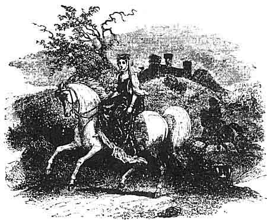
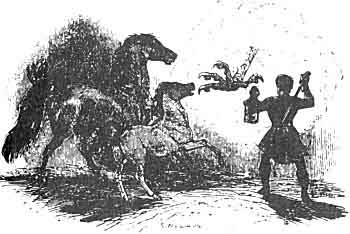

  
[Intangible Textual Heritage](../../../index.md)  [Legends and
Sagas](../../index)  [Celtic](../index)  [Index](index.md) 
[Previous](mab20)  [Next](mab22.md) 

------------------------------------------------------------------------

[Buy this Book at
Amazon.com](https://www.amazon.com/exec/obidos/ASIN/B001W0Z8PY/internetsacredte.md)

------------------------------------------------------------------------

  
*The Mabinogion*, tr. by Lady Charlotte Guest, \[1877\], at Intangible
Textual Heritage

------------------------------------------------------------------------

p. 360

 

### NOTES TO PWYLL PRINCE OF DYVED.

339a PWYLL.--*Page*
[339](mab20.htm#page_339.md).

NEARLY the whole of the Mabinogi of Pwyll Pendevig Dyved, has already
been printed with a translation in the Cambrian Register, and the story
has also appeared in Jones's Welsh Bards.

Who Pwyll (whose name literally signifies Prudence) really was, appears
to be a matter of uncertainty, but in some of the pedigrees of Gwynvardd
Dyved, Prince of Dyved, he is said to be the son of Argoel, or Aircol
Law Hir, [1](#fn_188.md) son of Pyr y Dwyrain. Mr.
Davies, in the "Rites and Mythology of the Druids," states that he was
the son of Meirig, son of Aircol, son of Pyr, which is rather confirmed
by some other MS. pedigrees.

In Taliesin's Preiddeu Annwn, he is mentioned, with big son Pryderi, in
such a manner as to lead to the inference that he flourished not later
than the age of Arthur. The opening lines of that remarkable composition
are given in the Myvyrian Archaiology, I. p. 45. It must be allowed that
their exact interpretation is by

p. 361

no means easy to discover, but the following version is from the pen of
a distinguished Welsh scholar. The allusions, it should be observed, are
very old and very obscure.

"Adorable potentate, sovereign ruler!  
Who hast extended thy dominion over the boundaries of the world!  
Arranged was the prison of Gwair in Caer Sidi  
By the ministration of Pwyll and Pryderi.  
None before him ever entered it.  
The heavy blue chain the faithful one keeps.--  
And on account of the herds of Annwn I am afflicted;  
And till doom shall my bardic prayer continue.  
Three times the loading of Prydwen we went there,  
Besides seven none returned from Caer Sidi."

In subsequent parts of the poem Arthur is spoken of as having himself
taken a share in the various expeditions which it records. The ship
Prydwen is well known as one of his treasures. See [p.
261](mab17.htm#page_261.md). Gwair's captivity, which one of the Triads
places in the Castle of Oeth and Annoeth, has been already adverted to,
[p. 192](mab14.htm#page_192.md).

 

339b DYVED.--*Page*
[339](mab20.htm#page_339.md).

IT often happens, and is a cause of great confusion in comparing ancient
story with modern topography, that the old names are retained while the
boundaries of the territory which they indicated are changed. Not
unfrequently the names of petty Celtic kingdoms were applied to modem
counties. This is the case with the name now before us. Dyved, the
country inhabited by the Dimetæ of the Romans, is now generally
considered to apply only to the county of Pembroke. It once included
also the counties of Carmarthen and Cardigan, forming, in fact, the
western, while Gwent formed the eastern division of South Wales.

There appears, however, to have been an exception to this general
division, a portion of Cardigan having been once exclusively termed
Ceredigiawn, and one-third part of Carmarthenshire having been included
in the District of Rheged, called subsequently "Cantrev Bychan and
Kidwelly." Lewis Dwnn, [1](#fn_189.md) in the
reign of Elizabeth, thus describes the ancient boundaries of Dyved, as
he understood them to have been:--

p. 362

"The kingdom of Dyved formerly extended between the rivers Teivy and
Towy, from Llyn Teivy and the source of the Towy to St. David's, and the
centre of this kingdom was the Dark-Gate, in Carmarthen, and there is at
this day a record of these boundaries in an old parchment book of the
Bishop of St. David's."

According to this Dyved would appear to have comprehended about a sixth
part of Cardiganshire, two-thirds of the county of Carmarthen, and the
whole county of Pembroke.

It is evident, however, that at the time the Mabinogi of Pwyll was
committed to writing, Dyved was restricted to the Cantrevs (or Hundreds)
of Arberth (or Narberth), Dan Gleddyv, y Coed, Penvro, Rhos, Pebidiog,
and Cenmaes, to which we are told that Pryderi added the three Cantrevs
of Ystrad Tywi, or Carmarthenshire, Cantrev Bychan, Cantrev Mawr, and
Cantrev Eginawg, together with the four Cantrevs of Ceredigiawn, Cantrev
Emlyn, Cantrev Caer Wedws, Cantrev Mabwyniawn, and Cantrev Gwarthav,
which seven Cantrevs were classed together under the appellation of
Seissyllwch. [1](#fn_190.md) The addition made by
Pryderi probably restored Dyved to its original extent at the time of
the Romans.

 

339c GLYN CUCH.--*Page*
[339](mab20.htm#page_339.md).

CUCH, or, as it is generally written, Cych, is the boundary stream
between the counties of Pembroke and Carmarthen, and falls into the
Teivy between Cenarth and Llechryd. In the upper part of Glyn Cuch (the
valley of the Cuch) was the residence of Cadivor Vawr, a regulus or
petty king of Dyved, who died in 1088, and was called lord of Blaen Cuch
and Cilsant. From him many of the principal families of Pembrokeshire
trace their descent.

p. 363

340a ARAWN, KING OF ANNWVYN.--*Page*
[340](mab20.htm#page_340.md).

THIS personage is the King of Annwn, already noticed (see [p.
280](mab17.htm#page_280).md) as having fought against Amaethon mab Don, in
the battle of Cad Goddeu. But it is doubtful whether he can be
identified either with the Arawn ab Cynvarch, whom the Triads celebrate
as one of the three Knights of Counsel, [1](#fn_191.md) or with the Aron mab Dewinvin, whose
grave is alluded to in the Englynion y Beddau.--Myv. Arch. I. p. 82.

 

340b ANNWVYN.--*Page*
[340](mab20.htm#page_340.md).

ANNWVYN, or Annwn, is frequently rendered "Hell," though, perhaps, "The
Lower Regions" would more aptly express the meaning which the name
conveys.

The Dogs of Annwn are the subject of an ancient Welsh superstition,
which was once universally believed in throughout the Principality, and
which it would seem is not yet quite extinct. It is said that they are
sometimes heard at night passing through the air overhead, as if in full
cry in pursuit of some object.

 

344a MOUND.--*Page*
[344](mab20.htm#page_344.md).

THE word in the original is Gorsedd, which signifies a tumulus or mound,
used as a seat of judicature, to which in its derivative sense it is
commonly applied.

The mound called the Tyn-wald, still remaining in the Isle of Man, was
long the place upon which the Deemsters of that Island held their
judicial assemblies.

 

347a RHIANNON.--*Page*
[347](mab20.htm#page_347.md).

AFTER the death of Pwyll, Rhiannon was, by her son Pryderi, bestowed in
marriage upon Manawyddan, the son of Llyr, and her subsequent history is
detailed in the Mabinogi that bears his name. Her marvellous birds,
whose notes were so sweet that warriors remained spell-bound for eighty
years together listening to them, are a frequent theme with the poets.

"Three things that are not often heard; the song of the birds of
Rhiannon, a song of wisdom from the mouth of a Saxon, and an invitation
to a feast from a miser." [2](#fn_192.md)

p. 364

347b HEVEYDD HÊN.--*Page*
[347](mab20.htm#page_347.md).

ACCORDING to the Triads, Heveydd Hên (probably the same as Hyvaidd Hir)
was the son of Bleiddan Sant [1](#fn_193.md) of
Glamorgan, and was one of the three stranger kings upon whom dominion
was conferred for their mighty deeds, and for their praiseworthy and
gracious qualities. But in some of the pedigrees he is called the son of
Caradawc Vreichvras.--See Professor Rees's Welsh Saints, p. 103.

 

354a GWENT IS COED.--*Page*
[354](mab20.htm#page_354.md).

ONE of the divisions of Gwent; the other two being Gwent Uch Coed, and
Gwent Coch yn y Dena, or the Forest of Dean. Gwent was the name formerly
applied to the eastern division of South Wales. In its present
restricted sense it is applied only to the county of Monmouth.

 

355a GWRI GWALLT EURYN.--*Page*
[355](mab20.htm#page_355.md).

GWRI GWALLT EURYN, styled at the close of the present tale Pryderi (care
or anxiety), is frequently alluded to by the Bards, who speak of him
under either name indiscriminately. In the Mabinogi of Kilhwch and Olwen
he appears under his earlier appellation, perhaps, however, Pryderi is
that by which he is best known. He was one of the chief swineherds of
the island, and was so called because he kept the swine of Pendaran
Dyved, in the Vale of Cuch in Emlyn. One of the Triads says that the
swine he tended were those of Pwyll himself, and that he had the care of
them during his father's absence in Annwn. This version, however, does
not correspond with the circumstances as given in the text, which imply
that Pryderi's birth must have taken place long after Pwyll's mysterious
expedition.

We find the adventures of Pryderi's maturer years detailed in the
Mabinogi of Manawyddan, with whom his name is coupled in a passage of
the Kerdd am Veib Llyr, attributed to Taliesin.

In the tale of Math ab Mathonwy it is related that Pryderi was deprived
of life by Gwydion ab Don, who was enabled by magical arts to overcome
him in single combat, after having by similar means defrauded him of
some swine which had been sent him from Annwn, and which he and his
people highly prized.

The encounter took place near Melenryd, a ford on the Cynvael, a

p. 365

river of Merionethshire. The same authority places his grave at Maen
Tyriawg, near Ffestiniog, but a different locality is assigned to it in
the Enelynion Beddau.

"In Abergenoli is the grave of Pryderi,  
Where the waves beat against the shore."

Dyved was called by Lewis Glyn Cothi "Gwlad Pryderi," and by Davydd ab
Gwilym "Pryderi dir," and sometimes "Gwlad yr Hud," or the Land of
Enchantment.

 

357a PENDARAN DYVED.--*Page*
[357](mab20.htm#page_357.md).

WE learn from the Triads, that the foster-father of Pryderi was the
chief of one of the principal Welsh tribes; that which extended over
Dyved, Gower (in Glamorgan), and Cardigan. [1](#fn_194.md)

Beyond this, and the fact of his possessing an immense herd of swine,
which his foster-son Pryderi kept for him in the Vale of Ouch, but few
particulars of Pendaran Dyved are extant.

 

 

------------------------------------------------------------------------

### Footnotes

[360:1](mab21.htm#fr_189.md) Aircol Law Hir is
recorded, in the Liber Landavensis, to have been the son of Tryfun and
contemporary with St. Teiliaw, who flourished in the Sixth century. We
find the grave of Aircol spoken of as being in Dyved.--Myv. Arch. I. p.
82.

[361:1](mab21.htm#fr_190.md) "Heraldic Visitation
of Wales," published by the Welsh MSS. Society, under the care of Sir
Samuel Rush Meyrick.

[362:1](mab21.htm#fr_191.md) Seissyllwch was one
of the ancient kingdoms of South Wales, and must not be confounded with
Essyllwg (the Welsh word for the country of the Silures), as it has
sometimes been. In the life of St. Paternus (preserved among the Cotton
MSS.) it is said that the whole of South Wales was divided into three
kingdoms, the same forming three bishoprics. Of these, the kingdom of
Seissyl received its consecration from St. Paternus, Bishop of
Llanbadarn Vawr, as the other two, those of Rein and Morgant, did from
St. David and St. Eliu \[Teiliaw\]. The latter kingdom, Glamorgan,
having derived its appellation from Morgan, a sovereign of the tenth
century, it is probable that the name of Seissyllwch is of the same
date, and also that it may be derived from Seissyll, or Sitsyllt, the
father of Llewelyn ab Sitsyllt, Prince of North Wales. The name of
Seissyllwch occurs in the Triads, where we are told that Cynan Meriadawc
led the warriors of that district to the assistance of Maxen
Wledig.--Triad 14.

[363:1](mab21.htm#fr_192.md) Triad lxxxvi.

[363:2](mab21.htm#fr_193.md) Trioedd y Cybydd, The
Miser's Triads. Myv. Arch. III. p. 245.

[364:1](mab21.htm#fr_194.md) Written in other
versions of the Triads, Bleiddig in Deheubarth.

[365:1](mab21.htm#fr_195.md) Triad 16.

------------------------------------------------------------------------

[Next: Branwen the Daughter of Llyr](mab22.md)
