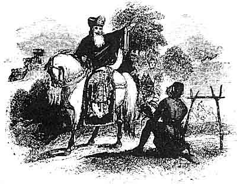
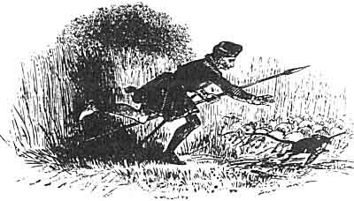

  
[Intangible Textual Heritage](../../../index)  [Legends and
Sagas](../../index)  [Celtic](../index)  [Index](index) 
[Previous](mab24)  [Next](mab26) 

------------------------------------------------------------------------

[Buy this Book at
Amazon.com](https://www.amazon.com/exec/obidos/ASIN/B001W0Z8PY/internetsacredte)

------------------------------------------------------------------------

  
*The Mabinogion*, tr. by Lady Charlotte Guest, \[1877\], at Intangible
Textual Heritage

------------------------------------------------------------------------

p. 411

 

### MANAWYDDAN THE SON OF LLYR.

THE Prince who figures as the hero of the present Mabinogi, is the
subject of two Triads, in one of which his singular adventures are thus
alluded to:--

"Three Makers of Golden Shoes, of the Isle of Britain: Caswallawn the
son of Beli, when he went as far as Gascony to obtain Flur, the daughter
of Mygnach Gorr, who had been carried thither to Cæsar the Emperor, by
one called Mwrchan the Thief, king of that country and friend of Julius
Cæsar, and Caswallawn brought her back to the Isle of Britain;
Manawyddan the son of Llyr Llediaith, when he was as far as Dyved laying
restrictions; Llew Llaw Gyffes, when be was along with Gwydion, the son
of Don, seeking a name and arms from Arianrod, his mother."--Triad 124.

In the other, he is represented as one of the humble princes of the
Island, because, having cultivated minstrelsy after the captivity of his
brother Bran, he would not afterwards resume his rank, although be might
have done so.--Tr. 38.

p. 412

Manawyddan is mentioned in the Dialogue between Arthur, Kai, and
Glewlwyd; and his name occurs in connexion with that of Pryderi in the
Poem on the Sons of Llyr, "Kerdd meib Llyr," [1](#fn_202) of Taliesin.

The other principal personages whose names appear in this Mabinogi, are
here passed over in silence, having been already made the subjects of
various preceding notes.

It may be useful to remind the reader that Lloegyr is the Welsh name for
the eastern and greater part of the island; and corresponds in modern
usage with the word England.--See [p. 210](mab14.htm#page_210).

 

 

------------------------------------------------------------------------

### Footnotes

[412:1](mab25.htm#fr_203) Myv. Arch. I. 67,
167.

------------------------------------------------------------------------

[Next: Math the Son of Mathonwy](mab26)
