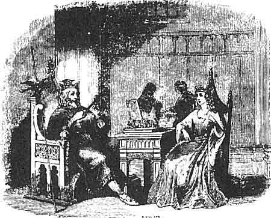
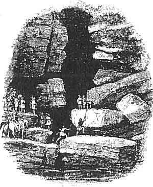

  
[Intangible Textual Heritage](../../../index.md)  [Legends and
Sagas](../../index)  [Celtic](../index)  [Index](index.md) 
[Previous](mab28)  [Next](mab30.md) 

------------------------------------------------------------------------

[Buy this Book at
Amazon.com](https://www.amazon.com/exec/obidos/ASIN/B001W0Z8PY/internetsacredte.md)

------------------------------------------------------------------------

  
*The Mabinogion*, tr. by Lady Charlotte Guest, \[1877\], at Intangible
Textual Heritage

------------------------------------------------------------------------

p. 453

 

### MAXEN WLEDIG.

443a *Page* [443](mab28.htm#page_443.md).

MAXIMUS, the Maxen of the present Tale, was invested by his army with
the Imperial purple in the year 383. He was of low birth, and Spanish
origin. He served much in Britain, in which Island he commanded at the
time of his elevation, and whence he proceeded with his army into Gaul,
to support his claim against the lawful emperor Gratian.

It is said that he rendered part of Britain desolate by transporting the
inhabitants into Gaul, where they are supposed to have formed the Breton
immigration. He was put to death in the neighbourhood of Aquileia, after
having been defeated by Theodosius and Valentinian the Younger, in
388.--Gibbon, chap. xxvii.

Maximus is the subject of many Welsh legends. Part of his history will
be recognized as forming the basis of the exaggerated fictions of the
text.

p. 454

As regards the other personages who figure in the present Tale, we find
that the two most conspicuous, Kynan (or Kynan Meriadawc, as he is
usually called), and his sister Helen Luyddawg, or Helen of mighty
hosts, were the children of Eudav. A Triad is preserved, which goes at
some length into the account of the expedition they undertook for the
purpose of supporting the claim of Maximus to the Imperial throne. They
raised an army of sixty thousand men in Britain, and proceeded with it
across the sea to Armorica, A.D. 383. The desolation caused by this
abstraction of its inhabitants from the Island is said to have been the
remote cause of the Saxon invasion.--Tr. 14.

The history of Kynan is also preserved in a Legendary Life.

The Brut Gruffydd ab Arthur gives a different account of the personages
and events alluded to in this Mabinogi, but does not advert to the
dream, though it mentions St. Ursula and the eleven thousand virgins,
who were sent from Britain as wives for the emigrated hosts of Kynan
Meriadawc, in Armorica. According to Gruffydd, Helen Luyddawg was the
only child of King Coel (the founder of Colchester), and was bestowed in
marriage, with the dominions she inherited, upon the Roman Constans.
Their son, the celebrated Constantine, was called from his kingdom of
Britain to the Imperial throne, in place of Maximus the Cruel; after his
departure, Eudav earl of Cornwall, rose up and wrested the government of
the Island from the hands of those princes to whom Constantine had
consigned it, and, in spite of the Roman forces sent against him under
Trahayarn, Helen's uncle, established himself on the throne.

Eudav's reign extended to the time of the emperors Gratian and
Valentinian. His heir was an only daughter, whose name does not appear,
but whom, by advice of his nobles, he married to the Roman senator,
Maxen Wledig, who boasted British descent, being the son of Helen's
uncle Llewelyn. Maxen's marriage, and his succession to the sovereign
power, were long and strenuously opposed by Eudav's nephew, Kynan
Meriadawc, who himself aspired to the crown.

But peace having at length been concluded between them, Kynan
accompanied Maxen in an expedition which he undertook on the continent,
and was rewarded for his assistance with the kingdom of Llydaw, or
Armorica, in which Maxen left him to establish himself, whilst he
proceeded to contend for the nobler prize. But having killed
Valentinian, and driven Gratian from the empire,

p. 455

\[paragraph continues\] Maxen himself was
soon after slain at Rome; whereupon the vast hosts that had accompanied
him from Britain dispersed, the chief part of them seeking refuge in
Armorica with Kynan Meriadawc.--Myv. Arch. II. p. 205-225.

The same story is related by Nennius, who calls the emperor Maximianus.

"The seventh emperor was Maximianus. He withdrew from Britain with all
its military force, slew Gratianus the king of the Romans, and obtained
the sovereignty of all Europe. Unwilling to send back his warlike
companions to their wives, families, and possessions in Britain, he
conferred upon them numerous districts from the lake on the summit of
Mons Iovis, to the city called Cant Guic, and to the western Tumulus,
that is Cruc Occident. These are the Armoric Britons, and they remain
there to the present day. In consequence of their absence, Britain being
overcome by foreign nations, the lawful heirs were cast out, till God
interposed with his assistance."

The lake here mentioned is thought to be that near the hospice of the
great St. Bernard, and Cant Gwic is probably Cantavic, in Picardy. It is
more difficult to identify Cruc Occident, the western Tumulus, but the
author of the Hanes Cymru supposes it to be Mont St. Michel, near
Quiberon, in Brittany.

Some copies of Nennius contain an account of the lingual disablement of
the women, similar to that in the text; and add, that from this cause
they were called Letewiccion \[Lledfydion\], that is Semitacentes. This
is evidently an attempt to account for the name of Letavia \[Llydaw\],
as applied to Armorica.

Gildas, in his work "De Excidio Britanniæ," also mentions the revolt of
Maximus, and its disastrous consequences:--

"Afterwards Britain, being robbed of all its armed soldiery, and
military forces, was abandoned to cruel rulers, being deprived of an
immense number of youths who accompanied the above-named tyrant
\[Maximus\], and never returned home; and being totally ignorant of the
art of war, groaned in stupefaction for many years, under the oppression
of two foreign nations," &c. &c.

This author, however, has not any allusion to the Armorican settlement.

The roads attributed in the text to Helen Luyddawc, are evidently the
Roman Roads, which intersected our Island. Their remains in several
places in the Principality, bear, to this day, the name of Sarn

p. 456

\[paragraph continues\] Helen, which some,
however, consider to be a corruption Of Sarn y Lleng, the Road of the
Legion.

The Welsh text of this Mabinogi, Breuddwyd Maxen Wledig, was printed in
1806, in a Welsh collection entitled the Greal, p. 289, but no
translation of it has hitherto appeared.

 

 

------------------------------------------------------------------------

[Next: Here is the Story of Lludd and Llevelys](mab30.md)
