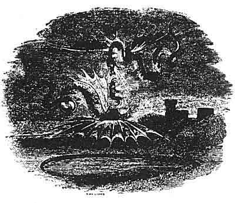
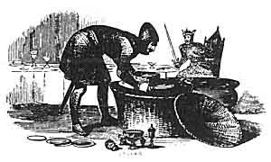

  
[Intangible Textual Heritage](../../../index)  [Legends and
Sagas](../../index)  [Celtic](../index)  [Index](index) 
[Previous](mab30)  [Next](mab32) 

------------------------------------------------------------------------

[Buy this Book at
Amazon.com](https://www.amazon.com/exec/obidos/ASIN/B001W0Z8PY/internetsacredte)

------------------------------------------------------------------------

  
*The Mabinogion*, tr. by Lady Charlotte Guest, \[1877\], at Intangible
Textual Heritage

------------------------------------------------------------------------

p. 466

 

### LLUDD AND LLEVELYS.

LLUDD is the celebrated King Lud, brother to Cæsar's opponent
Cassibelaunus. The Brut and Geoffrey of Monmouth record his fortifying
and decorating the City of London nearly in the same terms as the
Mabinogi, stating that it was from him called Caerlud, afterwards
corrupted into Caer London, then into London, and lastly by the
foreigners into Londres. They also state that King Lud was buried near
the gate, still called from his name, in the British language, Porthlud,
and in the Saxon, Ludesgate.

Amongst the poems attributed to Taliesin, is one called "Ymarwar Lludd,"
"The Conciliation of Lludd," in which the meeting with Llevelys is
mentioned; but the poem is very obscure in consequence of the allusions
not being understood. Llewelyn the Bard also, in an ode to Llewelyn ab
Iorwerth, refers to this occurrence, but in so cursory a manner, as not
to throw any further light upon the subject.

The Coranians who occupy so conspicuous a place in the present Tale,
form the subject of a Triad (Tr. vii.). They are by some supposed to be
the Coritani.

p. 467

The imprisonment of the Dragons in Dinas Emrys in Snowdon, is one of the
most curious legends of romantic fiction. Their combats, five centuries
later, led to the discovery of the enchanter Merlin, with which opens
the great drama of Arthurian Romance. This story being related by
Geoffrey of Monmouth, has by many been considered as the fabrication of
that writer; but it must be noticed that it is also found in Nennius,
who wrote in the eighth century, and of whose works, some copies as old
as the tenth, are still extant. The substance of the tale as told by
Nennius is as follows:--

Vortigern being forced to retire from his kingdom, in consequence of his
various delinquencies, took refuge in Snowdon; and finding Dinas Emrys
an eligible spot, commenced building a tower there. But, to his great
dismay, he found that whatever he that whatever he built in the daytime,
always fell down in the succeeding night. Having consulted his magicians
upon the cause of this mystery, they told him that unless he could find
a child without a father, and sprinkle the tower with his blood, it
would never stand. Upon this Vortigern despatched messengers in every
direction to search for the required victim, and at length they lit upon
Merlin, whom they brought to Vortigern, that he might be slain. But the
boy exposed the ignorance and imposture of the magicians, and caused the
ground to be dug at the foundation of the building, where they found two
sleeping dragons, one white and the other red. These dragons awaking
from their sleep commenced a furious conflict. The white one at first
had the advantage of the red, but at last the red dragon prevailed, and
expelled his opponent. Merlin then informed them that the red was the
British dragon, and the white one that of the invading Saxons. Then it
was, according to Geoffrey and the Brut, that Merlin uttered the
celebrated prophecy concerning the fate of Britain. Vortigern departing
thence to seek some other place of refuge, bestowed that citadel upon
the wonderful child, who declared his name to be Merlin Ambrosius, and
after whom the spot was called Dinas Emrys.

Whatever date or origin may be assigned to this legend, it is well known
that the red dragon has long been the national standard of the Welsh.
Henry VII. bore it at Bosworth, and afterwards established the heraldic
office of Rouge Dragon in honour of the occasion.

Dinas Emrys, the site of all these marvels, is a natural mound, or
rather a small insulated hill in one of the valleys of Snowdon, between
Beddgelert and Capel Curig. Giraldus Cambrensis speaks of it in
connection with the story here referred to. He says, "At the head

p. 468

of the Snowdon Mountains, not far from the source of the Conway, which
flows from this region towards the north, stands Dinas Emrys; that is,
the promontory of Ambrosius, where Merlin, sitting on a rock, prophesied
to Vortigern."

Lludd and Llevelys is found in the Myvyrian Archaiology, Vol. II., in
the Brut Gruffydd ab Arthur, and the Brut Tysilio; and is printed in a
separate form in the Greal, apparently from a different MS. An English
translation of the Myvyrian copy has been given by the Rev. Peter
Roberts, in "The Chronicle of the Kings of Britain."

 

 

------------------------------------------------------------------------

[Next: Taliesin](mab32)
