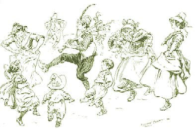

[Intangible Textual Heritage](../../../index.md)  [Sagas and
Legends](../../index)  [Celtic Folklore](../index.md) 

------------------------------------------------------------------------

<table width="75%">
<colgroup>
<col style="width: 50%" />
<col style="width: 50%" />
</colgroup>
<tbody>
<tr class="odd">
<td width="50%" data-valign="CENTER"></td>
<td width="50%" data-valign="CENTER"><h1 id="celtic-music" data-align="CENTER">Celtic Music</h1></td>
</tr>
</tbody>
</table>

------------------------------------------------------------------------

Here is a small collection of Celtic-themed midi files for your
listening enjoyment while reading the Celtic folklore files.

These files were rescued from the now defunct Belinus site. You can
download these files and play them in any midi player application.

------------------------------------------------------------------------

[Anglers reel](angreel.mid.md) *50176 bytes*  
[Banshee](banshee.mid.md) *3845 bytes*  
[Cooleys](cooleys.mid.md) *24103 bytes*  
[Faery dance](fdance.mid.md) *2072 bytes*  
[Foggy Dew](fogdew.mid.md) *9465 bytes*  
[Green Grvsin](green.mid.md) *6839 bytes*  
[Irish medly](irishmed.mid.md) *5015 bytes*  
[Irish Washerwoman](irishwsh.mid.md) *7404 bytes*  
[King of the Fairies](kingfair.mid.md) *9622 bytes*  
[Oak Tree](oaktree.mid.md) *30720 bytes*  
[Garberry](garbarry.mid.md) *5908 bytes*  
[Haystack](haystack.mid.md) *16166 bytes*  
[Humors](humors.mid.md) *5936 bytes*  
[Beggar](jbeggar.mid.md) *10957 bytes*  
[Salamanc](salamanc.mid.md) *13938 bytes*  
[Set41](set41.mid.md) *5288 bytes*  
[Tandern](tandern.mid.md) *9471 bytes*  
[Washerwoman](washer.mid.md) *18846 bytes*  

------------------------------------------------------------------------

[celtharp.mid](celtharp.mid.md) *12613 bytes*  
[celtic1.mid](celtic1.mid.md) *8139 bytes*  
[celtic2.mid](celtic2.mid.md) *7904 bytes*  
[celtic3.mid](celtic3.mid.md) *9051 bytes*  
[celtic4.mid](celtic4.mid.md) *6735 bytes*  
[celtic5.mid](celtic5.mid.md) *18237 bytes*  
[celtkesh.mid](celtkesh.mid.md) *15566 bytes*  
[celtsong.mid](celtsong.mid.md) *5565 bytes*  
