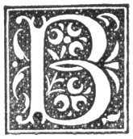

  
[Intangible Textual Heritage](../../../index)  [Legends and
Sagas](../../index)  [Celtic](../index)  [Index](index) 
[Previous](nes07)  [Next](nes09) 

------------------------------------------------------------------------

p. 21

# CHAPTER V.

### BOY CODE OF HONOUR.

|                     |
|---------------------|
|  |

OYS seem to fight at times for the fun of fighting, and it is not at all
difficult to got up a fight at any time. One will say to his companion,
"Jock, will ye faicht Tam?" "Aye, will a," is at once the answer. Away
the fighter, with a few companions, sets out in search of Tam. Tam is
soon found. "Eh, Jock says he'll try a faicht wee ye, Tam," cries out
one of Jock's companions. "Will ye dee’t?" Another shouts out, "Eh, Tam,
man, ye're fairt at Jock." "A'm nae fairt at Jock, nor at him an you
athegither," is the indignant answer. "Come on, Jock," shout two or
three voices. Jock and his opponent meet, and look each other in the
face. A third steps in between the two, holds out his arm between them
and says, "The best man spit our that." [1](#fn_15) Jock spits. Then all cry, "Follow yir
spittle," and Jock rushes on his opponent, and the two fight till they
are tired. Sometimes, when one wishes to get up a fight with a companion
who does not wish to fight, he challenges him by striking him a blow,
which is called the "coordie blow." If he does not accept the challenge
he is set down as a coward, and all who see the blow struck cry out,
"coordie, coordie."

It was always accounted cowardly for two boys to attack one, hence the
saying:--

"Ane for ane may compare,  
Bit twa for ane is raither sehr."

In starting on a race, or in doing anything that required a little space
to do it, when the onlookers were pressing too near, the cry was, "Gie
’im Scots room," which seemed to mean

p. 22

about as much space as enabled him to toss both his -arms at full length
around him.

In parts of Banffshire boys, on concluding a bargain, linked the little
fingers of their right hands together, shook the hands with an
up-and-down motion, and repeated the words:--

"Ring, ring the pottle bell;  
Gehn ye brak the bargain,  
Ye'll gang t’ hell."

This ceremony was called "ringing the pottle-bell," and to break a
bargain, after being sealed in this fashion, was regarded as the height
of wickedness.

The following was current about Fraserburgh:--

"Ring a bottle, ring a bell,  
The first brae it ye cum till,  
Ye'll fa’ doon an brack yer neck,  
An that ’ill the bargain brack."

Here is another solemn formula of bargain-making. When the bargain was
struck the one said to the other, "Will ye brak the bargain?" "No," was
the answer. "Swear, than," said the first. Then came this oath:--

"As sure's death  
Cut ma breath  
Ten mile aneth the earth,  
Fite man, black man  
Burn me t’ death."

\[paragraph continues\] If the bargain was broken, the doom of the
breaker was looked upon as sure, and with awe.

Here is a shorter formula:--

"As sure's death  
Cut ma breath."

\[paragraph continues\] With these words the buyer and seller drew the
forefinger across the throat.

It was a maxim in the code of honour that if one made a gift of anything
to a companion it was not to be asked back. If such a thing was done the
taunt was thrown at him--"Gie a thing, tack a thing, the ill-man's
bonnie thing."

p. 23

The following are more explicit:--

"Tack a thing an gee a thing,  
The aul’ man's goud ring.  
Lie but, lie ben,  
Lie amo’ the bleedy men."

\[paragraph continues\] And:--

"Tack a thing an gee a thing  
Is the aul’ man's byename,  
Row but, row ben,  
Row amo’ the bleedy men."

Here is a shorter version:--

"Lie but, lie ben,  
Lie amo’ the bleedy men."

To act the informer was and still is looked upon as something very mean
and cowardly, and one who was guilty of such all action led no pleasant
life among his companions. Whenever he appeared for a time after giving
the information he was hailed with the words:--

"Clash-pyot, clash-pyot,  
Sits in the tree.  
Ding doon aipples  
Ane, twa, three;  
Ane for the lady,  
An ane for the laird,  
An ane for the clash-pyot  
It sits in the tree."

One convicted of lying was received among his fellows with the words of
welcome:--

"Leearie, leearie, licht the lamps,  
Lang legs and crookit shanks;  
Hang the leearie o’er a tree,  
That ’ill gar the leearie never lee."

\[paragraph continues\] This shorter form was repeated again and
again:--

"Leearie, leearie, lick stick."

If a boy or girl wished to get a share of any bit of sweetmeat or fruit
from a companion, the eyes were shut, the hand was held out, and the
words were repeated:

p. 24

"Fill a pottie, fill a pannie,  
Fill a blin’ man's hannie.

When one boy or girl made a present of "sweeties," lozenges, or such
like, to another, if only one or two were given, the following words
were repeated:--

"Ane ’s nane,  
Twa ’s some,  
Three's a birn,  
Four's a horse laid."

A boy, when he finds anything that has been lost, cries out, "The thing
it's fun's free," and, if he has a companion, he cries out "Halfs." It
is considered that, unless the two cries are uttered almost at once, the
boy who first speaks is entitled to the whole of the found property.

------------------------------------------------------------------------

### Footnotes

[21:1](nes08.htm#fr_15) Cf. Henderson, p. 32.

------------------------------------------------------------------------

[Next: Chapter VI. About the Human Body](nes09)
