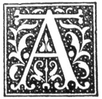

  
[Intangible Textual Heritage](../../../index)  [Legends and
Sagas](../../index)  [Celtic](../index)  [Index](index) 
[Previous](nes18)  [Next](nes20) 

------------------------------------------------------------------------

p. 76

# CHAPTER XVI.

### RIDDLES.

|                     |
|---------------------|
|  |

GREAT source of amusement among the folk was, and still is, at least
among the young, a kind of riddles in rhyme. One characteristic of many
of them is the horrible descriptions they contain, and these
descriptions generally turn out to be something very innocent. The
riddles have in most cases the appearance of being very old.

"There wiz a man of Adam's race,  
Who had a certain dwelling-place,  
It was neither in earth, heaven, nor hell.  
Come, tell me where that man did dwell?"  
                       "Jonah in the whale's belly."

"Two brothers dear,  
Two sisters' sons are we,  
Our father's our grandfather,  
And whose sons are we?"  
                        "Lot's."

As I leukit our my father's castle wa’,  
I saw a bunch o’ waans,  
An nae ane can coont them but God's ain han’s?"  
                    "The hair of the head."

"As I leukit our ma father's castle,  
I saw a bodie stanin;  
I took aff's head and drank's bleed,  
And left's body stanin?"  
                "A bottle."

"It's lang an its roon,  
An its as black's coal,  
Wi’ a lang and a plump hole?"  
                 "A bottle."

p. 77

"As I geed our the Brig o’ Dee  
I met Geordie Buchan;  
I took aff his head, an drank his bleed,  
An left his body stan’in?"  
            "A bottle of whisky."

"An it's naither Peg, Meg, nor Margit  
Its my true love's name;  
An it's naither Peg, Meg, nor Margit,  
An thrice I've told her name?"  
                   "Ann."

"As I went to Westminster school,  
I met a Westminster scholar,  
He pulled off his hat  
And drew off his gloves,  
And I have told you the name of the scholar?"  
                                 "Andrew."

"There wiz a king met a king  
In a narrow lane,  
Said the king to the king,  
'Where hae ye been?'  
'I hae been where ye hae been,  
Huntin at the roe.'  
'Will ye lend me yir dog?'  
'Yes, I will do so.  
Call upon him, call upon him.'  
'What is his name?'  
'I have told you twice,  
And I will tell you again?'"  
                      "Bean."

"Caul kail, aul’ kail,  
Nine days' aul’ kail,  
Boilt in a pot, fried in a pan,  
Spell ye that wi’ four letters if ye can?"  
                        "That."

"Aberdeen and Aberdour,  
Spell that in letters four?"  
                   "That."

"There was a man raid through this toon--  
Gray Thistle was his name;  
His girth was gold, his bridle bold,  
And thrice I've told his name?"  
                         "Was."

p. 78

"It is in every mountain,  
It's not in any hill,  
It's not in all the world,  
And yet it's in the mill?"  
               "The letter m."

The minister an the schoolmaister  
An maister Andrew Lamb  
Geed oot t’ view the gairden  
Fahr three pears hang;  
Ilky ane pu’d a pear  
An still twa hang?"

"The minister and the elder and lang John Lamb  
Geed a' till a pear tree  
Where three pears hang,  
And ilky ane pu'd a pear  
And still twa pears hang?"  
              "John Lamb is both minister and elder."

"Three hail cakes,  
Three half cakes,  
Three quarters o’ anither,  
Atween the piper and his wife  
And the fiddler and his mither.  
Divide without breaking the cakes?"  
    "The piper's wife is the fiddler's mother."

"Ten teeth withoot a tongue,  
It is gueede sport t’ aul’ an young;  
Take it oot o’ts yallow fleece  
An kittle’t on the belly piece?"  
                         "A fiddle."

"As I went to the school alone  
I found a little pennerie;  
’Twas painted oot, ’twas painted in,  
’Twas painted our wi’ poverty:  
’T would kill a bull, I would kill a bear,  
’T would kill a thousand men and mehr?"  
                                   "Hunger."

"Humpity Dumpity sat on a wall,  
Humpity Dumpity got a great fall,  
The king wi’ a' his men  
Cudna lift Humpity Dumpity again?"  
                  "An egg."

p. 79

"I geed by a hoosie,  
An it wiz fou o’ meht,  
But there wiz naither door nor window  
T’ lat me in to eht?"  
                 "An egg."

"I think you live beneath a roof  
That is upheld by me;  
I think you seldom walk abroad,  
But my fair form you see;  
I close you in on every side,  
Your very dwelling pave,  
And probably I'll go with you  
At last into the grave?"  
                  "Wood."

"There wiz a man bespoke a coat.  
When the maker it home did bring,  
The man who made it would not have it,  
The man who spoke for’t cudna use it,  
And the man who wore it cudna tell  
Whether it suited him ill or well?"  
                               "A coffin."

"It's as roon as a mill-wheel,  
An luggit like a cat;  
Though ye sud clatter a’ day,  
Ye’d never clatter that?"  
                   "A tub."

"A countrie loon cam doon the toon  
Wi’ three feet up and twa feet doon,  
Wi’ the moo of the livin an the head o’ the dead,  
Come tell me my riddle an I'll gee ye ma head?"  
                    "A boy with a pot on his head."

"Three feet eemist, cauld an deed,  
Twa feet nethmest, flesh an bleed;  
The head o’ the livin  
An the mou o’ the deed?"  
        "A man with a metal pot on his head."

"Pee pee pattie,  
Three feet an a timmer hattie?"  
              "A pot with a wooden cover."

"Father, mother, sister, brother,  
A’ lies in ae bed,  
An diz na touch each other?"  
               "The bars of a grate."

p. 80

"Lang legs,  
Short thighs,  
Little head,  
An no eyes?"  
           "The tongs."

"Chick, chick, cherry,  
A’ the men in Kirry,  
Cudna clam chick, chick-cherry?"  
                               "Smoke."

"As I geed t’ ma father's fehst  
I saw a great notorious behst  
Wi’ ten tails an forty feet,  
An aye the behst crape oot an eat?"  
                        "A ten-ousen pleugh."

"Hairy oot, an hairy in,  
His the hair but wints the skin?"  
                    "A hairy rope."

"As I leukit our ma father's castle wa'  
A saw the dead carryin the livin awa?"  
                          "A ship."

"A riddle, a riddle, a rot tot tot,  
I met a man wi’ a red, red coat,  
A staff in han’ an a stehn in’s throat,  
Come, tell me my riddle an a’ll gee you a groat?"  
                              "A cherry."

"It's as fite’s milk,  
It's as saft’s silk,  
It hiz a beard like a buck,  
An a tail cocking up?"  
                 "An onion."

"Hobbity-bobbity sits on this side o’ the burn,  
Hobbity-bobbity sits on that side o’ the burn,  
An gehn ye touch hobbity-bobbity,  
Hobbity-bobbity ’ill bite you?"  
                          "A nettle."

"Robbie-Stobbie on this side o’ the dyke,  
Robbie-Stobbie on that side o’ the dyke,  
An gehn ye touch Robbie-Stobbie,  
Robbie-Stobbie ’ill bite ye?"  
                          "A nettle."

p. 81

"It's as white's milk  
An as black's coal,  
An it jumps on the dyke  
Like a new shod foal?"  
                 "A magpie."

"Reddicy roddichy rins on the dyke,  
Keep awa’ yir clockin hen,  
I carena for yir tyke?"  
                         "A worm."

"Lang man legless  
Cam till my door staffless,  
Hand awa’ yir cocks an hens,  
Yir dogs an cats I fehr na?"  
                     "A worm."

"It sits high  
An cries sair,  
Hiz the head,  
Bit wints the hair?"  
         "The town clock."

"It's as roon’s the meen  
An as clear’s crystal,  
In ye dinna tell me ma riddle  
A’ll shot ye wi’ ma pistal?"  
                     "A watch,"

"There wiz a thing of four weeks old  
When Adam was no more,  
And ere that thing was five months old  
Adam was four score?"  
                     "The moon."

"Fite bird featherless,  
Flew oot o’ Paradise,  
An lichtit on yon castle wa’,  
An Lord Lan’less  
Took it up han’less,  
An raid awa’ horseless?"  
                     "A snowflake."

"Bank-fou an brae-fou,  
Though ye gaither a’ day,  
Ye winna gaither a stoup-fou?"  
                           "Mist."

p. 82

"I sat wi, my love,  
I drank wi’ my love,  
And my love she gave me licht;  
And I will give you a pint o’ wine  
To read my riddle richt?"  
            "A man murdered his lady love."

"Oot atween twa woods, and in atween twa waters?"  
                         "A woman going to fetch water in two wooden
pails."

"What is it that goes out black, and comes in white?"  
                         "A black cow on a snowy day."

"Dee ye ken fuh Scatterty's cat winna eat salmon?"  
                         "Because she canna get it."

"At what season of the year are there most holes in the ground?"  
                         "In autumn, when the crop is all cut."

Spell withered girss wi’ three letters?"  
                         "Hay."

"What is neither in the house, nor out of the house, and still is about
the house?"  
                         "A window."

"What prophet was with Adam in Paradise and with Noah in the Ark?--He
does not believe in the Resurrection, but he does not deny a word of the
Christian faith."  
                         "The cock."

"What is it that gangs wi’ts hehd down?"  
                         "A nail in a horse's shoe."

Where did Noah strike the first nail of the ark?"  
                         "On the head."

"Faht twa black things is’t it lies at your bedside an gapes for your
behns?"  
                         "Your shoes."

"Faht is’t gangs our an our the water an never touches it?"  
                         "Your shadow."

Would ye raither lie on a bed o’ bibbles or a bed of scarlet?"  
                         "The bed of scarlet means hell."

"Faht's the difference between a black doo an a fitan?"  
                         "Fitan is the whiting, the fish."

How many toad's tails wid it need to gang t’ the meen?"  
                         "Ane, gehn it be lang eneuch."

"Faht is’t that grows wi’ its head down?"  
                         "An icicle."

------------------------------------------------------------------------

[Next: Chapter XVII. Marriage](nes20)
