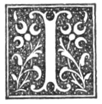

  
[Intangible Textual Heritage](../../../index)  [Legends and
Sagas](../../index)  [Celtic](../index)  [Index](index) 
[Previous](nes21)  [Next](nes23) 

------------------------------------------------------------------------

p. 117

# CHAPTER XIX.

### PLACE AND FAMILY CHARACTERISTICS.

### ABERDEEN.

|                     |
|---------------------|
|  |

N the ballad of 'The Battle of Harlaw,' the burgh of Aberdeen is styled
"brave":--

"The Provost of brave Aberdeen,  
  With trumpets and with tuck of drum,  
Came shortly in their armour sheen."

In the ballad of the 'Duke of Gordon's Three Daughters,' Aberdeen is
characterised as "bonnie":--

"The Duke of Gordon has three daughters,  
  Elizabeth, Margaret, and Jane;  
They wad na stay in bonnie Castle Gordon,  
  But they wad go to bonnie Aberdeen."

### DRUM.

The laird of Drum and his brother laird of Lawrieston are mentioned in
the ballad of 'The Ballad of Harlaw' in this way:--

"The strong undoubted laird of Drum,  
The stalwart laird of Lawrieston,  
With ilk their forces all and some.

### DUFF.

Duff is the family name of the Earl of Fife. The family has gone on for
several generations, adding, from a beginning not at all large, land to
land, so that the estates now bulk largely in the shires of Banff,
Aberdeen, and Moray. Hence, probably, has arisen the proverb "Duffs
luck."

p. 118

### FRASER.

Thomas the Rhymer has delivered himself regarding the family of Saltoun.
There are several versions of the "prophecy":--

"Quhen there's ne'er a cock o’ the North,  
Y’ll find a Firzell in Philorth.

Another form is:--

"While a cock craws i’ the North,  
There'll be a Fraser at Philorth."

A third form, with two additional lilies, not of a flattering nature,
may still be heard in the district:--

"As lang as there is a cock o’ the North,  
  There'll be a Fraser in Philorth.  
There'll be ane t’ win an twa, t’ spen’  
  Till the warl come till an en’."

The Frasers' characteristic was "bauld," and Lord Saltoun, in the ballad
of 'The Battle of Harlaw,' is called "worthy Lord Saltoun."

### THE GORDONS.

During the sixteenth and seventeenth centuries the Gordons had great
power in the North. Their possessions were very large. Much that was
done in the North was done by them. Hence arose the proverb, "The
Gordons hae the guidin o’t."

The Gordons are, by the ballad-writers, characterised as "gay."

"Four-and-twenty nobles sit in the king's ha’,  
Bonnie Glenlogie is the flower amang them a’.

In came Lady Jane, skipping on the floor,  
And she has chosen Glenlogie ’mong a’ that was there.

She turned to his footman, and thus she did say--  
'O what is his name and where does he stay?'

'His name is Glenlogie, when he is from home,  
He is of the gay Gordons; his name it is John.' p.
119

'Glenlogie, Glenlogie, an you will prove kind,  
My love is laid on you; I am telling my mind.'

He turned about lightly, as the Gordons does a’  
I thank you, Lady Jean; my love's promised awa’."

"The Battle of Otterburn" says:--

"It fell about the Lammas tide  
When muirmen win their hay,  
That the doughty Earl of Douglas rade  
Into England to fetch a prey.

And he has ta’en the Lindsay light,  
With them the Gordons gay.  
. . . . . . . . . . . . . . . . . . . . . .  
The Gordons gay in English blude  
They wat their hose and shoon."

Another version of the last words is:--

"The Gordons guid in English bluid  
Did dip their hose and shoon."

During the reign of James II. several rebellions broke out in the North.
Alexander de Seton, first Earl of Huntly, was sent by the King to bring
the rebel chiefs to order. He defeated the Earl of Crawford at Brechin
in 1542, but he was not long after defeated by the Earl of Moray at a
place called the Bog of Dunkinty. Hume of Godscroft, in his 'History of
the House of Douglas,' gives the following account of Huntly's
disaster:--"Huntly had the name of the victory (at Brechin), yet could
not march forward to the King as he intended, and that partly because of
his great losse of his men, partly for that he was advertised that
Archibald Douglas, Earl of Moray, had invaded his lands, and burnt the
Piele of Strathbogie. Therefore he returned speedily to his own country,
which gave Crawford leisure and occasion to pour out his wrath against
them who had so treacherously forsaken them by burning and wasting their
lands. Huntly being returned to the North, not only recompensed the
damage done to him by the Earl of Murray, but also compelled him out of
his whole bounds of Murray; yet it was not done without conflict and
mutual harm; for Huntly, coming to Elgin in Murray, found it
divided--the one half standing for him, the other half (and almost the
other side of the street)

p. 120

standing for the Earl of Murray, wherefore he burnt the half which was
for Murray; and hereupon rose the proverb,

'Halfe done as Elgin was burnt.'

\[paragraph continues\] While he was there Murray assembled his power,
which, consisting mostly of footmen, he sate down upon a hill some two
or three miles off, called the Drum of Pluscardine, which was
inaccessible to the horsemen. Huntly furrowed his lands, to draw him
from the hill, or at least to be revenged of him that way, thinking he
durst not come into the plain fields, and not thinking it safe to
assault him in a place of such disadvantage. But Murray, seeing Huntly's
men so scattered, came out of his strength, and failing upon four or
five thousand horsemen, drave them into a bogue, called the Bogue of
Dunkintie, in the bounds of Pittendriech, full of quagmires, so deepe
that a speere may be thrust into them and not find the bottom. In this
bogue many were drowned, the rest slain, few or none of that company
escaping. There are yet (1646) to be seene swords, steele caps, and such
other things, which are found now and then by the country people who
live about it. They made this round rhyme of it afterwards:--

'Where left thou thy men, thou Gordon so gay?'  
'In the Bogue of Dunkintie, mowing the hay.'"

Besides the characteristic of "gay," which belonged to the Gordons, that
of "gude" is put to the credit of their clan. The laird of Auchindoun,
in the ballad of 'The Battle of Benrinnes, is alluded to thus:--

"Gude Auchindoun was slain himsel’  
Wi’ seven mair in batell."

Gordon Castle, the mansion of the Dukes of Gordon, and now of the Duke
of Richmond and Gordon, on the bank of the Spey, near Fochabers, used to
be called by the folk "bounie Castle Gordon." It is so styled in the
ballad of 'The Duke of Gordon's Three Daughters':--

"O, if I were at the glens o’ Foudlen,  
  Where hunting I hae been;  
I could find the way to bonnie Castle Gordon,  
  Without either stockings or shoon."

p. 121

### HAY.

There stands in front of Slains Castle a stone, which has been preserved
with the utmost care by the family of Erroll, and of which the following
is the tradition. It is the stone on which the great hero of the battle
of Luncarty seated himself after putting the enemy to rout. "Yielding to
the quick respiration of a wearied man, he gave utterance to the sound,
'Hech, hey!' which, softened into Hay, is said to have acquired for him
the name, and thus originated the name of the family." The King on
hearing the exclamation said:--

"Hech, heigh, say ye,  
And Hay shall ye be."

The Hays are styled "the handsome." The character given to the Earl of
Erroll in the ballad of 'The Battle of Benrinnes' is "noble" and
"gude":--

"The first man in council spak,  
Gude Errol, it was he."

### EARL OF MAR.

The Earl of Mar is spoken of in the ballad of 'The Battle of Harlaw' in
this way:--

"To hinder this proud enterprise  
  The stout and mighty Earl of Mar,  
With all his men in arms did arise,  
  Even frae Cargarf to Craigievar.  
And thus the martial Earl of Mar  
  Marched with his men in right array."

### OGILVIE.

Of Lord Ogilvie the ballad of 'The Battle of Harlaw' speaks thus:--

"With him the brave Lord Ogilvy,  
Of Angus Sheriff -Principal."

### STRATHBOGIE.

Strathbogie gets the epithet of "fair" in the ballad of 'The Battle of
Harlaw':--

"And then through fair Strathbogie lands  
His purpose was for to pursue."

p. 122

And the same in the ballad of 'The Battle of Benrinnes':--

"Then Huntlie, to prevent that peril,  
He sent right hastilie,  
Unto the noble Earl of Errol,  
Besought him for supplie.  
'Sae lang’s a man will stand by me,  
Shall Huntlie hae support,  
For gin he lose fair Strathbogie,  
The Slaines will come to hurt.'"

### TOWIE-BARCLAY.

"Tollie Barclay of the glen,  
Happy to the maids but never to the men."

This weird was said to follow the death of the heir male, who seldom
survived his father, and so strong a hold had this in the belief of the
people that it was by them assigned as the reason for the sale of the
estate in 1753.

------------------------------------------------------------------------

[Next: Chapter XX. Animal and Plant Superstitions.](nes23)
