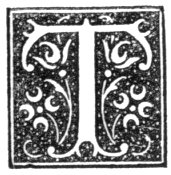

  
[Intangible Textual Heritage](../../../index)  [Legends and
Sagas](../../index)  [Celtic](../index)  [Index](index) 
[Previous](nes30)  [Next](nes32) 

------------------------------------------------------------------------

p. 210

# CHAPTER XXVII.

### BURIAL.

<table>
<colgroup>
<col style="width: 100%" />
</colgroup>
<tbody>
<tr class="odd">
<td>"The storm that wrecks the winter sky 
  No more disturbs their deep repose 
Than summer evening's latest sigh 
  That shuts the rose."</td>
</tr>
</tbody>
</table>

|                     |
|---------------------|
|  |

HE barn was cleared, swept clean, and fitted up with seats--deals placed
on anything and everything capable of supporting them. On the middle of
the floor was placed a table covered with a table--cloth, at the head of
which was set an arm-chair for the minister. On the table was a quantity
of bread and cheese, as well as of cut tobacco, with a number of new
tobacco-pipes. Beneath the table were bottles and jars of whisky, with
ale.

The people had been invited to the funeral, or "warnt," by a special
messenger a few days before the funeral took place. On arriving, they
were received by the nearest relative of the deceased, and conducted to
the barn. Each, as he entered, if be was a smoker, laid hold of a pipe,
filled and lighted it. When all arrived, and usually the arrivals lasted
from one to two hours and even longer, prayer was offered up by the
minister, and in his absence by an elder or any other that "had the
gift." When the prayer was ended, the whisky was brought forward, and
toddy was made in bowls, if the company was not very large, or if the
friends of the departed were poor; but, if the company was large and the
deceased well-to-do, it was brewed in the firlot. There have been those
who were famous for their joviality in their lifetime giving strict
orders on their death-bed regarding the quantity of whisky to be used at
their funeral obsequies. When the toddy was made and tested, all glasses
were filled and handed round. They were emptied to the memory of the
departed. Bread and cheese followed. The glasses were again filled and
drained to the toast, "Consolation

p. 211

to the friends of the deceased." Then came more broad and cheese, and a
glass or two more of toddy. Such as preferred "a drap o’ the raw geer,"
or ale, to the toddy, received it. [1](#fn_170)
When all had eaten or drunken in a manner befitting the station and
means of the dead, prayer was again offered; not, however, always. It
was then announced, "Gehn ony o’ ye wis t’ see the corp, ye’ll noo hae
an opportunity." The company thereupon left the barn, and, one by one,
went into the apartment of death, uncovered his head, and gently and
reverently laid his hand upon the breast or brow of the dead, [2](#fn_171) frequently making a remark on the
appearance of the body, as "He's unco like himsel," "She's a bonnie
corp," or "He's sair altert;" or on the character of the departed, as
"She'll be a sehr misst umman," or "He wiz a gueede freen t’ mony ane."
It was believed that unless the body was touched the image of it haunted
the fancy.

If the body was soft and flabby when the coffin-lid was closed, it was a
sure indication that another corpse would at no distant period of time
be carried from the same dwelling. [3](#fn_172)

When the last look had been taken by all the coffin-lid was closed.
Before this was done part of the winding sheet, commonly one of the
corners, was cut off, and preserved with tender care beside a lock of
the hair of the dead one. Sometimes it was made into a napkin, which was
worn only on the occasion of a "kistan," or on a Communion Sunday. When
all was ready, or, as it was expressed, "fin the beerial wiz reathy t’
lift," two chairs were placed in front of the door of the
dwelling-house, and the coffin was tenderly borne forth, and laid upon
them. The spokes were then adjusted under it. The coffin was covered
with the mort-cloth, or, if the friends of the deceased were too poor to
pay for it, with a plaid. The coffin of a boy or a girl was often
covered with a sheet, and a child's almost always. The coffin of a
full-grown person was carried on spokes by eight

p. 212

bearers, who relieved each other, not at regular intervals, but as fancy
struck them, the one nearest the coffin retiring. In the Highlands the
coffin was sometimes carried shoulder-high, as the more honourable mode
of being borne to the grave. The "first lift" was taken by the females
of the family and near female relatives or friends that were present.

In some of the fishing villages the coffin of a young unmarried woman
was carried to the grave by her young companions, dressed in white, with
a black ribbon round the waist. [1](#fn_173)

The chairs were overturned as soon as the coffin was lifted off them,
and were allowed to lie, in some places till sunset, and in others till
one of those that had attended the funeral returned, when they were
lifted, and carefully washed. If not overturned, the spirit returned
from the unseen world.

On the funeral leaving--"the beerial liftin"--all the animals, such as
the horses and cattle, belonging to the farm were loosed from their
stalls, and driven forth. The funeral has been seen to be followed by
the cattle in amazement, with wide nostrils, wild eyes, and much lowing.
Such an occurrence was looked upon with awe, and was set down as an
indication of brute sorrow and sympathy for the departed.

The funeral procession on no account took bye-ways, or moved a foot from
the common path, but moved along the "kirk-road." The road which the
deceased had walked to God's house must be the road along which the
mortal remains were carried to God's acre.

In some parts the bellman went in front of the procession, and tolled a
hand-bell, kept by the kirk-session for the purpose. In other places the
church-bell was tolled as the procession neared the churchyard.

When the coffin is lowered into the grave and properly laid each present
takes off his head-covering.

If the churchyard was at a distance, whisky was carried; and on the road
was usually a fixed spot for resting and partaking of it. At this spot
there was in some places a big stone, called "the ristin stehn," on
which the coffin was laid. Fame has

p. 213

it that the quantity now taken in addition to what was formerly taken
not unfrequently put not a few of the coffin-bearers into a state far
from seemly, and that even old scores have been paid off by broken heads
and faces.

When the grave was again covered over with the green sod, whisky was in
many cases partaken of, when each took his way home. A few of the
nearest relatives and intimate friends of the dead returned to the
house, where a dinner was prepared.

The weather on the day of the funeral was most carefully observed. A
shower on the mould of the open grave--the "meels"--was taken as an
indication that the soul of the departed was enjoying happiness. [1](#fn_174) A hurricane told of some foul deed done,
but never brought to light, or of a bad life, however fair to the eye,
or of a compact with Satan.

A coffin more than ordinarily heavy was remarked; and there have been
coffins of "a heavier weight than lead," which were with the utmost
difficulty carried to the graveyard. Such a thing was spoken of with
awe. [2](#fn_175)

In B------, the night after the funeral, bread and water were placed in
the apartment in which the body lay. The dead was believed to return
that night and partake of the bread and water. Unless this were done the
spirit could not rest in the unseen world. This curious custom seems to
throw light upon what have been called "food vases" and "drinking cups,"
found in round barrows and in the secondary interments in long barrows,
supposed to be of the "bronze age" and of the ancient British period.

A burial ought not on any account to be looked at from a window. The one
that did so would soon follow.

Peculiar horror was manifested towards suicides. Such were not buried in
the churchyard. It is not much over half a century since a fierce fight
took place in a churchyard in the middle of Banffshire, to prevent the
burial of a suicide in it. By an early hour all the strong men of the
parish who were opposed to an act so sacrilegious were astir and
hastening to the churchyard with their weapons of defence--strong
sticks. The

p. 214

churchyard was taken possession of, and the walls were manned. The gate
and more accessible parts of the wall were assigned to picked men. In
due time the suicide's coffin appeared, surrounded by an excited crowd,
for the most part armed with sticks. Some, however, carried spades
sharpened on the edge. Fierce and long was the fight at the gate, and
not a few rolled in the dust. The assailing party was beaten off. A
grave was dug outside the churchyard, close beneath the wall, and the
coffin laid in it. The lid was lifted, and a bottle of vitriol poured
over the body. Before the lid could be again closed, the fumes of the
dissolving body were rising thickly over the heads of actors and
spectators. This was done to prevent the body from being lifted during
the coming night from its resting-place, conveyed back to its abode when
in life, and placed against the door, to fall at the feet of the member
of the family that was the first to open the door in the morning.

The self-murderer's grave was on the boundary of two lairds' lands, and
was marked by a single large stone or by a small cairn, to which the
passing traveller was bound to cast a stone.

It was the prevailing idea that nothing would grow over the grave of a
suicide, or on the spot on which a murder was committed. [1](#fn_176)

After the suicide's body was allowed to be buried in the churchyard, it
was laid below the wall in such a position that one could not step over
the grave. This was done under the belief that, if a woman enceinte
stepped over such a grave, her child would quit this earth by its own
act.

The instrument by which the unfortunate put an end to life was eagerly
sought after, as the possession of it, particularly the knot of the
rope, if death was brought about by hanging, secured great worldly
prosperity. This notion about the knot of a rope by which one was hanged
did not attach simply to a suicide's rope, but to a criminal's.

Still-born children and children that died without baptism were buried
before sunrise, from the belief that, unless this were done, their
spirits were not admitted into Heaven, but floated

p. 215

homeless through the regions of space. In some places they were buried
in such a position that one could not step over their graves.

### GRAVEYARDS.

There is a great reluctance in burying the first body in a new
graveyard, and as groat reluctance in leaving the old churchyard after a
beginning of burying has been made in the new one. It is told that, when
a graveyard on the east coast of Aberdeenshire had to be in a great
measure closed, nothing would induce the inhabitants of one of the
villages of the parish to bury their dead in the new one. What was to be
done? A shoemaker, whose shop was the meeting-place of many of the
people of the village, was equal to the difficulty. One night, when a
few of the villagers were in the shop, the shoemaker announced that
there were "yird swine" in the old graveyard. All were aroused, but
hoped that what the shoemaker said might be a mistake. "No mistake, said
the man, "I can show you one that was got in the very place." The cry
was "Lat's see ’t." A water rat was produced. "An’ that's a yird swine,
is ’t, the creatir it eats the dead bodies?" said the men, standing at a
distance, and looking in horror on the abhorred beast. "Aye, that's the
real yird-swine." The news spread like fire through the village, and
many visited the shop to convince themselves of the dreadful truth. The
fate of the old graveyard was sealed in that village. [1](#fn_177)

Graveyards and ill connected with them--the earth or "meels" and the
gravestones, and the coffin and the mort-cloth--were looked upon with
awe. Human bones were objects of dread, and there were those who would
have left a house had human bones been in it. No one would have carried
off a piece of the wood of a coffin that had been cast up in opening a
grave and thrown into a corner of the churchyard, for it was a custom so
to treat coffins after they had fallen to pieces on the grave being
re-opened to admit new tenants.

Many of the churchyards were reputed as haunted by ghosts--the ghosts of
those who had committed some great crime, and had died without its being
detected and without their revealing

p. 216

it, but who now could not rest in their graves till their souls were
disburdened of the load, and they appeared nightly in hope of coming in
contact with some living person bold enough to meet them, and to whom
they could make known their sin, and to whom they could tell what to do
for them to remove the load, and thus allow them to rest in peace in
their graves. Such graveyards were avoided after nightfall, and such
graveyards made many a benighted traveller take a roundabout way home if
it lay before him in his journey

Those who sold themselves to the devil to acquire supernatural powers
had to go to the churchyard at twelve o'clock at night, and in the
silence of the night, in the abodes of the dead, make their infernal
compact, and give their souls for the price.

Those who wished to acquire the power of "arresting" man or beast on
their journey, had to go to the churchyard, and, at twelve o'clock at
night, uncover a coffin, and take from it one of the lid-screws,
repeating at the same time the Lord's Prayer backwards. Such a screw
screwed into a human or animal foot-print from left to right, with the
repetition of the Lord's Prayer backwards, stopped the further progress
of the man or animal.

The mould of the churchyard--"the meels"--was used in acts of sorcery.
Thus "meels" taken at the hour of midnight from the graveyard and thrown
into a mill-race caused the wheel to stop. The following extract shows
another use to which "meels" were put:--

"And anent Issobell Traylle, her consulting with Walker, the witch, shoe
confessed the said witch had hir tack ane moldewort hillock and muild
out of the church yard, and putt it vnder hir gait twys, and that wold
mack hir aill to sell. But shoe denyed shoe requyred it at the said
witch, or that shoe practised it." [1](#fn_178)

------------------------------------------------------------------------

### Footnotes

[211:1](nes31.htm#fr_170) *Choice Notes*, p.
121; *Notes and Queries*, 5th series, vol. iv. pp. 326, 397, vol. v. p.
218.

[211:2](nes31.htm#fr_171) Cf. Henderson, p. 57.

[211:3](nes31.htm#fr_172) Cf. Henderson, p. 50;
*F. L. Record*, vol. i. p. 51 (169), vol. iii. pt. i. p. 127.

[212:1](nes31.htm#fr_173) *Notes and Queries*,
5th series, vol. v. p. 364.

[213:1](nes31.htm#fr_174) See [p.
90](nes20.htm#page_90).

[213:2](nes31.htm#fr_175) See [p.
136](nes23.htm#page_136).

[214:1](nes31.htm#fr_176) *F. L. Record*, vol.
i. p. 17 (67).

[215:1](nes31.htm#fr_177) Cf. Henderson, p.
121.

[216:1](nes31.htm#fr_178) "Extracts from the
Presbytery Book of Strathbogie," p. 5. Spalding Club, Aberdeen. A.D.
1843.

------------------------------------------------------------------------

[Next: Glossary](nes32)
