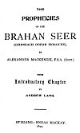
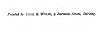

  
[Intangible Textual Heritage](../../../index)  [Legends and
Sagas](../../index)  [Celtic](../index)  [Prophecy](../../../pro/index) 
[Index](index)  [Next](pbs01) 

------------------------------------------------------------------------

[Buy this Book at
Amazon.com](https://www.amazon.com/exec/obidos/ASIN/0766136337/internetsacredte)

------------------------------------------------------------------------

*Prophecies of the Brahan Seer*, by Alexander Mackenzie, \[1899\], at
Intangible Textual Heritage

------------------------------------------------------------------------

p. ii

The Prophecies of the Brahan Seer.

p. iii

##### THE

## PROPHECIES

###### OF THE

# BRAHAN SEER

##### (COINNEACH ODHAR FIOSAICHE),

###### BY

## ALEXANDER MACKENZIE, F.S.A. (SCOT.)

###### WITH

### Introductory Chapter

###### BY

#### ANDREW LANG.

#### STIRLING: ENEAS MACKAY.

#### \[1899\]

Scanned at Intangible Textual Heritage, September 2006. Proofed and
formatted by John Bruno Hare. This text is in the public domain in the
United States because it was published prior to January 1st, 1923. These
files may be used for any non-commercial purpose, provided this notice
of attribution is left intact in all copies.

[  
Click to enlarge](img/cover.jpg)  
Front cover and spine  

[  
Click to enlarge](img/title.jpg)  
Title Page  

[  
Click to enlarge](img/verso.jpg)  
Verso  

p. iv

*Printed by* COOK & WYLIE, 9 *Barman Street, Stirling*.

------------------------------------------------------------------------

[Next: Contents](pbs01)
