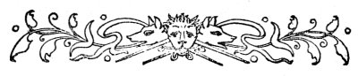

  
[Intangible Textual Heritage](../../../index.md)  [Legends and
Sagas](../../index)  [Celtic](../index)  [Prophecy](../../../pro/index.md) 
[Index](index)  [Previous](pbs08)  [Next](pbs10.md) 

------------------------------------------------------------------------

[Buy this Book at
Amazon.com](https://www.amazon.com/exec/obidos/ASIN/0766136337/internetsacredte.md)

------------------------------------------------------------------------

*Prophecies of the Brahan Seer*, by Alexander Mackenzie, \[1899\], at
Intangible Textual Heritage

------------------------------------------------------------------------

p. 68

 

### SEAFORTH'S DREAM.

|                     |
|---------------------|
|  |

EFORE proceeding to relate the Seer's remarkable prediction, and the
extraordinary minuteness with which it has been fulfilled, we shall give
the particulars of a curious dream by Lord Seaforth, which was a
peculiar forecast of the loss of his faculties of speech and hearing
during the latter part of his eventful life. It has been supplied by a
member of the family, [\*](#fn_7.md) who shows an
unmistakable interest in everything calculated to throw light on the
"prophecies," and who evidently believes them not to be merely an old
wife's tale. We give it *verbatim et literatim*:--"The last Lord
Seaforth was born in full possession of all his faculties. When about
twelve years of age scarlet fever broke out in the school at which he
was boarding. All the boys who were able to be sent away were returned
to their homes at once, and some fifteen or twenty boys who had taken
the infection were moved into a large room, and there treated. After a
week had passed, some boys naturally became worse than others, and some
of them were in great danger. One evening, before dark, the attendant
nurse, having left the dormitory, for a few minutes, was alarmed by a
cry. She instantly

p. 69

returned, and found Lord Seaforth in a state of great excitement. After
he became calmer, he told the nurse that he had seen, soon after she had
left the room, the door opposite to his bed silently open, and a hideous
old woman came in. She had a wallet full of something hanging from her
neck in front of her. She paused on entering, then turned to the bed
close to the door, and stared steadily at one of the boys lying in it.
She then passed to the foot of the next boy's bed, and, after a moment,
stealthily moved up to the head, and taking from her wallet a mallet and
peg, drove the peg into his forehead. Young Seaforth said he heard the
crash of the bones, though the boy never stirred. She then proceeded
round the room, looking at some boys longer than at others. When she
came to him, his suspense was awful. He felt he could not resist or even
cry out, and he never could forget, in years after, that moment's agony,
when he saw her hand reaching down for a nail, and feeling his ears. At
last, after a look, she slunk off, and slowly completing the circuit of
the room, disappeared noiselessly through the same door by which she had
entered. Then he felt the spell seemed to be taken off, and uttered the
cry which had alarmed the nurse. The latter laughed at the lad's story,
and told him to go to sleep. When the doctor came, an hour later, to
make his rounds, he observed that the boy was feverish and excited, and
asked the nurse afterwards if she knew the cause, whereupon she reported
what had occurred. The doctor, struck with the story, returned to the
boy's bedside and made him repeat his dream. He took it down in writing
at the moment. The following day nothing eventful happened, but, in
course of time, some got worse, a few indeed died, others suffered but
slightly, while some, though they recovered, bore some evil trace and
consequence of the fever

p. 70

for the rest of their lives. The doctor, to his horror, found that those
whom Lord Seaforth had described as having a peg driven into their
foreheads, were those who died from the fever; those whom the old hag
passed by recovered, and were none the worse; whereas those she appeared
to look at intently, or handled, all suffered afterwards. Lord Seaforth
left his bed of sickness almost stone deaf; and, in later years,
grieving over the loss of his four sons, absolutely and entirely ceased
to speak.

We shall now relate the circumstances connected with the prophecy, and
continue an account of the Seaforths' connection with it to the end of
the chapter.

 

------------------------------------------------------------------------

### Footnotes

[68:\*](pbs09.htm#fr_7.md) The late Colonel John
Constantine Stanley, son of Lord Stanley of Alderley, who married Susan
Mary, eldest daughter of the late Keith William Stewart Mackenzie of
Seaforth.

------------------------------------------------------------------------

[Next: Seaforth's Doom](pbs10.md)
