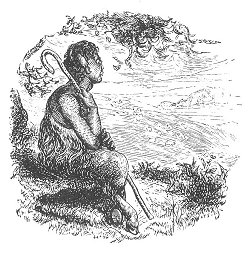

  
[Intangible Textual Heritage](../../../index.md) 
[Legends/Sagas](../../index)  [Celtic](../index.md) 

------------------------------------------------------------------------

<table width="75%">
<colgroup>
<col style="width: 50%" />
<col style="width: 50%" />
</colgroup>
<tbody>
<tr class="odd">
<td width="50%" data-valign="TOP"> 
</td>
<td width="50%" data-valign="TOP"><h1 id="the-phynodderre" data-align="CENTER">The Phynodderre</h1>
<h5 id="and-other-legends-of-the-isle-of-man" data-align="CENTER">and Other Legends of the Isle of Man</h5>
<h2 id="by-edward-callow" data-align="CENTER">by Edward Callow</h2>
<h4 id="section" data-align="CENTER">[1882]</h4></td>
</tr>
</tbody>
</table>

------------------------------------------------------------------------

[Title Page](phy00.md)  
[Preface](phy01.md)  
[Contents](phy02.md)  
[Mona's Isle](phy03.md)  

### The Phynodderree: A Tale of Fairy Love

[Chapter I](phy04.md)  
[Chapter II](phy05.md)  
[Chapter III](phy06.md)  
[Chapter IV](phy07.md)  
[Chapter V](phy08.md)  

### Tom Kewley and the Lannanshee

[Chapter I](phy09.md)  
[Chapter II](phy10.md)  
[Chapter III](phy11.md)  
[Chapter IV](phy12.md)  

### King Olave the Second and the Great Sword Macabuin

[Chapter I](phy13.md)  
[Chapter II](phy14.md)  
[Chapter III](phy15.md)  
[Chapter IV](phy16.md)  

### The Buggane's Vow

[Chapter I](phy17.md)  
[Chapter II](phy18.md)  
[Chapter III](phy19.md)  
[Chapter VI](phy20.md)  
