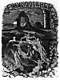
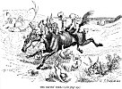

  
[Intangible Textual Heritage](../../../index.md) 
[Legends/Sagas](../../index)  [Celtic](../index)  [Index](index.md) 
[Next](phy01.md) 

------------------------------------------------------------------------

###### THE

# PHYNODDERREE

###### AND OTHER

### LEGENDS OF THE ISLE OF MAN.

###### BY

#### EDWARD CALLOW.

### WITH SIXTY ILLUSTRATIONS.

###### Drawn expressly for this Work, and Engraved on Wood, by W. J. Watson.

#### J. Dean & Son

#### London

#### \[1882\]

NOTICE OF ATTRIBUTION  
Scanned and proofed at sacredspiral.com, by Eliza Yetter, April, 2005.
Additional proofing and formatting at Intangible Textual Heritage, by
John Bruno Hare. This text is in the public domain worldwide. These
files may be used for any non-commercial purpose provided this notice of
attribution is left intact in all copies.

[  
Click to enlarge](img/title.jpg.md)  
Title Page  

[  
Click to enlarge](img/front.jpg.md)

 

TO THE

DEAR FAIRIES

OF MY OWN HOME,

SARAH FRANCES, FRANCES ELIZABETH,

AND

ALICE MARY,

I DEDICATE THIS BOOK.

EDWARD CALLOW.

------------------------------------------------------------------------

[Next: Preface](phy01.md)
